# Technical Specification

# 0. Agent Action Plan

## 0.1 Intent Clarification

### 0.1.1 Core Feature Objective

Based on the prompt, the Blitzy platform understands that the new feature requirement is to **systematically audit and enhance CCC (Claude's C Compiler) to achieve production-grade C11 conformance** across its entire compilation pipeline, spanning four target architectures (x86-64, AArch64, RISC-V 64, i686). This is a two-phase endeavor:

- **Phase 1 — Gap Discovery:** Conduct a comprehensive audit of the CCC codebase against nine audit areas (C11 language conformance, optimization pipeline, backend/codegen, linker, preprocessor, parser/diagnostics, `__attribute__` support, infrastructure, and active bugs) to produce a categorized gap inventory with severity, affected files, and implementation scope for each deficiency
- **Phase 2 — Gap Resolution:** Implement fixes for every discovered gap, each with at least one dedicated integration test in `tests/`, and validate all changes through eight formal validation gates (Gates 0–8)

The core sub-requirements detected from the user prompt include:

- **C11 Language Feature Completion:** Full implementation of `_Atomic`, `_Generic`, `_Static_assert`, `_Alignas`, `_Noreturn`, VLAs, `_Complex` edge-case fixes, `restrict` qualifier propagation, and `inline` linkage semantics — currently the codebase defines `__STDC_NO_ATOMICS__` as `1` and `__STDC_NO_VLA__` as `1` in `src/frontend/preprocessor/builtin_macros.rs`, confirming these are incomplete
- **Tiered Optimization Pipeline:** Transform the current single-tier pipeline (all `-O` levels run identical passes as documented in `src/passes/mod.rs`) into six distinct tiers (`-O0` through `-Oz`) with per-tier pass configuration, including new loop unrolling and tail call optimization passes
- **Backend Enhancements:** Extend tail call optimization from x86-64-only (currently in `src/backend/x86/codegen/peephole/passes/tail_call.rs`) to all four architectures; add loop-depth-aware spill weight calculation to the register allocator (`src/backend/regalloc.rs`); expand NEON intrinsic coverage in `include/arm_neon.h` from the current ~255 functions to ≥90% of 128-bit NEON operation families
- **Linker Script Support:** Implement `-T script.ld` parsing and `SECTIONS`, `MEMORY`, `ENTRY`, `PROVIDE`, `KEEP` directives — currently absent from `src/backend/linker_common/args.rs` and all backend linkers
- **Preprocessor Enhancements:** Upgrade `#pragma once` from path-based (`PathBuf`) to device+inode tracking, implement `#pragma pack` push/pop stack, and desugar the `_Pragma` operator (currently skipped in `src/frontend/preprocessor/macro_defs.rs` line 445)
- **Parser Error Recovery:** Add synchronization-based multi-error reporting (up to 20 diagnostics per translation unit) with source-line-and-caret output
- **`__attribute__` Support Matrix:** Implement and test 20 specific attributes, with `-Wattributes` warnings for unsupported attributes and `-Wno-attributes` to suppress
- **Diagnostics:** Implement `-Werror=<name>` granular control (partially exists in `src/common/error.rs`), `-pedantic` mode, and per-feature warning flags
- **Trigraph and Digraph Support:** Add digraphs unconditionally in the lexer and trigraphs behind a `-trigraphs` flag — currently neither is implemented per `src/frontend/preprocessor/README.md`
- **IFUNC and Static Linking:** Add GNU IFUNC support for x86-64 and AArch64 (partially exists in linker), implement `-static` with NSS warnings (flag exists in driver but NSS diagnostics are absent)
- **Infrastructure:** Create a CI/CD GitHub Actions workflow (`.github/workflows/ci.yml`), formal EBNF grammar (`docs/grammar.ebnf`), and ABI compliance test suite (`tests/abi/` with ≥50 struct layouts)
- **Active Bug Resolution:** Fix all 13 bugs tracked in `current_tasks/`, each with a dedicated regression test

### 0.1.2 Special Instructions and Constraints

The user has specified explicit boundaries and preservation requirements:

- **MUST preserve:**
  - Backward compatibility with existing real-world project builds (PostgreSQL, FFmpeg, Linux kernel, SQLite, Redis, QEMU)
  - Zero external Rust crate dependencies — `Cargo.toml` has no `[dependencies]` section and this must remain unchanged
  - All existing feature gates (`gcc_assembler`, `gcc_linker`, `gcc_m16`)
  - CC0 1.0 Universal license
  - Existing binary target structure (5 binaries: `ccc`, `ccc-x86`, `ccc-arm`, `ccc-riscv`, `ccc-i686`)
  - Existing trait method signatures (new methods allowed, existing signatures must not change)

- **MUST NOT:**
  - Introduce new `unsafe` Rust blocks beyond existing ones
  - Add external crate dependencies
  - Change ELF output format
  - Support non-Linux targets
  - Implement C++, Objective-C, or C17/C23 features beyond those explicitly listed
  - Implement auto-vectorization, instruction scheduling, or multi-threaded compilation
  - Replace the register allocator algorithm (only enhance with spill weight heuristics)

- **Minimal Change Clause:** Modifications must be scoped to discovered gaps only — no speculative refactoring, no renaming of existing public APIs, no restructuring of module hierarchy unless required by a specific gap

- **Validation Environment Prerequisites:** Runtime tools only — `gcc`, `gcc-aarch64-linux-gnu`, `gcc-riscv64-linux-gnu`, `gcc-i686-linux-gnu`, `dash`, `bison`, `flex`, `libreadline-dev`, `zlib1g-dev`, `qemu-user` — downloaded sources and build artifacts must NOT be committed

- **Top-Level Success Criteria (ALL must pass):**
  - `cargo test --release` exits 0 with zero failures
  - All integration tests pass on all 4 architectures (native x86-64, QEMU for AArch64/RISC-V/i686)
  - Every gap has ≥1 dedicated test case
  - Gates 0–8 all pass (Gate 0b non-blocking but must be reported)

### 0.1.3 Technical Interpretation

These feature requirements translate to the following technical implementation strategy:

- To **complete C11 conformance**, we will modify the frontend (parser, semantic analyzer, type system) and IR lowering modules to fully implement `_Atomic` type tracking, `_Generic` compile-time selection, VLA stack allocation, `_Complex` edge-case arithmetic, `restrict` alias analysis propagation, and `inline` linkage rules, then propagate these through all four backend code generators
- To **implement tiered optimization**, we will modify `src/passes/mod.rs` to dispatch different pass sets per optimization level, create a new `loop_unroll.rs` pass, and extend the existing tail call optimization to all four architecture backends
- To **enhance backends**, we will modify `src/backend/regalloc.rs` for loop-depth-aware spill weights, extend `include/arm_neon.h` for NEON intrinsic coverage, and add calling convention documentation comments to each architecture's codegen directory
- To **add linker script support**, we will create a linker script parser and integrate it through `src/backend/linker_common/` and each architecture-specific linker
- To **enhance the preprocessor**, we will modify `src/frontend/preprocessor/pipeline.rs` for device+inode `#pragma once`, add pack-stack semantics to `pragmas.rs`, and implement `_Pragma` desugaring in `macro_defs.rs`
- To **add parser error recovery**, we will modify `src/frontend/parser/parse.rs` for synchronization-based recovery with multi-error reporting and source-line caret output
- To **implement `__attribute__` support**, we will extend `src/frontend/parser/parse.rs` attribute parsing, propagate attributes through sema and codegen, and add `-Wattributes` / `-Wno-attributes` flag handling
- To **add trigraph/digraph support**, we will modify `src/frontend/lexer/scan.rs` for digraphs and `src/frontend/preprocessor/pipeline.rs` for trigraph processing under a `-trigraphs` flag
- To **create CI/CD infrastructure**, we will create `.github/workflows/ci.yml` with build, test, and cross-architecture QEMU jobs
- To **create specification artifacts**, we will create `docs/grammar.ebnf` with EBNF productions and `tests/abi/` with struct layout and calling convention tests
- To **fix all active bugs**, we will address each of the 13 bugs in `current_tasks/` by modifying the affected source files and creating regression tests

## 0.2 Repository Scope Discovery

### 0.2.1 Comprehensive File Analysis

The CCC repository comprises ~351 Rust source files totaling ~186,696 lines of code, plus 17 C header files in `include/` and 6 POSIX shell stubs. The codebase is organized into nine top-level source modules with four architecture-specific backend trees, each containing codegen, assembler, and linker subsystems. The following analysis categorizes every affected file and folder.

#### Existing Modules Requiring Modification

**Frontend — Preprocessor (`src/frontend/preprocessor/`)**

| File | Current Purpose | Required Changes |
|------|----------------|-----------------|
| `src/frontend/preprocessor/pipeline.rs` | Directive handling, includes, macros, pragmas | Upgrade `#pragma once` from `PathBuf` to device+inode (via `std::fs::metadata`); add trigraph preprocessing Phase 1 behind `-trigraphs` flag |
| `src/frontend/preprocessor/macro_defs.rs` | Macro parsing/expansion, `_Pragma` skip logic | Implement `_Pragma("...")` desugaring per C11 §6.10.9 (line ~445 currently skips) |
| `src/frontend/preprocessor/pragmas.rs` | Pragma handling | Implement full `#pragma pack(push, N)` / `#pragma pack(pop)` / `#pragma pack()` stack semantics |
| `src/frontend/preprocessor/builtin_macros.rs` | Predefined macros | Remove `__STDC_NO_ATOMICS__` (line 414) and `__STDC_NO_VLA__` (line 417) after features are implemented; add feature-test macros |
| `src/frontend/preprocessor/predefined_macros.rs` | System include paths, target macros | Add new predefined macros for C11 features |

**Frontend — Lexer (`src/frontend/lexer/`)**

| File | Current Purpose | Required Changes |
|------|----------------|-----------------|
| `src/frontend/lexer/scan.rs` | Byte-level tokenizer | Add digraph token recognition (`<:`, `:>`, `<%`, `%>`, `%:`, `%:%:`) unconditionally; add alternate token mapping |
| `src/frontend/lexer/token.rs` | Token type definitions | Add digraph token variants or mapping from digraph to canonical tokens |

**Frontend — Parser (`src/frontend/parser/`)**

| File | Current Purpose | Required Changes |
|------|----------------|-----------------|
| `src/frontend/parser/parse.rs` | Parser state, helpers, attribute parsing | Add synchronization-based error recovery; implement 20-diagnostic limit; extend `parse_gcc_attribute` for all 20 attributes; add `-Wattributes` for unknown attributes |
| `src/frontend/parser/ast.rs` | AST node definitions | Add AST nodes for VLA `sizeof` runtime evaluation; extend attribute representations for `format`, `deprecated`, `warn_unused_result`, `malloc`, `pure`, `const` |
| `src/frontend/parser/declarations.rs` | Declaration parsing, `_Static_assert` | Ensure C23 single-argument `_Static_assert` form works; strengthen `_Alignas` validation (power-of-two, ≥ natural alignment) |
| `src/frontend/parser/declarators.rs` | Declarator parsing, VLA star syntax | Extend VLA support for full `[*]` parameter syntax and multi-dimensional VLAs |
| `src/frontend/parser/expressions.rs` | Expression parsing | Extend `_Generic` selection evaluation for compile-time type matching with `default` association |
| `src/frontend/parser/statements.rs` | Statement parsing | Add VLA scope tracking for stack pointer restoration at scope exit |
| `src/frontend/parser/types.rs` | Type specifier parsing | Extend `_Atomic` type qualifier tracking through type system |

**Frontend — Semantic Analysis (`src/frontend/sema/`)**

| File | Current Purpose | Required Changes |
|------|----------------|-----------------|
| `src/frontend/sema/analysis.rs` | Semantic enforcement, diagnostics | Add `_Atomic` type enforcement; `_Noreturn` reachable-return warning; `_Alignas` power-of-two validation; attribute-driven semantic checks (`warn_unused_result`, `deprecated`, `format` printf validation) |
| `src/frontend/sema/type_checker.rs` | Expression type analysis | Handle `_Generic` type matching resolution; `_Atomic`-qualified type checking |
| `src/frontend/sema/type_context.rs` | Type resolution infrastructure | Track `_Atomic` and `restrict` qualifiers through type resolution |
| `src/frontend/sema/const_eval.rs` | Constant expression evaluation | Support `_Static_assert` compile-time expression evaluation with improved error diagnostics |
| `src/frontend/sema/builtins.rs` | Builtin function handling | Add atomic builtins for `_Atomic` operations |

**Common Utilities (`src/common/`)**

| File | Current Purpose | Required Changes |
|------|----------------|-----------------|
| `src/common/types.rs` | CType/IrType dual type system (27 variants) | Add `_Atomic` qualifier to CType variants; add `restrict` qualifier tracking; add VLA CType representation |
| `src/common/type_builder.rs` | Type construction from declarators | Handle `_Atomic(type)` and `_Alignas` in type building |
| `src/common/error.rs` | DiagnosticEngine, warnings, `-Werror` | Add `-pedantic` mode; add `-Wattributes` / `-Wno-attributes` warning kinds; extend warning category system for new features |
| `src/common/source.rs` | Source location management | Ensure caret diagnostics support for multi-error recovery output |
| `src/common/const_arith.rs` | Constant arithmetic | Handle `_Complex` edge-case arithmetic per Annex G |
| `src/common/const_eval.rs` | Constant expression evaluation | Support `_Static_assert` and `_Generic` compile-time evaluation |

**Driver (`src/driver/`)**

| File | Current Purpose | Required Changes |
|------|----------------|-----------------|
| `src/driver/cli.rs` | CLI argument parsing | Add `-trigraphs` flag; add `-pedantic` flag; add `-T script.ld` linker script option; extend `-Werror=<name>` and `-Wno-<name>` parsing for new warning kinds |
| `src/driver/pipeline.rs` | Compilation pipeline orchestration | Pass optimization level to `run_passes` with actual tier dispatch; add linker script path forwarding |
| `src/driver/external_tools.rs` | Assembler/linker invocation | Forward `-T` flag to builtin linker |

**IR — Intermediate Representation (`src/ir/`)**

| File | Current Purpose | Required Changes |
|------|----------------|-----------------|
| `src/ir/instruction.rs` | SSA instruction set, atomics | Extend atomic instruction variants for full `_Atomic` qualifier support |
| `src/ir/ops.rs` | Operation enums (AtomicRmwOp, etc.) | Ensure complete atomic operation coverage for all C11 atomic operations |
| `src/ir/intrinsics.rs` | Target-independent intrinsics | Add NEON intrinsic operations |
| `src/ir/constants.rs` | Constant lattice | Handle `_Complex` constant representation improvements |

**IR — Lowering (`src/ir/lowering/`)**

| File | Current Purpose | Required Changes |
|------|----------------|-----------------|
| `src/ir/lowering/lower.rs` | Main lowering orchestration | Handle `_Atomic` qualified variables; VLA stack allocation; `_Generic` lowering; string literal deduplication |
| `src/ir/lowering/expr.rs` | Expression lowering | Lower `_Generic` selections; `_Atomic` operations |
| `src/ir/lowering/expr_atomics.rs` | Atomic expression lowering | Extend for full C11 `_Atomic` qualifier operations |
| `src/ir/lowering/expr_ops.rs` | Operation lowering | Handle `_Complex` Annex G edge cases |
| `src/ir/lowering/complex.rs` | Complex number lowering | Fix multiplication, division, mixed real/complex per Annex G |
| `src/ir/lowering/func_lowering.rs` | Function lowering | VLA stack pointer save/restore; `_Noreturn` unreachable code elimination |
| `src/ir/lowering/stmt.rs` | Statement lowering | VLA scope management with stack pointer restoration |
| `src/ir/lowering/types.rs` | Type lowering | Map `_Atomic` CType to appropriate IrType |
| `src/ir/lowering/definitions.rs` | Definition lowering | Handle `inline` linkage rules (GNU vs C99) |

**Optimization Passes (`src/passes/`)**

| File | Current Purpose | Required Changes |
|------|----------------|-----------------|
| `src/passes/mod.rs` | Pass scheduling, `run_passes` | Implement tiered dispatch: `-O0` (skip all), `-O1` (const fold + copy prop + DCE + mem2reg), `-O2` (current pipeline), `-O3` (add loop unrolling + aggressive inlining), `-Os` (reduce inlining), `-Oz` (disable inlining) |
| `src/passes/inline.rs` | Function inlining with budgets | Add configurable threshold per optimization level; `-Os` at 50% threshold; `-Oz` disable entirely |
| `src/passes/gvn.rs` | Global value numbering | Leverage `restrict` qualifier for alias analysis improvement |
| `src/passes/licm.rs` | Loop-invariant code motion | Leverage `restrict` qualifier for safe load hoisting |
| `src/passes/dce.rs` | Dead code elimination | Handle `_Noreturn` unreachable code after calls |

**Backend — Shared (`src/backend/`)**

| File | Current Purpose | Required Changes |
|------|----------------|-----------------|
| `src/backend/regalloc.rs` | Linear-scan register allocation | Add loop-depth-aware spill weight calculation |
| `src/backend/generation.rs` | Module/function lowering | Handle `_Noreturn` attribute in code generation; calling convention documentation |
| `src/backend/traits.rs` | ArchCodegen trait (~185 methods) | Add new methods for linker script integration and enhanced atomics (additive only; existing signatures preserved) |
| `src/backend/liveness.rs` | Liveness analysis | Enhance for loop-depth weighting |
| `src/backend/call_abi.rs` | ABI classification | Document calling conventions per architecture |
| `src/backend/elf_writer_common.rs` | Shared ELF object writing | Support linker script section directives |

**Backend — Stack Layout (`src/backend/stack_layout/`)**

| File | Current Purpose | Required Changes |
|------|----------------|-----------------|
| `src/backend/stack_layout/mod.rs` | Stack frame computation | Support VLA dynamic stack allocation; improve slot sizing to reduce stack frame bloat (addresses `fix_pcre2_stack_frame_bloat`) |
| `src/backend/stack_layout/slot_assignment.rs` | Stack slot assignment | Allow 4-byte slots for small integer/float IR types |

**Backend — x86-64 (`src/backend/x86/`)**

| File | Current Purpose | Required Changes |
|------|----------------|-----------------|
| `src/backend/x86/codegen/emit.rs` | x86-64 code emitter | Atomic instruction emission for `_Atomic`; calling convention documentation |
| `src/backend/x86/codegen/atomics.rs` | x86-64 atomic operations | Full atomic load/store/exchange/compare_exchange/fetch_add for `_Atomic` |
| `src/backend/x86/codegen/peephole/passes/tail_call.rs` | Tail call optimization (x86-64 only) | Maintain existing; reference implementation for other architectures |
| `src/backend/x86/codegen/prologue.rs` | x86-64 prologue/epilogue | VLA dynamic stack adjustment |
| `src/backend/x86/codegen/intrinsics.rs` | x86-64 intrinsic lowering | Extended SIMD coverage |
| `src/backend/x86/assembler/parser.rs` | x86-64 AT&T assembler parser | Implement `.ifnb`/`.ifb` directives (fix `fix_x86_asm_ifnb_ifb_conditional`); fix expression parsing for kernel link errors |
| `src/backend/x86/linker/link.rs` | x86-64 linker orchestration | Add linker script `-T` support; IFUNC enhancements |
| `src/backend/x86/linker/emit_exec.rs` | x86-64 executable emission | Linker script section placement; static linking with NSS warnings |

**Backend — AArch64 (`src/backend/arm/`)**

| File | Current Purpose | Required Changes |
|------|----------------|-----------------|
| `src/backend/arm/codegen/emit.rs` | AArch64 code emitter | Atomic instruction emission (LDXR/STXR loops); tail call optimization; calling convention documentation |
| `src/backend/arm/codegen/atomics.rs` | AArch64 atomic operations | Full `_Atomic` support with proper LDXR/STXR/CASP sequences |
| `src/backend/arm/codegen/intrinsics.rs` | AArch64 intrinsic lowering | NEON intrinsic emission coverage |
| `src/backend/arm/codegen/prologue.rs` | AArch64 prologue/epilogue | VLA dynamic stack adjustment; tail call support |
| `src/backend/arm/assembler/parser.rs` | AArch64 assembler parser | Fix CASPAL instruction (fix `fix_arm_asm_caspal_instruction`); fix `.org` directive; fix `.quad` PREL64 relocation; fix MOVW symbolic relocations |
| `src/backend/arm/assembler/elf_writer.rs` | AArch64 ELF writer | Fix global branch relocations (fix `fix_arm_asm_global_branch_relocs`) |
| `src/backend/arm/linker/link.rs` | AArch64 linker | Linker script support |

**Backend — RISC-V 64 (`src/backend/riscv/`)**

| File | Current Purpose | Required Changes |
|------|----------------|-----------------|
| `src/backend/riscv/codegen/emit.rs` | RISC-V code emitter | Atomic instruction emission (LR/SC sequences); tail call optimization; calling convention documentation |
| `src/backend/riscv/codegen/atomics.rs` | RISC-V atomic operations | Full `_Atomic` with AMO/LR/SC |
| `src/backend/riscv/codegen/prologue.rs` | RISC-V prologue/epilogue | VLA dynamic stack adjustment |
| `src/backend/riscv/codegen/variadic.rs` | RISC-V variadic handling | Fix va_arg long double struct alignment (fix `fix_riscv_va_arg_long_double_struct`) |
| `src/backend/riscv/linker/link.rs` | RISC-V linker | Linker script support; IFUNC unsupported diagnostic |

**Backend — i686 (`src/backend/i686/`)**

| File | Current Purpose | Required Changes |
|------|----------------|-----------------|
| `src/backend/i686/codegen/emit.rs` | i686 code emitter | Atomic instruction emission (LOCK CMPXCHG8B for 64-bit); tail call optimization; calling convention documentation |
| `src/backend/i686/codegen/atomics.rs` | i686 atomic operations (if exists) | Full `_Atomic` support with LOCK-prefix instructions |
| `src/backend/i686/codegen/float_ops.rs` | i686 floating-point | Fix double parameter high-word store (fix `fix_i686_double_param_high_word_store`) |
| `src/backend/i686/codegen/prologue.rs` | i686 prologue/epilogue | VLA dynamic stack adjustment |
| `src/backend/i686/linker/link.rs` | i686 linker | Linker script support; IFUNC unsupported diagnostic |

**Backend — Linker Common (`src/backend/linker_common/`)**

| File | Current Purpose | Required Changes |
|------|----------------|-----------------|
| `src/backend/linker_common/args.rs` | Linker argument parsing | Add `-T script.ld` flag parsing |
| `src/backend/linker_common/symbols.rs` | Symbol resolution | Support `PROVIDE(symbol = expr)` and `ENTRY(symbol)` |
| `src/backend/linker_common/merge.rs` | Section merging | Support `SECTIONS { }` placement directives and `KEEP(...)` |
| `src/backend/linker_common/check.rs` | Undefined symbol checking | Add NSS warning for static linking with NSS-dependent functions |

**Backend — ELF Infrastructure (`src/backend/elf/`)**

| File | Current Purpose | Required Changes |
|------|----------------|-----------------|
| `src/backend/elf/constants.rs` | ELF numeric constants | Add `STT_GNU_IFUNC` constant if not present; add linker script constants |
| `src/backend/elf/section_flags.rs` | Section directive mapping | Support linker script section directives |

**Backend — Assembler Preprocessing (`src/backend/`)**

| File | Current Purpose | Required Changes |
|------|----------------|-----------------|
| `src/backend/asm_preprocess.rs` | Shared assembler macro/conditional processing | Fix macro parameter prefix-matching substitution (fix `fix_macro_param_prefix_substitution`) |

**Bundled Headers (`include/`)**

| File | Current Purpose | Required Changes |
|------|----------------|-----------------|
| `include/arm_neon.h` | ARM NEON intrinsic declarations (~255 functions) | Expand to ≥90% coverage of 128-bit NEON families: lane manipulation, widening/narrowing, saturating arithmetic, load/store variants, comparison, bitwise |

**Root Configuration**

| File | Current Purpose | Required Changes |
|------|----------------|-----------------|
| `Cargo.toml` | Crate manifest, binary targets, feature gates | No changes to dependency section; ensure edition and feature gates remain unchanged |
| `README.md` | Project documentation | Update known limitations section (remove items fixed during this work) |
| `DESIGN_DOC.md` | Architecture narrative | Update to reflect new optimization tiers and C11 feature coverage |

#### Integration Point Discovery

- **API endpoints connecting to the feature:** The `Driver` struct in `src/driver/pipeline.rs` is the master integration point that sequences preprocessing → lexing → parsing → sema → lowering → optimization → codegen → assembly → linking. New flags (`-trigraphs`, `-pedantic`, `-T`) enter through `src/driver/cli.rs` and propagate via `Driver` fields
- **Database models/migrations affected:** Not applicable (no database)
- **Service classes requiring updates:** The `ArchCodegen` trait in `src/backend/traits.rs` is the backend service interface; new methods for enhanced atomics and VLA support may be added
- **Controllers/handlers to modify:** The `run_passes` function in `src/passes/mod.rs` is the optimization controller that must be modified for tiered dispatch
- **Middleware/interceptors impacted:** The preprocessor pipeline (`src/frontend/preprocessor/pipeline.rs`) acts as the input interceptor and must be modified for trigraphs and `_Pragma`

### 0.2.2 Web Search Research Conducted

No external web search is required for this project. The implementation specifications are exhaustively defined in the user prompt, covering C11 (ISO/IEC 9899:2011) requirements, optimization tier definitions, NEON intrinsic families, linker script directive syntax, and validation gate criteria. The CCC codebase is self-contained with zero external dependencies, and all implementation patterns can be derived from existing code conventions observed in the repository.

### 0.2.3 New File Requirements

**New Source Files to Create:**

- `src/passes/loop_unroll.rs` — Loop unrolling pass: unroll constant-bound loops ≤32 iterations with post-unroll body ≤256 IR instructions, active only at `-O3`
- `src/backend/linker_common/linker_script.rs` — Linker script parser: parse `SECTIONS`, `MEMORY`, `ENTRY`, `PROVIDE`, `KEEP` directives with wildcard section matching
- `docs/grammar.ebnf` — Formal EBNF grammar covering all implemented C11 productions and GNU extension productions, cross-referenced by parser rule comments

**New Test Files and Directories to Create:**

- `tests/atomic_load_store/` — `_Atomic` load/store operations across 4 architectures
- `tests/atomic_exchange/` — `_Atomic` exchange and compare_exchange tests
- `tests/atomic_fetch_add/` — `_Atomic` fetch_add operation tests
- `tests/generic_selection/` — `_Generic` type matching tests (exact, compatible, default, missing default error)
- `tests/static_assert/` — `_Static_assert` passing, failing, and single-argument forms
- `tests/alignas/` — `_Alignas` variable and struct member alignment tests
- `tests/noreturn/` — `_Noreturn` valid usage, reachable return warning, DCE test
- `tests/vla_basic/` — VLA stack allocation and runtime `sizeof` evaluation
- `tests/vla_nested/` — Nested VLA scope deallocation (1000-iteration leak test)
- `tests/vla_multidim/` — Multi-dimensional VLA tests
- `tests/vla_param/` — VLA function parameter syntax tests
- `tests/complex_mul/` — `_Complex` multiplication edge cases
- `tests/complex_div/` — `_Complex` division edge cases
- `tests/complex_mixed/` — Mixed real/complex operation tests
- `tests/restrict_parse/` — `restrict` qualifier parsing and type propagation
- `tests/restrict_opt/` — `restrict` optimization effect verification
- `tests/inline_static/` — `static inline` linkage test
- `tests/inline_gnu/` — `extern inline` GNU mode test
- `tests/inline_c99/` — `inline` C99 mode test
- `tests/opt_O0_correct/` — `-O0` correctness vs `-O2` reference
- `tests/opt_O0_passlist/` — `-O0` pass skipping verification
- `tests/opt_O1_passlist/` — `-O1` limited pass selection verification
- `tests/opt_O3_unroll/` — `-O3` loop unrolling verification
- `tests/opt_Os_Oz_size/` — Binary size comparison across optimization levels
- `tests/tail_call/` — Tail call optimization (recursive factorial, large N)
- `tests/pragma_once/` — `#pragma once` device+inode deduplication test
- `tests/pragma_pack/` — `#pragma pack` push/pop/reset test
- `tests/pragma_operator/` — `_Pragma("...")` desugaring test
- `tests/parser_recovery/` — Multi-error reporting test (5 errors in one file)
- `tests/attr_visibility/` through `tests/attr_const/` — One test per attribute (20 tests)
- `tests/attr_unknown_warn/` — Unknown attribute `-Wattributes` warning test
- `tests/werror/` — `-Werror` and `-Werror=<name>` tests
- `tests/pedantic/` — `-pedantic` GNU extension warning test
- `tests/digraphs/` — Digraph token compilation test
- `tests/trigraphs/` — Trigraph processing with `-trigraphs` flag test
- `tests/linker_script_sections/` — Linker script SECTIONS placement test
- `tests/linker_script_memory/` — MEMORY and ENTRY directive test
- `tests/linker_script_provide/` — PROVIDE and KEEP directive test
- `tests/ifunc_x86/` — IFUNC dispatch on x86-64
- `tests/ifunc_arm/` — IFUNC dispatch on AArch64 via QEMU
- `tests/ifunc_unsupported/` — IFUNC unsupported diagnostic on i686/RISC-V
- `tests/static_link/` — `-static` fully static ELF test
- `tests/static_nss_warn/` — `-static` NSS function warning test
- `tests/neon_lane/` — NEON lane manipulation intrinsics
- `tests/neon_widen/` — NEON widening/narrowing intrinsics
- `tests/neon_saturate/` — NEON saturating arithmetic intrinsics
- `tests/neon_loadstore/` — NEON load/store variant intrinsics
- `tests/neon_compare/` — NEON comparison/bitwise intrinsics
- `tests/abi/` — ABI compliance test suite directory (≥50 struct layout tests, parameter passing, return value, stack alignment, cross-linked CCC↔GCC caller/callee tests)
- Regression tests for each `current_tasks/` bug (13 test directories)

**New CI/CD Configuration:**

- `.github/workflows/ci.yml` — GitHub Actions workflow with ≥4 jobs: build, unit test, x86-64 integration, cross-architecture integration via QEMU; triggers on push and PR to main

## 0.3 Dependency Inventory

### 0.3.1 Private and Public Packages

CCC has a zero-external-dependency design. The `Cargo.toml` manifest contains no `[dependencies]`, `[dev-dependencies]`, or `[build-dependencies]` sections. This constraint is explicitly preserved per the user's requirements. All functionality is implemented from scratch using only the Rust standard library.

| Registry | Package Name | Version | Purpose | Status |
|----------|-------------|---------|---------|--------|
| Rust Std Lib | `std` | Rust 1.93.1 stable | Core runtime, thread spawning, I/O, collections, fs, path | Installed |
| Cargo (build) | `ccc` (self) | 0.1.0 | The CCC compiler crate itself | Installed |
| System (apt) | `gcc` | System default | Required for ABI compliance tests (CCC↔GCC cross-linking) | Runtime validation tool |
| System (apt) | `gcc-aarch64-linux-gnu` | System default | Cross-compilation sysroot and GCC callee for AArch64 ABI tests | Runtime validation tool |
| System (apt) | `gcc-riscv64-linux-gnu` | System default | Cross-compilation sysroot and GCC callee for RISC-V ABI tests | Runtime validation tool |
| System (apt) | `gcc-i686-linux-gnu` | System default | Cross-compilation sysroot and GCC callee for i686 ABI tests | Runtime validation tool |
| System (apt) | `qemu-user` | ≥6.2 recommended | User-mode emulation for cross-architecture integration testing | Runtime validation tool |
| System (apt) | `dash` | System default | POSIX shell for Gate 0b real-world project validation | Runtime validation tool |
| System (apt) | `bison` | System default | Parser generator for real-world project builds (PostgreSQL) | Runtime validation tool |
| System (apt) | `flex` | System default | Lexer generator for real-world project builds | Runtime validation tool |
| System (apt) | `libreadline-dev` | System default | Library for real-world project builds (PostgreSQL) | Runtime validation tool |
| System (apt) | `zlib1g-dev` | System default | Compression library for real-world project builds | Runtime validation tool |

**Cargo Feature Gates (Existing — No Changes):**

| Feature | Purpose | Default State |
|---------|---------|---------------|
| `gcc_linker` | Allow GCC as a linker fallback | Disabled |
| `gcc_assembler` | Allow GCC as an assembler fallback | Disabled |
| `gcc_m16` | Allow GCC passthrough for `-m16` mode | Disabled |

### 0.3.2 Dependency Updates

No external dependency additions or version changes are required. The CCC zero-dependency constraint is preserved.

**Import Updates (Internal Module Reorganization):**

New modules created as part of this work require import additions in existing files:

- `src/passes/mod.rs` — Add `pub(crate) mod loop_unroll;` declaration for the new loop unrolling pass
- `src/backend/linker_common/mod.rs` — Add `pub(crate) mod linker_script;` declaration for the new linker script parser
- Files consuming new optimization tier logic will import `loop_unroll` pass functions via `use crate::passes::loop_unroll::*;`

**Import Transformation Rules:**

- Old: No `loop_unroll` module exists
- New: `src/passes/loop_unroll.rs` added, imported via `mod loop_unroll;` in `src/passes/mod.rs`
- Old: No linker script parser exists
- New: `src/backend/linker_common/linker_script.rs` added, imported via `mod linker_script;` in `src/backend/linker_common/mod.rs`
- Old: `_Pragma` skipped in `macro_defs.rs`
- New: `_Pragma` desugared to equivalent `#pragma` directive with string unescaping

**External Reference Updates:**

- `README.md` — Update known limitations section to reflect completed C11 features
- `DESIGN_DOC.md` — Update optimization pipeline description to document tiered dispatch
- `src/passes/README.md` — Document new loop unrolling pass and tiered optimization behavior
- `src/backend/README.md` — Document tail call optimization expansion to all architectures
- `src/frontend/preprocessor/README.md` — Remove "no digraph/trigraph" and "_Pragma skipped" limitations

### 0.3.3 Build Configuration

The build configuration in `Cargo.toml` requires no changes:

```toml
[package]
name = "ccc"
version = "0.1.0"
edition = "2021"
```

The existing five binary targets and three feature gates are preserved exactly as-is. The `autobins = false` setting ensures only explicitly declared binaries are built. No `Cargo.lock` file exists by design (zero external dependencies), and none should be created.

## 0.4 Integration Analysis

### 0.4.1 Existing Code Touchpoints

The CCC compiler follows a strict pipeline architecture where data flows linearly from frontend through middle-end to backend. Integration points fall into three categories: pipeline-sequential touchpoints (where one stage feeds the next), cross-cutting touchpoints (shared infrastructure used by multiple stages), and backend-parallel touchpoints (changes replicated across all four architecture backends).

#### Pipeline-Sequential Integration Points

```mermaid
graph LR
    A["Driver<br/>cli.rs, pipeline.rs"] --> B["Preprocessor<br/>pipeline.rs, pragmas.rs"]
    B --> C["Lexer<br/>scan.rs, token.rs"]
    C --> D["Parser<br/>parse.rs, declarations.rs"]
    D --> E["Sema<br/>analysis.rs, type_checker.rs"]
    E --> F["Lowering<br/>lower.rs, expr_atomics.rs"]
    F --> G["mem2reg<br/>promote.rs"]
    G --> H["Passes<br/>mod.rs → tier dispatch"]
    H --> I["Codegen<br/>4× emit.rs"]
    I --> J["Assembler<br/>4× parser.rs"]
    J --> K["Linker<br/>4× link.rs"]
```



**Direct Modifications Required:**

- **`src/driver/cli.rs`** (CLI Entry): Register new flags at the argument parsing level
  - Add `-trigraphs` boolean flag
  - Add `-pedantic` boolean flag
  - Add `-T <path>` linker script path storage
  - Extend `-Werror=<name>` and `-Wno-<name>` for new warning kinds (`attributes`, `pedantic`, `return-type`, `unused-result`)
  - Store `opt_level` as distinct `u32` value (0, 1, 2, 3) plus size-optimize flags for `-Os`/`-Oz`

- **`src/driver/pipeline.rs`** (Pipeline Orchestration): Forward new driver state to downstream stages
  - Pass `trigraphs_enabled` to preprocessor configuration
  - Pass `pedantic_mode` to diagnostic engine
  - Pass `opt_level` to `run_passes()` with actual tier semantics
  - Pass `-T script_path` to linker invocation

- **`src/frontend/preprocessor/pipeline.rs`** (Preprocessor Integration): Accept trigraph flag and device+inode tracking
  - Add trigraph preprocessing phase (Phase 1) before directive processing when flag is active
  - Replace `pragma_once_files: FxHashSet<PathBuf>` with `FxHashSet<(u64, u64)>` for device+inode pairs
  - Implement `_Pragma` desugaring callback in macro expansion

- **`src/frontend/lexer/scan.rs`** (Lexer Integration): Digraph token production
  - Add digraph recognition in `next_token()` — map `<:` → `[`, `:>` → `]`, `<%` → `{`, `%>` → `}`, `%:` → `#`, `%:%:` → `##`

- **`src/frontend/parser/parse.rs`** (Parser Integration): Error recovery and attribute dispatch
  - Add `error_count` tracker and 20-diagnostic abort threshold
  - Add `synchronize()` method that skips to `;`, `}`, `)`, or end-of-declaration
  - Extend `parse_gcc_attribute_list()` to recognize all 20 required attributes

- **`src/frontend/sema/analysis.rs`** (Sema Integration): New semantic rules
  - `_Noreturn` reachable-return path analysis
  - `_Alignas` power-of-two validation
  - `deprecated` attribute usage warning emission
  - `warn_unused_result` attribute enforcement
  - `format(printf, N, M)` argument type checking

- **`src/passes/mod.rs`** (Optimizer Dispatch): Tiered pass configuration
  - `-O0`: Return immediately after `run_inline_phase` skip — no mem2reg, no optimization passes
  - `-O1`: Run only `constant_fold`, `copy_prop`, `dce` + mem2reg
  - `-O2`: Current full pipeline (unchanged)
  - `-O3`: Full pipeline + `loop_unroll` pass + raised inlining threshold
  - `-Os`: Full pipeline - loop unrolling, inlining threshold at 50%
  - `-Oz`: Full pipeline - loop unrolling - inlining entirely

- **`src/ir/lowering/lower.rs`** (IR Lowering Integration): New C11 constructs
  - String literal deduplication via a `FxHashMap<Vec<u8>, IrGlobal>` tracking unique literals
  - VLA alloca with dynamic stack pointer save/restore
  - `_Generic` lowering to the selected association expression

#### Cross-Cutting Integration Points (Shared Infrastructure)

- **`src/common/types.rs`** (Type System): Central modification required before any C11 qualifier work
  - Add `is_atomic: bool` field to `CType` or extend qualifier tracking
  - Add `is_restrict: bool` field for alias analysis
  - VLA-aware array type variant
  - These changes propagate to `type_builder.rs`, `type_checker.rs`, `type_context.rs`, and every backend's `call_abi` classification

- **`src/common/error.rs`** (Diagnostic Engine): Extended before parser error recovery and attribute warnings
  - Add `WarningKind::Attributes` for `-Wattributes`
  - Add `WarningKind::Pedantic` for `-pedantic`
  - Add `WarningKind::ReturnType` for `_Noreturn` warnings
  - Add `WarningKind::UnusedResult` for `warn_unused_result` attribute

- **`src/backend/regalloc.rs`** (Register Allocator): Loop-depth weighting affects all four backends
  - Add loop-depth factor to spill cost computation
  - Requires loop nesting information from `src/passes/loop_analysis.rs` to be available at codegen time

#### Backend-Parallel Integration Points (Replicated Across 4 Architectures)

Each of the following modifications must be implemented four times — once per architecture backend:

- **Tail Call Optimization**: Currently exists only in `src/backend/x86/codegen/peephole/passes/tail_call.rs`. Must be created/adapted in:
  - `src/backend/arm/codegen/peephole.rs`
  - `src/backend/riscv/codegen/peephole.rs`
  - `src/backend/i686/codegen/peephole.rs`

- **Atomic Instruction Emission**: Each backend must emit architecture-appropriate atomic instructions:
  - x86-64: `LOCK CMPXCHG`, `LOCK XADD`, `LOCK XCHG`, `MFENCE`
  - AArch64: `LDXR`/`STXR` loops, `CASPA`/`CASPL` (LSE), `DMB`/`DSB`
  - RISC-V: `LR.W`/`SC.W`, `LR.D`/`SC.D`, AMO instructions, `FENCE`
  - i686: `LOCK CMPXCHG8B` (for 64-bit atomics), `LOCK CMPXCHG`, `LOCK XADD`

- **VLA Stack Management**: Each backend's prologue/epilogue must handle dynamic stack allocation:
  - Save stack pointer before VLA allocation
  - Restore stack pointer at VLA scope exit
  - Adjust frame pointer handling for VLA-containing functions

- **Calling Convention Documentation**: Each architecture's codegen directory must include comments documenting:
  - Variadic argument passing mechanism
  - Struct return convention
  - Stack alignment requirements
  - Callee-saved register set

- **Linker Script Support**: Each architecture's linker must integrate with the new shared linker script parser in `src/backend/linker_common/linker_script.rs`:
  - Section address placement per `SECTIONS { }` directives
  - Symbol generation for `PROVIDE(symbol = expr)` and `ENTRY(symbol)`
  - Section retention for `KEEP(...)` directives

### 0.4.2 Dependency Injection and Service Registration

CCC uses a trait-based architecture rather than a dependency injection container. The key service interface is the `ArchCodegen` trait in `src/backend/traits.rs` with ~185 methods. Integration of new features follows the existing pattern:

- **New trait methods** (additive only): Methods for enhanced atomic instruction emission and VLA stack management may be added to `ArchCodegen` with default implementations so existing backends remain functional without immediate override
- **Driver-to-stage propagation**: New driver flags propagate through the `Driver` struct fields to downstream stages via method parameters on `compile_to_assembly`, `run_passes`, and linker invocation functions
- **Pass registration**: The new `loop_unroll` pass integrates into the pass scheduler in `src/passes/mod.rs` by adding it to the `-O3` pass list, following the existing `should_run!` dependency macro pattern

### 0.4.3 Data and Schema Changes

CCC does not use databases. However, internal data structures require extension:

- **`IrModule` (`src/ir/module.rs`)**: Add a string literal deduplication map for `-fmerge-constants` behavior
- **`CType` (`src/common/types.rs`)**: Extend with `_Atomic` and `restrict` qualifier tracking
- **`FunctionAttributes` (`src/frontend/parser/ast.rs`)**: Extend bitfield for new attributes (`deprecated`, `warn_unused_result`, `malloc`, `pure`, `const`)
- **`WarningKind` enum (`src/common/error.rs`)**: Add new warning categories
- **`Driver` struct (`src/driver/pipeline.rs`)**: Add fields for `trigraphs_enabled`, `pedantic`, `linker_script_path`
- **Pragma pack stack**: Add `Vec<Option<usize>>` for pack alignment stack push/pop semantics in preprocessor state

## 0.5 Technical Implementation

### 0.5.1 File-by-File Execution Plan

The execution plan follows strict priority ordering: P0 (blocks real-world compilation / incorrect codegen / active bugs) → P1 (missing C11 features / optimization gaps) → P2 (documentation / CI/CD / edge-case coverage).

#### Group 1 — P0: Active Bug Fixes (`current_tasks/`)

All 13 bugs in `current_tasks/` are P0 and must be resolved first with minimal, targeted fixes and dedicated regression tests.

| Action | File | Gap Addressed | Change Description |
|--------|------|--------------|-------------------|
| MODIFY | `src/backend/arm/assembler/parser.rs` | fix_arm_asm_caspal_instruction | Add CASP/CASPA/CASPL/CASPAL LSE instruction encoding with pair register operand handling |
| MODIFY | `src/backend/arm/assembler/elf_writer.rs` | fix_arm_asm_global_branch_relocs | Add local-symbol check before resolving bl/b to emit R_AARCH64_CALL26/JUMP26 relocations for global symbols |
| MODIFY | `src/backend/arm/assembler/parser.rs` | fix_arm_asm_org_directive | Implement `.org` directive with zero-padding semantics (lines 1636–1639) |
| MODIFY | `src/backend/arm/assembler/parser.rs` | fix_arm_asm_quad_prel64_relocation | Parse addends in symbol+offset expressions, pick R_AARCH64_PREL64 for `.quad` fixups, add Prel64 relocation type |
| MODIFY | `src/backend/arm/assembler/parser.rs` | fix_arm_movw_symbolic_relocations | Extend RelocType with MovwUabsG*/MovwSabsG* entries; emit WordWithReloc for symbolic modifiers |
| MODIFY | `src/backend/riscv/codegen/variadic.rs` | fix_riscv_va_arg_long_double_struct | Add 16-byte boundary alignment before pointer extraction for long double aggregates in va_arg |
| MODIFY | `src/backend/i686/codegen/emit.rs` or `memory.rs` | fix_i686_double_param_high_word_store | Ensure both low-word and high-word movl stores are emitted for 64-bit double parameter copies |
| MODIFY | `src/backend/asm_preprocess.rs` | fix_macro_param_prefix_substitution | Replace naive `String::replace` with longest-match-first substitution to avoid `\orig` matching inside `\orig_len` |
| MODIFY | `src/backend/stack_layout/slot_assignment.rs` | fix_pcre2_stack_frame_bloat | Allow 4-byte stack slots for small integer/float IR types; update prologue slot alignment |
| MODIFY | `src/backend/x86/assembler/parser.rs` | fix_x86_asm_ifnb_ifb_conditional | Implement `.ifnb`/`.ifb` directives checking blankness before executing macro bodies |
| MODIFY | `src/backend/x86/assembler/parser.rs` | fix_x86_standalone_kernel_link_errors | Fix `parse_data_values` for additive/subtractive expressions; fix numeric forward labels; fix macro output fragment leaking |
| MODIFY | `src/ir/lowering/lower.rs` | implement_string_literal_deduplication | Add deduplication map for identical string literals during IR lowering |
| MODIFY | `src/backend/riscv/codegen/*.rs` | fix_dash | Investigate and fix RISC-V-specific failure in dash shell compilation |
| CREATE | `tests/` (13 regression test directories) | All bug fixes | One regression test per bug derived from original failure case |

#### Group 2 — P0/P1: C11 Language Conformance

| Action | File | Gap Addressed | Change Description |
|--------|------|--------------|-------------------|
| MODIFY | `src/common/types.rs` | _Atomic qualifier | Add atomic qualifier bit to CType; propagate through type comparisons, size/alignment |
| MODIFY | `src/common/type_builder.rs` | _Atomic qualifier | Handle `_Atomic(type)` in type construction |
| MODIFY | `src/frontend/parser/types.rs` | _Atomic qualifier | Full type specifier tracking for `_Atomic` through parser state |
| MODIFY | `src/frontend/sema/analysis.rs` | _Atomic qualifier | Enforce atomic type semantics in semantic analysis |
| MODIFY | `src/ir/lowering/expr_atomics.rs` | _Atomic qualifier | Extend atomic expression lowering for full C11 operations |
| MODIFY | `src/backend/x86/codegen/atomics.rs` | _Atomic codegen (x86-64) | Emit LOCK CMPXCHG, LOCK XADD, LOCK XCHG, MFENCE |
| MODIFY | `src/backend/arm/codegen/atomics.rs` | _Atomic codegen (AArch64) | Emit LDXR/STXR loops, LSE CASP sequences |
| MODIFY | `src/backend/riscv/codegen/atomics.rs` | _Atomic codegen (RISC-V) | Emit LR/SC, AMO instructions |
| MODIFY | `src/backend/i686/codegen/emit.rs` | _Atomic codegen (i686) | Emit LOCK CMPXCHG8B for 64-bit, LOCK prefix for 32-bit |
| MODIFY | `src/frontend/preprocessor/builtin_macros.rs` | _Atomic macro | Remove `__STDC_NO_ATOMICS__` definition (line 414) |
| MODIFY | `src/frontend/sema/type_checker.rs` | _Generic selection | Implement compile-time type matching with exact, compatible, and default association |
| MODIFY | `src/ir/lowering/expr.rs` | _Generic lowering | Lower selected association expression |
| MODIFY | `src/frontend/parser/declarations.rs` | _Static_assert | Strengthen compile-time expression evaluation; ensure C23 single-arg form |
| MODIFY | `src/frontend/sema/analysis.rs` | _Alignas validation | Power-of-two and ≥ natural alignment enforcement |
| MODIFY | `src/frontend/sema/analysis.rs` | _Noreturn warnings | Reachable return path analysis and warning emission |
| MODIFY | `src/passes/dce.rs` | _Noreturn DCE | Eliminate unreachable code after `_Noreturn` function calls |
| MODIFY | `src/frontend/preprocessor/builtin_macros.rs` | VLA macro | Remove `__STDC_NO_VLA__` definition (line 417) |
| MODIFY | `src/common/types.rs` | VLA type | Add VLA array type representation with runtime size expression |
| MODIFY | `src/ir/lowering/stmt.rs` | VLA stack management | Dynamic stack pointer save at VLA declaration; restore at scope exit |
| MODIFY | `src/ir/lowering/func_lowering.rs` | VLA functions | Track VLA-containing scopes for stack restoration |
| MODIFY | `src/ir/lowering/expr_sizeof.rs` | VLA sizeof | Runtime `sizeof` evaluation for VLA variables |
| MODIFY | `src/backend/*/codegen/prologue.rs` (×4) | VLA stack | Dynamic stack adjustment in prologue/epilogue for all 4 architectures |
| MODIFY | `src/ir/lowering/complex.rs` | _Complex fixes | Fix multiplication/division per Annex G conventions |
| MODIFY | `src/common/types.rs` | restrict qualifier | Add restrict qualifier tracking in CType |
| MODIFY | `src/passes/gvn.rs` | restrict optimization | Use restrict info to improve load forwarding |
| MODIFY | `src/passes/licm.rs` | restrict optimization | Use restrict info for safe load hoisting |
| MODIFY | `src/ir/lowering/definitions.rs` | inline semantics | Implement C99/C11 inline linkage rules based on `-std` flag and `gnu89_inline` driver flag |

#### Group 3 — P1: Optimization Pipeline Tiers

| Action | File | Gap Addressed | Change Description |
|--------|------|--------------|-------------------|
| MODIFY | `src/passes/mod.rs` | Tiered dispatch | Replace single `run_passes` with tier-aware scheduling: O0 (skip all), O1 (limited), O2 (current), O3 (extended), Os (size-optimized), Oz (minimal) |
| CREATE | `src/passes/loop_unroll.rs` | Loop unrolling | Constant-bound ≤32 iterations, post-unroll ≤256 instructions, active only at -O3 |
| MODIFY | `src/passes/inline.rs` | Configurable inlining | Accept threshold parameter; raise for -O3, halve for -Os, disable for -Oz |
| MODIFY | `src/backend/arm/codegen/peephole.rs` | Tail call (AArch64) | Detect self-recursive tail calls; convert to branch loop |
| MODIFY | `src/backend/riscv/codegen/peephole.rs` | Tail call (RISC-V) | Detect self-recursive tail calls; convert to branch loop |
| MODIFY | `src/backend/i686/codegen/peephole.rs` | Tail call (i686) | Detect self-recursive tail calls; convert to jump loop |
| MODIFY | `src/backend/regalloc.rs` | Spill weight | Add loop-depth factor from loop_analysis to spill cost formula |

#### Group 4 — P1: Preprocessor, Parser, Lexer Enhancements

| Action | File | Gap Addressed | Change Description |
|--------|------|--------------|-------------------|
| MODIFY | `src/frontend/preprocessor/pipeline.rs` | #pragma once | Replace PathBuf tracking with (device, inode) pairs via `std::fs::metadata()` |
| MODIFY | `src/frontend/preprocessor/pragmas.rs` | #pragma pack stack | Implement `Vec<Option<usize>>` pack alignment stack; push/pop/reset |
| MODIFY | `src/frontend/preprocessor/macro_defs.rs` | _Pragma operator | Desugar `_Pragma("...")` to equivalent `#pragma` directive with string unescaping |
| MODIFY | `src/frontend/parser/parse.rs` | Error recovery | Add `synchronize()` method; 20-diagnostic limit; error count tracking |
| MODIFY | `src/common/source.rs` | Caret diagnostics | Ensure caret (^) column pointing works for multi-error output |
| MODIFY | `src/frontend/lexer/scan.rs` | Digraph tokens | Recognize `<:`, `:>`, `<%`, `%>`, `%:`, `%:%:` and map to canonical tokens |
| MODIFY | `src/frontend/preprocessor/pipeline.rs` | Trigraph flag | Add trigraph replacement phase behind `-trigraphs` CLI flag |
| MODIFY | `src/driver/cli.rs` | New CLI flags | Add `-trigraphs`, `-pedantic`, `-T` flags |
| MODIFY | `src/common/error.rs` | Warning kinds | Add `WarningKind::Attributes`, `WarningKind::Pedantic` and related kinds |

#### Group 5 — P1: Attribute Support and Diagnostics

| Action | File | Gap Addressed | Change Description |
|--------|------|--------------|-------------------|
| MODIFY | `src/frontend/parser/parse.rs` | 20 attributes | Extend `parse_gcc_attribute_list()` for: `format`, `deprecated`, `warn_unused_result`, `malloc`, `pure`, `const`; emit `-Wattributes` for unknown |
| MODIFY | `src/frontend/parser/ast.rs` | Attribute AST | Add bitfield entries for new attributes |
| MODIFY | `src/frontend/sema/analysis.rs` | Attribute enforcement | `deprecated` usage warning; `warn_unused_result` call-site warning; `format(printf)` arg checking |
| MODIFY | `src/backend/generation.rs` | Attribute codegen | Propagate `section`, `used`, `alias`, `constructor/destructor` to ELF output |
| MODIFY | `src/driver/cli.rs` | -Wno-attributes | Parse and store `-Wno-attributes` flag |

#### Group 6 — P1: Linker Enhancements

| Action | File | Gap Addressed | Change Description |
|--------|------|--------------|-------------------|
| CREATE | `src/backend/linker_common/linker_script.rs` | Linker script parser | Parse SECTIONS, MEMORY, ENTRY, PROVIDE, KEEP with wildcard matching |
| MODIFY | `src/backend/linker_common/args.rs` | -T flag | Add `-T <path>` parsing to LinkerArgs |
| MODIFY | `src/backend/linker_common/merge.rs` | Section placement | Apply SECTIONS directives to output section layout |
| MODIFY | `src/backend/linker_common/symbols.rs` | PROVIDE/ENTRY | Generate symbols from PROVIDE; set entry point from ENTRY |
| MODIFY | `src/backend/x86/linker/link.rs` | x86-64 linker script | Integrate linker script parser into link pipeline |
| MODIFY | `src/backend/arm/linker/link.rs` | AArch64 linker script | Integrate linker script parser into link pipeline |
| MODIFY | `src/backend/riscv/linker/link.rs` | RISC-V linker script | Integrate linker script parser; add IFUNC unsupported diagnostic |
| MODIFY | `src/backend/i686/linker/*.rs` | i686 linker script | Integrate linker script parser; add IFUNC unsupported diagnostic |
| MODIFY | `src/backend/linker_common/check.rs` | NSS warning | Detect `getaddrinfo`/`getpwnam`/`gethostbyname` symbols in static link; emit warning |
| MODIFY | `src/backend/x86/linker/emit_exec.rs` | Static IFUNC | Ensure STT_GNU_IFUNC works in static linking mode |

#### Group 7 — P1: NEON Intrinsics Expansion

| Action | File | Gap Addressed | Change Description |
|--------|------|--------------|-------------------|
| MODIFY | `include/arm_neon.h` | NEON coverage ≥90% | Add lane manipulation (`vget_lane_*`, `vset_lane_*`, `vdup_n_*`, `vdup_lane_*`), widening/narrowing (`vmovl_*`, `vmovn_*`, `vqmovn_*`, `vaddl_*`, `vsubl_*`), saturating arithmetic (`vqadd_*`, `vqsub_*`, `vqdmul_*`), load/store variants (`vld1q_*` through `vld4q_*`, `vst1q_*` through `vst2q_*`), comparison (`vceq_*`, `vcgt_*`), bitwise (`vand_*`, `vorr_*`, `veor_*`, `vbic_*`, `vbsl_*`) |

#### Group 8 — P2: Infrastructure and Documentation

| Action | File | Gap Addressed | Change Description |
|--------|------|--------------|-------------------|
| CREATE | `.github/workflows/ci.yml` | CI/CD pipeline | GitHub Actions: build, unit test, x86-64 integration, cross-arch QEMU integration (≥4 jobs) |
| CREATE | `docs/grammar.ebnf` | Formal grammar | EBNF productions for all parser rules; distinguish C11 vs GNU extensions |
| MODIFY | `src/frontend/parser/*.rs` | Grammar cross-refs | Add `// grammar: <production>` comment to each `parse_*` function |
| CREATE | `tests/abi/` (≥50 tests) | ABI compliance | Struct layout, parameter passing, return value, stack alignment tests across 4 architectures |
| MODIFY | `src/backend/x86/codegen/emit.rs` | Calling conv docs | Add comments: variadic passing, struct return, stack alignment, callee-saved regs |
| MODIFY | `src/backend/arm/codegen/emit.rs` | Calling conv docs | Add comments: variadic passing, struct return, stack alignment, callee-saved regs |
| MODIFY | `src/backend/riscv/codegen/emit.rs` | Calling conv docs | Add comments: variadic passing, struct return, stack alignment, callee-saved regs |
| MODIFY | `src/backend/i686/codegen/emit.rs` | Calling conv docs | Add comments: variadic passing, struct return, stack alignment, callee-saved regs |
| MODIFY | `README.md` | Documentation | Update known limitations; document new features |
| MODIFY | `DESIGN_DOC.md` | Architecture docs | Document tiered optimization and C11 completion |

### 0.5.2 Implementation Approach

The implementation follows a bottom-up dependency order to ensure each change is validated before higher-level features depend on it:

- **Foundation first:** Modify `src/common/types.rs` (CType with `_Atomic`, `restrict`, VLA), `src/common/error.rs` (new warning kinds), and `src/driver/cli.rs` (new flags) before any feature work begins, as these are shared across all pipeline stages
- **Fix active bugs:** Address all 13 `current_tasks/` bugs with minimal changes and regression tests — these P0 fixes stabilize the baseline for subsequent feature additions
- **Frontend C11 features:** Implement parser/sema/lowering changes for `_Atomic`, `_Generic`, `_Static_assert`, `_Alignas`, `_Noreturn`, VLAs, `_Complex`, `restrict`, and `inline` — each feature flows from parse → sema → lower → codegen
- **Backend atomics:** After frontend `_Atomic` support, implement architecture-specific atomic instruction emission in all 4 backends
- **Optimization tiers:** Modify `src/passes/mod.rs` for tiered dispatch, then create `loop_unroll.rs` pass and extend tail call optimization to all backends
- **Preprocessor/lexer:** Independent from C11 features; `#pragma once`, `#pragma pack`, `_Pragma`, digraphs, and trigraphs can be implemented in parallel
- **Linker scripts:** Create the shared parser first in `linker_common/`, then integrate into each backend linker
- **Attributes and diagnostics:** Extend parser and sema after core C11 features are stable
- **NEON intrinsics:** Pure C header expansion in `include/arm_neon.h` — independent of Rust code changes
- **Infrastructure last:** CI/CD, EBNF grammar, and ABI test suite are documentation-grade artifacts that finalize the deliverable

### 0.5.3 Validation Gate Mapping

Each implementation group maps to specific validation gates:

| Group | Validation Gates |
|-------|-----------------|
| Group 1 (Bug Fixes) | Gate 0 (V-000 through V-005), Gate 3 (V-3xx per bug) |
| Group 2 (C11 Features) | Gate 1 (V-100 through V-108) |
| Group 3 (Optimization) | Gate 2 (V-200 through V-207) |
| Group 4 (Preprocessor/Parser) | Gate 4 (V-400 through V-410) |
| Group 5 (Attributes) | Gate 4 (V-405 through V-408) |
| Group 6 (Linker) | Gate 5 (V-500 through V-507) |
| Group 7 (NEON) | Gate 6 (V-600 through V-605) |
| Group 8 (Infrastructure) | Gate 7 (V-700 through V-704), Gate 8 (V-800 through V-802) |

## 0.6 Scope Boundaries

### 0.6.1 Exhaustively In Scope

**C11 Language Feature Source Files:**
- `src/common/types.rs` — CType `_Atomic`, `restrict`, VLA qualifier additions
- `src/common/type_builder.rs` — `_Atomic(type)` construction
- `src/common/error.rs` — New warning kinds, `-pedantic` mode
- `src/common/const_arith.rs` — `_Complex` Annex G arithmetic fixes
- `src/common/const_eval.rs` — `_Static_assert` / `_Generic` compile-time evaluation
- `src/common/source.rs` — Caret diagnostic enhancements
- `src/frontend/preprocessor/**/*.rs` — `#pragma once` (device+inode), `#pragma pack` stack, `_Pragma` desugaring, trigraph preprocessing, macro updates
- `src/frontend/lexer/**/*.rs` — Digraph token recognition
- `src/frontend/parser/**/*.rs` — Error recovery, 20 attribute parsing, `_Alignas` validation, VLA syntax
- `src/frontend/sema/**/*.rs` — `_Atomic` semantics, `_Noreturn` analysis, attribute enforcement
- `src/ir/lowering/**/*.rs` — `_Atomic` operations, VLA stack management, `_Generic` lowering, `_Complex` fixes, string deduplication, `inline` linkage
- `src/ir/instruction.rs` — Atomic instruction extensions
- `src/ir/ops.rs` — Atomic operation coverage
- `src/ir/intrinsics.rs` — NEON intrinsic operations
- `src/ir/constants.rs` — `_Complex` constant improvements

**Optimization Pipeline Files:**
- `src/passes/mod.rs` — Tiered dispatch (O0–Oz)
- `src/passes/loop_unroll.rs` — New loop unrolling pass (CREATE)
- `src/passes/inline.rs` — Configurable inlining thresholds
- `src/passes/gvn.rs` — `restrict` alias analysis
- `src/passes/licm.rs` — `restrict` safe load hoisting
- `src/passes/dce.rs` — `_Noreturn` unreachable code elimination
- `src/passes/loop_analysis.rs` — Loop depth info for regalloc spill weights

**Backend Files (all 4 architectures):**
- `src/backend/x86/codegen/**/*.rs` — Atomics, tail call (existing), VLA prologue, calling convention docs
- `src/backend/arm/codegen/**/*.rs` — Atomics, tail call (new), VLA prologue, NEON, calling convention docs
- `src/backend/riscv/codegen/**/*.rs` — Atomics, tail call (new), VLA prologue, va_arg fix, calling convention docs
- `src/backend/i686/codegen/**/*.rs` — Atomics, tail call (new), VLA prologue, double param fix, calling convention docs
- `src/backend/x86/assembler/**/*.rs` — `.ifnb`/`.ifb`, kernel link expression parsing
- `src/backend/arm/assembler/**/*.rs` — CASPAL, `.org`, PREL64, MOVW symbolic, global branch relocs
- `src/backend/*/linker/**/*.rs` — Linker script integration, IFUNC diagnostics, NSS warnings
- `src/backend/regalloc.rs` — Loop-depth spill weight
- `src/backend/liveness.rs` — Loop-depth weighting support
- `src/backend/generation.rs` — `_Noreturn` codegen, calling convention docs
- `src/backend/asm_preprocess.rs` — Macro parameter prefix substitution fix
- `src/backend/stack_layout/**/*.rs` — 4-byte slot support for stack frame reduction

**Linker Infrastructure:**
- `src/backend/linker_common/linker_script.rs` — Linker script parser (CREATE)
- `src/backend/linker_common/args.rs` — `-T` flag parsing
- `src/backend/linker_common/merge.rs` — Section placement directives
- `src/backend/linker_common/symbols.rs` — PROVIDE/ENTRY symbol generation
- `src/backend/linker_common/check.rs` — NSS warning detection
- `src/backend/elf/constants.rs` — Linker script constants

**Driver Files:**
- `src/driver/cli.rs` — New flags: `-trigraphs`, `-pedantic`, `-T`, extended `-Werror=`, `-Wno-`
- `src/driver/pipeline.rs` — Tiered optimization forwarding, linker script path
- `src/driver/external_tools.rs` — `-T` flag forwarding

**Header Files:**
- `include/arm_neon.h` — NEON intrinsic expansion to ≥90% coverage

**Test Files (CREATE):**
- `tests/atomic_*/**` — 20+ atomic tests across 4 architectures
- `tests/generic_selection/**` — 3 `_Generic` tests
- `tests/static_assert/**` — 3 `_Static_assert` tests
- `tests/alignas/**` — 3 `_Alignas` tests
- `tests/noreturn/**` — 3 `_Noreturn` tests
- `tests/vla_*/**` — 4 VLA tests
- `tests/complex_*/**` — 3 `_Complex` tests
- `tests/restrict_*/**` — 2 `restrict` tests
- `tests/inline_*/**` — 3 `inline` tests
- `tests/opt_*/**` — 7 optimization tier tests
- `tests/tail_call/**` — 1 tail call test
- `tests/pragma_*/**` — 3 preprocessor tests
- `tests/parser_recovery/**` — 1 multi-error test
- `tests/attr_*/**` — 22 attribute tests
- `tests/werror/**` — 1 `-Werror` test
- `tests/pedantic/**` — 1 `-pedantic` test
- `tests/digraphs/**` — 1 digraph test
- `tests/trigraphs/**` — 1 trigraph test
- `tests/linker_script_*/**` — 3 linker script tests
- `tests/ifunc_*/**` — 3 IFUNC tests
- `tests/static_link/**` — 1 static linking test
- `tests/static_nss_warn/**` — 1 NSS warning test
- `tests/neon_*/**` — 5 NEON intrinsic tests
- `tests/abi/**` — ≥50 ABI compliance tests
- Regression tests for 13 `current_tasks/` bugs

**CI/CD and Documentation (CREATE):**
- `.github/workflows/ci.yml` — GitHub Actions workflow
- `docs/grammar.ebnf` — Formal EBNF grammar

**Documentation Updates:**
- `README.md` — Updated limitations, new features documentation
- `DESIGN_DOC.md` — Updated architecture description
- `src/passes/README.md` — Tiered optimization documentation
- `src/backend/README.md` — Tail call expansion documentation
- `src/frontend/preprocessor/README.md` — Removed limitation notes

### 0.6.2 Explicitly Out of Scope

- **Non-Linux targets:** No PE (Windows), Mach-O (macOS), or COFF output format support
- **C++ / Objective-C / C17 / C23 features:** Beyond the explicitly listed `_Static_assert` single-argument form, no C17 or C23 features are implemented
- **Auto-vectorization:** No SIMD vectorization passes are created
- **Instruction scheduling:** No instruction reordering optimization pass
- **Multi-threaded compilation:** CCC remains single-threaded per invocation
- **Register allocator replacement:** The existing linear-scan algorithm is retained; only spill weight heuristics are enhanced
- **External crate additions:** `Cargo.toml` `[dependencies]` section remains empty
- **New `unsafe` blocks:** No new `unsafe` Rust code beyond existing usage
- **Module hierarchy restructuring:** No renaming of existing modules or public API signatures
- **Performance optimization of compilation speed:** Beyond `-O0` fast path, no general compile-time performance work
- **Features not in the user prompt:** No new architectures, no new output formats, no new language support
- **Gate 0b real-world validation:** This is explicitly non-blocking — failures are reported but do not gate other work
- **Speculative refactoring:** No changes beyond what is required to address discovered gaps
- **Contents of `ideas/` directory:** These are speculative future work items and are not addressed unless they overlap with a discovered gap

## 0.7 Rules for Feature Addition

### 0.7.1 Preservation Rules

- **Zero-Dependency Invariant:** The `Cargo.toml` must never contain a `[dependencies]`, `[dev-dependencies]`, or `[build-dependencies]` section. Every capability must be implemented from scratch using only the Rust standard library. This is a defining architectural decision per `Cargo.toml` and `README.md`
- **License Preservation:** The CC0 1.0 Universal (Public Domain) license in `LICENSE` must remain unchanged. No code with incompatible licensing may be introduced
- **Binary Target Stability:** The five binary targets (`ccc`, `ccc-x86`, `ccc-arm`, `ccc-riscv`, `ccc-i686`) defined in `Cargo.toml` must remain exactly as-is
- **Feature Gate Stability:** The three feature gates (`gcc_assembler`, `gcc_linker`, `gcc_m16`) must remain with their current semantics
- **Trait Signature Stability:** Existing method signatures in the `ArchCodegen` trait (`src/backend/traits.rs`) must not be modified. New methods may be added with default implementations
- **ELF Output Format:** The generated ELF format must remain compatible with existing real-world project builds

### 0.7.2 Code Quality and Safety Rules

- **No New Unsafe Blocks:** No new `unsafe` Rust blocks may be introduced beyond those already present in the codebase. All new code must be safe Rust
- **Minimal Change Clause:** Every modification must be directly traceable to a discovered gap. No speculative refactoring, no opportunistic improvements, no renaming of existing public APIs
- **No Module Restructuring:** The existing module hierarchy (`src/frontend/`, `src/ir/`, `src/passes/`, `src/backend/`, `src/common/`, `src/driver/`) must be preserved. New files are added within the existing structure
- **Existing Test Preservation:** All 493 existing unit tests must continue to pass. The 6 currently ignored tests must remain ignored (not broken). All existing integration tests in `tests/` must continue to pass

### 0.7.3 Testing Rules

- **One Test Per Gap:** Every discovered gap must have ≥1 dedicated integration test in `tests/` that exercises the specific fix or feature
- **Test Structure Convention:** Follow the existing test directory convention: `tests/<name>/main.c` with `expected.stdout`, `expected.ret`, and optional `expected.skip.<arch>` files
- **Architecture Skip Markers:** Tests that are architecture-specific must use `expected.skip.<arch>` files (e.g., `expected.skip.arm`, `expected.skip.riscv`) for architectures where the test is not applicable
- **ABI Cross-Linking:** ABI compliance tests in `tests/abi/` must cross-link CCC caller ↔ GCC callee and GCC caller ↔ CCC callee to verify boundary correctness
- **Regression Tests for Bugs:** Each `current_tasks/` bug fix must have a regression test derived from the original failure case described in the bug file

### 0.7.4 Optimization Pipeline Rules

- **Tier Isolation:** Each optimization tier (`-O0` through `-Oz`) must have a distinct, documented pass configuration. The `-O0` tier must skip ALL optimization passes and mem2reg
- **Pass Timing Compatibility:** The `CCC_TIME_PASSES` environment variable must continue to report per-pass timing. At `-O0`, it must report zero passes executed
- **Existing Pass Stability:** The behavior of the existing `-O2` pipeline must remain identical. Changes to the pass list only affect `-O0`, `-O1`, `-O3`, `-Os`, and `-Oz`
- **Loop Unrolling Constraints:** Unrolling is bounded by both iteration count (≤32) and instruction count (≤256 post-unroll). These are hard limits, not heuristics

### 0.7.5 Backend Rules

- **Architecture Parity:** Features that apply to all architectures (atomics, VLAs, tail calls) must be implemented for all four backends (x86-64, AArch64, RISC-V 64, i686). Architecture-specific skip markers in tests are permitted where the feature is genuinely inapplicable (e.g., IFUNC on RISC-V/i686)
- **IFUNC Architecture Scope:** GNU IFUNC is supported on x86-64 and AArch64 only. RISC-V and i686 must emit an unsupported diagnostic rather than silently ignoring
- **Atomic Instruction Selection:** Each architecture must use its native atomic instructions (not generic software fallbacks) for `_Atomic` operations. The instruction selection must match the target's ABI conventions
- **Register Allocator Enhancement Only:** The existing linear-scan register allocation algorithm must not be replaced. Only the spill weight heuristic is modified to account for loop depth

### 0.7.6 Linker Rules

- **Linker Script Sufficiency:** Linker script support must be sufficient for Linux kernel linker scripts (the primary real-world use case)
- **Wildcard Matching:** `*(.text)` input section wildcard matching must work in SECTIONS directives
- **NSS Warning Scope:** The NSS warning applies only to known glibc NSS-dependent functions: `getaddrinfo`, `getpwnam`, `gethostbyname`, `getpwuid`, `getgrnam`, and similar resolver functions

### 0.7.7 Validation Framework Rules

- **Gate Ordering:** Gate 0 (build and regression) is BLOCKING and must pass before proceeding to Gates 1–8. Gate 0b is NON-BLOCKING
- **No Repository Pollution:** Downloaded sources and build artifacts for Gate 0b real-world validation must reside in `/tmp/ccc-validation/` and must NOT be committed to the repository
- **QEMU Version:** QEMU ≥6.2 is recommended for full atomic instruction emulation on RISC-V and AArch64
- **CI/CD Quality:** The `.github/workflows/ci.yml` must not contain `continue-on-error: true`. All jobs must be blocking. Target pipeline completion ≤30 minutes

## 0.8 References

### 0.8.1 Repository Files and Folders Searched

The following comprehensive list documents every file and folder retrieved or inspected during the analysis phase of this Agent Action Plan:

**Root-Level Files:**
- `Cargo.toml` — Crate manifest; confirmed zero external dependencies, 5 binary targets, 3 feature gates, edition 2021
- `README.md` — Project documentation; confirmed authorship, testing conventions, environment variables, known limitations
- `DESIGN_DOC.md` — Architecture narrative; confirmed pipeline design and module structure
- `LICENSE` — CC0 1.0 Universal public domain dedication
- `BUILDING_LINUX.txt` — Linux kernel build reproduction steps

**Source Root (`src/`):**
- `src/lib.rs` — Crate root; confirmed recursion limit 512, 64 MiB worker thread, `compiler_main` entry point
- `src/main.rs` — Default binary entry; trivial delegation to `ccc::compiler_main()`

**Driver (`src/driver/`):**
- `src/driver/README.md`, `src/driver/mod.rs`, `src/driver/cli.rs`, `src/driver/pipeline.rs`, `src/driver/external_tools.rs`, `src/driver/file_types.rs`

**Frontend — Preprocessor (`src/frontend/preprocessor/`):**
- `src/frontend/preprocessor/README.md`, `src/frontend/preprocessor/mod.rs`, `src/frontend/preprocessor/pipeline.rs`, `src/frontend/preprocessor/macro_defs.rs`, `src/frontend/preprocessor/conditionals.rs`, `src/frontend/preprocessor/expr_eval.rs`, `src/frontend/preprocessor/builtin_macros.rs`, `src/frontend/preprocessor/predefined_macros.rs`, `src/frontend/preprocessor/pragmas.rs`, `src/frontend/preprocessor/text_processing.rs`, `src/frontend/preprocessor/utils.rs`, `src/frontend/preprocessor/includes.rs`

**Frontend — Lexer (`src/frontend/lexer/`):**
- `src/frontend/lexer/README.md`, `src/frontend/lexer/mod.rs`, `src/frontend/lexer/scan.rs`, `src/frontend/lexer/token.rs`

**Frontend — Parser (`src/frontend/parser/`):**
- `src/frontend/parser/README.md`, `src/frontend/parser/mod.rs`, `src/frontend/parser/ast.rs`, `src/frontend/parser/parse.rs`, `src/frontend/parser/declarations.rs`, `src/frontend/parser/declarators.rs`, `src/frontend/parser/expressions.rs`, `src/frontend/parser/statements.rs`, `src/frontend/parser/types.rs`

**Frontend — Semantic Analysis (`src/frontend/sema/`):**
- `src/frontend/sema/README.md`, `src/frontend/sema/mod.rs`, `src/frontend/sema/analysis.rs`, `src/frontend/sema/builtins.rs`, `src/frontend/sema/const_eval.rs`, `src/frontend/sema/type_checker.rs`, `src/frontend/sema/type_context.rs`

**Common Utilities (`src/common/`):**
- `src/common/README.md`, `src/common/mod.rs`, `src/common/types.rs`, `src/common/type_builder.rs`, `src/common/error.rs`, `src/common/source.rs`, `src/common/symbol_table.rs`, `src/common/const_arith.rs`, `src/common/const_eval.rs`, `src/common/encoding.rs`, `src/common/fx_hash.rs`, `src/common/long_double.rs`, `src/common/temp_files.rs`, `src/common/asm_constraints.rs`

**IR (`src/ir/`):**
- `src/ir/README.md`, `src/ir/mod.rs`, `src/ir/instruction.rs`, `src/ir/intrinsics.rs`, `src/ir/module.rs`, `src/ir/ops.rs`, `src/ir/constants.rs`, `src/ir/analysis.rs`, `src/ir/reexports.rs`

**IR — Lowering (`src/ir/lowering/`):**
- `src/ir/lowering/README.md`, `src/ir/lowering/mod.rs`, `src/ir/lowering/lower.rs`, `src/ir/lowering/expr.rs`, `src/ir/lowering/expr_atomics.rs`, `src/ir/lowering/expr_ops.rs`, `src/ir/lowering/expr_sizeof.rs`, `src/ir/lowering/expr_types.rs`, `src/ir/lowering/expr_calls.rs`, `src/ir/lowering/expr_access.rs`, `src/ir/lowering/expr_assign.rs`, `src/ir/lowering/expr_builtins.rs`, `src/ir/lowering/expr_builtins_fpclass.rs`, `src/ir/lowering/expr_builtins_intrin.rs`, `src/ir/lowering/expr_builtins_overflow.rs`, `src/ir/lowering/complex.rs`, `src/ir/lowering/const_eval.rs`, `src/ir/lowering/const_eval_global_addr.rs`, `src/ir/lowering/const_eval_init_size.rs`, `src/ir/lowering/definitions.rs`, `src/ir/lowering/func_lowering.rs`, `src/ir/lowering/func_state.rs`, `src/ir/lowering/global_decl.rs`, `src/ir/lowering/global_init.rs`, `src/ir/lowering/global_init_bytes.rs`, `src/ir/lowering/global_init_compound.rs`, `src/ir/lowering/global_init_compound_ptrs.rs`, `src/ir/lowering/global_init_compound_struct.rs`, `src/ir/lowering/global_init_helpers.rs`, `src/ir/lowering/lvalue.rs`, `src/ir/lowering/pointer_analysis.rs`, `src/ir/lowering/ref_collection.rs`, `src/ir/lowering/stmt.rs`, `src/ir/lowering/stmt_asm.rs`, `src/ir/lowering/stmt_control_flow.rs`, `src/ir/lowering/stmt_init.rs`, `src/ir/lowering/stmt_return.rs`, `src/ir/lowering/stmt_switch.rs`, `src/ir/lowering/struct_init.rs`, `src/ir/lowering/structs.rs`, `src/ir/lowering/types.rs`, `src/ir/lowering/types_ctype.rs`, `src/ir/lowering/types_seed.rs`

**IR — mem2reg (`src/ir/mem2reg/`):**
- `src/ir/mem2reg/README.md`, `src/ir/mem2reg/mod.rs`, `src/ir/mem2reg/promote.rs`, `src/ir/mem2reg/phi_eliminate.rs`

**Passes (`src/passes/`):**
- `src/passes/README.md`, `src/passes/mod.rs`, `src/passes/cfg_simplify.rs`, `src/passes/constant_fold.rs`, `src/passes/copy_prop.rs`, `src/passes/dce.rs`, `src/passes/dead_statics.rs`, `src/passes/div_by_const.rs`, `src/passes/gvn.rs`, `src/passes/if_convert.rs`, `src/passes/inline.rs`, `src/passes/ipcp.rs`, `src/passes/iv_strength_reduce.rs`, `src/passes/licm.rs`, `src/passes/loop_analysis.rs`, `src/passes/narrow.rs`, `src/passes/resolve_asm.rs`, `src/passes/simplify.rs`

**Backend — Shared (`src/backend/`):**
- `src/backend/README.md`, `src/backend/mod.rs`, `src/backend/asm_expr.rs`, `src/backend/asm_preprocess.rs`, `src/backend/call_abi.rs`, `src/backend/cast.rs`, `src/backend/common.rs`, `src/backend/elf_writer_common.rs`, `src/backend/f128_softfloat.rs`, `src/backend/generation.rs`, `src/backend/inline_asm.rs`, `src/backend/liveness.rs`, `src/backend/peephole_common.rs`, `src/backend/regalloc.rs`, `src/backend/state.rs`, `src/backend/traits.rs`, `src/backend/x86_common.rs`

**Backend — Stack Layout (`src/backend/stack_layout/`):**
- `src/backend/stack_layout/README.md`, `src/backend/stack_layout/mod.rs`, `src/backend/stack_layout/slot_assignment.rs`, `src/backend/stack_layout/analysis.rs`, `src/backend/stack_layout/alloca_coalescing.rs`, `src/backend/stack_layout/copy_coalescing.rs`, `src/backend/stack_layout/inline_asm.rs`, `src/backend/stack_layout/regalloc_helpers.rs`

**Backend — ELF (`src/backend/elf/`):**
- `src/backend/elf/mod.rs`, `src/backend/elf/archive.rs`, `src/backend/elf/constants.rs`, `src/backend/elf/io.rs`, `src/backend/elf/linker_symbols.rs`, `src/backend/elf/numeric_labels.rs`, `src/backend/elf/object_writer.rs`, `src/backend/elf/parse_string.rs`, `src/backend/elf/section_flags.rs`, `src/backend/elf/string_table.rs`, `src/backend/elf/symbol_table.rs`, `src/backend/elf/writer_base.rs`

**Backend — Linker Common (`src/backend/linker_common/`):**
- `src/backend/linker_common/README.md`, `src/backend/linker_common/mod.rs`, `src/backend/linker_common/args.rs`, `src/backend/linker_common/archive.rs`, `src/backend/linker_common/check.rs`, `src/backend/linker_common/dynamic.rs`, `src/backend/linker_common/dynstr.rs`, `src/backend/linker_common/eh_frame.rs`, `src/backend/linker_common/gc_sections.rs`, `src/backend/linker_common/hash.rs`, `src/backend/linker_common/merge.rs`, `src/backend/linker_common/parse_object.rs`, `src/backend/linker_common/parse_shared.rs`, `src/backend/linker_common/resolve_lib.rs`, `src/backend/linker_common/section_map.rs`, `src/backend/linker_common/symbols.rs`, `src/backend/linker_common/types.rs`, `src/backend/linker_common/write.rs`

**Backend — x86-64 (`src/backend/x86/`):**
- `src/backend/x86/README.md`, `src/backend/x86/mod.rs`, assembler directory (parser.rs, encoder/, elf_writer), codegen directory (emit.rs, alu.rs, atomics.rs, calls.rs, cast_ops.rs, comparison.rs, f128.rs, float_ops.rs, globals.rs, i128_ops.rs, inline_asm.rs, intrinsics.rs, memory.rs, prologue.rs, returns.rs, variadic.rs, asm_emitter.rs, peephole/), linker directory (link.rs, elf.rs, emit_exec.rs, emit_shared.rs, input.rs, plt_got.rs, types.rs)

**Backend — AArch64 (`src/backend/arm/`):**
- `src/backend/arm/README.md`, `src/backend/arm/mod.rs`, assembler directory, codegen directory (emit.rs, peephole.rs, atomics.rs, intrinsics.rs, etc.), linker directory

**Backend — RISC-V 64 (`src/backend/riscv/`):**
- `src/backend/riscv/README.md`, `src/backend/riscv/mod.rs`, assembler directory (parser.rs, encoder, compress.rs, elf_writer.rs), codegen directory (emit.rs, peephole.rs, atomics.rs, variadic.rs, etc.), linker directory

**Backend — i686 (`src/backend/i686/`):**
- `src/backend/i686/README.md`, `src/backend/i686/mod.rs`, assembler directory, codegen directory (emit.rs, peephole.rs, etc.), linker directory

**Binary Shims (`src/bin/`):**
- `src/bin/ccc_arm.rs`, `src/bin/ccc_i686.rs`, `src/bin/ccc_riscv.rs`, `src/bin/ccc_x86.rs`

**Headers (`include/`):**
- `include/arm_neon.h`, `include/avx2intrin.h`, `include/avx512fintrin.h`, `include/avxintrin.h`, `include/bmi2intrin.h`, `include/emmintrin.h`, `include/fmaintrin.h`, `include/immintrin.h`, `include/mmintrin.h`, `include/nmmintrin.h`, `include/pmmintrin.h`, `include/shaintrin.h`, `include/smmintrin.h`, `include/tmmintrin.h`, `include/wmmintrin.h`, `include/x86intrin.h`, `include/xmmintrin.h`

**Active Bug Files (`current_tasks/`):**
- `current_tasks/fix_arm_asm_caspal_instruction.txt`
- `current_tasks/fix_arm_asm_global_branch_relocs.txt`
- `current_tasks/fix_arm_asm_org_directive.txt`
- `current_tasks/fix_arm_asm_quad_prel64_relocation.txt`
- `current_tasks/fix_arm_movw_symbolic_relocations.txt`
- `current_tasks/fix_dash.txt`
- `current_tasks/fix_i686_double_param_high_word_store.txt`
- `current_tasks/fix_macro_param_prefix_substitution.txt`
- `current_tasks/fix_pcre2_stack_frame_bloat.txt`
- `current_tasks/fix_riscv_va_arg_long_double_struct.txt`
- `current_tasks/fix_x86_asm_ifnb_ifb_conditional.txt`
- `current_tasks/fix_x86_standalone_kernel_link_errors.txt`
- `current_tasks/implement_string_literal_deduplication.txt`

**Ideas and Projects:**
- `ideas/` directory (21 files inspected for overlap with discovered gaps)
- `projects/cleanup_code_quality.txt`

### 0.8.2 Technical Specification Sections Referenced

- Section 1.1 — Executive Summary: Confirmed project overview, value proposition, and zero-dependency architecture
- Section 2.1 — Feature Catalog: Reviewed all 20 features (F-001 through F-020) to understand existing capabilities
- Section 2.4 — Implementation Considerations: Confirmed technical constraints (uniform optimization, `_Atomic` limitation, partial attributes, `_Complex` edge cases)
- Section 3.1 — Programming Languages: Confirmed Rust 2021 edition, stable toolchain, 17 C headers, 6 shell stubs
- Section 3.3 — Open Source Dependencies: Confirmed zero external crate dependencies as architectural decision

### 0.8.3 Attachments and External Metadata

No external attachments, Figma URLs, or external design documents were provided with this project. All requirements are derived from the user's inline prompt text and the CCC repository codebase.

### 0.8.4 Key Evidence Summary

| Evidence | Source | Finding |
|----------|--------|---------|
| `__STDC_NO_ATOMICS__` = 1 | `src/frontend/preprocessor/builtin_macros.rs:414` | `_Atomic` qualifier not fully implemented |
| `__STDC_NO_VLA__` = 1 | `src/frontend/preprocessor/builtin_macros.rs:417` | VLAs not supported |
| All `-O` levels run same pipeline | `src/passes/mod.rs:6`, `src/passes/mod.rs:269` | No tiered optimization dispatch |
| `_Pragma` is skipped | `src/frontend/preprocessor/macro_defs.rs:445` | `_Pragma` operator not desugared |
| No digraph/trigraph processing | `src/frontend/preprocessor/README.md:617-618` | Trigraphs and digraphs unimplemented |
| Tail call only x86-64 | `src/backend/x86/codegen/peephole/passes/tail_call.rs` | Other 3 backends lack tail call optimization |
| `#pragma once` uses PathBuf | `src/frontend/preprocessor/pipeline.rs:75` | No device+inode tracking |
| 13 active bugs | `current_tasks/*.txt` | Known regressions across ARM, RISC-V, i686, x86 assemblers and codegen |
| 493 unit tests pass | `cargo test --release --lib` output | Baseline test suite healthy |
| 5 binaries produced | `cargo build --release` output | Build pipeline functional |
| Zero external dependencies | `Cargo.toml` (no `[dependencies]` section) | Core architectural invariant confirmed |
| PostgreSQL frames 3.8× GCC | `ideas/reduce_stack_frame_size_for_postgres.txt` | Stack frame bloat target ≤3.0× |
| ~255 NEON functions | `include/arm_neon.h` (`grep -c "static.*inline"`) | Baseline for ≥90% coverage target |

