# Technical Specification

# 1. Introduction

## 1.1 Executive Summary

### 1.1.1 Project Overview

**CCC — Claude's C Compiler** is a fully self-contained C compiler written entirely from scratch in Rust (2021 edition), targeting four processor architectures: x86-64, i686 (32-bit x86), AArch64, and RISC-V 64. The project is distributed as crate `ccc` at version 0.1.0 under the CC0 1.0 Universal (Public Domain) license, permitting unrestricted reuse and redistribution (`Cargo.toml`, `LICENSE`).

What distinguishes CCC from virtually every other compiler project is its zero-dependency design philosophy: the entire compilation toolchain — including the frontend (preprocessor, lexer, parser, semantic analyzer), SSA-based intermediate representation, optimizer, code generators for all four architectures, peephole optimizers, builtin assemblers, builtin linkers, and DWARF debug information generation — is implemented from scratch within a single Rust codebase (`README.md`). CCC produces Linux ELF executables without invoking any external toolchain component.

A further distinguishing characteristic is the project's authorship. 100% of the code and documentation in the repository was written by Claude Opus 4, an AI model. A human guided aspects of the development process by writing test cases that the AI was directed to pass, but never interactively pair-programmed with the model (`README.md`).

### 1.1.2 Core Problem Statement

Traditional C compilation workflows depend on a chain of independently developed tools — preprocessor, compiler, assembler (e.g., GNU `as`), and linker (e.g., GNU `ld` or `gold`) — each with its own installation requirements, versioning concerns, and platform-specific behaviors. Cross-compilation further compounds this complexity, requiring architecture-specific toolchain packages and sysroot configurations.

CCC addresses these challenges by consolidating the entire compilation pipeline into a single, self-contained binary per target architecture. This eliminates external toolchain dependencies for the core compilation flow and provides a uniform interface across all supported targets.

### 1.1.3 Key Stakeholders and Users

| Stakeholder Group | Role and Interest |
|---|---|
| **C Developers on Linux** | Primary users who compile and link C programs; CCC serves as a GCC drop-in replacement via `CC=ccc` in Makefiles, CMake, and `configure` scripts (`README.md`) |
| **Cross-Compilation Users** | Engineers targeting ARM (AArch64), RISC-V 64, or i686 from a Linux x86-64 host, leveraging architecture-specific binaries (`ccc-arm`, `ccc-riscv`, `ccc-i686`) |
| **Compiler Researchers and Educators** | Academics and students studying a complete, self-contained compiler implementation covering all phases from preprocessing through linking |
| **Open-Source Community** | Developers and organizations who benefit from the CC0 public domain license for unrestricted reuse, modification, and integration |

### 1.1.4 Value Proposition and Expected Impact

CCC delivers measurable value across several dimensions:

- **Self-Contained Toolchain**: A single binary replaces the traditional multi-tool pipeline (preprocessor → compiler → assembler → linker), eliminating external dependencies and simplifying deployment and reproducibility.
- **Multi-Architecture from a Single Codebase**: One Rust codebase compiles to five binary variants supporting four architectures — x86-64, i686, AArch64, and RISC-V 64 — reducing maintenance burden and ensuring consistent behavior across targets (`Cargo.toml`).
- **Proven Real-World Maturity**: CCC can successfully build major real-world codebases including the Linux kernel (6.9, RISC-V via QEMU), PostgreSQL (all 237 regression tests passing), FFmpeg (all 7,331 FATE checkasm tests passing), SQLite, Redis, QEMU, and over 150 additional projects (`README.md`, `ideas/new_projects.txt`, `ideas/new_projects_myasm.txt`).
- **GCC Compatibility**: CCC reports itself as GCC 14.2.0 for build-system compatibility, supports standard GCC flags (`-O0` through `-O3`, `-Os`, `-Oz`, `-g`, `-fPIC`, `-shared`, etc.), and emits compatible `-dumpmachine` and `-dumpversion` outputs (`README.md`).
- **Zero-Cost Licensing**: The CC0 1.0 Universal license removes all legal barriers to adoption, embedding, and redistribution.

---

## 1.2 System Overview

### 1.2.1 Project Context

#### Platform and Prerequisites

CCC is a Linux-only system targeting Linux ELF executables. The host platform requirements are:

| Requirement | Details |
|---|---|
| **Build Toolchain** | Rust stable (2021 edition) via `rustup` |
| **Host OS** | Linux (x86-64 host for all targets) |
| **System Headers** | glibc or musl C library headers |
| **Cross-Compilation** | Optional architecture-specific sysroots (e.g., `aarch64-linux-gnu-gcc`, `riscv64-linux-gnu-gcc`) |

These prerequisites are documented in `README.md` and reflect the design decision to depend only on system-provided C runtime libraries and headers, not on any external compiler toolchain.

#### Build System Compatibility

CCC is engineered for seamless integration with existing C build ecosystems. It can be specified as the C compiler via the `CC` environment variable in Make-based, CMake-based, and Autoconf-based (`configure` script) build systems. To maximize compatibility, CCC reports GCC-compatible version and machine information (`README.md`):

- `ccc -dumpversion` → `14.2.0`
- `ccc -dumpmachine` → architecture-appropriate target triple (e.g., `x86_64-linux-gnu`)

#### Standalone vs. Fallback Modes

CCC compiles with all-builtin (standalone) tooling by default. Three optional Cargo feature gates allow selective fallback to GCC components for specific edge cases (`Cargo.toml`):

| Feature Flag | Purpose |
|---|---|
| `gcc_assembler` | Use GCC assembler instead of builtin |
| `gcc_linker` | Use GCC linker instead of builtin |
| `gcc_m16` | Use GCC for 16-bit real-mode boot code |

When compiled without these features, `ccc --version` reports `Backend: standalone`, confirming full self-containment.

### 1.2.2 High-Level Description

#### Primary System Capabilities

CCC implements a complete, multi-phase C compilation pipeline transforming C source code into native ELF executables. The pipeline is depicted below:

```mermaid
flowchart LR
    subgraph Frontend
        A[C Source] --> B[Preprocessor]
        B --> C[Lexer]
        C --> D[Parser]
        D --> E[Semantic Analysis]
    end

    subgraph MiddleEnd["Middle-End (IR)"]
        F[IR Lowering]
        G[mem2reg / SSA Construction]
        H[Optimization Passes]
        I[Phi Elimination]
        F --> G --> H --> I
    end

    subgraph Backend
        J[Code Generation]
        K[Peephole Optimizer]
        L[Builtin Assembler]
        M[Builtin Linker]
        J --> K --> L --> M
    end

    E --> F
    I --> J
    M --> N[ELF Executable]
```

This pipeline, documented in `DESIGN_DOC.md`, covers every stage from C source text to runnable binary, with each stage implemented internally rather than delegated to external tools.

#### Major System Components

The compiler is organized into seven major component groups, each corresponding to a top-level module directory under `src/`:

| Component | Source Location | Responsibility |
|---|---|---|
| **Frontend** | `src/frontend/` | Preprocessor, Lexer, Parser, Semantic Analysis — transforms C source into a typed AST |
| **IR Subsystem** | `src/ir/` | SSA intermediate representation with lowering from AST and mem2reg promotion |
| **Optimization Passes** | `src/passes/` | 15+ SSA-based optimization passes with dirty-flag iteration control |
| **Backend** | `src/backend/` | Architecture-specific code generation, peephole optimization, builtin assembler, and builtin linker for all four targets |
| **Common** | `src/common/` | Shared infrastructure — dual type system (CType/IrType), diagnostics engine, symbol table, source locations |
| **Driver** | `src/driver/` | CLI argument parsing, pipeline orchestration, external tool integration, file type handling |
| **Bundled Headers** | `include/` | 17 C header files providing x86 SIMD intrinsics (SSE through AVX-512, AES-NI, FMA, SHA, BMI2) and ARM NEON intrinsics |

#### Output Binaries

The crate builds five binary targets from the same source, with the target architecture selected at runtime based on the binary name (`argv[0]` inference in `src/driver/cli.rs`):

| Binary | Target Architecture | Description |
|---|---|---|
| `ccc` | x86-64 | Default compiler binary |
| `ccc-x86` | x86-64 | Explicit x86-64 target |
| `ccc-arm` | AArch64 | ARM 64-bit target |
| `ccc-riscv` | RISC-V 64 | RISC-V 64-bit target |
| `ccc-i686` | i686 | 32-bit x86 target |

All five binary shims in `src/bin/` invoke the shared `ccc::compiler_main()` entry point defined in `src/lib.rs`, which spawns a worker thread with a 64 MiB stack to accommodate deep recursion during compilation of complex translation units.

#### Core Technical Approach

The compiler's design follows several key architectural principles documented in `DESIGN_DOC.md`:

- **SSA Construction via Alloca-then-Promote**: The IR initially generates `alloca` instructions for all local variables, then the `mem2reg` pass promotes eligible allocas to SSA registers — the same approach used by LLVM. This simplifies the frontend while enabling powerful SSA-based optimizations (`src/ir/mem2reg/`).
- **Trait-Based Backend Abstraction**: All four architecture backends implement the `ArchCodegen` trait, which defines approximately 185 methods with shared default implementations. This allows maximum code reuse while permitting architecture-specific overrides (`src/backend/`).
- **Dual Type System**: The compiler maintains two parallel type representations — `CType` for C-level semantics and `IrType` for machine-level layout — bridging the gap between source-language semantics and target-machine requirements (`src/common/`).
- **Linear Scan Register Allocation**: Register allocation uses a linear scan algorithm enhanced with loop-aware liveness analysis for improved allocation quality across all backends.
- **Peephole Optimization**: Each backend implements its own peephole optimizer (x86-64 alone has 15 distinct pass functions) to perform target-specific instruction refinement after code generation (`DESIGN_DOC.md`).
- **Text-to-Text Preprocessing**: The preprocessor operates as a text-to-text transformation, emitting GCC-style `# line "file"` markers to preserve source location information through the pipeline (`src/frontend/`).
- **Zero External Dependencies Philosophy**: Every compilation phase — from preprocessing through linking — is implemented within the crate. No external assembler, linker, or toolchain component is required in the default (standalone) build configuration.

#### Optimization Pipeline Architecture

The optimization subsystem in `src/passes/` implements a phased, dirty-tracked iteration strategy:

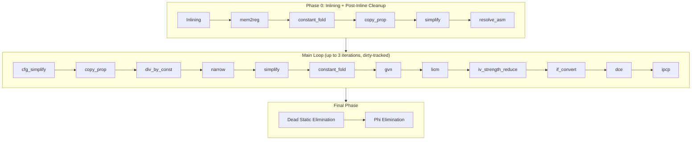

Each pass sets a dirty flag when it modifies the IR, enabling the main loop to re-iterate only when further optimization opportunities exist, up to a maximum of three iterations.

### 1.2.3 Success Criteria

#### Measurable Objectives

CCC's maturity and correctness are validated through a rigorous set of real-world compilation targets and test suites:

| Validation Target | Metric | Status |
|---|---|---|
| Linux Kernel 6.9 (RISC-V) | Builds and boots via QEMU | ✅ Pass (`BUILDING_LINUX.txt`) |
| PostgreSQL | 237/237 regression tests | ✅ Pass |
| FFmpeg (x86-64 + AArch64) | 7,331/7,331 FATE checkasm tests | ✅ Pass |
| SQLite | Functional on all 4 backends | ✅ Pass |
| QEMU (x86-64) | Boots Linux kernel | ✅ Pass |
| Additional Projects | 150+ real-world codebases | ✅ Pass |

The extended project tracking files (`ideas/new_projects.txt`, `ideas/new_projects_myasm.txt`) document per-architecture pass/fail status for approximately 200+ open-source projects including Redis, zlib, libsodium, libpng, jq, libjpeg-turbo, mbedTLS, libuv, libffi, musl, TCC, DOOM, BusyBox, CPython, LuaJIT, and GNU coreutils.

#### Critical Success Factors

1. **GCC Drop-In Compatibility**: CCC must be usable as `CC=ccc` without modifications to standard build systems (Make, CMake, Autoconf).
2. **Self-Contained Execution**: The standalone build configuration must produce valid ELF executables without invoking external assemblers or linkers.
3. **Multi-Architecture Correctness**: Generated code must be correct across all four target architectures for the supported C language subset.
4. **Real-World Viability**: The compiler must successfully build and pass test suites for major open-source C projects.

#### Key Performance Indicators

| KPI | Description |
|---|---|
| **Project Build Success Rate** | Percentage of tracked projects that compile and pass tests per architecture |
| **Test Suite Pass Rate** | Percentage of tests passed for major validation targets (PostgreSQL, FFmpeg) |
| **Standalone Mode Coverage** | Percentage of projects buildable without GCC fallback features |
| **Architecture Parity** | Feature and correctness parity across all four backends |

---

## 1.3 Scope

### 1.3.1 In-Scope

#### 1.3.1.1 Core Features and Functionalities

**Must-Have Capabilities:**

1. **Complete C Compilation Pipeline**: Full transformation from C source to ELF executable, encompassing preprocessing, lexing, parsing, semantic analysis, IR lowering, SSA construction (mem2reg), optimization (15+ passes), phi elimination, code generation, peephole optimization, assembly, and linking (`DESIGN_DOC.md`, `src/`).
2. **Four Target Architectures**: Native code generation, assembly, and linking for x86-64 (SysV ABI), i686 (cdecl ABI), AArch64 (AAPCS64 ABI), and RISC-V 64 (LP64D ABI) (`src/backend/`).
3. **GCC Drop-In Replacement**: Support for standard GCC command-line flags including `-O0` through `-O3`, `-Os`, `-Oz`, `-g`, `-D`, `-I`, `-W`, `-f`, `-S`, `-c`, `-E`, `-fPIC`, `-shared`, and `-x c` (`README.md`).
4. **SSA-Based Optimization Pipeline**: Fifteen or more optimization passes organized in a phased, dirty-tracked iteration scheme (`src/passes/`).
5. **DWARF Debug Information**: Generation of DWARF debug information when the `-g` flag is specified, enabling source-level debugging.
6. **Position-Independent Code**: Support for `-fPIC` and `-shared` flags for shared library generation.
7. **Builtin Assembler**: Architecture-specific assemblers (AT&T syntax for x86, ARM syntax for AArch64, RV syntax for RISC-V) with full encoding support including REX/ModR/M/SIB (x86), fixed 32-bit encoding with imm12 auto-shift (AArch64), and RV64C compression (RISC-V) (`DESIGN_DOC.md`, `src/backend/`).
8. **Builtin Linker**: Symbol resolution, relocation processing (PLT/GOT, TLS, IFUNC where applicable), and ELF generation for all four architectures, with both static and dynamic linking support (`DESIGN_DOC.md`, `src/backend/`).
9. **Bundled SIMD Headers**: 17 header files in `include/` providing intrinsics for SSE, SSE2, SSE3, SSSE3, SSE4.1, SSE4.2, AVX, AVX2, AVX-512, AES-NI, FMA, SHA, BMI2, and ARM NEON.
10. **Cross-Compilation**: Compilation for non-host architectures from a Linux x86-64 host using architecture-specific sysroots.

**Primary User Workflows:**

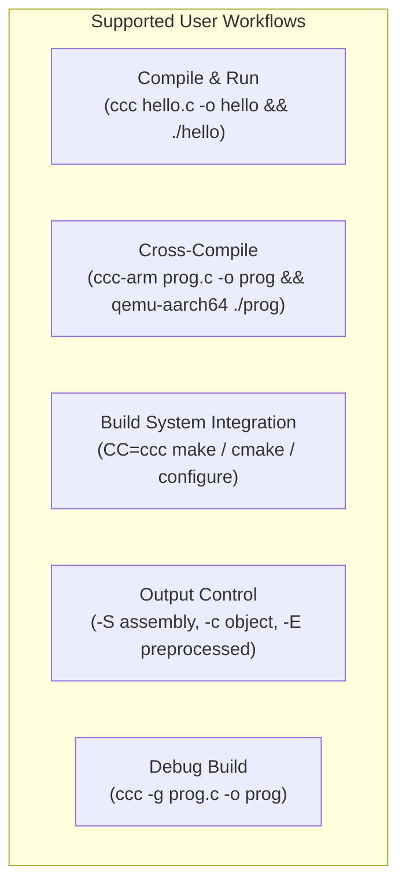

**Essential Integrations:**

| Integration Point | Description |
|---|---|
| Linux System Headers | glibc or musl headers for standard C library declarations |
| C Runtime Libraries | System-provided `crt1.o`, `crti.o`, `crtn.o`, and `libc.so` / `libc.a` |
| Cross-Compilation Sysroots | Architecture-specific system roots for ARM, RISC-V, and i686 targets |
| GCC Fallback (Optional) | Feature-gated fallback to GCC assembler, linker, or 16-bit code generation |

**Diagnostic and Developer Controls:**

| Environment Variable | Purpose |
|---|---|
| `CCC_TIME_PHASES` | Report time spent in each compilation phase |
| `CCC_TIME_PASSES` | Report time spent in each optimization pass |
| `CCC_DISABLE_PASSES` | Selectively disable optimization passes |
| `CCC_KEEP_ASM` | Retain intermediate assembly output |
| `CCC_ASM_DEBUG` | Enable assembler debug output |

#### 1.3.1.2 Implementation Boundaries

- **System Boundary**: Linux host producing Linux ELF executables exclusively. No other operating system or executable format is targeted.
- **User Groups**: C language developers working on Linux hosts who need to compile C programs for any of the four supported architectures.
- **Geographic/Market Coverage**: Platform-neutral (any Linux environment); no geographic restrictions apply.
- **Data Domains**: C source code (including standard and GNU extensions) as input; ELF binaries, assembly text, object files, or preprocessed source as output.
- **Testing Infrastructure**: In-source `#[test]` unit tests (via `cargo test --release`) and end-to-end integration tests in `tests/` directories using `main.c`, `expected.stdout`, `expected.ret`, and per-architecture skip markers (`README.md`).

### 1.3.2 Out-of-Scope

#### 1.3.2.1 Excluded Features and Capabilities

The following items are explicitly **not** part of the current CCC scope:

| Exclusion | Rationale |
|---|---|
| Windows (PE) and macOS (Mach-O) support | Linux-only design; only ELF output format is implemented |
| C++ compilation | CCC is a C-only compiler; no C++ frontend, name mangling, or template support |
| Objective-C compilation | Not implemented |
| IDE integration | No editor plugins or integrations are provided |
| Language Server Protocol (LSP) | No LSP server for code intelligence |
| Formal verification of compiler correctness | Not in current scope |
| Complete C11/C17/C23 compliance | Partial GNU extensions supported; full standards conformance is aspirational |

#### 1.3.2.2 Known Limitations

The following limitations exist within the current implementation (`README.md`):

1. **Uniform Optimization Levels**: All optimization levels (`-O0` through `-O3`, `-Os`, `-Oz`) run the same optimization pipeline. Separate optimization tiers with distinct pass configurations are not yet implemented.
2. **`_Atomic` Qualifier**: The `_Atomic` keyword is parsed but the qualifier is not tracked through the type system, meaning atomic semantics are not enforced.
3. **`_Complex` Arithmetic**: Complex number arithmetic has edge-case failures in certain operations.
4. **Partial `__attribute__` Support**: Only a subset of GCC `__attribute__` annotations is recognized and honored.
5. **Partial NEON Intrinsics**: Core 128-bit ARM NEON operations are supported, but coverage is incomplete.

#### 1.3.2.3 Future Phase Considerations

The `ideas/` directory documents planned enhancements and architectural improvements for future development phases:

| Future Work Item | Source |
|---|---|
| Sparse Conditional Constant Propagation (SCCP) pass | `ideas/optimization_passes_future.txt` |
| Use-def chain infrastructure | `ideas/high_use_def_chains.txt` |
| Value location abstraction improvements | `ideas/high_value_location_abstraction.txt` |
| Register allocator quality improvements | `ideas/register_allocator.txt` |
| Compile speed optimizations | `ideas/high_compile_speed_improvements.txt` |
| String literal deduplication | `current_tasks/implement_string_literal_deduplication.txt` |
| Stack frame size optimization | `ideas/reduce_stack_frame_size_for_postgres.txt` |

Additionally, `current_tasks/` tracks 12+ active bug and task items including ARM assembler regressions, i686 double-precision parameter issues, RISC-V `va_arg` alignment concerns, and x86 kernel link errors.

---

## 1.4 Technology Stack

### 1.4.1 Core Technologies

| Component | Technology | Details |
|---|---|---|
| Implementation Language | Rust | 2021 edition, stable toolchain |
| Crate Identity | `ccc` v0.1.0 | Single crate, five binary targets |
| External Dependencies | None | Zero compiler-specific dependencies |
| License | CC0 1.0 Universal | Public Domain dedication |
| Host Platform | Linux | x86-64 host required |
| Target Formats | ELF | Linux executables and shared objects |

### 1.4.2 Architecture Coverage

| Architecture | ABI | Assembler Syntax | Link Mode | Distinguishing Features |
|---|---|---|---|---|
| x86-64 | SysV | AT&T | Dynamic | REX/ModR/M/SIB encoding, SSE/AES-NI |
| i686 | cdecl | AT&T (reused) | Dynamic | 32-bit ELFCLASS32, `.rel` relocations |
| AArch64 | AAPCS64 | ARM | Static + Dynamic | Fixed 32-bit encoding, IFUNC, imm12 auto-shift |
| RISC-V 64 | LP64D | RV | Dynamic | RV64C compression, TLS GD→LE relaxation |

---

#### References

- `README.md` — Project overview, capabilities, prerequisites, usage instructions, GCC compatibility flags, real-world build results, known limitations, testing infrastructure, environment variables
- `DESIGN_DOC.md` — Complete architecture documentation including compilation pipeline, source tree structure, design decisions, philosophy, assembler architecture, linker architecture
- `Cargo.toml` — Package metadata (name, version, edition, description), binary target definitions, feature gate declarations
- `LICENSE` — CC0 1.0 Universal public domain dedication
- `BUILDING_LINUX.txt` — Linux kernel 6.9 RISC-V build reproduction steps using CCC
- `src/lib.rs` — Crate root with module declarations and `compiler_main()` entry point (64 MiB stack worker thread)
- `src/bin/` — Four architecture-specific binary shims invoking shared entry point
- `src/frontend/` — Preprocessor, lexer, parser, and semantic analysis modules
- `src/ir/` — SSA intermediate representation with lowering and mem2reg subsystems
- `src/passes/` — Sixteen optimization pass implementation files with phased iteration control
- `src/backend/` — Architecture-specific code generation, peephole optimization, assembler, and linker implementations
- `src/common/` — Shared types (CType/IrType), diagnostics engine, symbol table, source locations
- `src/driver/` — CLI parsing, pipeline orchestration, external tool integration, file type handling
- `include/` — Seventeen bundled C header files for SIMD intrinsics (SSE through AVX-512, AES-NI, FMA, SHA, BMI2, ARM NEON)
- `ideas/new_projects.txt` — Project validation tracking for major open-source builds
- `ideas/new_projects_myasm.txt` — Extended per-architecture pass/fail tracking for 200+ projects using standalone assembler and linker
- `ideas/` — Twenty-one future work proposals, bug investigations, and optimization plans
- `current_tasks/` — Thirteen active bug and task tracking files

# 2. Product Requirements

## 2.1 Feature Catalog

### 2.1.1 Feature Overview and Categorization

CCC (Claude's C Compiler) is decomposed into twenty discrete features spanning six functional categories. Each feature represents a testable, independently identifiable capability of the system. Features are organized by their position in the compilation pipeline and their role in the overall product architecture.

The following summary table provides a navigational index to the full feature catalog:

| Feature ID | Feature Name | Category |
|---|---|---|
| F-001 | C Preprocessing | Frontend |
| F-002 | Lexical Analysis | Frontend |
| F-003 | Parsing (AST Construction) | Frontend |
| F-004 | Semantic Analysis | Frontend |
| F-005 | SSA Intermediate Representation | Middle-End |
| F-006 | IR Lowering | Middle-End |
| F-007 | SSA Construction (mem2reg) | Middle-End |
| F-008 | Optimization Pipeline | Middle-End |
| F-009 | Multi-Architecture Code Generation | Backend |
| F-010 | Builtin Assembler | Backend |
| F-011 | Builtin Linker | Backend |
| F-012 | GCC Compatibility Layer | Platform |
| F-013 | Cross-Compilation Support | Platform |
| F-014 | DWARF Debug Information | Platform |
| F-015 | PIC & Shared Libraries | Platform |
| F-016 | Bundled SIMD & Intrinsic Headers | Platform |
| F-017 | Diagnostics & Error Reporting | Infrastructure |
| F-018 | Driver & Pipeline Orchestration | Infrastructure |
| F-019 | GCC Fallback Modes | Infrastructure |
| F-020 | Dual Type System | Infrastructure |

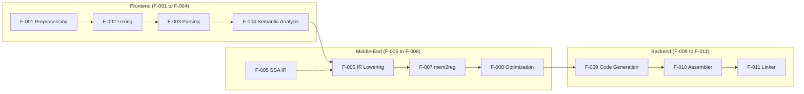

### 2.1.2 Frontend Features

#### F-001: C Preprocessing

| Attribute | Detail |
|---|---|
| **Feature ID** | F-001 |
| **Feature Name** | C Preprocessing |
| **Category** | Frontend |
| **Priority** | Critical |
| **Status** | Completed |

**Overview**: A GCC-compatible text-based preprocessor that operates as the first stage of the compilation pipeline, performing text-to-text transformation on C source files. The implementation resides in `src/frontend/preprocessor/` across seven source files: `pipeline.rs`, `macro_defs.rs`, `conditionals.rs`, `expr_eval.rs`, `builtin_macros.rs`, `predefined_macros.rs`, and `utils.rs`.

**Business Value**: Enables CCC to consume real-world C source code that relies on standard and GNU-extended preprocessing directives, which is a prerequisite for building any non-trivial C project. Without a complete preprocessor, the compiler cannot process system headers or macro-heavy codebases such as the Linux kernel or PostgreSQL.

**User Benefits**: Developers experience transparent preprocessing behavior compatible with GCC, including header inclusion, conditional compilation, macro expansion, and predefined macros for target architecture and optimization levels.

**Technical Context**: The preprocessor emits GCC-style `# line "file"` markers to preserve source location information throughout the pipeline (`src/frontend/preprocessor/pipeline.rs`). It supports `#include`, `#define` (object-like and function-like macros), `#undef`, `#ifdef`/`#ifndef`/`#if`/`#elif`/`#else`/`#endif`, variadic GNU `,##__VA_ARGS__`, stringification (`#`), token pasting (`##`), `defined` and `__has_*` intrinsics, and a comprehensive set of builtin and predefined macros (`__FILE__`, `__LINE__`, `__DATE__`, `__TIME__`, architecture-specific identifiers). Recursion protection is enforced via paint markers, and system include path initialization is performed per target architecture.

| Dependency Type | Details |
|---|---|
| **Prerequisite Features** | None — first stage of pipeline |
| **System Dependencies** | System headers (glibc/musl) |
| **External Dependencies** | None |
| **Integration Requirements** | Feeds output to F-002 Lexer |

---

#### F-002: Lexical Analysis

| Attribute | Detail |
|---|---|
| **Feature ID** | F-002 |
| **Feature Name** | Lexical Analysis |
| **Category** | Frontend |
| **Priority** | Critical |
| **Status** | Completed |

**Overview**: A single-pass, byte-level scanner that tokenizes preprocessed C source (`Vec<u8>`) into a stream of span-anchored tokens. The implementation is located in `src/frontend/lexer/` with two source files: `token.rs` (token type definitions) and `scan.rs` (scanning logic).

**Business Value**: Provides the tokenization foundation required by the parser, translating raw byte sequences into categorized tokens with precise source location information necessary for diagnostics.

**User Benefits**: Accurate source position reporting in compiler diagnostics, including file, line, and column information, is directly enabled by the lexer's span-anchored token design.

**Technical Context**: The lexer handles numerical variants, strings (regular, wide, and UTF-16), character literals, identifiers, keywords, GCC pragmas, and all C punctuation. It supports escape decoding, Unicode-to-UTF-8 conversion, and Private Use Area (PUA) decoding for non-UTF-8 bytes. GNU extension toggles allow selective acceptance of GNU-specific tokens. Integration with the `SourceManager` (`src/common/source.rs`) provides file/line/column reporting for all tokens.

| Dependency Type | Details |
|---|---|
| **Prerequisite Features** | F-001 C Preprocessing |
| **System Dependencies** | None |
| **External Dependencies** | None |
| **Integration Requirements** | Feeds output to F-003 Parser |

---

#### F-003: Parsing (AST Construction)

| Attribute | Detail |
|---|---|
| **Feature ID** | F-003 |
| **Feature Name** | Parsing (AST Construction) |
| **Category** | Frontend |
| **Priority** | Critical |
| **Status** | Completed |

**Overview**: A recursive-descent parser that constructs a typed Abstract Syntax Tree (AST) from the token stream. The implementation resides in `src/frontend/parser/` with files including `ast.rs`, `parse.rs`, and expression/statement/declaration helper modules.

**Business Value**: Transforms a flat token stream into a structured hierarchical representation of the C program, enabling subsequent semantic analysis and code generation. This is the critical step that makes program structure machine-interpretable.

**User Benefits**: Support for the full C language grammar including GNU extensions allows developers to compile real-world C code that uses common GCC-isms without modification.

**Technical Context**: The parser implements full C language grammar support including GNU extensions, typedef disambiguation via typedef stacks seeded from builtins, declarator parsing (function, pointer, array, qualified), statement parsing (compound, control flow, iteration, jump, inline assembly), and expression parsing with operator precedence. AST nodes use `ExprId` heap-backed references for stable referencing. The parser also supports `#pragma pack`/`visibility` and partial `__attribute__` handling via an attribute bitfield. Error recovery mechanisms allow continued parsing after encountering malformed input.

| Dependency Type | Details |
|---|---|
| **Prerequisite Features** | F-002 Lexical Analysis |
| **System Dependencies** | None |
| **External Dependencies** | None |
| **Integration Requirements** | Feeds output to F-004 Semantic Analysis |

---

#### F-004: Semantic Analysis

| Attribute | Detail |
|---|---|
| **Feature ID** | F-004 |
| **Feature Name** | Semantic Analysis |
| **Category** | Frontend |
| **Priority** | Critical |
| **Status** | Completed |

**Overview**: Enforces C language semantics on the parsed AST, performing type checking, implicit conversion insertion, constant expression evaluation, and attribute handling. The implementation is located in `src/frontend/sema/`.

**Business Value**: Ensures that compiled programs conform to C language semantics, catching type errors and constraint violations at compile time rather than producing silently incorrect code at runtime.

**User Benefits**: Developers receive precise diagnostic messages for type mismatches, constraint violations, and other semantic errors, reducing debugging time.

**Technical Context**: The semantic analyzer employs a `TypeContext` with undo-logged operations for speculative type resolution, an `ExprTypeChecker` for expression-level type analysis, and a `ConstMap` infrastructure for tracking compile-time constant values. An information-gathering pass collects metadata needed for downstream IR lowering. The diagnostic emission integrates with the `DiagnosticEngine` (F-017) for formatted error and warning output.

| Dependency Type | Details |
|---|---|
| **Prerequisite Features** | F-003 Parsing |
| **System Dependencies** | F-020 Dual Type System |
| **External Dependencies** | None |
| **Integration Requirements** | Feeds output to F-006 IR Lowering |

---

### 2.1.3 Middle-End Features

#### F-005: SSA Intermediate Representation

| Attribute | Detail |
|---|---|
| **Feature ID** | F-005 |
| **Feature Name** | SSA Intermediate Representation |
| **Category** | Middle-End |
| **Priority** | Critical |
| **Status** | Completed |

**Overview**: A target-independent Static Single Assignment (SSA) form intermediate representation with a rich instruction set, serving as the central program representation for all optimization and analysis passes. The implementation spans `src/ir/` across seven source files: `instruction.rs`, `intrinsics.rs`, `module.rs`, `ops.rs`, `constants.rs`, `analysis.rs`, and `reexports.rs`.

**Business Value**: Provides a uniform, architecture-independent representation that decouples frontend C semantics from backend machine-specific concerns, enabling the same optimization passes to benefit all four target architectures.

**User Benefits**: The SSA-based IR enables powerful optimizations that improve the runtime performance and binary size of compiled programs across all supported architectures.

**Technical Context**: The IR instruction set covers memory operations, arithmetic, pointer operations, ABI helpers, function calls, atomics, intrinsics, inline assembly representation, phi nodes, and complex-return shims. The `IrModule` structure serves as the compilation unit container, holding `IrGlobal` storage, `GlobalInit` initializers, and `IrFunction` metadata. Semantic vocabulary includes `AtomicRmwOp`, `AtomicOrdering`, `IrBinOp`, `IrUnaryOp`, and `IrCmpOp` enumerations. A constant lattice (`IrConst`) supports signed integers, floats, long doubles, and zero constants. CFG analysis infrastructure in `analysis.rs` provides CSR adjacency lists, reverse postorder DFS traversal, Cooper-Harvey-Kennedy dominator computation, and dominance frontier calculation. The `IntrinsicOp` enum models target-independent hardware intrinsics including fences, SIMD stores, AES, CRC, SSE operations, and scalar math. A side-effect analysis helper (`is_pure`) supports dead code elimination and code motion.

| Dependency Type | Details |
|---|---|
| **Prerequisite Features** | None (foundational) |
| **System Dependencies** | F-020 Dual Type System |
| **External Dependencies** | None |
| **Integration Requirements** | Used by F-006, F-007, F-008, F-009 |

---

#### F-006: IR Lowering

| Attribute | Detail |
|---|---|
| **Feature ID** | F-006 |
| **Feature Name** | IR Lowering |
| **Category** | Middle-End |
| **Priority** | Critical |
| **Status** | Completed |

**Overview**: Transforms the semantically validated C AST into SSA IR form. The implementation resides in `src/ir/lowering/` and covers functions, expressions, statements, global variables, types, constant evaluation, inline assembly, and complex numbers.

**Business Value**: Bridges the gap between high-level C program structure and the lower-level SSA representation required for optimization and code generation.

**User Benefits**: Correct and complete lowering ensures that the full range of C language constructs is preserved through the compilation pipeline, including inline assembly, complex numbers, and global initializers.

**Technical Context**: The `Lowerer` entry point orchestrates lowering of all C AST constructs including function bodies, expression trees, control-flow statements, global variable initializers, and inline assembly directives. Type seeding establishes the mapping from `CType` (F-020) to `IrType` representations. Constant evaluation at the IR level handles compile-time computable expressions. Complex number support maps `_Complex` operations to appropriate IR instruction sequences.

| Dependency Type | Details |
|---|---|
| **Prerequisite Features** | F-004 Semantic Analysis, F-005 SSA IR |
| **System Dependencies** | F-020 Dual Type System |
| **External Dependencies** | None |
| **Integration Requirements** | Feeds output to F-007 mem2reg |

---

#### F-007: SSA Construction (mem2reg)

| Attribute | Detail |
|---|---|
| **Feature ID** | F-007 |
| **Feature Name** | SSA Construction (mem2reg) |
| **Category** | Middle-End |
| **Priority** | Critical |
| **Status** | Completed |

**Overview**: Promotes `alloca` instructions to SSA registers using the same alloca-then-promote approach employed by LLVM. The implementation is in `src/ir/mem2reg/`, including `promote.rs`.

**Business Value**: Converts memory-based variable representations into register-based SSA form, enabling the full suite of SSA-based optimization passes to operate effectively.

**User Benefits**: Improved optimization quality translates directly to faster executable performance and smaller binary sizes.

**Technical Context**: The promotion process follows six steps: alloca filtering (subject to `MAX_PROMOTABLE_ALLOCA_SIZE` heuristic), CFG rebuild, dominator and dominance frontier computation, phi node insertion at dominance frontiers, variable renaming via dominator tree traversal, and alloca elimination. Phi elimination is performed separately as a final phase before code generation to prepare the IR for register allocation.

| Dependency Type | Details |
|---|---|
| **Prerequisite Features** | F-006 IR Lowering |
| **System Dependencies** | F-005 SSA IR (CFG analysis) |
| **External Dependencies** | None |
| **Integration Requirements** | Feeds output to F-008 Optimization |

---

#### F-008: Optimization Pipeline

| Attribute | Detail |
|---|---|
| **Feature ID** | F-008 |
| **Feature Name** | Optimization Pipeline |
| **Category** | Middle-End |
| **Priority** | High |
| **Status** | Completed |

**Overview**: A phased, dirty-tracked optimization framework comprising fifteen or more SSA-based optimization passes. The implementation spans `src/passes/` across eighteen files: `mod.rs`, sixteen pass implementation files, `loop_analysis.rs`, and `resolve_asm.rs`.

**Business Value**: Generates efficient machine code by eliminating redundancies, simplifying computations, and restructuring control flow, directly improving the runtime performance of compiled programs.

**User Benefits**: Developers benefit from compiler optimizations without needing to manually optimize their C source code. The optimization pipeline enables CCC-compiled binaries to achieve competitive performance with established compilers for many workloads.

**Technical Context**: The pipeline is organized in three phases:

- **Phase 0 (Inlining + Post-Inline Cleanup)**: Function inlining with a budget system (instruction counts, block caps, `always_inline` override, recursion limits), followed by mem2reg, constant folding, copy propagation, algebraic simplification, and inline assembly symbol resolution.
- **Phase 0.5**: `IsConstant` falsification.
- **Main Loop** (up to 3 iterations with dirty tracking): `cfg_simplify` → `copy_prop` → `div_by_const` → `narrow` → `simplify` → `constant_fold` → `gvn` → `licm` → `iv_strength_reduce` → `if_convert` → `dce` → `ipcp`.
- **Final Phase**: Dead static elimination → Phi elimination.

Individual pass capabilities include:

| Pass | Implementation File | Core Technique |
|---|---|---|
| CFG Simplify | `cfg_simplify.rs` | Branch folding, jump threading, dead block removal |
| Constant Fold | `constant_fold.rs` | Int/float/BFloat/long-double folding |
| Copy Propagation | `copy_prop.rs` | SSA-to-operand map with path compression |
| DCE | `dce.rs` | Use counting with side-effect recognition |
| Dead Statics | `dead_statics.rs` | BFS reachability from symbol roots |
| Div by Constant | `div_by_const.rs` | Magic number mul/shift sequences |
| GVN | `gvn.rs` | Dominator-based numbering, load forwarding |
| If-Convert | `if_convert.rs` | Diamond/triangle to Select (≤8 speculative ops) |
| Inlining | `inline.rs` | Budget-limited, always_inline, recursion-safe |
| IPCP | `ipcp.rs` | Return propagation, arg specialization |
| IV Strength Reduce | `iv_strength_reduce.rs` | GEP rewriting for induction variables |
| LICM | `licm.rs` | Pure instruction and safe load hoisting |
| Loop Analysis | `loop_analysis.rs` | Natural-loop detection, preheader identification |
| Narrow | `narrow.rs` | Bit-width narrowing |
| Simplify | `simplify.rs` | Algebraic identity simplification |

Iteration convergence uses a <5% change threshold after two rounds unless IPCP has mutated the IR. Environment variables `CCC_DISABLE_PASSES` and `CCC_TIME_PASSES` provide developer controls for debugging and profiling.

| Dependency Type | Details |
|---|---|
| **Prerequisite Features** | F-007 mem2reg |
| **System Dependencies** | F-005 SSA IR (CFG analysis) |
| **External Dependencies** | None |
| **Integration Requirements** | Feeds output to F-009 Code Generation |

---

### 2.1.4 Backend Features

#### F-009: Multi-Architecture Code Generation

| Attribute | Detail |
|---|---|
| **Feature ID** | F-009 |
| **Feature Name** | Multi-Architecture Code Generation |
| **Category** | Backend |
| **Priority** | Critical |
| **Status** | Completed |

**Overview**: Trait-based code generation for four processor architectures (x86-64, i686, AArch64, RISC-V 64), translating optimized SSA IR into architecture-specific machine instructions. The shared backend infrastructure resides in `src/backend/` (17 files), with architecture-specific implementations in `src/backend/x86/codegen/`, `src/backend/i686/codegen/`, `src/backend/arm/codegen/`, and `src/backend/riscv/codegen/`.

**Business Value**: Multi-architecture support from a single codebase maximizes market reach while minimizing maintenance cost — a single set of optimizations and a single IR benefits all four targets.

**User Benefits**: Developers can target multiple processor architectures using a single, consistent compiler interface without switching toolchains.

**Technical Context**: All four backends implement the `ArchCodegen` trait defined in `src/backend/traits.rs`, which specifies approximately 185 methods with shared default implementations. This design enables maximum code reuse while permitting architecture-specific overrides.

| Architecture | ABI | Key Characteristics |
|---|---|---|
| x86-64 | SysV AMD64 | 6 GP + 8 XMM regs, x87 long double, REX/ModR/M/SIB |
| i686 | cdecl | ILP32, `%eax` accumulator, `%ebx` PIC, `.code16gcc` |
| AArch64 | AAPCS64 | Fixed 32-bit encoding, IFUNC/IPLT, LDXR/STXR atomics |
| RISC-V 64 | LP64D | RV64GC, LR/SC atomics, software SIMD |

Shared infrastructure includes `call_abi.rs` for ABI classification logic, `cast.rs` for conversion semantics, `regalloc.rs` for linear scan register allocation with loop-aware liveness, `liveness.rs` for liveness analysis, `stack_layout/` for stack frame computation, `peephole_common.rs` for shared peephole utilities, `f128_softfloat.rs` for IEEE binary128 soft float (ARM/RISC-V), and `x86_common.rs` for shared x86/i686 helpers. Each backend has its own peephole optimizer — x86-64 alone implements 15 distinct pass functions.

Codegen options include PIC mode, retpoline generation (Spectre mitigation), CET (Control-flow Enforcement Technology), patchable entry points, and kernel code model selection.

| Dependency Type | Details |
|---|---|
| **Prerequisite Features** | F-008 Optimization Pipeline |
| **System Dependencies** | F-005 SSA IR, F-020 Dual Type System |
| **External Dependencies** | None |
| **Integration Requirements** | Feeds output to F-010 Assembler |

---

#### F-010: Builtin Assembler

| Attribute | Detail |
|---|---|
| **Feature ID** | F-010 |
| **Feature Name** | Builtin Assembler |
| **Category** | Backend |
| **Priority** | Critical |
| **Status** | Completed |

**Overview**: Architecture-specific assemblers implemented entirely from scratch, converting assembly text into relocatable object code. Implementations reside in `src/backend/x86/assembler/`, `src/backend/i686/assembler/`, `src/backend/arm/assembler/`, and `src/backend/riscv/assembler/`, with shared infrastructure in `src/backend/asm_preprocess.rs` and `src/backend/asm_expr.rs`.

**Business Value**: Eliminates dependency on external assemblers (GNU `as`), completing the self-contained toolchain vision and ensuring consistent behavior across all platforms.

**User Benefits**: Zero-configuration assembly — users do not need to install a separate assembler. The builtin assembler also enables the `-S` flag workflow where assembly output from CCC can be re-consumed by CCC itself.

**Technical Context**: The x86-64 assembler handles AT&T syntax with SSE through EVEX encoding, BMI2, AES-NI, x87 instructions, numeric labels, and GAS macro support. The i686 assembler reuses the x86-64 AT&T parser with a 32-bit encoder, producing REL relocations in ELFCLASS32 format. The AArch64 assembler supports GNU-style ARM syntax, literal pools, NEON operands, macros/conditionals/directives, and backpatch constructs. The RISC-V assembler uses a seven-stage pipeline (preprocess, parse, encode, ELF write, compression, relaxation) with RV64C compression producing 16-bit halfwords. Shared preprocessing infrastructure handles comment stripping, `.rept`/`.irp` expansion, macro parsing/expansion, and conditional assembly directives.

| Dependency Type | Details |
|---|---|
| **Prerequisite Features** | F-009 Code Generation |
| **System Dependencies** | None |
| **External Dependencies** | None |
| **Integration Requirements** | Feeds output to F-011 Linker |

---

#### F-011: Builtin Linker

| Attribute | Detail |
|---|---|
| **Feature ID** | F-011 |
| **Feature Name** | Builtin Linker |
| **Category** | Backend |
| **Priority** | Critical |
| **Status** | Completed |

**Overview**: A full ELF linker for all four architectures, performing symbol resolution, relocation processing, and executable/shared-object generation. Implementations are in `src/backend/x86/linker/`, `src/backend/i686/linker/`, `src/backend/arm/linker/`, `src/backend/riscv/linker/`, with shared code in `src/backend/linker_common/` and `src/backend/elf/`.

**Business Value**: Eliminates the dependency on external linkers (GNU `ld`, `gold`, `mold`), completing the fully self-contained compilation pipeline and removing a major source of cross-compilation complexity.

**User Benefits**: Single-step compilation from C source to executable with no external tool invocations. Users do not need to install or configure a separate linker.

**Technical Context**: The linker performs symbol resolution, relocation processing (architecture-specific), PLT/GOT generation, and TLS support (LE, IE, TLSDESC, GD modes; GD→LE relaxation on RISC-V). It supports both static and dynamic linking, shared library generation (`-shared`), IFUNC/IPLT (AArch64), CRT file handling (`crt1.o`, `crti.o`, `crtn.o`), `--gc-sections`, `--defsym`, `-rdynamic`, GNU hash tables, symbol versioning, archive and thin-archive processing, and COMDAT deduplication. Architecture-specific behaviors include ELFCLASS32 with `.rel` relocations for i686 and dynamic linking with TLS relaxation for RISC-V.

| Dependency Type | Details |
|---|---|
| **Prerequisite Features** | F-010 Assembler |
| **System Dependencies** | CRT libraries (`crt1.o`, `crti.o`, `crtn.o`) |
| **External Dependencies** | `libc.so`/`libc.a` (system C library) |
| **Integration Requirements** | Produces final ELF output |

---

### 2.1.5 Platform and Compatibility Features

#### F-012: GCC Compatibility Layer

| Attribute | Detail |
|---|---|
| **Feature ID** | F-012 |
| **Feature Name** | GCC Compatibility Layer |
| **Category** | Platform |
| **Priority** | Critical |
| **Status** | Completed |

**Overview**: A comprehensive GCC command-line compatibility layer that allows CCC to function as a drop-in GCC replacement for existing build systems. The implementation is primarily in `src/driver/cli.rs`.

**Business Value**: Enables immediate adoption in existing C development workflows without requiring build system modifications, significantly lowering the barrier to entry.

**User Benefits**: Developers can use `CC=ccc` with Make, CMake, and Autoconf (`configure`) scripts without any changes. Standard GCC flags are recognized and processed correctly.

**Technical Context**: CCC reports as GCC 14.2.0 (`ccc -dumpversion` → `14.2.0`) and emits architecture-appropriate target triples via `ccc -dumpmachine`. GNU ld version emulation reports `GNU ld (Claude's C Compiler built-in) 2.42`. Supported flags include `-O0` through `-O3`, `-Os`, `-Oz`, `-g`, `-fPIC`, `-shared`, `-D`, `-I`, `-W`, `-f`, `-S`, `-c`, `-E`, `-x c`, `-std=`, and SIMD flag implications (`-mavx2`, `-msse3`, etc.). Linker/assembler/preprocessor flag passthrough is supported via `-Wl,`, `-Xlinker`, `-Wa,`, and `-Wp,` prefixes. Response file expansion (`@file`), `-print-search-dirs`, `-print-file-name`, and silent ignoring of unrecognized flags round out the compatibility surface.

| Dependency Type | Details |
|---|---|
| **Prerequisite Features** | F-018 Driver & Pipeline |
| **System Dependencies** | None |
| **External Dependencies** | None |
| **Integration Requirements** | Make, CMake, Autoconf build systems |

---

#### F-013: Cross-Compilation Support

| Attribute | Detail |
|---|---|
| **Feature ID** | F-013 |
| **Feature Name** | Cross-Compilation Support |
| **Category** | Platform |
| **Priority** | High |
| **Status** | Completed |

**Overview**: Enables compilation for non-host architectures from a Linux x86-64 host using dedicated binary targets and architecture-specific sysroots. The five binary shims are defined in `Cargo.toml` and `src/bin/`.

**Business Value**: A single build of CCC supports four target architectures, eliminating the need to install separate cross-compilation toolchain packages for each target.

**User Benefits**: Developers can cross-compile for AArch64, RISC-V 64, and i686 from their x86-64 workstation using simple binary name selection (`ccc-arm`, `ccc-riscv`, `ccc-i686`) and test with QEMU.

**Technical Context**: The five binary targets (`ccc`, `ccc-x86`, `ccc-arm`, `ccc-riscv`, `ccc-i686`) are built from the same codebase. Target architecture is inferred from the binary name (`argv[0]`) in `src/driver/cli.rs`. Architecture-specific sysroot paths (e.g., `aarch64-linux-gnu`, `riscv64-linux-gnu`) are configured per target for system header and library resolution.

| Dependency Type | Details |
|---|---|
| **Prerequisite Features** | F-009 Code Generation (all backends) |
| **System Dependencies** | Architecture-specific sysroots |
| **External Dependencies** | QEMU (for testing cross-compiled binaries) |
| **Integration Requirements** | Sysroot packages on host |

---

#### F-014: DWARF Debug Information Generation

| Attribute | Detail |
|---|---|
| **Feature ID** | F-014 |
| **Feature Name** | DWARF Debug Information |
| **Category** | Platform |
| **Priority** | Medium |
| **Status** | Completed |

**Overview**: Generation of DWARF debug information when the `-g` flag is specified, enabling source-level debugging of compiled programs. The implementation integrates with code generation via `build_and_emit_dwarf_file_table` in `src/backend/generation.rs`.

**Business Value**: Enables developers to use standard debuggers (GDB, LLDB) with CCC-compiled binaries, which is essential for practical development workflows.

**User Benefits**: Source-level debugging capability including file/line mapping for breakpoints and stack traces.

**Technical Context**: DWARF file table generation is integrated into the code generation pipeline. The `-g` flag activates DWARF emission across all architecture backends.

| Dependency Type | Details |
|---|---|
| **Prerequisite Features** | F-009 Code Generation |
| **System Dependencies** | None |
| **External Dependencies** | None |
| **Integration Requirements** | GDB/LLDB debugger compatibility |

---

#### F-015: Position-Independent Code & Shared Libraries

| Attribute | Detail |
|---|---|
| **Feature ID** | F-015 |
| **Feature Name** | PIC & Shared Libraries |
| **Category** | Platform |
| **Priority** | High |
| **Status** | Completed |

**Overview**: Support for position-independent code generation and shared library production across all four architectures, controlled by `-fPIC` and `-shared` flags. Implemented across all backend codegen and linker modules.

**Business Value**: Enables production of shared libraries (`.so` files) and ASLR-compatible executables, which are requirements for modern Linux system software.

**User Benefits**: Developers can build shared libraries and PIE executables using standard GCC-compatible flags.

**Technical Context**: PIC code generation uses GOT-based addressing (i686 via `%ebx`-relative GOT access). The linker generates PLT/GOT entries for dynamic symbol resolution. TLS support spans LE, IE, TLSDESC, and GD modes across architectures. The `-shared` flag triggers shared library output with appropriate dynamic section generation.

| Dependency Type | Details |
|---|---|
| **Prerequisite Features** | F-009 Code Generation, F-011 Linker |
| **System Dependencies** | Dynamic linker (`ld-linux.so`) |
| **External Dependencies** | None |
| **Integration Requirements** | System dynamic linking infrastructure |

---

#### F-016: Bundled SIMD & Intrinsic Headers

| Attribute | Detail |
|---|---|
| **Feature ID** | F-016 |
| **Feature Name** | Bundled SIMD & Intrinsic Headers |
| **Category** | Platform |
| **Priority** | High |
| **Status** | Completed |

**Overview**: A complete set of seventeen C header files in `include/` providing x86 SIMD and ARM NEON intrinsic type definitions and function declarations.

**Business Value**: Enables compilation of performance-critical C code that uses SIMD intrinsics without requiring external header packages.

**User Benefits**: Transparent intrinsic support for SSE, SSE2, SSE3, SSSE3, SSE4.1/4.2, AVX, AVX2, AVX-512 Foundation, AES-NI, FMA3, SHA, BMI2, and ARM NEON.

**Technical Context**: Headers include `mmintrin.h` (MMX), `xmmintrin.h` (SSE), `emmintrin.h` (SSE2), `pmmintrin.h` (SSE3), `tmmintrin.h` (SSSE3), `smmintrin.h` (SSE4.1/4.2), `nmmintrin.h` (SSE4.2 wrapper), `avxintrin.h` (AVX), `avx2intrin.h` (AVX2), `avx512fintrin.h` (AVX-512F), `fmaintrin.h` (FMA3), `wmmintrin.h` (AES/CLMUL), `shaintrin.h` (SHA), `bmi2intrin.h` (BMI2), `immintrin.h` (aggregator + RDRAND/RDSEED), `x86intrin.h` (rdtsc, byte swap, bit scan, rotate), and `arm_neon.h` (NEON with struct-based vector types). All intrinsics are implemented as pure C via loops, memcpy, and macros rather than actual SIMD instructions, relying on the compiler to lower them to appropriate machine instructions.

| Dependency Type | Details |
|---|---|
| **Prerequisite Features** | F-001 Preprocessing (include paths) |
| **System Dependencies** | None |
| **External Dependencies** | None |
| **Integration Requirements** | Preprocessor include path configuration |

---

### 2.1.6 Infrastructure Features

#### F-017: Diagnostics & Error Reporting

| Attribute | Detail |
|---|---|
| **Feature ID** | F-017 |
| **Feature Name** | Diagnostics & Error Reporting |
| **Category** | Infrastructure |
| **Priority** | High |
| **Status** | Completed |

**Overview**: A GCC-style colored diagnostic system providing structured error and warning output with source code context. Implemented in `src/common/error.rs` and `src/common/source.rs`.

**Business Value**: High-quality diagnostics are essential for developer productivity and directly influence user perception of compiler quality.

**User Benefits**: Clear, location-annotated diagnostic messages with source snippets, caret indicators, macro expansion traces, and include chain tracing help developers quickly identify and fix errors.

**Technical Context**: The `DiagnosticEngine` supports configurable `ColorMode`, multiple severity levels, warning kinds and configuration (`-Werror`, `-Wall`, `-Wextra`), and GCC-style `location:severity:message` formatting. Source code snippets with caret indicators pinpoint error locations. Include chain tracing is capped at 200 hops to prevent infinite output. Error and warning count tracking enables summary reporting.

| Dependency Type | Details |
|---|---|
| **Prerequisite Features** | None (foundational) |
| **System Dependencies** | Terminal color support |
| **External Dependencies** | None |
| **Integration Requirements** | Used by all pipeline stages |

---

#### F-018: Driver & Pipeline Orchestration

| Attribute | Detail |
|---|---|
| **Feature ID** | F-018 |
| **Feature Name** | Driver & Pipeline Orchestration |
| **Category** | Infrastructure |
| **Priority** | Critical |
| **Status** | Completed |

**Overview**: CLI argument handling and compilation pipeline management, orchestrating the nine-phase compilation sequence from source input to ELF output. Implemented in `src/driver/` across `pipeline.rs`, `cli.rs`, `external_tools.rs`, `file_types.rs`, and `mod.rs`.

**Business Value**: The driver is the user-facing entry point of the entire compiler; it must correctly parse diverse GCC-compatible command lines and orchestrate the compilation pipeline for all supported modes.

**User Benefits**: A single command invocation handles the complete compilation flow, with fine-grained control over output modes (`-S`, `-c`, `-E`).

**Technical Context**: The driver supports four `CompileMode` variants (PreprocessOnly, AssemblyOnly, ObjectOnly, Full) and a nine-phase compilation sequence. File type detection operates by extension, magic bytes, or explicit `-x` override. Dependency file generation (`-M`/`-MD`/`-MMD`) supports Make-style build systems. Phase timing via `CCC_TIME_PHASES` enables performance profiling. The main compilation entry point spawns a worker thread with a 64 MiB stack (`src/lib.rs`) to handle deep recursion in complex translation units. Driver configuration is organized into groups: target/output, optimization, preprocessor, code generation, RISC-V overrides, linker, diagnostics, dependency generation, and miscellaneous settings.

| Dependency Type | Details |
|---|---|
| **Prerequisite Features** | None (orchestrator) |
| **System Dependencies** | All pipeline features |
| **External Dependencies** | None |
| **Integration Requirements** | Coordinates all features |

---

#### F-019: GCC Fallback Modes

| Attribute | Detail |
|---|---|
| **Feature ID** | F-019 |
| **Feature Name** | GCC Fallback Modes |
| **Category** | Infrastructure |
| **Priority** | Low |
| **Status** | Completed |

**Overview**: Three optional Cargo feature gates that allow selective fallback to external GCC components for edge cases. Defined in `Cargo.toml` and implemented via `src/driver/external_tools.rs`.

**Business Value**: Provides an escape hatch for scenarios where the builtin assembler, linker, or 16-bit code generator cannot yet handle specific edge cases, maintaining build compatibility while internal implementations mature.

**User Benefits**: Users encountering rare edge cases can enable GCC fallback to unblock their builds.

**Technical Context**: Three feature gates are available: `gcc_assembler` (use GCC assembler instead of builtin), `gcc_linker` (use GCC linker instead of builtin), and `gcc_m16` (use GCC for 16-bit real-mode boot code). When a fallback is active, a one-time warning is printed. The `ccc --version` output reflects which components use GCC versus standalone mode. All three features are disabled by default, ensuring the standalone build is the standard configuration.

| Dependency Type | Details |
|---|---|
| **Prerequisite Features** | F-018 Driver & Pipeline |
| **System Dependencies** | None (when disabled) |
| **External Dependencies** | GCC installation (when enabled) |
| **Integration Requirements** | Cargo feature gate system |

---

#### F-020: Dual Type System

| Attribute | Detail |
|---|---|
| **Feature ID** | F-020 |
| **Feature Name** | Dual Type System |
| **Category** | Infrastructure |
| **Priority** | Critical |
| **Status** | Completed |

**Overview**: Two parallel type representations bridging C language semantics and machine-level layout, used throughout the entire compilation pipeline. Implemented in `src/common/types.rs` and `src/common/type_builder.rs`.

**Business Value**: Enables precise and correct translation from C-level types to machine-level representations across all four target architectures, which is foundational for correctness.

**User Benefits**: Correct type handling ensures that compiled programs behave identically to GCC-compiled equivalents for the supported C language subset.

**Technical Context**: `CType` provides a 27-variant C-level type system supporting Display formatting, size/alignment computation, integer promotion, vectors, bitfields, flexible arrays, function types, enum types, and struct layout. `IrType` provides machine-level layout with per-target predicates. `TypeConvertContext` transforms declarator chains into concrete types. `StructLayoutBuilder` handles struct layout with packing and bitfield support. ABI classifiers (`EightbyteClass`, `RiscvFloatClass`, `AddressSpace`) support architecture-specific calling conventions. Thread-local helpers provide target-specific type property access.

| Dependency Type | Details |
|---|---|
| **Prerequisite Features** | None (foundational) |
| **System Dependencies** | None |
| **External Dependencies** | None |
| **Integration Requirements** | Used by F-004, F-005, F-006, F-009 |

---

## 2.2 Functional Requirements

### 2.2.1 Frontend Requirements

#### F-001-RQ: Preprocessing Requirements

| Requirement ID | Description | Priority |
|---|---|---|
| F-001-RQ-001 | Process `#include` directives for system and local headers | Must-Have |
| F-001-RQ-002 | Expand object-like and function-like macros including variadic GNU `,##__VA_ARGS__` | Must-Have |
| F-001-RQ-003 | Evaluate conditional directives (`#if`, `#ifdef`, `#ifndef`, `#elif`, `#else`, `#endif`) | Must-Have |
| F-001-RQ-004 | Support stringification (`#`) and token pasting (`##`) operators | Must-Have |
| F-001-RQ-005 | Provide predefined macros for target arch, optimization level, PIC, and SSE enablement | Must-Have |
| F-001-RQ-006 | Emit GCC-style `# line "file"` markers for source location preservation | Must-Have |
| F-001-RQ-007 | Prevent infinite recursion via paint-marker recursion protection | Must-Have |

| Requirement ID | Acceptance Criteria | Complexity |
|---|---|---|
| F-001-RQ-001 | All system headers from glibc/musl resolve correctly per target sysroot | High |
| F-001-RQ-002 | Macro expansion matches GCC behavior including edge cases | High |
| F-001-RQ-003 | Conditional evaluation of integer constant expressions with `defined` operator | Medium |
| F-001-RQ-004 | Token pasting produces valid tokens; stringification escapes correctly | Medium |
| F-001-RQ-005 | Macros such as `__x86_64__`, `__aarch64__`, `__riscv`, `__OPTIMIZE__` defined per config | Low |
| F-001-RQ-006 | Line markers preserved through pipeline; diagnostic locations map to original source | Medium |
| F-001-RQ-007 | Recursive macro definitions terminate without infinite loops | Medium |

**Validation Rules**:
- **Business Rule**: Preprocessing output must be identical to GCC output for supported directives on conforming input.
- **Data Validation**: Include paths must be searched in the documented order (quoted includes, `-I` paths, system paths).
- **Security**: Include chain depth is capped (200 hops) to prevent resource exhaustion from pathological circular includes (`src/common/error.rs`).

---

#### F-002-RQ: Lexical Analysis Requirements

| Requirement ID | Description | Priority |
|---|---|---|
| F-002-RQ-001 | Tokenize all C language tokens including keywords, identifiers, literals, and punctuation | Must-Have |
| F-002-RQ-002 | Associate each token with precise source span (file, line, column) | Must-Have |
| F-002-RQ-003 | Decode escape sequences including Unicode to UTF-8 and PUA for non-UTF-8 bytes | Must-Have |
| F-002-RQ-004 | Support GNU extension tokens when enabled | Should-Have |

| Requirement ID | Acceptance Criteria | Complexity |
|---|---|---|
| F-002-RQ-001 | All token categories (numerical, string, char, identifier, keyword, pragma, punctuation, EOF) correctly classified | Medium |
| F-002-RQ-002 | Diagnostics report correct file, line, and column for any token | Medium |
| F-002-RQ-003 | Wide strings (`L"..."`), UTF-16 strings, and escape sequences decode correctly | Medium |
| F-002-RQ-004 | GNU-specific keywords and pragmas accepted when extension mode is active | Low |

**Validation Rules**:
- **Business Rule**: Token classification must be deterministic and consistent.
- **Data Validation**: All byte sequences in `Vec<u8>` input must be handled without panics, including invalid UTF-8.

---

#### F-003-RQ: Parsing Requirements

| Requirement ID | Description | Priority |
|---|---|---|
| F-003-RQ-001 | Parse complete C grammar including declarations, statements, and expressions | Must-Have |
| F-003-RQ-002 | Resolve typedef/identifier ambiguity via typedef stacks | Must-Have |
| F-003-RQ-003 | Parse inline assembly statements | Must-Have |
| F-003-RQ-004 | Recover from parse errors to report multiple diagnostics | Should-Have |
| F-003-RQ-005 | Support `#pragma pack` and `#pragma visibility` | Should-Have |

| Requirement ID | Acceptance Criteria | Complexity |
|---|---|---|
| F-003-RQ-001 | All C declarator, statement, and expression forms parse into valid AST nodes | High |
| F-003-RQ-002 | typedef-name vs. identifier ambiguity resolves correctly for nested scopes | High |
| F-003-RQ-003 | GCC extended inline assembly syntax with constraints parsed correctly | Medium |
| F-003-RQ-004 | Multiple errors in a single translation unit are reported before compilation terminates | Medium |
| F-003-RQ-005 | Struct packing and visibility attributes affect downstream layout and linkage | Low |

**Validation Rules**:
- **Business Rule**: AST must faithfully represent the source program's structure and semantics.
- **Data Validation**: `ExprId` heap-backed nodes must remain stable throughout the AST's lifetime.

---

#### F-004-RQ: Semantic Analysis Requirements

| Requirement ID | Description | Priority |
|---|---|---|
| F-004-RQ-001 | Perform type checking on all expressions and enforce C type rules | Must-Have |
| F-004-RQ-002 | Insert implicit type conversions per C standard | Must-Have |
| F-004-RQ-003 | Evaluate constant expressions at compile time | Must-Have |
| F-004-RQ-004 | Emit diagnostics for type errors and constraint violations | Must-Have |

| Requirement ID | Acceptance Criteria | Complexity |
|---|---|---|
| F-004-RQ-001 | Type mismatches between operands are detected and reported | High |
| F-004-RQ-002 | Integer promotions and usual arithmetic conversions applied correctly | High |
| F-004-RQ-003 | Array sizes, enum values, and `_Static_assert` conditions evaluated at compile time | Medium |
| F-004-RQ-004 | Error messages include location and contextual information | Medium |

**Validation Rules**:
- **Business Rule**: Type checking must be at least as strict as GCC's default mode.
- **Data Validation**: `TypeContext` undo-logged operations must correctly roll back speculative type resolutions.

---

### 2.2.2 Middle-End Requirements

#### F-005-RQ: SSA IR Requirements

| Requirement ID | Description | Priority |
|---|---|---|
| F-005-RQ-001 | Represent all C language constructs in a target-independent SSA form | Must-Have |
| F-005-RQ-002 | Provide CFG analysis (dominators, frontiers, reverse postorder) | Must-Have |
| F-005-RQ-003 | Model hardware intrinsics via `IntrinsicOp` enum | Should-Have |
| F-005-RQ-004 | Classify instruction side effects via `is_pure` helper | Should-Have |

| Requirement ID | Acceptance Criteria | Complexity |
|---|---|---|
| F-005-RQ-001 | Complete instruction coverage for memory, arithmetic, control flow, atomics, calls | High |
| F-005-RQ-002 | Dominator tree computed correctly via Cooper-Harvey-Kennedy fixpoint algorithm | High |
| F-005-RQ-003 | All target-independent intrinsics (fences, SIMD, AES, CRC, SSE, scalar math) representable | Medium |
| F-005-RQ-004 | Pure instructions correctly identified for DCE and LICM | Medium |

---

#### F-006-RQ: IR Lowering Requirements

| Requirement ID | Description | Priority |
|---|---|---|
| F-006-RQ-001 | Lower all C expression, statement, and declaration forms to IR | Must-Have |
| F-006-RQ-002 | Handle global variable initialization with complex initializers | Must-Have |
| F-006-RQ-003 | Lower inline assembly with constraints to IR asm nodes | Must-Have |
| F-006-RQ-004 | Support `_Complex` number lowering | Should-Have |

| Requirement ID | Acceptance Criteria | Complexity |
|---|---|---|
| F-006-RQ-001 | All AST node types have corresponding IR lowering implementations | High |
| F-006-RQ-002 | Aggregate and array initializers produce correct `GlobalInit` sequences | High |
| F-006-RQ-003 | Inline asm constraints map to IR asm instruction operands correctly | Medium |
| F-006-RQ-004 | Complex add/sub/mul/div produce correct results (known edge-case limitations) | Medium |

---

#### F-007-RQ: mem2reg Requirements

| Requirement ID | Description | Priority |
|---|---|---|
| F-007-RQ-001 | Promote eligible `alloca` instructions to SSA phi nodes | Must-Have |
| F-007-RQ-002 | Insert phi nodes at dominance frontiers | Must-Have |
| F-007-RQ-003 | Eliminate promoted `alloca` instructions after renaming | Must-Have |

| Requirement ID | Acceptance Criteria | Complexity |
|---|---|---|
| F-007-RQ-001 | Allocas within `MAX_PROMOTABLE_ALLOCA_SIZE` are promoted to registers | Medium |
| F-007-RQ-002 | Phi placement matches iterated dominance frontier algorithm | High |
| F-007-RQ-003 | No `alloca` instructions remain for promoted variables after the pass | Medium |

---

#### F-008-RQ: Optimization Pipeline Requirements

| Requirement ID | Description | Priority |
|---|---|---|
| F-008-RQ-001 | Execute phased optimization with dirty-tracked iteration (up to 3 rounds) | Must-Have |
| F-008-RQ-002 | Perform function inlining with budget-limited heuristics | Must-Have |
| F-008-RQ-003 | Execute constant folding for ints (including 128-bit), floats, and long doubles | Must-Have |
| F-008-RQ-004 | Perform dead code elimination respecting side effects | Must-Have |
| F-008-RQ-005 | Perform global value numbering with store-to-load forwarding | Should-Have |
| F-008-RQ-006 | Hoist loop-invariant code from natural loops | Should-Have |
| F-008-RQ-007 | Replace integer division by constants with multiply/shift sequences | Should-Have |
| F-008-RQ-008 | Convert diamond/triangle CFG patterns to Select nodes (if-conversion) | Could-Have |
| F-008-RQ-009 | Perform interprocedural constant propagation | Could-Have |
| F-008-RQ-010 | Allow pass disable/timing via environment variables | Should-Have |

| Requirement ID | Acceptance Criteria | Complexity |
|---|---|---|
| F-008-RQ-001 | Main loop terminates after ≤3 iterations or when <5% change detected | Medium |
| F-008-RQ-002 | Inlining respects block/instruction caps and recursion limits | High |
| F-008-RQ-003 | Constant operations evaluated at compile time without precision loss | High |
| F-008-RQ-004 | Dead instructions removed; side-effecting instructions preserved | Medium |
| F-008-RQ-005 | Redundant computations eliminated; loads forwarded from preceding stores | High |
| F-008-RQ-006 | Pure and safe-to-speculate instructions moved to loop preheaders | High |
| F-008-RQ-007 | Division/remainder by constant replaced correctly for 32/64-bit signed/unsigned | Medium |
| F-008-RQ-008 | Select conversion limited to ≤8 speculative instructions, excludes F128/I128 | Medium |
| F-008-RQ-009 | Constant returns propagated, dead calls eliminated, constant args specialized | High |
| F-008-RQ-010 | `CCC_DISABLE_PASSES` and `CCC_TIME_PASSES` function as documented | Low |

---

### 2.2.3 Backend Requirements

#### F-009-RQ: Code Generation Requirements

| Requirement ID | Description | Priority |
|---|---|---|
| F-009-RQ-001 | Generate correct machine code for x86-64 (SysV ABI) | Must-Have |
| F-009-RQ-002 | Generate correct machine code for i686 (cdecl ABI) | Must-Have |
| F-009-RQ-003 | Generate correct machine code for AArch64 (AAPCS64 ABI) | Must-Have |
| F-009-RQ-004 | Generate correct machine code for RISC-V 64 (LP64D ABI) | Must-Have |
| F-009-RQ-005 | Perform linear scan register allocation with loop-aware liveness | Must-Have |
| F-009-RQ-006 | Execute architecture-specific peephole optimizations | Should-Have |
| F-009-RQ-007 | Support PIC, retpoline, and CET code generation options | Should-Have |

| Requirement ID | Acceptance Criteria | Complexity |
|---|---|---|
| F-009-RQ-001 | x86-64 binaries pass test suites (PostgreSQL, FFmpeg, etc.) | High |
| F-009-RQ-002 | i686 binaries execute correctly in 32-bit mode | High |
| F-009-RQ-003 | AArch64 binaries execute correctly under QEMU | High |
| F-009-RQ-004 | RISC-V 64 binaries boot Linux kernel under QEMU | High |
| F-009-RQ-005 | Register allocator produces valid allocation without spill errors | High |
| F-009-RQ-006 | Peephole passes improve instruction quality without changing semantics | Medium |
| F-009-RQ-007 | PIC binaries load at arbitrary addresses; retpoline mitigates Spectre | Medium |

---

#### F-010-RQ: Assembler Requirements

| Requirement ID | Description | Priority |
|---|---|---|
| F-010-RQ-001 | Assemble x86-64 AT&T syntax with SSE through EVEX encoding | Must-Have |
| F-010-RQ-002 | Assemble i686 instructions with 32-bit ELFCLASS32 output | Must-Have |
| F-010-RQ-003 | Assemble AArch64 GNU-style ARM syntax with NEON support | Must-Have |
| F-010-RQ-004 | Assemble RISC-V with RV64C compression and relaxation | Must-Have |
| F-010-RQ-005 | Process GAS-compatible directives and macros | Should-Have |

| Requirement ID | Acceptance Criteria | Complexity |
|---|---|---|
| F-010-RQ-001 | All x86-64 instructions used by codegen encode correctly | High |
| F-010-RQ-002 | ELFCLASS32 with REL relocations produced correctly | Medium |
| F-010-RQ-003 | Literal pools, backpatch constructs handled for ARM | High |
| F-010-RQ-004 | RV64C compression produces valid 16-bit halfwords | High |
| F-010-RQ-005 | `.rept`, `.irp`, `.macro`, conditional assembly directives function correctly | Medium |

---

#### F-011-RQ: Linker Requirements

| Requirement ID | Description | Priority |
|---|---|---|
| F-011-RQ-001 | Resolve symbols across multiple object files and libraries | Must-Have |
| F-011-RQ-002 | Process architecture-specific relocations correctly | Must-Have |
| F-011-RQ-003 | Generate PLT/GOT entries for dynamic linking | Must-Have |
| F-011-RQ-004 | Support TLS modes (LE, IE, TLSDESC, GD) | Must-Have |
| F-011-RQ-005 | Link with system CRT files and C library | Must-Have |
| F-011-RQ-006 | Generate shared libraries (`-shared`) | Should-Have |
| F-011-RQ-007 | Support `--gc-sections` dead section elimination | Should-Have |
| F-011-RQ-008 | Process archive and thin-archive formats | Must-Have |

| Requirement ID | Acceptance Criteria | Complexity |
|---|---|---|
| F-011-RQ-001 | Multi-file projects link without undefined symbol errors | High |
| F-011-RQ-002 | Relocation types handled per architecture ELF ABI specification | High |
| F-011-RQ-003 | Dynamically linked executables resolve symbols at runtime | High |
| F-011-RQ-004 | Thread-local variables accessible via correct TLS mechanism | High |
| F-011-RQ-005 | CRT initialization sequence executes before `main()` | Medium |
| F-011-RQ-006 | Produced `.so` files load with `dlopen()` | High |
| F-011-RQ-007 | Unreferenced sections removed from output binary | Medium |
| F-011-RQ-008 | `.a` and thin archives parsed, members extracted correctly | Medium |

---

### 2.2.4 Platform and Integration Requirements

#### F-012-RQ: GCC Compatibility Requirements

| Requirement ID | Description | Priority |
|---|---|---|
| F-012-RQ-001 | Report as GCC 14.2.0 via `-dumpversion` | Must-Have |
| F-012-RQ-002 | Accept all standard GCC optimization flags (`-O0` to `-O3`, `-Os`, `-Oz`) | Must-Have |
| F-012-RQ-003 | Integrate with Make, CMake, and Autoconf via `CC=ccc` | Must-Have |
| F-012-RQ-004 | Pass through linker, assembler, and preprocessor flags via `-Wl,`, `-Wa,`, `-Wp,` | Must-Have |
| F-012-RQ-005 | Silently ignore unrecognized GCC flags | Should-Have |

| Requirement ID | Acceptance Criteria | Complexity |
|---|---|---|
| F-012-RQ-001 | `ccc -dumpversion` outputs `14.2.0`; `ccc -dumpmachine` outputs correct triple | Low |
| F-012-RQ-002 | All `-O` flags accepted without error (same pipeline currently) | Low |
| F-012-RQ-003 | Standard build systems complete without modification | High |
| F-012-RQ-004 | Prefixed flags forwarded to appropriate subsystem | Medium |
| F-012-RQ-005 | Unknown flags produce no error, allowing future GCC flags | Low |

---

#### F-013-RQ: Cross-Compilation Requirements

| Requirement ID | Description | Priority |
|---|---|---|
| F-013-RQ-001 | Infer target architecture from binary name (`argv[0]`) | Must-Have |
| F-013-RQ-002 | Locate architecture-specific sysroot for cross targets | Must-Have |
| F-013-RQ-003 | Produce valid ELF binaries for non-host architectures | Must-Have |

| Requirement ID | Acceptance Criteria | Complexity |
|---|---|---|
| F-013-RQ-001 | `ccc-arm` targets AArch64; `ccc-riscv` targets RV64; `ccc-i686` targets i686 | Low |
| F-013-RQ-002 | System headers and libraries resolve from cross sysroot | Medium |
| F-013-RQ-003 | Cross-compiled binaries execute correctly under QEMU | High |

---

### 2.2.5 Infrastructure Requirements

#### F-017-RQ: Diagnostics Requirements

| Requirement ID | Description | Priority |
|---|---|---|
| F-017-RQ-001 | Emit GCC-style `location:severity:message` formatted diagnostics | Must-Have |
| F-017-RQ-002 | Display source snippets with caret indicators | Must-Have |
| F-017-RQ-003 | Support `-Werror`, `-Wall`, `-Wextra` warning configuration | Must-Have |
| F-017-RQ-004 | Trace include chains and macro expansions in error output | Should-Have |

| Requirement ID | Acceptance Criteria | Complexity |
|---|---|---|
| F-017-RQ-001 | Diagnostic output matches GCC format (file:line:col: severity: message) | Medium |
| F-017-RQ-002 | Caret points to exact error location; snippet shows relevant line | Medium |
| F-017-RQ-003 | Warning flags control emission correctly | Low |
| F-017-RQ-004 | Include chain capped at 200 hops; macro expansion shown in context | Medium |

---

#### F-018-RQ: Driver & Pipeline Requirements

| Requirement ID | Description | Priority |
|---|---|---|
| F-018-RQ-001 | Support four compile modes: PreprocessOnly (`-E`), AssemblyOnly (`-S`), ObjectOnly (`-c`), Full | Must-Have |
| F-018-RQ-002 | Detect file types by extension, magic bytes, or `-x` override | Must-Have |
| F-018-RQ-003 | Generate Make-compatible dependency files (`-M`, `-MD`, `-MMD`) | Should-Have |
| F-018-RQ-004 | Spawn 64 MiB stack thread for deep recursion | Must-Have |
| F-018-RQ-005 | Expand response files (`@file`) | Should-Have |

| Requirement ID | Acceptance Criteria | Complexity |
|---|---|---|
| F-018-RQ-001 | Each mode stops at the correct pipeline phase and produces the correct output type | Medium |
| F-018-RQ-002 | `.c`, `.s`, `.S`, `.o` files routed to appropriate pipeline entry point | Low |
| F-018-RQ-003 | Dependency files list all included headers in Make syntax | Medium |
| F-018-RQ-004 | Deeply nested translation units compile without stack overflow | Low |
| F-018-RQ-005 | Arguments read from response files treated identically to command-line arguments | Low |

---

## 2.3 Feature Relationships

### 2.3.1 Feature Dependency Map

The following diagram illustrates the dependency relationships between all twenty features, reflecting the compilation pipeline structure and shared infrastructure usage:

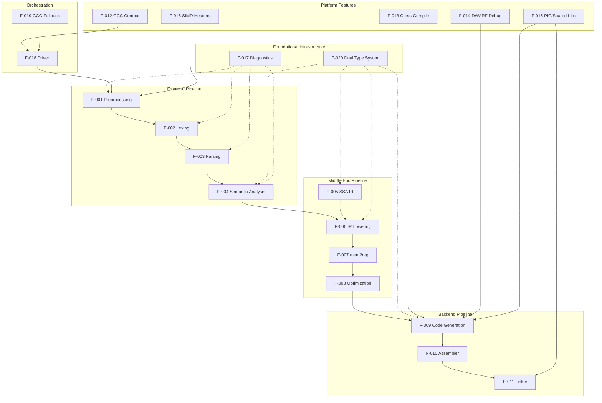

### 2.3.2 Integration Points

CCC integrates with the external environment at the following well-defined boundaries:

| Integration Point | Features Involved | Description |
|---|---|---|
| Build Systems (Make/CMake/Autoconf) | F-012, F-018 | `CC=ccc` environment variable integration |
| System Headers (glibc/musl) | F-001, F-013 | Include path resolution per target |
| C Runtime Libraries | F-011 | CRT files (`crt1.o`, `crti.o`, `crtn.o`) and `libc` |
| Cross-Compilation Sysroots | F-013 | `aarch64-linux-gnu`, `riscv64-linux-gnu` sysroot paths |
| GCC Fallback | F-019 | Feature-gated external assembler/linker invocation |
| QEMU | F-013 | Testing cross-compiled binaries |
| Debuggers (GDB/LLDB) | F-014 | DWARF debug information consumption |
| Dynamic Linker (`ld-linux.so`) | F-011, F-015 | Runtime shared library loading |

### 2.3.3 Shared Components

The following source modules serve as shared infrastructure consumed by multiple features:

| Shared Component | Source Location | Consuming Features |
|---|---|---|
| Dual Type System | `src/common/types.rs`, `src/common/type_builder.rs` | F-004, F-005, F-006, F-009 |
| Diagnostic Engine | `src/common/error.rs` | F-001 through F-011 (all pipeline stages) |
| Source Manager | `src/common/source.rs` | F-001, F-002, F-003, F-017 |
| Constant Arithmetic | `src/common/const_arith.rs`, `src/common/const_eval.rs` | F-004, F-006 |
| ArchCodegen Trait | `src/backend/traits.rs` | F-009 (all 4 backends) |
| ABI Classification | `src/backend/call_abi.rs` | F-009 (all 4 backends) |
| ASM Preprocessor | `src/backend/asm_preprocess.rs` | F-010 (all 4 assemblers) |
| ASM Expression Parser | `src/backend/asm_expr.rs` | F-010 (all 4 assemblers) |
| F128 Soft Float | `src/backend/f128_softfloat.rs` | F-009 (ARM, RISC-V backends) |
| x86 Common Helpers | `src/backend/x86_common.rs` | F-009, F-010 (x86-64, i686) |
| CFG Analysis | `src/ir/analysis.rs` | F-007, F-008 (GVN, LICM, IVSR, if-convert) |

### 2.3.4 Common Services

| Service | Provider | Consumers |
|---|---|---|
| File/Line/Column Tracking | `SourceManager` (`src/common/source.rs`) | Preprocessor, Lexer, Parser, Diagnostics |
| Error/Warning Emission | `DiagnosticEngine` (`src/common/error.rs`) | All pipeline stages |
| Type Size/Alignment Queries | `CType`/`IrType` (`src/common/types.rs`) | Sema, IR Lowering, Code Generation |
| Target Architecture Config | Driver (`src/driver/cli.rs`) | Preprocessor, Code Generation, Assembler, Linker |
| Pass Timing/Control | Pass Manager (`src/passes/mod.rs`) | All optimization passes |

---

## 2.4 Implementation Considerations

### 2.4.1 Technical Constraints

| Constraint | Description | Source |
|---|---|---|
| Linux-Only Output | Only ELF executable format is produced; no PE (Windows) or Mach-O (macOS) | `README.md` |
| x86-64 Host Required | All builds (including cross-compilation) require a Linux x86-64 host | `README.md` |
| 64 MiB Stack Requirement | Deep recursion in complex translation units requires a 64 MiB worker thread stack | `src/lib.rs` |
| Recursion Limit | Rust compiler recursion limit set to 512 (`#![recursion_limit = "512"]`) | `src/lib.rs` |
| Uniform Optimization | All `-O` levels run the same pipeline; no separate tier configurations | `README.md` |
| `_Atomic` Limitation | The `_Atomic` qualifier is parsed but not tracked through the type system | `README.md` |
| Partial `__attribute__` | Only a subset of GCC attributes is recognized | `README.md` |
| `_Complex` Edge Cases | Complex number arithmetic has known edge-case failures | `README.md` |

### 2.4.2 Performance Requirements

| Requirement | Details | Source |
|---|---|---|
| Phase Timing | `CCC_TIME_PHASES` reports per-phase wall-clock time | `README.md` |
| Pass Timing | `CCC_TIME_PASSES` reports per-pass execution time | `src/passes/mod.rs` |
| Optimization Convergence | Main optimization loop uses <5% change threshold for early termination | `src/passes/mod.rs` |
| Compilation Throughput | Known bottlenecks: memory allocation, preprocessor, string interning, lexer keywords | `ideas/high_compile_speed_improvements.txt` |
| Stack Frame Efficiency | PostgreSQL stack frames 3.8× larger than GCC (documented for future optimization) | `ideas/reduce_stack_frame_size_for_postgres.txt` |

### 2.4.3 Scalability Considerations

| Factor | Current State | Implications |
|---|---|---|
| Concurrency | Single-threaded (one thread per invocation) | Compilation speed limited to single-core throughput |
| Optimization Depth | Up to 3 iterations with dirty tracking | Bounded compilation time; may miss some optimization opportunities |
| Architecture Extensibility | Trait-based `ArchCodegen` (~185 methods) | New architectures require implementing the trait |
| Pass Extensibility | Pass manager with dirty-flag registration | New passes integrate into the existing phased iteration |

### 2.4.4 Security Implications

| Security Feature | Implementation | Feature ID |
|---|---|---|
| ASLR Compatibility | PIC/PIE code generation via `-fPIC` | F-015 |
| Spectre Mitigation | Retpoline support (x86-64) | F-009 |
| Control-Flow Integrity | CET (Control-flow Enforcement Technology) support | F-009 |
| Stack Protection | `-fstack-protector` flag recognized in CLI | F-012 |
| Resource Exhaustion Prevention | Include chain depth capped at 200 hops | F-017 |
| Recursion Safety | 64 MiB stack thread prevents stack overflow on complex inputs | F-018 |

### 2.4.5 Maintenance Requirements

| Aspect | Current Strategy | Source |
|---|---|---|
| Bug Tracking | Active task files in `current_tasks/` (13 files tracking architecture-specific bugs) | `current_tasks/` |
| Future Planning | 21 idea/proposal files in `ideas/` covering optimization, performance, and architecture improvements | `ideas/` |
| Code Quality | Backlog tracked in `projects/` | `projects/` |
| Testing | Unit tests (`cargo test --release`), integration tests (`tests/`), real-world validation (200+ projects) | `README.md` |
| Regression Prevention | Per-test expected output files (`expected.stdout`, `expected.ret`), per-arch skip markers | `README.md` |

---

## 2.5 Traceability Matrix

### 2.5.1 Feature-to-Source Traceability

| Feature ID | Primary Source Location | Key Files |
|---|---|---|
| F-001 | `src/frontend/preprocessor/` | `pipeline.rs`, `macro_defs.rs`, `conditionals.rs`, `expr_eval.rs` |
| F-002 | `src/frontend/lexer/` | `token.rs`, `scan.rs` |
| F-003 | `src/frontend/parser/` | `ast.rs`, `parse.rs` |
| F-004 | `src/frontend/sema/` | Type checker, const evaluator modules |
| F-005 | `src/ir/` | `instruction.rs`, `module.rs`, `analysis.rs`, `intrinsics.rs` |
| F-006 | `src/ir/lowering/` | Function, expression, statement, globals lowering |
| F-007 | `src/ir/mem2reg/` | `promote.rs` |
| F-008 | `src/passes/` | 18 files including `mod.rs` and 16 pass implementations |
| F-009 | `src/backend/*/codegen/` | Per-architecture code generators + shared `traits.rs` |
| F-010 | `src/backend/*/assembler/` | Per-architecture assemblers + shared `asm_preprocess.rs` |
| F-011 | `src/backend/*/linker/` | Per-architecture linkers + `linker_common/`, `elf/` |
| F-012 | `src/driver/cli.rs` | CLI parsing and GCC flag compatibility |
| F-013 | `src/bin/`, `Cargo.toml` | Binary shim targets, `argv[0]` inference |
| F-014 | `src/backend/generation.rs` | `build_and_emit_dwarf_file_table` |
| F-015 | `src/backend/` (all codegen/linker) | PIC, GOT, PLT, TLS modules per architecture |
| F-016 | `include/` | 17 header files |
| F-017 | `src/common/error.rs`, `src/common/source.rs` | `DiagnosticEngine`, `SourceManager` |
| F-018 | `src/driver/` | `pipeline.rs`, `cli.rs`, `file_types.rs`, `external_tools.rs` |
| F-019 | `Cargo.toml`, `src/driver/external_tools.rs` | Feature gates, external tool invocation |
| F-020 | `src/common/types.rs`, `src/common/type_builder.rs` | `CType`, `IrType`, `StructLayoutBuilder` |

### 2.5.2 Feature-to-Validation Traceability

| Feature ID | Validation Method | Key Validation Targets |
|---|---|---|
| F-001 through F-004 | Unit tests, integration tests | `cargo test --release`, `tests/` directory |
| F-005 through F-008 | Unit tests, real-world build correctness | Optimization pass dirty-tracking, project builds |
| F-009 | Real-world project builds | PostgreSQL (237/237), FFmpeg (7,331/7,331), SQLite |
| F-010 | Standalone assembler mode builds | 200+ projects with builtin assembler |
| F-011 | Standalone linker mode builds | 200+ projects with builtin linker |
| F-012 | Build system integration tests | Make, CMake, Autoconf builds via `CC=ccc` |
| F-013 | Cross-compiled execution | QEMU execution of ARM, RISC-V, i686 binaries |
| F-009 + F-013 | Linux kernel build | Linux 6.9 (RISC-V) boots via QEMU |

---

## 2.6 Assumptions and Constraints

### 2.6.1 Assumptions

| ID | Assumption |
|---|---|
| A-001 | Target systems run Linux with standard ELF loader |
| A-002 | System C library headers (glibc or musl) are installed on the host |
| A-003 | Cross-compilation sysroots are installed for non-host targets |
| A-004 | Host system has sufficient memory for 64 MiB stack thread allocation |
| A-005 | Build system (Rust stable, 2021 edition) is available via `rustup` |

### 2.6.2 Active Known Issues

| Area | Issue Summary | Source |
|---|---|---|
| ARM | CASPAL encoding, global branch relocs, `.org` directive, quad PREL64, movw symbolic | `current_tasks/` |
| i686 | Double parameter high-word store regression | `current_tasks/` |
| RISC-V | `va_arg` long double struct alignment, dash shell failure | `current_tasks/` |
| x86 | `.ifnb`/`.ifb` conditional, kernel link errors, PCRE2 stack frame bloat | `current_tasks/` |
| Cross-cutting | String literal deduplication, macro param prefix substitution | `current_tasks/` |

---

## 2.7 References

#### References

- `Cargo.toml` — Package metadata, five binary targets, three feature gates, zero external dependencies
- `README.md` — Project overview, prerequisites, usage, status, known limitations, testing, environment variables, project organization
- `src/lib.rs` — Crate entry point, 64 MiB stack thread, module declarations, recursion limit
- `src/driver/cli.rs` — CLI argument parsing, GCC compatibility flags, target inference
- `src/driver/pipeline.rs` — Compilation pipeline orchestration, compile modes
- `src/driver/external_tools.rs` — GCC fallback tool invocation
- `src/driver/file_types.rs` — File type detection logic
- `src/frontend/preprocessor/` — Seven preprocessor source files (pipeline, macros, conditionals, expression evaluation, builtins, predefined macros, utilities)
- `src/frontend/lexer/` — Token definitions and scanner implementation
- `src/frontend/parser/` — AST definitions, recursive-descent parser, expression/statement/declaration helpers
- `src/frontend/sema/` — Semantic analysis, type checking, constant evaluation
- `src/ir/` — SSA IR instruction set, module structure, CFG analysis, intrinsics, constants
- `src/ir/lowering/` — AST-to-IR lowering for all C constructs
- `src/ir/mem2reg/` — Alloca-to-SSA promotion including `promote.rs`
- `src/passes/` — Eighteen optimization pass files with phased iteration control
- `src/backend/traits.rs` — `ArchCodegen` trait (~185 methods)
- `src/backend/generation.rs` — Module/function lowering, DWARF file table generation
- `src/backend/call_abi.rs` — Shared ABI classification logic
- `src/backend/regalloc.rs` — Linear scan register allocator
- `src/backend/asm_preprocess.rs` — Shared assembler preprocessing
- `src/backend/asm_expr.rs` — Shared assembler expression parser
- `src/backend/f128_softfloat.rs` — IEEE binary128 soft float (ARM/RISC-V)
- `src/backend/x86_common.rs` — Shared x86/i686 helpers
- `src/backend/x86/` — x86-64 codegen, assembler, linker
- `src/backend/i686/` — i686 codegen, assembler, linker
- `src/backend/arm/` — AArch64 codegen, assembler, linker
- `src/backend/riscv/` — RISC-V 64 codegen, assembler, linker
- `src/backend/linker_common/` — Shared linker infrastructure
- `src/backend/elf/` — ELF format handling
- `src/common/types.rs` — `CType` (27-variant) and `IrType` type system
- `src/common/type_builder.rs` — `TypeConvertContext`, `StructLayoutBuilder`
- `src/common/error.rs` — `DiagnosticEngine` with severity levels and color mode
- `src/common/source.rs` — `SourceManager` for file/line/column tracking
- `include/` — Seventeen bundled SIMD and intrinsic header files
- `current_tasks/` — Thirteen active bug and task tracking files
- `ideas/` — Twenty-one future work proposal and investigation files
- `ideas/high_compile_speed_improvements.txt` — Compile speed bottleneck analysis
- `ideas/reduce_stack_frame_size_for_postgres.txt` — Stack frame optimization proposal
- `ideas/new_projects.txt` — Real-world project validation tracking
- `ideas/new_projects_myasm.txt` — Extended per-architecture project tracking (200+ projects)

# 3. Technology Stack

This section provides an authoritative reference for every technology, library, tool, and runtime dependency that constitutes CCC (Claude's C Compiler). CCC's technology profile is defined by a distinctive **zero-external-dependency** philosophy: the entire compilation pipeline — from C source text to native ELF binary — is implemented within a single Rust crate with no third-party crate dependencies. This architectural decision shapes every subsection below.

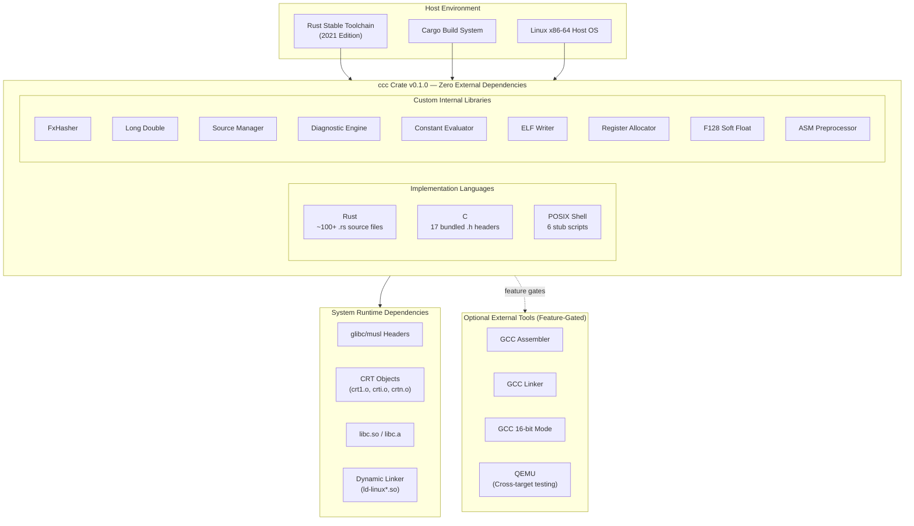

## 3.1 Programming Languages

CCC employs three languages, each serving a distinct role in the project. The overwhelming majority of the implementation is in Rust, with C and POSIX shell playing supporting roles.

### 3.1.1 Rust (Primary Implementation Language)

| Attribute | Value | Evidence |
|---|---|---|
| **Edition** | 2021 | `Cargo.toml`, line 4: `edition = "2021"` |
| **Toolchain** | Stable | `README.md`: "Rust (stable, 2021 edition) — install via rustup" |
| **Source Files** | ~100+ `.rs` files | `src/` directory tree across 9 module directories |
| **Recursion Limit** | 512 | `src/lib.rs`, line 1: `#![recursion_limit = "512"]` |
| **Worker Stack** | 64 MiB | `src/lib.rs`, lines 13–14: `std::thread::Builder` with explicit stack size |

#### Selection Justification

Rust was selected as the implementation language for the following reasons:

- **Memory Safety Without Garbage Collection**: Rust's ownership model and borrow checker provide compile-time memory safety guarantees critical for a compiler that must process arbitrarily complex inputs without undefined behavior, without incurring garbage collection pauses that would degrade compilation throughput.
- **Zero-Cost Abstractions**: Trait-based polymorphism — the foundation of the `ArchCodegen` trait with ~185 methods defined in `src/backend/traits.rs` — compiles to static dispatch, delivering the same performance as hand-written C while maintaining architectural extensibility.
- **Algebraic Type System**: Rust's `enum` types with exhaustive pattern matching enable precise modeling of the compiler's 27-variant `CType` and `IrType` representations (`src/common/types.rs`), ensuring that new type variants are handled across all pipeline stages.
- **Conditional Compilation**: Rust's `#[cfg(feature = "...")]` attribute directly supports the three optional GCC fallback feature gates (`gcc_assembler`, `gcc_linker`, `gcc_m16`) defined in `Cargo.toml`, enabling compile-time binary specialization.
- **Ecosystem Maturity**: The Cargo build system and `rustup` toolchain manager provide reproducible builds, cross-compilation support, and integrated testing (`cargo test`) without external build tool configuration.

#### Rust-Specific Technical Constraints

| Constraint | Implementation Detail | Source |
|---|---|---|
| Recursion depth | `#![recursion_limit = "512"]` set at crate root to accommodate deep macro/type expansions | `src/lib.rs` |
| Stack overflow prevention | 64 MiB worker thread via `std::thread::Builder::new().stack_size(64 * 1024 * 1024)` | `src/lib.rs` |
| Feature gating | `#[cfg_attr]` used to suppress dead-code warnings per feature gate | `Cargo.toml`, source files |
| Thread-local configuration | Thread-local storage helpers for target-specific type properties | `src/common/types.rs` |
| Explicit binary targets | `autobins = false` in `Cargo.toml` to declare five named binary targets | `Cargo.toml` |

### 3.1.2 C (Bundled Header Files)

| Attribute | Value | Evidence |
|---|---|---|
| **File Count** | 17 `.h` header files | `include/` directory |
| **Purpose** | SIMD/NEON intrinsic declarations | `include/mmintrin.h` through `include/arm_neon.h` |
| **Implementation Style** | Pure C using loops, `memcpy`, and macros | Feature catalog F-016 |

The `include/` directory provides bundled C header files that supply SIMD intrinsic type definitions and function declarations. These headers cover x86 SSE through AVX-512, AES-NI, FMA3, SHA, BMI2, and ARM NEON intrinsic families. Crucially, all intrinsics are implemented as **pure C constructs** — using loops, `memcpy`, and preprocessor macros — rather than actual SIMD instructions, relying on the compiler's code generation to produce appropriate machine instructions.

#### Bundled Header Inventory

| Header File | Intrinsic Family |
|---|---|
| `mmintrin.h` | MMX |
| `xmmintrin.h` | SSE |
| `emmintrin.h` | SSE2 |
| `pmmintrin.h` | SSE3 |
| `tmmintrin.h` | SSSE3 |
| `smmintrin.h` | SSE4.1/SSE4.2 |
| `nmmintrin.h` | SSE4.2 (wrapper) |
| `avxintrin.h` | AVX |
| `avx2intrin.h` | AVX2 |
| `avx512fintrin.h` | AVX-512 Foundation |
| `fmaintrin.h` | FMA3 |
| `wmmintrin.h` | AES-NI / CLMUL |
| `shaintrin.h` | SHA |
| `bmi2intrin.h` | BMI2 |
| `immintrin.h` | Aggregator + RDRAND/RDSEED |
| `x86intrin.h` | rdtsc, byte swap, bit scan, rotate |
| `arm_neon.h` | ARM NEON (struct-based vector types) |

### 3.1.3 POSIX Shell (Toolchain Stub Scripts)

| Attribute | Value | Evidence |
|---|---|---|
| **Script Count** | 6 scripts | `src/backend/{x86,arm,riscv}/` |
| **Interpreter** | `#!/bin/sh` (POSIX-compliant) | Script headers |
| **Purpose** | Assembler/linker testing stubs | `asm_stub.sh`, `ld_stub.sh` per architecture |

Six minimal POSIX shell scripts serve as placeholder stubs for toolchain testing:

| Script Path | Purpose |
|---|---|
| `src/backend/x86/asm_stub.sh` | x86-64 assembler test stub |
| `src/backend/x86/ld_stub.sh` | x86-64 linker test stub |
| `src/backend/arm/asm_stub.sh` | AArch64 assembler test stub |
| `src/backend/arm/ld_stub.sh` | AArch64 linker test stub |
| `src/backend/riscv/asm_stub.sh` | RISC-V assembler test stub |
| `src/backend/riscv/ld_stub.sh` | RISC-V linker test stub |

These scripts are not part of the compilation pipeline; they exist solely to support testing infrastructure and do not contribute to production binary outputs.

## 3.2 Frameworks & Libraries

### 3.2.1 Core Framework: Rust Standard Library

CCC uses **no external frameworks or crate dependencies**. The sole framework dependency is the Rust standard library (`std`), which ships with every Rust toolchain installation. This is a deliberate architectural decision documented in the project overview and confirmed by the absence of any `[dependencies]` section in `Cargo.toml`.

#### Standard Library Modules Utilized

| `std` Module | Usage | Evidence |
|---|---|---|
| `std::thread::Builder` | Worker thread creation with 64 MiB stack | `src/lib.rs`, lines 13–14 |
| `std::env::args` | CLI argument collection | `src/lib.rs` |
| `std::process::exit` | Process exit code control | `src/lib.rs` |
| `std::path::Path` | Filesystem path operations | `src/backend/mod.rs` |
| `std::sync::Once` | One-time GCC fallback warning emission | `src/backend/common.rs` |
| `std::collections` | `HashMap`, `HashSet` (aliased via custom hasher) | `src/common/fx_hash.rs` |
| `std::fmt` | `Display` trait implementations throughout codebase | Multiple source files |
| `std::hash::BuildHasherDefault` | Custom hasher integration | `src/common/fx_hash.rs` |

### 3.2.2 Custom Internal Libraries

Because CCC has zero external dependencies, every non-trivial capability that a typical project would delegate to a third-party crate is instead implemented from scratch as an internal library module. These custom implementations collectively replace what would typically require 10+ external crate dependencies in a standard Rust project.

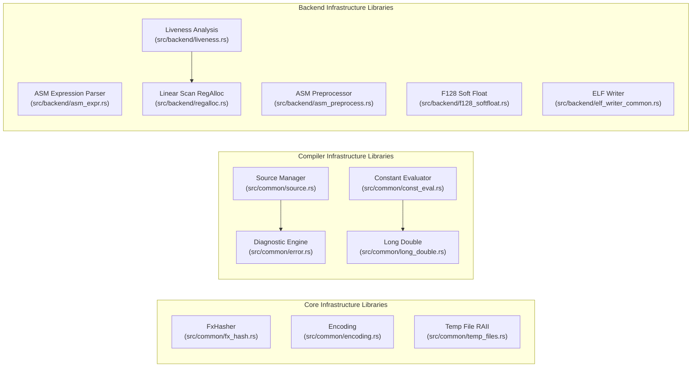

#### Detailed Internal Library Catalog

| Internal Library | Source Location | Purpose | Replaces Typical Crate |
|---|---|---|---|
| **FxHasher** | `src/common/fx_hash.rs` | Fast deterministic hashing using rotate-XOR-multiply algorithm; provides `FxHashMap` and `FxHashSet` type aliases via `BuildHasherDefault` | `rustc-hash`, `ahash` |
| **Long Double** | `src/common/long_double.rs` | `BigUint`-backed decimal parsing, x87 80-bit / IEEE binary128 / f64 encode/decode, software arithmetic and comparison operations | `num-bigint`, `softfloat` |
| **Source Manager** | `src/common/source.rs` | File/line/column tracking, GCC-style line map parsing, include chain reconstruction with depth cap of 200 | N/A (compiler-specific) |
| **Diagnostic Engine** | `src/common/error.rs` | GCC-style colored diagnostics with configurable `ColorMode`, severity levels, `-Wall`/`-Wextra`/`-Werror` handling, caret indicators | `codespan-reporting`, `annotate-snippets` |
| **Encoding** | `src/common/encoding.rs` | UTF-8 BOM handling, Private Use Area (PUA) byte encoding, non-UTF-8 fallback support | `encoding_rs` |
| **Constant Evaluator** | `src/common/const_eval.rs`, `src/common/const_arith.rs` | Compile-time constant evaluation for integer, float, i128, and long double arithmetic | N/A (compiler-specific) |
| **Temp File RAII** | `src/common/temp_files.rs` | Atomic counter-based (`AtomicU64` + PID) temporary path generation with automatic cleanup via `Drop` trait | `tempfile` |
| **ASM Expression Parser** | `src/backend/asm_expr.rs` | Platform-independent integer expression parser using recursive descent with operator precedence | N/A (compiler-specific) |
| **ASM Preprocessor** | `src/backend/asm_preprocess.rs` | Comment stripping, `.rept`/`.irp` loop expansion, GAS macro definition and invocation support, conditional assembly directives | N/A (compiler-specific) |
| **F128 Soft Float** | `src/backend/f128_softfloat.rs` | IEEE binary128 software floating-point trait implementation shared by ARM and RISC-V backends | `softfloat-sys` |
| **ELF Writer** | `src/backend/elf_writer_common.rs` | Shared relocatable ELF object file generation for x86 family backends | `object`, `goblin` |
| **Linear Scan RegAlloc** | `src/backend/regalloc.rs` | Loop-aware linear scan register allocator with spill management | `regalloc2` |
| **Liveness Analysis** | `src/backend/liveness.rs` | Live interval computation for register allocation inputs | N/A (compiler-specific) |

### 3.2.3 Compatibility Requirements

CCC requires only the Rust stable toolchain (2021 edition) for compilation. No nightly features, procedural macros, or build scripts (`build.rs`) are used. The absence of external dependencies means there are no inter-crate version compatibility concerns, Minimum Supported Rust Version (MSRV) constraints from third-party crates, or dependency resolution conflicts.

## 3.3 Open Source Dependencies

### 3.3.1 External Crate Dependencies

**CCC has zero external crate dependencies.**

This is not an oversight but a defining architectural decision. The `Cargo.toml` manifest contains no `[dependencies]` section, no `[dev-dependencies]` section, and no `[build-dependencies]` section. The repository contains no `Cargo.lock` file, no `rust-toolchain.toml`, no `.rustfmt.toml`, and no `clippy.toml` configuration files.

Every capability that a typical Rust project would obtain from the crates.io ecosystem — including hashing algorithms, floating-point arithmetic, ELF format handling, expression parsing, diagnostic formatting, temporary file management, and all compiler infrastructure — is implemented from scratch within the crate.

### 3.3.2 Dependency Justification

The zero-dependency approach provides the following benefits:

| Benefit | Explanation |
|---|---|
| **Supply Chain Security** | No transitive dependencies eliminates entire categories of supply-chain attack vectors (dependency confusion, typosquatting, malicious crate injection) |
| **Build Reproducibility** | Builds depend only on the Rust standard library version, which is pinned by the toolchain installation — no `Cargo.lock` drift |
| **Compile Time** | No dependency resolution, download, or compilation of external crates; build time is solely the cost of compiling the `ccc` crate |
| **Audibility** | The complete source code for every algorithm and data structure used by the compiler is visible within the single repository |
| **Licensing Simplicity** | No license compatibility analysis required; the entire codebase falls under CC0 1.0 Universal (Public Domain) |

### 3.3.3 Package Registry

CCC does not publish to crates.io or any other package registry. Distribution is via the source repository. The build command is:

```
cargo build --release
```

## 3.4 Third-Party Services & External Integrations

### 3.4.1 External Service Dependencies

CCC is a standalone, offline command-line compiler. It requires **no network connectivity**, **no cloud services**, **no external APIs**, **no authentication services**, and **no monitoring or telemetry systems**. Every invocation is a stateless transformation from input files to output files on the local filesystem.

### 3.4.2 Optional GCC Fallback Integration

Three optional Cargo feature gates enable selective fallback to external GCC components when the builtin assembler, linker, or 16-bit code generator encounters edge cases. These are **disabled by default**, and the standalone build represents the standard configuration.

| Feature Gate | Cargo Flag | External Tool | Purpose | Evidence |
|---|---|---|---|---|
| `gcc_assembler` | `--features gcc_assembler` | Architecture-specific GCC | Assembler fallback for unsupported directives | `Cargo.toml`, `src/driver/external_tools.rs` |
| `gcc_linker` | `--features gcc_linker` | Architecture-specific GCC | Linker fallback for complex link scenarios | `Cargo.toml`, `src/driver/external_tools.rs` |
| `gcc_m16` | `--features gcc_m16` | GCC | 16-bit real-mode boot code compilation | `Cargo.toml`, `src/driver/external_tools.rs` |

#### Architecture-Specific GCC Commands

When fallback features are enabled, the following GCC invocations are configured per target architecture in `src/backend/mod.rs`:

| Target Architecture | Assembler Command | Linker Command |
|---|---|---|
| x86-64 | `gcc` | `gcc` |
| i686 | `i686-linux-gnu-gcc -m32` | `i686-linux-gnu-gcc -m32` |
| AArch64 | `aarch64-linux-gnu-gcc -march=armv8-a+crc+crypto` | `aarch64-linux-gnu-gcc` |
| RISC-V 64 | `riscv64-linux-gnu-gcc -march=rv64gc -mabi=lp64d` | `riscv64-linux-gnu-gcc` |

#### Compatibility Emulation Strings

When operating in standalone mode, CCC emulates well-known toolchain version strings to maximize build system compatibility (`src/backend/mod.rs`):

| Emulated Identity | Reported String |
|---|---|
| GCC compiler version | `14.2.0` (via `ccc -dumpversion`) |
| GNU assembler | `GNU assembler (Claude's C Compiler built-in) 2.42` |
| GNU linker | `GNU ld (Claude's C Compiler built-in) 2.42` |
| Target triple (x86-64) | `x86_64-linux-gnu` |
| Target triple (i686) | `i686-linux-gnu` |
| Target triple (AArch64) | `aarch64-linux-gnu` |
| Target triple (RISC-V 64) | `riscv64-linux-gnu` |

### 3.4.3 System Runtime Dependencies

The following system-provided components are required at link time or run time by programs compiled with CCC. These are **not dependencies of CCC itself** but rather of the ELF executables it produces.

| Dependency | Type | Purpose | Required By |
|---|---|---|---|
| glibc or musl headers | System headers | C standard library declarations for compilation | Preprocessor (F-001) |
| `crt1.o`, `crti.o`, `crtn.o` | CRT startup objects | C runtime initialization and finalization code | Linker (F-011) |
| `libc.so` / `libc.a` | System library | C standard library implementation | Linker (F-011) |
| Dynamic linker (`ld-linux-x86-64.so.2`, `ld-linux-aarch64.so.1`, etc.) | System runtime | Runtime dynamic symbol resolution | Linked executables |
| Architecture-specific sysroots | System packages | Headers and libraries for cross-compilation targets | Cross-compilation (F-013) |

### 3.4.4 Optional Testing Tools

| Tool | Purpose | Context |
|---|---|---|
| QEMU (user-mode emulation) | Execution testing of cross-compiled binaries | Used to test AArch64, RISC-V, and i686 binaries on x86-64 host |

## 3.5 Databases & Storage

### 3.5.1 Persistent Storage

CCC uses **no databases, caches, or persistent storage mechanisms** of any kind. The compiler is a fully **stateless** command-line tool:

- Each invocation reads C source files and referenced headers from the filesystem.
- Each invocation writes output (ELF executables, object files, assembly text, or preprocessed source) to the filesystem.
- No state is preserved between invocations.
- No compilation caches, incremental compilation databases, or precompiled header stores are maintained.

### 3.5.2 Temporary File Management

During a single compilation invocation, CCC uses temporary files for intermediate pipeline stages. Temporary file management is implemented in `src/common/temp_files.rs` using a RAII pattern:

| Mechanism | Implementation Detail |
|---|---|
| **Path Generation** | `AtomicU64` counter combined with process PID produces unique temporary file paths |
| **Lifecycle** | `TempFile` guard struct implements the `Drop` trait for automatic cleanup |
| **Cleanup Guarantee** | Files are removed when the guard goes out of scope, even on error paths |
| **Storage Location** | System temporary directory (default: `/tmp/`) |

No data persists beyond the lifetime of a single compiler invocation.

## 3.6 Development & Deployment

### 3.6.1 Build System

CCC uses **Cargo**, Rust's native package manager and build system, as its sole build tool. No Makefiles, CMake configurations, or custom build scripts (`build.rs`) are used.

#### Package Manifest Configuration

The `Cargo.toml` manifest defines the following configuration:

| Field | Value | Purpose |
|---|---|---|
| Package name | `ccc` | Crate identity |
| Version | `0.1.0` | Semantic version |
| Edition | `2021` | Rust edition for language features |
| `autobins` | `false` | Disables automatic binary target discovery; all binaries are explicitly declared |

#### Binary Targets

Five binary targets are explicitly declared in `Cargo.toml`, all sharing the same `ccc::compiler_main()` entry point defined in `src/lib.rs`:

| Binary Name | Source Path | Default Target Architecture |
|---|---|---|
| `ccc` | `src/main.rs` | x86-64 (default) |
| `ccc-x86` | `src/bin/ccc_x86.rs` | x86-64 (explicit) |
| `ccc-arm` | `src/bin/ccc_arm.rs` | AArch64 |
| `ccc-riscv` | `src/bin/ccc_riscv.rs` | RISC-V 64 |
| `ccc-i686` | `src/bin/ccc_i686.rs` | i686 |

Each binary shim in `src/bin/` is a thin wrapper that delegates to the shared library entry point. Target architecture is inferred at runtime from the binary name (`argv[0]`) in `src/driver/cli.rs`.

#### Build Commands

| Configuration | Command | Output |
|---|---|---|
| Standalone (default) | `cargo build --release` | Self-contained compiler, no GCC dependency |
| GCC assembler + linker fallback | `cargo build --release --features gcc_assembler,gcc_linker` | Uses GCC for assembly and linking |
| GCC 16-bit only | `cargo build --release --features gcc_m16` | GCC fallback for 16-bit real-mode code only |

### 3.6.2 Testing Infrastructure

CCC employs a three-tier testing strategy with no external test framework dependencies:

#### Tier 1: Unit Tests

| Attribute | Detail |
|---|---|
| Framework | Rust built-in `#[test]` attribute |
| Execution | `cargo test --release` |
| Location | In-source test functions across all modules |

#### Tier 2: Integration Tests

| Attribute | Detail |
|---|---|
| Location | `tests/` directory |
| Test Structure | Per-test `main.c` source file with accompanying `expected.stdout` and `expected.ret` oracle files |
| Architecture Skip Markers | `expected.skip.arm`, `expected.skip.riscv`, etc. for per-architecture test exclusion |
| Validation Method | Compiled output is executed and compared against expected return code and stdout |

#### Tier 3: Real-World Validation

| Attribute | Detail |
|---|---|
| Tracking Files | `ideas/new_projects.txt`, `ideas/new_projects_myasm.txt` |
| Coverage | 200+ open-source C projects including Linux kernel 6.9, PostgreSQL, FFmpeg, SQLite, Redis, QEMU, CPython, LuaJIT, and GNU coreutils |
| Per-Architecture Tracking | Pass/fail status recorded per target architecture for each project |

### 3.6.3 Developer Environment Variables

CCC provides environment variables for development diagnostics and debugging. These are not part of the compilation output but aid compiler development:

| Variable | Purpose | Evidence |
|---|---|---|
| `CCC_TIME_PHASES` | Reports per-phase wall-clock timing to stderr | `README.md` |
| `CCC_TIME_PASSES` | Reports per-optimization-pass execution time | `src/passes/mod.rs` |
| `CCC_DISABLE_PASSES` | Disables specific optimization passes (comma-separated names, or `all`) | `src/passes/mod.rs` |
| `CCC_KEEP_ASM` | Preserves intermediate `.s` assembly files after compilation | `README.md` |
| `CCC_ASM_DEBUG` | Dumps preprocessed assembly to `/tmp/asm_debug_*.s` for inspection | `README.md` |

### 3.6.4 Host Platform Requirements

| Requirement | Details | Justification |
|---|---|---|
| **Operating System** | Linux | ELF output format; system header and library paths assume Linux layout |
| **Host Architecture** | x86-64 | All binaries (including cross-compilers) build and run on x86-64 hosts |
| **Rust Toolchain** | Stable, 2021 edition (via `rustup`) | Only build-time prerequisite |
| **System Headers** | glibc or musl C library headers installed | Required to compile C code that includes standard headers |
| **Cross-Compilation Sysroots** | Optional: `aarch64-linux-gnu-*`, `riscv64-linux-gnu-*`, `i686-linux-gnu-*` packages | Required only for cross-architecture compilation |
| **Available Memory** | Sufficient for 64 MiB stack allocation per compilation | Worker thread stack requirement documented in `src/lib.rs` |

### 3.6.5 Containerization & CI/CD

CCC does not define any containerization configurations (no `Dockerfile`), orchestration manifests, or CI/CD pipeline definitions (no `.github/workflows/` or equivalent). Deployment is performed by building from source via `cargo build --release` and placing the resulting binary targets on the system `PATH`.

## 3.7 Architecture-Specific Technology Matrix

### 3.7.1 Target Architecture Specifications

CCC supports four target architectures, each with distinct ABI conventions, instruction encoding schemes, and ELF format requirements. The following matrix summarizes the technology-level characteristics of each target:

| Property | x86-64 | i686 | AArch64 | RISC-V 64 |
|---|---|---|---|---|
| **ABI** | SysV AMD64 | cdecl | AAPCS64 | LP64D |
| **Assembly Syntax** | AT&T | AT&T (shared) | ARM (GNU-style) | RV |
| **ELF Class** | ELFCLASS64 | ELFCLASS32 | ELFCLASS64 | ELFCLASS64 |
| **Pointer Size** | 8 bytes | 4 bytes | 8 bytes | 8 bytes |
| **Link Mode** | Dynamic | Dynamic | Static + Dynamic | Dynamic |
| **Relocation Type** | `.rela` | `.rel` | `.rela` | `.rela` |
| **Instruction Encoding** | Variable (REX/ModR/M/SIB) | Variable (ModR/M/SIB) | Fixed 32-bit | Variable (RV64C compressed) |
| **Atomics** | `lock` prefix | `lock` prefix | LDXR/STXR | LR/SC |
| **SIMD** | SSE/AVX/AVX-512, AES-NI | SSE (subset) | NEON | Software SIMD |
| **Long Double** | x87 80-bit | x87 80-bit | IEEE binary128 (soft float) | IEEE binary128 (soft float) |
| **Register File** | 6 GP + 8 XMM callee-save | `%eax` accumulator, `%ebx` PIC | 30 GP + 32 SIMD | 32 GP + 32 FP |

### 3.7.2 Per-Architecture Backend Structure

Each architecture backend under `src/backend/` follows a consistent modular structure:

```mermaid
flowchart TB
    subgraph SharedBackend["Shared Backend Infrastructure (src/backend/)"]
        Traits["traits.rs<br/>ArchCodegen trait (~185 methods)"]
        Generation["generation.rs<br/>Module/function dispatch"]
        CallABI["call_abi.rs<br/>Unified ABI classification"]
        Cast["cast.rs<br/>CastKind classification"]
        RegAllocShared["regalloc.rs<br/>Linear scan allocator"]
        LivenessShared["liveness.rs<br/>Live interval computation"]
        StackLayout["stack_layout/<br/>Frame slot assignment"]
        PeepholeCommon["peephole_common.rs<br/>Shared peephole utilities"]
        ELFCommon["elf_writer_common.rs<br/>Shared ELF writing"]
        LinkerCommon["linker_common/<br/>Shared linker infra"]
        X86Common["x86_common.rs<br/>Shared x86/i686 helpers"]
        F128["f128_softfloat.rs<br/>IEEE binary128 (ARM + RV)"]
        InlineAsm["inline_asm.rs<br/>Shared inline ASM framework"]
    end

    subgraph ArchBackends["Architecture-Specific Backends"]
        X86["src/backend/x86/<br/>codegen/ + assembler/ + linker/"]
        I686["src/backend/i686/<br/>codegen/ + assembler/ + linker/"]
        ARM["src/backend/arm/<br/>codegen/ + assembler/ + linker/"]
        RISCV["src/backend/riscv/<br/>codegen/ + assembler/ + linker/"]
    end

    Traits --> X86
    Traits --> I686
    Traits --> ARM
    Traits --> RISCV
    X86Common --> X86
    X86Common --> I686
    F128 --> ARM
    F128 --> RISCV
```

Each architecture backend contains three subdirectories:
- **`codegen/`** — `ArchCodegen` trait implementation, instruction emission, peephole optimizer, ABI-specific modules
- **`assembler/`** — Builtin assembler (parser, encoder, ELF object writer)
- **`linker/`** — Builtin ELF linker (input processing, symbol resolution, relocation application, PLT/GOT generation, final ELF emission)

### 3.7.3 Codegen Options

The `CodegenOptions` struct in `src/backend/mod.rs` captures all configurable code generation parameters, which affect the technology-level behavior of produced binaries:

| Option | CLI Flag | Purpose | Security Relevance |
|---|---|---|---|
| PIC mode | `-fPIC` / `-fpic` | Position-independent code for ASLR and shared libraries | ASLR support |
| Return thunk | `-mfunction-return=thunk-extern` | Retpoline for function returns | Spectre V2 mitigation |
| Indirect branch thunk | `-mindirect-branch=thunk-extern` | Retpoline for indirect branches | Spectre V2 mitigation |
| CET/IBT | `-fcf-protection=branch` | `endbr64` at function entry points | Control-flow integrity |
| Patchable entry | `-fpatchable-function-entry=N[,M]` | NOP padding at function entries | Live patching support |
| No SSE | `-mno-sse` | Disable SSE instruction generation | Kernel-mode safety |
| GP-only | `-mgeneral-regs-only` | Restrict to general-purpose registers | Kernel-mode safety |
| Kernel model | `-mcmodel=kernel` | High-address kernel code model | Kernel compilation |
| No jump tables | `-fno-jump-tables` | Disable switch jump table generation | Security hardening |
| No relaxation | `-mno-relax` | Disable RISC-V linker relaxation | Deterministic linking |
| Debug info | `-g` | DWARF debug information generation | Debugging support |
| Function sections | `-ffunction-sections` | Place each function in its own ELF section | `--gc-sections` compatibility |
| Data sections | `-fdata-sections` | Place each data object in its own ELF section | `--gc-sections` compatibility |
| 16-bit mode | `-m16` | Generate `.code16gcc` 16-bit real-mode code | Boot code support |
| Regparm | `-mregparm=N` | Pass N arguments in registers (i686 only) | Linux kernel ABI |
| Omit frame pointer | `-fomit-frame-pointer` | Skip `%rbp` frame setup | Performance optimization |
| No CFI | `-fno-asynchronous-unwind-tables` | Suppress `.cfi_*` directives | Binary size reduction |

## 3.8 Security Considerations

### 3.8.1 Compiler Security Posture

The technology choices in CCC have direct implications for both the security of the compiler itself and the security properties of the binaries it produces.

#### Compiler Self-Security

| Security Property | Implementation | Evidence |
|---|---|---|
| Memory safety | Rust ownership model — no `unsafe` code in binary shims | `src/bin/` source files |
| Supply chain integrity | Zero external dependencies eliminates crate-level attack surface | `Cargo.toml` |
| Resource exhaustion prevention | Include chain depth capped at 200 hops | `src/common/source.rs` |
| Stack overflow prevention | 64 MiB worker thread for deep recursion | `src/lib.rs` |
| Deterministic hashing | Custom `FxHasher` avoids HashDoS via predictable, non-randomized hashing | `src/common/fx_hash.rs` |

#### Produced Binary Security Features

| Security Feature | Technology | CLI Flag | Evidence |
|---|---|---|---|
| ASLR compatibility | PIC/PIE code generation | `-fPIC` | `src/backend/mod.rs`, `CodegenOptions::pic` |
| Spectre V2 mitigation | Retpoline thunks (x86-64) | `-mindirect-branch=thunk-extern`, `-mfunction-return=thunk-extern` | `CodegenOptions::indirect_branch_thunk`, `CodegenOptions::function_return_thunk` |
| Control-flow integrity | CET `endbr64` emission | `-fcf-protection=branch` | `CodegenOptions::cf_protection_branch` |
| Stack protection | GCC-compatible flag recognition | `-fstack-protector` | `src/driver/cli.rs` |

## 3.9 Licensing

### 3.9.1 Project License

| Attribute | Value |
|---|---|
| **License** | CC0 1.0 Universal (Public Domain Dedication) |
| **License File** | `LICENSE` |
| **SPDX Identifier** | CC0-1.0 |
| **Permissions** | Unrestricted reuse, modification, and redistribution |
| **Third-Party License Obligations** | None — zero external dependencies |

The CC0 license, combined with the zero-dependency architecture, means there are no license compatibility concerns, no attribution requirements from transitive dependencies, and no obligation chains to track.

#### References

- `Cargo.toml` — Package metadata (name: `ccc`, version: `0.1.0`, edition: `2021`), five binary target declarations, three feature gate definitions, zero dependencies
- `README.md` — Prerequisites (Rust stable 2021 edition), build instructions (`cargo build --release`), environment variables, testing, usage, known limitations
- `LICENSE` — CC0 1.0 Universal (Public Domain) license text
- `src/lib.rs` — Crate root with `#![recursion_limit = "512"]`, `compiler_main()` entry point, 64 MiB stack worker thread creation
- `src/main.rs` — Default binary entry point delegating to `ccc::compiler_main()`
- `src/bin/` — Four architecture-specific binary shims (`ccc_x86.rs`, `ccc_arm.rs`, `ccc_riscv.rs`, `ccc_i686.rs`)
- `src/common/fx_hash.rs` — Custom `FxHasher` implementation, `FxHashMap`/`FxHashSet` type aliases
- `src/common/long_double.rs` — Software long double arithmetic (x87/binary128/f64)
- `src/common/source.rs` — `SourceManager` with file/line/column tracking, include chain depth cap (200)
- `src/common/error.rs` — `DiagnosticEngine` with GCC-style colored diagnostics
- `src/common/encoding.rs` — UTF-8 BOM handling, PUA byte encoding
- `src/common/const_eval.rs` — Compile-time constant evaluation infrastructure
- `src/common/const_arith.rs` — Integer and floating-point constant arithmetic
- `src/common/temp_files.rs` — RAII temporary file management with `AtomicU64` counter
- `src/common/types.rs` — `CType` (27 variants) and `IrType` dual type system, thread-local target configuration
- `src/backend/mod.rs` — `Target` enum, `CodegenOptions` struct, GCC fallback command configuration, architecture dispatch
- `src/backend/traits.rs` — `ArchCodegen` trait with ~185 methods
- `src/backend/generation.rs` — Module/function code generation dispatch, DWARF file table generation
- `src/backend/regalloc.rs` — Linear scan register allocator with loop-aware liveness
- `src/backend/liveness.rs` — Live interval computation for register allocation
- `src/backend/elf_writer_common.rs` — Shared ELF relocatable-object writing
- `src/backend/f128_softfloat.rs` — IEEE binary128 soft float trait (ARM + RISC-V)
- `src/backend/asm_preprocess.rs` — GAS-compatible assembly preprocessing
- `src/backend/asm_expr.rs` — Assembly expression parser (recursive descent)
- `src/backend/x86_common.rs` — Shared x86/i686 register names and condition codes
- `src/backend/x86/` — x86-64 backend (codegen, assembler, linker, stub scripts)
- `src/backend/arm/` — AArch64 backend (codegen, assembler, linker, stub scripts)
- `src/backend/riscv/` — RISC-V 64 backend (codegen, assembler, linker, stub scripts)
- `src/backend/i686/` — i686 backend (codegen, assembler, linker)
- `src/backend/linker_common/` — Shared linker infrastructure
- `src/backend/elf/` — ELF format constants and helpers
- `src/driver/cli.rs` — CLI argument parsing, GCC compatibility, target inference from `argv[0]`
- `src/driver/external_tools.rs` — GCC fallback tool invocation logic
- `src/passes/mod.rs` — Optimization pass manager, phased iteration, `CCC_TIME_PASSES` / `CCC_DISABLE_PASSES` handling
- `include/` — 17 bundled SIMD/NEON C header files (SSE through AVX-512, AES-NI, FMA, SHA, BMI2, ARM NEON)
- `tests/` — Integration test directory with per-test source files and expected outputs
- `ideas/new_projects.txt` — Real-world project validation tracking
- `ideas/new_projects_myasm.txt` — Extended per-architecture pass/fail tracking (200+ projects)

# 4. Process Flowchart

This section provides a comprehensive visual and narrative documentation of all major process flows within the CCC (Claude's C Compiler) system. Each workflow is documented with precise mermaid diagrams illustrating start and end points, decision logic, error handling paths, system boundaries, and state transitions. The process flows are grounded in the actual implementation as found in `src/driver/pipeline.rs`, `src/lib.rs`, `src/driver/cli.rs`, `src/passes/mod.rs`, and supporting modules throughout the codebase.

---

## 4.1 HIGH-LEVEL SYSTEM WORKFLOW

### 4.1.1 Compiler Entry Point and Initialization

The CCC compiler entry point is defined in `src/lib.rs` via the `compiler_main()` function, which is invoked by all five binary shims (`ccc`, `ccc-x86`, `ccc-arm`, `ccc-riscv`, `ccc-i686`) located in `src/bin/`. The initialization sequence spawns a dedicated worker thread with a 64 MiB stack to accommodate deep recursion during compilation of complex translation units. The Rust compiler recursion limit is set to 512 (`#![recursion_limit = "512"]`).

The following diagram illustrates the complete entry point flow from binary invocation to process exit, including all three terminal result categories:

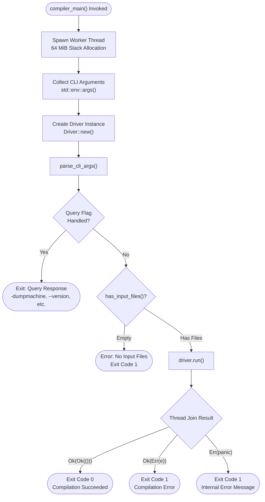

The three-tiered result handling in `src/lib.rs` ensures that all exit paths — successful compilation, user-facing compilation errors, and internal panics — are handled gracefully. The outer `Err(panic)` case catches any thread panics and converts them to a structured "internal error" message on stderr before returning exit code 1.

### 4.1.2 CLI Processing and Target Inference

CLI argument processing in `src/driver/cli.rs` follows a four-stage pipeline: target inference, query flag handling, response file expansion, and main argument parsing. The hand-written parser (no external library dependency) processes arguments through a flat match loop, maintaining the zero-external-dependencies philosophy documented in `DESIGN_DOC.md`.

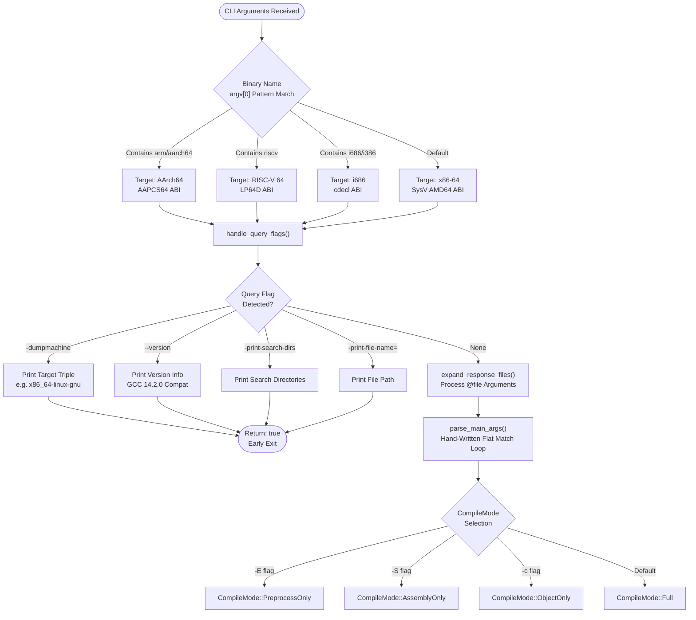

Target inference from `argv[0]` enables a single compiled Rust binary to serve all four architectures, with the binary name determining the target. This mechanism supports cross-compilation workflows where users invoke `ccc-arm` or `ccc-riscv` to compile for non-host architectures. A special case detects linker version queries from the Meson build system, ensuring compatibility with Meson-based projects.

Response file expansion (`expand_response_files`) handles `@file` arguments with full quoting and escape handling, supporting build systems that generate argument files for long command lines.

### 4.1.3 Compile Mode Selection and Dispatch

The `Driver::run()` method in `src/driver/pipeline.rs` dispatches to one of four mode-specific run methods based on the `CompileMode` determined during CLI parsing. Each mode represents a progressively deeper execution of the compilation pipeline:

| CompileMode | CLI Flag | Run Method | Pipeline Depth | Output |
|---|---|---|---|---|
| `PreprocessOnly` | `-E` | `run_preprocess_only()` | Phases 1–2 | Preprocessed text to stdout/file |
| `AssemblyOnly` | `-S` | `run_assembly_only()` | Phases 1–10 | Assembly `.s` file |
| `ObjectOnly` | `-c` | `run_object_only()` | Phases 1–10 + Assembler | Relocatable `.o` file |
| `Full` | Default | `run_full()` | Phases 1–10 + Assembler + Linker | ELF executable or shared library |

Each mode processes all input files in sequence (single-threaded execution model per `src/driver/pipeline.rs`), with file type classification performed by `src/driver/file_types.rs` using extension matching, magic byte detection, or explicit `-x` override.

---

## 4.2 CORE COMPILATION PIPELINE

### 4.2.1 Ten-Phase compile_to_assembly Pipeline

The `compile_to_assembly()` function in `src/driver/pipeline.rs` (lines 897–1133) implements the core ten-phase compilation pipeline that transforms C source text into architecture-specific assembly. This pipeline is invoked by all compile modes except `PreprocessOnly`. Each phase includes explicit error checking, with four validation checkpoints that can terminate compilation early.

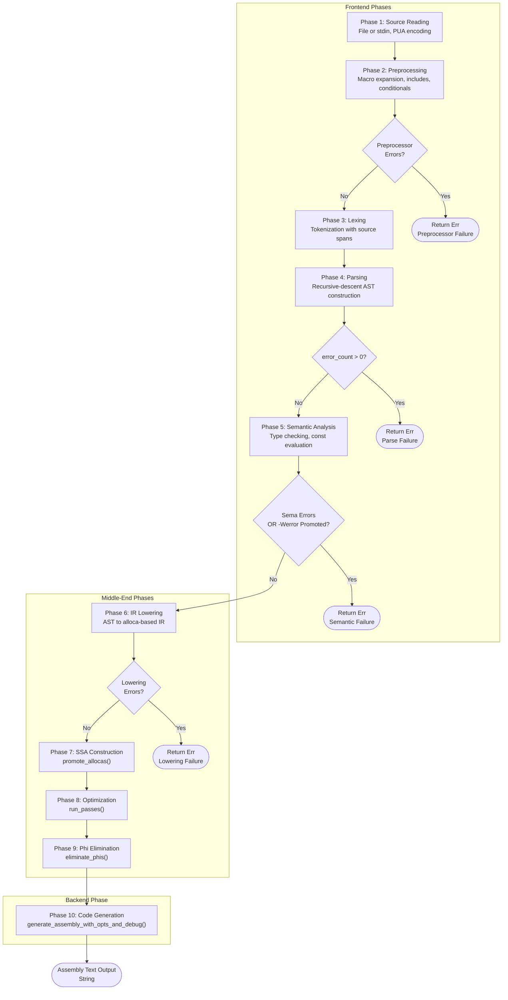

The pipeline is designed with a fail-fast architecture at the frontend boundary: any error detected during preprocessing, parsing, semantic analysis, or IR lowering causes immediate termination before entering the optimization and code generation phases. This ensures that malformed or semantically invalid programs never reach the resource-intensive backend stages.

### 4.2.2 Frontend Processing Phases

The frontend phases (1–5) transform raw C source text into a fully type-checked Abstract Syntax Tree (AST). Each phase is implemented as a separate module within `src/frontend/`.

#### Phase 1 — Source Reading

The source reading phase (`src/driver/pipeline.rs`) accepts input from either a file path or stdin (when the input is specified as `-`). Non-UTF-8 bytes are encoded as Private Use Area (PUA) code points (U+E080–U+E0FF) to guarantee round-trip fidelity through the text-based pipeline. This design, documented in `DESIGN_DOC.md`, ensures that binary content in string literals and inline assembly survives preprocessing intact.

#### Phase 2 — Preprocessing

The preprocessor (`src/frontend/preprocessor/`) is configured with target-specific macros and settings before execution:

- Architecture-specific predefined macros (e.g., `__x86_64__`, `__aarch64__`)
- RISC-V ABI and architecture overrides (`-mabi`, `-march`)
- `__STRICT_ANSI__` when non-GNU mode is active
- `__OPTIMIZE__` and `__OPTIMIZE_SIZE__` based on `-O` level
- PIC, SSE, and SIMD capability macros
- CLI-specified `-D` defines, `-I` include paths, and forced includes
- Unconditional undefine of `_FORTIFY_SOURCE` (compatibility measure)

The preprocessor operates as a text-to-text transformation, emitting GCC-style `# line "file"` markers for source location tracking. Errors are collected through a diagnostic channel that captures `#error` directives, missing `#include` targets, and recursive inclusion warnings. The error channel uses a `Cpp` warning kind for preprocessor-specific diagnostics.

**Validation Rule**: If the preprocessor error channel contains any errors, `compile_to_assembly()` returns `Err` immediately.

#### Phase 3 — Lexing

The lexer (`src/frontend/lexer/`) converts preprocessed text into `Vec<Token>` with source spans. The `SourceManager` in `src/common/source.rs` is initialized with the file content, and `build_line_map()` processes preprocessor line markers for accurate diagnostic reporting. Macro expansion metadata from the preprocessor is transferred to enable trace-back through macro expansions in error messages. GNU extensions mode is toggled based on the `-std=` setting.

#### Phase 4 — Parsing

The recursive-descent parser (`src/frontend/parser/`) constructs a `TranslationUnit` AST. The `DiagnosticEngine` (`src/common/error.rs`) is attached to the parser for span-accurate error resolution. The parser supports error recovery, allowing multiple errors to be reported before compilation is halted.

**Validation Rule**: If `parser.error_count > 0` after `parser.parse()`, the pipeline returns `Err`. Parser diagnostics are preserved for use in subsequent phases.

#### Phase 5 — Semantic Analysis

Semantic analysis (`src/frontend/sema/`) performs type checking, implicit conversion insertion, constant expression evaluation, and attribute processing. The `SemanticAnalyzer` produces a `SemaResult` containing the `TypeContext`, function metadata, expression types, and computed constant values. The `TypeContext` uses undo-logged operations for speculative type resolution.

**Validation Rule**: If `sema.analyze()` returns `Err(error_count)` due to type errors, the pipeline terminates. Additionally, a post-check evaluates whether `-Werror`-promoted warnings exist; if `diagnostics.has_errors()` after promotion, compilation stops.

### 4.2.3 Middle-End Processing Phases

The middle-end phases (6–9) transform the typed AST through a series of intermediate representations, from alloca-based IR to optimized SSA form and back to register-copy form for code generation.

#### Phase 6 — IR Lowering

The `Lowerer` in `src/ir/lowering/` converts the C AST into an `IrModule` containing alloca-based IR instructions. Lowering is target-aware, using `SemaResult` data from phase 5 for type mapping via `TypeConvertContext` (bridging `CType` to `IrType`). Post-lowering steps apply `#pragma weak`, `#pragma redefine_extname`, and `-fcommon` semantics (marking tentative definitions as COMMON symbols).

**Validation Rule**: If `diagnostics.has_errors()` after lowering completes, the pipeline returns `Err`.

#### Phase 7 — SSA Construction

The `promote_allocas()` function in `src/ir/mem2reg/promote.rs` transforms the alloca-based IR into SSA form. This follows the same alloca-then-promote strategy used by LLVM, as documented in `DESIGN_DOC.md`. The six-step process is detailed in Section 4.4.2.

#### Phase 8 — Optimization

The `run_passes()` function in `src/passes/mod.rs` executes the complete optimization pipeline, described in detail in Section 4.4.

#### Phase 9 — Phi Elimination

The `eliminate_phis()` function in `src/ir/mem2reg/` lowers SSA phi nodes to register copies, preparing the IR for register allocation during code generation. This phase includes critical edge splitting via trampolines and conflict detection for swap and rotation patterns.

### 4.2.4 Backend Code Generation Phase

#### Phase 10 — Architecture-Specific Code Generation

The final pipeline phase dispatches to the appropriate architecture backend via the `ArchCodegen` trait (`src/backend/traits.rs`, approximately 185 methods). A `CodegenOptions` struct (`src/backend/mod.rs`) is populated from driver configuration, carrying all code generation parameters including PIC mode, retpoline generation, CET support, patchable entry points, and kernel code model selection.

The code generation sequence for each function involves:
1. **Pre-scan optimizations**: GEP folding, compare-branch fusion, use counting (`src/backend/generation.rs`)
2. **Prologue emission**: Stack frame setup, callee-saved register saves
3. **Instruction dispatch**: IR instruction-by-instruction lowering to machine instructions
4. **Epilogue emission**: Stack frame teardown, return sequence
5. **Peephole optimization**: Architecture-specific instruction refinement (x86-64 alone implements 15 distinct peephole pass functions)

The output is architecture-specific assembly text as a `String`, suitable for consumption by the builtin assembler.

---

## 4.3 COMPILE MODE-SPECIFIC WORKFLOWS

### 4.3.1 Full Compilation Mode

The Full compilation mode (`run_full()` in `src/driver/pipeline.rs`) is the default mode that produces an ELF executable or shared library. This mode processes multiple input files of heterogeneous types, compiles each to an object file, and invokes the builtin linker to produce the final binary.

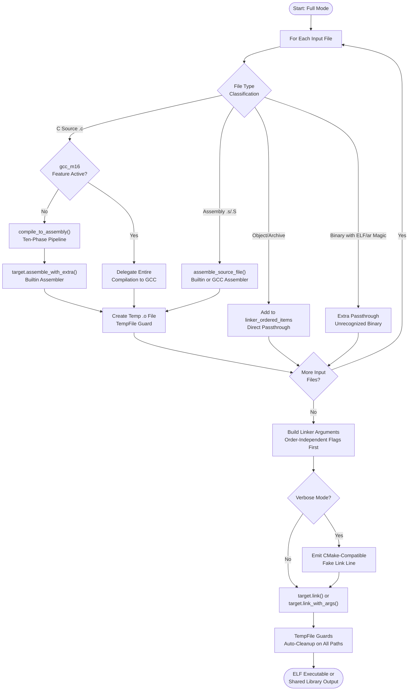

Linker arguments are assembled with order-independent flags first, followed by positional items from `linker_ordered_items`. `TempFile` guards ensure automatic cleanup of intermediate `.o` files on all exit paths — including success, error, and panic scenarios — preventing temporary file leaks.

### 4.3.2 Preprocess-Only Mode

The Preprocess-Only mode (`run_preprocess_only()` in `src/driver/pipeline.rs`) executes only the first two pipeline phases and outputs preprocessed text. This mode supports several sub-modes that alter the output format.

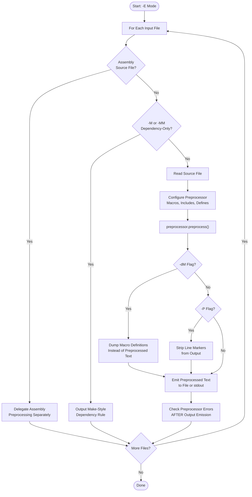

A critical GCC compatibility behavior is implemented in this mode: preprocessor errors are checked **after** output has been emitted, not before. This matches GCC's behavior where partially preprocessed output is still written to the output stream before the error is reported. This design decision in `src/driver/pipeline.rs` ensures that build systems relying on partial output during error recovery function correctly.

### 4.3.3 Assembly-Only and Object-Only Modes

The **Assembly-Only mode** (`-S`) executes the full ten-phase `compile_to_assembly()` pipeline and writes the resulting assembly text to an output `.s` file. A GCC fallback check (`gcc_m16` feature) is evaluated before compilation; if active, the entire compilation is delegated to GCC. Dependency files are written after successful compilation if `-MD` or `-MMD` was specified.

The **Object-Only mode** (`-c`) extends Assembly-Only by additionally invoking the builtin assembler (`target.assemble_with_extra()`) to convert assembly into relocatable ELF object files. If the input is already an assembly file (`.s` or `.S`), it is assembled directly via `assemble_source_file()`, bypassing the C compilation pipeline entirely. The `.S` file path includes a preprocessing step that defines `__ASSEMBLER__`, sets `asm_mode(true)` for `$` handling, and provides CET-related macro stubs (`_CET_H_INCLUDED`, `_CET_ENDBR`, `_CET_NOTRACK`).

---

## 4.4 OPTIMIZATION PIPELINE FLOW

### 4.4.1 Phased Optimization Architecture

The optimization pipeline orchestrated by `run_passes()` in `src/passes/mod.rs` (lines 1–552) is organized into four distinct phases with dirty-tracked iteration in the main loop. All optimization levels (`-O0` through `-O3`, `-Os`, `-Oz`) execute the same pipeline, as documented in `README.md`.

```mermaid
flowchart TD
    subgraph Phase0SG["Phase 0: Inlining + Post-Inline Cleanup"]
        OP_Inline["Inlining<br/>Budget-Limited, always_inline Override"] --> OP_DemoteGNU["Demote gnu_inline"]
        OP_DemoteGNU --> OP_Mem2Reg["mem2reg"]
        OP_Mem2Reg --> OP_CF1["constant_fold"]
        OP_CF1 --> OP_CP1["copy_prop"]
        OP_CP1 --> OP_Simp1["simplify"]
        OP_Simp1 --> OP_CF2["constant_fold 2"]
        OP_CF2 --> OP_CP2["copy_prop 2"]
        OP_CP2 --> OP_ResAsm["resolve_asm"]
    end

    subgraph Phase05SG["Phase 0.5: IsConstant Resolution"]
        OP_IsConst["resolve_remaining_is_constant<br/>Falsify remaining checks"]
    end

    subgraph MainLoopSG["Main Loop: Up to 3 Iterations, Dirty-Tracked"]
        OP_CfgSimp["cfg_simplify"] --> OP_CopyProp["copy_prop"]
        OP_CopyProp --> OP_DivConst["div_by_const<br/>Iteration 0 only, skip i686"]
        OP_DivConst --> OP_Narrow["narrow"]
        OP_Narrow --> OP_Simplify["simplify"]
        OP_Simplify --> OP_ConstFold["constant_fold"]
        OP_ConstFold --> OP_GVN["GVN + LICM + IVSR<br/>Shared CfgAnalysis"]
        OP_GVN --> OP_IfConv["if_convert"]
        OP_IfConv --> OP_CopyProp2["copy_prop 2nd"]
        OP_CopyProp2 --> OP_DCE["DCE"]
        OP_DCE --> OP_CfgSimp2["cfg_simplify 2nd"]
        OP_CfgSimp2 --> OP_IPCP["IPCP"]
        OP_IPCP --> OP_Converge{"Convergence<br/>Check"}
    end

    subgraph FinalPhaseSG["Final Phase"]
        OP_DeadStatic["Dead Static Function<br/>Elimination"]
    end

    OP_ResAsm --> OP_IsConst
    OP_IsConst --> OP_CfgSimp
    OP_Converge -->|"total_changes == 0 OR<br/>below 5% threshold OR<br/>max 3 iterations"| OP_DeadStatic
    OP_Converge -->|"Continue:<br/>Changes Detected"| OP_CfgSimp
    OP_DeadStatic --> OP_Output(["Optimized IR"])
```

The Phase 0 inlining pass uses a budget system based on instruction counts and block caps, with `always_inline` attribute override and recursion limits to prevent unbounded expansion. GVN, LICM, and IVSR (induction variable strength reduction) share a single `CfgAnalysis` computation to amortize the cost of CFG analysis across three passes. The `div_by_const` pass is restricted to iteration 0 and is skipped entirely for the i686 target.

### 4.4.2 SSA Construction and Elimination

SSA construction and phi elimination serve as bookend transformations surrounding the optimization pipeline. The `promote_allocas()` function in `src/ir/mem2reg/promote.rs` implements the alloca-then-promote strategy documented in `DESIGN_DOC.md`, while `eliminate_phis()` in `src/ir/mem2reg/` reverses the SSA representation to prepare for register allocation.

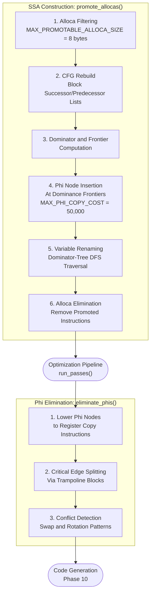

The alloca filtering step applies a size threshold (`MAX_PROMOTABLE_ALLOCA_SIZE = 8 bytes`) to exclude large aggregates from SSA promotion. The phi insertion step enforces a cost limit (`MAX_PHI_COPY_COST = 50,000`) to prevent exponential blowup in pathological CFG structures. During phi elimination, critical edge splitting inserts trampoline basic blocks to correctly sequence parallel phi assignments.

### 4.4.3 Iteration Control and Convergence

The main optimization loop employs a sophisticated dirty-tracking system implemented in `src/passes/mod.rs`:

- **Per-function dirty vectors**: Boolean vectors track which functions were modified by each pass, enabling selective re-visitation in subsequent iterations
- **Per-pass change counters**: Each pass reports the number of transformations applied, stored in the previous iteration's counter array
- **Dependency-driven skip logic**: The `should_run!` macro checks whether upstream passes made changes; if no upstream pass modified the IR, downstream passes are skipped entirely
- **Convergence criteria**: Three exit conditions terminate the loop early:
  1. `total_changes == 0` — no pass made any changes (immediate exit)
  2. Changes dropped below 5% of iteration 0's total (excluding DCE) AND iteration count exceeds 1 AND no IPCP changes — diminishing returns threshold
  3. Maximum of 3 iterations reached — hard upper bound

**Environment-based developer controls** (`src/passes/mod.rs`):

| Variable | Purpose |
|---|---|
| `CCC_DISABLE_PASSES` | Comma-separated list of pass names to skip |
| `CCC_TIME_PASSES` | Report per-pass execution time |
| `CCC_TIME_PHASES` | Report per-pipeline-phase wall-clock time |

---

## 4.5 BACKEND PROCESSING PIPELINES

### 4.5.1 Assembler Pipeline

The builtin assembler transforms assembly text into relocatable ELF object files. All four architecture assemblers follow a common three-stage pipeline, with shared preprocessing infrastructure in `src/backend/asm_preprocess.rs` and `src/backend/asm_expr.rs`. The RISC-V assembler extends this to a seven-stage pipeline to support instruction compression and linker relaxation.

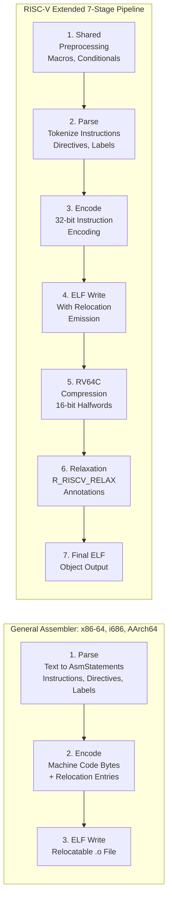

For `.S` files (assembly with preprocessor directives), the assembler integrates with the CCC preprocessor. Before assembly, the preprocessor is configured with `__ASSEMBLER__` defined, `_CET_H_INCLUDED` set (preventing CET header conflicts), `_CET_ENDBR` and `_CET_NOTRACK` defined as empty macros, and `asm_mode(true)` enabled for proper `$` handling. This preprocessing step is implemented in `src/driver/pipeline.rs` and `src/driver/external_tools.rs`.

The shared preprocessing infrastructure (`src/backend/asm_preprocess.rs`) handles comment stripping, `.rept`/`.irp` expansion, macro parsing and expansion, and conditional assembly directives — providing uniform assembly preprocessing across all four architecture backends.

### 4.5.2 ELF Linker Pipeline

The builtin linker, implemented in `src/backend/linker_common/` (18 shared infrastructure files) with architecture-specific modules in each backend subdirectory, follows a nine-step pipeline to produce final ELF executables or shared libraries.

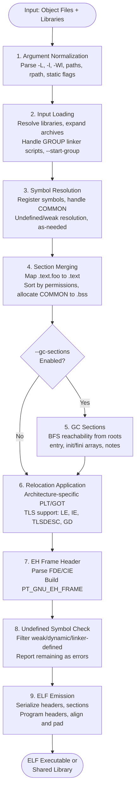

Architecture-specific linker behaviors vary across the four targets, as documented in `src/backend/`:

| Linker Aspect | x86-64 | i686 | AArch64 | RISC-V 64 |
|---|---|---|---|---|
| ELF Class | ELFCLASS64 | ELFCLASS32 | ELFCLASS64 | ELFCLASS64 |
| Relocation Format | `.rela` | `.rel` | `.rela` | `.rela` |
| TLS Modes | LE, IE, GD | LE, IE, GD | LE, IE, TLSDESC | LE, IE, GD (with GD→LE relaxation) |
| Special Features | Standard | ILP32 pointers | IFUNC/IPLT | Linker relaxation |
| Dynamic Linking | Full | Full | Full | Full |

The linker supports both static and dynamic linking, shared library generation (`-shared`), CRT file handling (`crt1.o`, `crti.o`, `crtn.o`), GNU hash tables, symbol versioning, thin-archive processing, COMDAT deduplication, and `--defsym` symbol definitions.

---

## 4.6 ERROR HANDLING FLOWS

### 4.6.1 Diagnostic System Architecture

The centralized diagnostic infrastructure is implemented in `src/common/error.rs` through the `DiagnosticEngine`. This engine provides GCC-compatible error formatting used by all pipeline stages from preprocessing through linking.

Key diagnostic system properties:

| Property | Detail |
|---|---|
| **Output Format** | GCC-style `file:line:col: severity: message` |
| **Severity Levels** | Error, Warning, Note |
| **Color Support** | Configurable `ColorMode` (Auto, Always, Never) |
| **Source Context** | Code snippets with caret (`^`) indicators |
| **Include Tracing** | Include chain reported, capped at 200 hops |
| **Macro Tracing** | Expansion trace from preprocessor metadata |
| **Warning Configuration** | `-Werror`, `-Werror=<name>`, `-Wno-error=<name>`, `-Wall`, `-Wextra`, `-W<name>`, `-Wno-<name>` |

The `WarningConfig` system supports fine-grained control over warning behavior. Individual warnings can be promoted to errors (`-Werror=<name>`), demoted from error status (`-Wno-error=<name>`), or suppressed entirely (`-Wno-<name>`). The `-Werror` flag promotes all warnings globally.

### 4.6.2 Pipeline Error Propagation

The following diagram illustrates how errors propagate through the compilation pipeline, with each phase's specific error handling behavior:

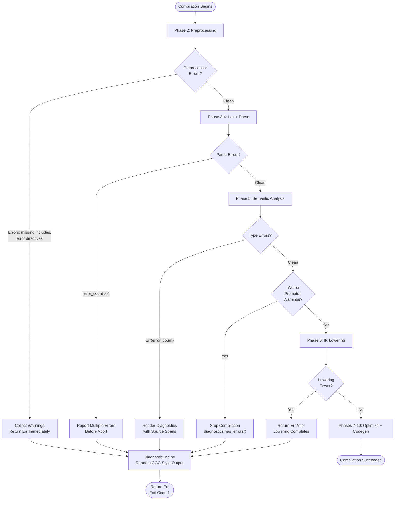

A notable design decision: the parser implements **error recovery** allowing continued parsing after encountering malformed input. This enables reporting multiple errors in a single compilation pass, providing a better user experience than single-error-and-abort compilers. The error count is tracked cumulatively and checked after parsing completes.

### 4.6.3 Recovery Procedures and Graceful Degradation

The CCC error handling architecture implements several recovery mechanisms:

**Thread-Level Panic Recovery** (`src/lib.rs`): The worker thread join operation catches Rust panics via the `Err(panic)` branch. When an internal panic occurs, the system prints an "internal error" message to stderr and exits with code 1, preventing unhandled panic propagation to the user.

**GCC-Compatible Error Ordering** (`src/driver/pipeline.rs`): In Preprocess-Only mode, the preprocessed output is emitted to the output stream before checking for errors. This matches GCC's behavior and ensures partial output is available even when preprocessing encounters errors.

**Resource Bound Protection**:
- Include chain depth is capped at 200 hops in `src/common/source.rs` to prevent infinite recursive inclusion
- The 64 MiB stack allocation prevents stack overflow on deeply nested translation units
- Phi node insertion is bounded by `MAX_PHI_COPY_COST = 50,000` to prevent exponential blowup
- Optimization iterations are capped at 3 with diminishing-returns early termination

**TempFile Cleanup Guarantees**: In Full compilation mode, `TempFile` guard objects ensure that all intermediate `.o` files are cleaned up on every exit path — success, compilation error, or panic — preventing temporary file accumulation.

---

## 4.7 INTEGRATION WORKFLOWS

### 4.7.1 Build System Integration

CCC is designed for seamless integration with Make, CMake, and Autoconf build systems via the `CC` environment variable. The following sequence diagram illustrates the end-to-end interaction between a build system and the CCC compilation pipeline:

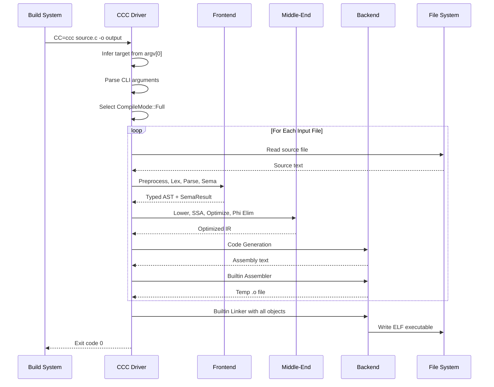

For GCC compatibility, CCC reports specific version information to satisfy build system probes:

| Probe | Response | Purpose |
|---|---|---|
| `ccc -dumpversion` | `14.2.0` | GCC version compatibility |
| `ccc -dumpmachine` | Target triple (e.g., `x86_64-linux-gnu`) | Architecture identification |
| `ccc -print-search-dirs` | Search directory listing | Library path discovery |
| `ccc --version` | Full version with backend info | Build system logging |
| GNU ld version query | `GNU ld (Claude's C Compiler built-in) 2.42` | Meson linker detection |

### 4.7.2 GCC Fallback Decision Flow

Three optional Cargo feature gates (`Cargo.toml`) enable selective fallback to GCC components when the builtin implementations cannot handle specific edge cases. Each feature gate represents a compile-time decision point that routes specific pipeline stages to the external GCC toolchain.

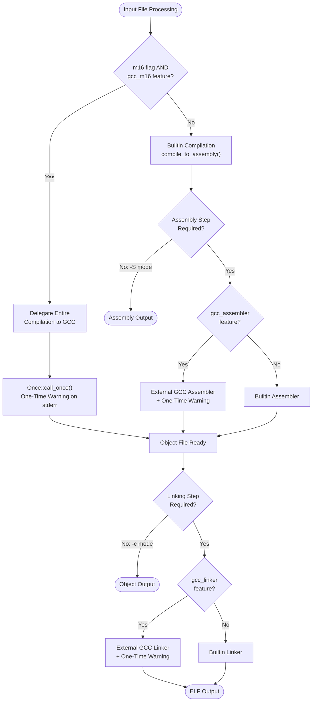

All three feature gates are disabled by default, ensuring the standalone build configuration is the standard. When compiled without any GCC fallback features, `ccc --version` reports `Backend: standalone`, confirming full self-containment. The `Once::call_once()` mechanism in `src/driver/external_tools.rs` ensures that fallback warnings are printed at most once per compilation session, avoiding diagnostic noise during multi-file builds.

### 4.7.3 Cross-Compilation Workflow

Cross-compilation is achieved through binary name selection and architecture-specific sysroot configuration. All five binary targets (`ccc`, `ccc-x86`, `ccc-arm`, `ccc-riscv`, `ccc-i686`) are built from the same Rust codebase and compiled into a single set of binaries. The target architecture is determined at runtime through `argv[0]` pattern matching in `src/driver/cli.rs`.

The cross-compilation workflow proceeds as follows:

1. **Binary Invocation**: User invokes architecture-specific binary (e.g., `ccc-arm prog.c -o prog`)
2. **Target Inference**: `argv[0]` pattern matching selects the appropriate target enum value and ABI
3. **Sysroot Configuration**: Architecture-specific system header and library paths are configured (e.g., `aarch64-linux-gnu` for AArch64)
4. **Preprocessor Configuration**: Target-specific predefined macros are set (e.g., `__aarch64__`, `__ARM_NEON`)
5. **Pipeline Execution**: The standard ten-phase pipeline executes with target-aware lowering, code generation, assembly, and linking
6. **Backend Dispatch**: The `ArchCodegen` trait dispatches to the appropriate architecture backend for code generation, the architecture-specific assembler produces the correct ELF class, and the architecture-specific linker applies the correct relocation types
7. **Output**: A target-architecture ELF binary is produced, testable via QEMU for non-host targets

---

## 4.8 STATE TRANSITION DIAGRAMS

### 4.8.1 Data Representation State Machine

The following state diagram traces the transformation of program data through the complete CCC pipeline, from raw source text to final ELF binary:

```mermaid
stateDiagram-v2
    [*] --> SourceText: Read from file or stdin
    SourceText --> PreprocessedText: Phase 2 Preprocessing
    PreprocessedText --> TokenStream: Phase 3 Lexing
    TokenStream --> AbstractSyntaxTree: Phase 4 Parsing
    AbstractSyntaxTree --> TypedAST: Phase 5 Semantic Analysis
    TypedAST --> AllocaIR: Phase 6 IR Lowering
    AllocaIR --> SSA_IR: Phase 7 SSA Construction
    SSA_IR --> OptimizedSSA: Phase 8 Optimization
    OptimizedSSA --> RegisterCopyIR: Phase 9 Phi Elimination
    RegisterCopyIR --> AssemblyText: Phase 10 Code Generation
    AssemblyText --> RelocatableObject: Builtin Assembler
    RelocatableObject --> ELFBinary: Builtin Linker
    ELFBinary --> [*]

    note right of SourceText: Raw bytes with PUA encoding
    note right of PreprocessedText: Text with line markers
    note right of TokenStream: Vec of Token with Spans
    note right of AbstractSyntaxTree: TranslationUnit
    note right of TypedAST: AST + SemaResult
    note right of AllocaIR: IrModule with allocas
    note right of SSA_IR: IrModule in SSA form
    note right of OptimizedSSA: IrModule optimized SSA
    note right of RegisterCopyIR: IrModule non-SSA
    note right of AssemblyText: String
    note right of RelocatableObject: ELF .o file
    note right of ELFBinary: ELF executable
```

Each state represents a distinct data representation type, with the transition arrows indicating the pipeline phase responsible for the transformation. The `SemaResult` produced during semantic analysis carries forward through IR lowering as auxiliary data containing the `TypeContext`, function metadata, expression type mappings, and computed constant values.

### 4.8.2 Type System Transitions

The dual type system (`src/common/types.rs`, `src/common/type_builder.rs`) maintains two parallel type representations that bridge the gap between C-language semantics and machine-level concerns:

- **CType** (27 variants): Used throughout the frontend (parsing, semantic analysis) and during IR lowering. Supports C-level concepts including `typedef` resolution, integer promotion rules, implicit conversions, vectors, bitfields, flexible arrays, and function types.
- **IrType**: Used from lowering onward through code generation. Provides machine-level layout with per-target size and alignment predicates.
- **TypeConvertContext**: Bridges `CType` declarator chains to concrete `IrType` representations during IR lowering.
- **TypeContext**: Employed during semantic analysis with undo-logged operations for speculative type resolution, enabling backtracking during overload resolution and type inference.

The type system transition occurs at the Phase 6 (IR Lowering) boundary, where `TypeConvertContext` maps each `CType` node in the AST to its corresponding `IrType` in the IR. Architecture-specific type properties (pointer size, long double format, alignment rules) are resolved through target-aware queries provided by thread-local helpers.

### 4.8.3 Optimization State Management

The optimization pipeline maintains several state tracking mechanisms within `src/passes/mod.rs`:

- **Per-function dirty vectors**: Boolean arrays indexed by function ID, tracking which functions were modified by each pass. Only modified functions are re-visited in subsequent iterations.
- **Per-pass change counters**: Arrays recording the number of transformations each pass applied during the previous iteration. These counters drive the `should_run!` macro's dependency-based skip logic.
- **Convergence state**: Accumulated change counts compared against iteration 0's baseline to detect diminishing returns. The threshold is set at 5% of the first iteration's total changes (excluding DCE, which tends to have a large constant contribution).
- **IPCP propagation state**: Inter-procedural constant propagation changes are tracked separately, as IPCP modifications can create new optimization opportunities that justify additional iterations even when other passes show diminishing returns.

---

## 4.9 VALIDATION RULES AND TIMING CONSTRAINTS

### 4.9.1 Per-Phase Validation Rules

Each pipeline phase enforces specific validation rules that gate progression to subsequent phases:

| Phase | Validation Rule | Error Behavior | Source |
|---|---|---|---|
| Phase 2: Preprocessing | `#error` directives, missing `#include` targets, recursive inclusion | Collect errors; return Err if any | `src/frontend/preprocessor/` |
| Phase 3: Lexing | Invalid tokens, unterminated strings, malformed literals | Errors reported via DiagnosticEngine | `src/frontend/lexer/` |
| Phase 4: Parsing | Syntax errors, grammar violations | Error recovery allows multiple errors; abort if `error_count > 0` | `src/frontend/parser/` |
| Phase 5: Semantic Analysis | Type mismatches, constraint violations, undefined identifiers | `Err(error_count)` on type errors; post-check for `-Werror` promotion | `src/frontend/sema/` |
| Phase 6: IR Lowering | Type conversion failures, unsupported constructs | Check `diagnostics.has_errors()` after completion | `src/ir/lowering/` |
| Phase 7: SSA Construction | Alloca size threshold (8 bytes), phi cost limit (50,000) | Graceful degradation: over-threshold allocas remain as memory operations | `src/ir/mem2reg/` |
| Phase 8: Optimization | Pass invariant preservation, dirty flag consistency | Bounded iteration (max 3); environment-variable pass disabling | `src/passes/` |
| Phase 10: Code Generation | Register allocation, instruction encoding | Architecture-specific validation via `ArchCodegen` trait | `src/backend/` |

### 4.9.2 Feature Gate and Configuration Checkpoints

The driver evaluates several configuration checkpoints during pipeline setup that influence the compilation path:

| Checkpoint | Location | Decision |
|---|---|---|
| Target Architecture | `src/driver/cli.rs` | Routes to architecture-specific backend |
| Compile Mode | `src/driver/pipeline.rs` | Determines pipeline depth (-E, -S, -c, full) |
| GCC Fallback Features | `Cargo.toml` feature gates | Compile-time routing to external GCC tools |
| PIC Mode | `CodegenOptions::pic` | Enables GOT-based addressing in code generation |
| CET/IBT Protection | `CodegenOptions::cf_protection_branch` | Emits `endbr64` at function entries |
| Retpoline | `CodegenOptions::indirect_branch_thunk` | Generates Spectre V2 mitigations |
| Kernel Code Model | `CodegenOptions::kernel_code_model` | High-address code generation |
| Debug Info | `CodegenOptions::debug_info` | Activates DWARF generation |
| RISC-V Overrides | `-mabi`, `-march` flags | Configures ABI and ISA extensions |

### 4.9.3 Resource Bounds and Timing Constraints

The following resource bounds and timing-relevant constraints ensure predictable compilation behavior:

| Constraint | Value | Purpose | Source |
|---|---|---|---|
| Worker Thread Stack | 64 MiB | Prevent stack overflow on deep recursion | `src/lib.rs` |
| Rust Recursion Limit | 512 | Bound type-level recursion | `src/lib.rs` |
| Include Chain Depth | 200 hops | Prevent infinite inclusion loops | `src/common/source.rs` |
| Max Promotable Alloca Size | 8 bytes | Limit SSA promotion to small scalars | `src/ir/mem2reg/promote.rs` |
| Max Phi Copy Cost | 50,000 | Prevent exponential phi node insertion | `src/ir/mem2reg/promote.rs` |
| Optimization Iterations | 3 maximum | Bound optimization time | `src/passes/mod.rs` |
| Convergence Threshold | 5% of iteration 0 changes | Early termination on diminishing returns | `src/passes/mod.rs` |
| If-Convert Speculation | 8 speculative operations max | Bound speculative execution in if-conversion | `src/passes/if_convert.rs` |
| Concurrency Model | Single-threaded per invocation | Compilation speed bound to single core | `src/driver/pipeline.rs` |

Phase-level timing instrumentation is available via `CCC_TIME_PHASES` and pass-level instrumentation via `CCC_TIME_PASSES`, enabling developers to profile compilation performance and identify bottlenecks. Known performance bottlenecks documented in `ideas/high_compile_speed_improvements.txt` include memory allocation patterns, preprocessor throughput, string interning overhead, and lexer keyword lookup.

---

## 4.10 REFERENCES

#### Source Files Examined

- `src/lib.rs` — Compiler entry point, 64 MiB thread spawning, three-tiered error handling
- `src/driver/pipeline.rs` — Complete compilation pipeline, CompileMode enum, all four run methods, compile_to_assembly core
- `src/driver/cli.rs` — CLI parsing, target inference from argv[0], query flag handling, response file expansion
- `src/driver/external_tools.rs` — GCC fallback integration, external assembler/linker invocation, dependency file generation
- `src/driver/file_types.rs` — Input file classification by extension and magic bytes
- `src/passes/mod.rs` — Optimization pipeline orchestration, dirty tracking, convergence logic, all pass phases
- `src/backend/mod.rs` — Target enum, CodegenOptions struct, assembler and linker configurations
- `src/backend/generation.rs` — GEP fold map, code generation dispatch structure, DWARF integration
- `src/backend/traits.rs` — ArchCodegen trait definition (~185 methods)
- `src/common/error.rs` — DiagnosticEngine, ColorMode, WarningKind, severity levels
- `src/common/types.rs` — CType (27 variants), IrType, dual type system
- `src/common/source.rs` — SourceManager, include chain tracking, line map construction
- `src/ir/mem2reg/promote.rs` — SSA construction via alloca promotion, phi elimination
- `src/ir/lowering/` — IR lowering from AST to alloca-based IR (43 files)
- `DESIGN_DOC.md` — Architecture documentation, pipeline design, alloca-then-promote rationale

#### Source Directories Examined

- `src/driver/` — Pipeline orchestration module
- `src/frontend/` — Preprocessor, lexer, parser, semantic analysis submodules
- `src/passes/` — Optimization passes (18 files)
- `src/backend/` — Shared codegen infrastructure and four architecture backends
- `src/backend/linker_common/` — Shared ELF64 linker infrastructure (18 files)
- `src/backend/riscv/assembler/` — RISC-V assembler seven-stage pipeline
- `src/ir/` — SSA IR modules, analysis, lowering, mem2reg
- `src/common/` — Shared infrastructure (14 files)
- `src/bin/` — Five binary shim entry points

#### Technical Specification Sections Referenced

- Section 1.2: System Overview — Pipeline architecture, component table, optimization architecture
- Section 1.3: Scope — In-scope capabilities, user workflows, implementation boundaries
- Section 2.1: Feature Catalog — All 20 features (F-001 through F-020)
- Section 2.3: Feature Relationships — Dependency map, integration points, shared components
- Section 2.4: Implementation Considerations — Technical constraints, performance requirements
- Section 2.6: Assumptions and Constraints — Active known issues, assumptions
- Section 3.7: Architecture-Specific Technology Matrix — Per-architecture specifications
- Section 3.8: Security Considerations — Compiler self-security, produced binary features

# 5. System Architecture

## 5.1 HIGH-LEVEL ARCHITECTURE

### 5.1.1 System Overview

CCC (Claude's C Compiler) is a fully self-contained, multi-phase pipeline compiler written entirely in Rust (2021 edition), implementing the complete transformation from C source text to Linux ELF executables without any external toolchain dependencies. The system is distributed as crate `ccc` v0.1.0 under the CC0 1.0 Universal (Public Domain) license.

#### Architecture Style and Rationale

CCC follows a **classic multi-phase pipeline compiler architecture** (frontend → middle-end IR → optimizer → backend) augmented with a **trait-based backend abstraction layer** for multi-architecture support. This style was chosen for several reasons:

- **Phase isolation**: Each major stage operates on its own representation (text/tokens/AST → alloca-IR → SSA IR → non-SSA IR → assembly text → ELF), with phase boundaries implemented as explicit ownership transfers rather than shared mutable state. This ensures clean separation of concerns and eliminates an entire class of shared-state bugs.
- **Alloca-then-promote SSA construction**: Identical to LLVM's strategy, the IR initially emits alloca/load/store sequences, then a dedicated `mem2reg` pass promotes eligible allocas to SSA form independently. This cleanly separates C semantics from SSA bookkeeping, simplifying the frontend while enabling powerful SSA-based optimizations (`DESIGN_DOC.md`).
- **Trait-based backend polymorphism**: The `ArchCodegen` trait (~185 methods) captures the interface between the shared codegen framework and architecture-specific instruction emission. Default method implementations maximize code reuse while permitting architecture-specific overrides (`src/backend/traits.rs`).
- **Zero external dependencies**: The entire pipeline—including assemblers and linkers for all four architectures—is implemented internally. `Cargo.toml` contains no `[dependencies]`, `[dev-dependencies]`, or `[build-dependencies]` sections, eliminating supply chain attack surface and ensuring build reproducibility.

#### Key Architectural Principles

| Principle | Description | Evidence |
|---|---|---|
| Separation through representations | Each phase works on a distinct data type; boundaries are explicit ownership transfers | `DESIGN_DOC.md` |
| Single-crate monolith | All components reside in one Rust crate with zero external Cargo dependencies | `Cargo.toml` |
| Trait-based polymorphism | Shared algorithms in default methods; backends supply architecture-specific primitives | `src/backend/traits.rs` |
| Fail-fast at frontend boundary | Errors halt before reaching the resource-intensive optimizer and backend stages | `src/driver/pipeline.rs` |
| GCC-compatible interface | CLI, diagnostics, and build-system probes emulate GCC 14.2.0 behavior | `src/driver/cli.rs` |

#### System Boundaries and Major Interfaces

- **Input Boundary**: C source files (`.c`, `.h`), assembly files (`.s`, `.S`), object files (`.o`), static archives (`.a`)
- **Output Boundary**: ELF executables, shared libraries, object files, assembly text, or preprocessed text
- **Host Platform**: Linux x86-64 only
- **Target Architectures**: x86-64, i686, AArch64, RISC-V 64
- **Runtime Dependencies**: glibc/musl system headers and C runtime libraries (`crt1.o`, `crti.o`, `crtn.o`, `libc`)

Five binary targets are built from the same codebase, with target architecture determined at runtime via `argv[0]` pattern matching in `src/driver/cli.rs`:

| Binary | Source Path | Target Architecture |
|---|---|---|
| `ccc` | `src/main.rs` | x86-64 (default) |
| `ccc-x86` | `src/bin/ccc_x86.rs` | x86-64 |
| `ccc-arm` | `src/bin/ccc_arm.rs` | AArch64 |
| `ccc-riscv` | `src/bin/ccc_riscv.rs` | RISC-V 64 |
| `ccc-i686` | `src/bin/ccc_i686.rs` | i686 |

All five binary shims invoke the shared `ccc::compiler_main()` entry point defined in `src/lib.rs`, which spawns a worker thread with a 64 MiB stack to handle deep recursion. The Rust recursion limit is set to 512 (`#![recursion_limit = "512"]`).

### 5.1.2 Core Components

CCC is organized into seven major component groups, each corresponding to a top-level module directory under `src/`. The following table summarizes their roles, dependencies, and integration points.

| Component | Primary Responsibility | Key Dependencies |
|---|---|---|
| **Driver** (`src/driver/`) | CLI parsing, pipeline orchestration, compile mode dispatch, file type handling | All other modules |
| **Frontend** (`src/frontend/`) | Preprocessor, lexer, parser, semantic analysis — transforms C source into a typed AST | `common` (types, diagnostics) |
| **IR Subsystem** (`src/ir/`) | SSA intermediate representation with lowering from AST and mem2reg promotion | `common` (types), `frontend` (AST) |
| **Optimization Passes** (`src/passes/`) | 16 SSA-based optimization passes with dirty-flag iteration control | `ir` (module, instructions) |
| **Backend** (`src/backend/`) | Architecture-specific codegen, peephole optimization, builtin assembler and linker | `ir`, `common` |
| **Common** (`src/common/`) | Shared infrastructure — dual type system, diagnostics engine, symbol table, hashing, encoding | None (foundational) |
| **Bundled Headers** (`include/`) | 17 C headers providing x86 SIMD intrinsics (SSE through AVX-512) and ARM NEON | None |

```mermaid
flowchart TD
    subgraph EntryPoints["Binary Entry Points"]
        CCC["ccc / ccc-x86"]
        ARM["ccc-arm"]
        RV["ccc-riscv"]
        I686["ccc-i686"]
    end

    subgraph DriverMod["Driver (src/driver/)"]
        CLI["CLI Parser<br/>cli.rs"]
        Pipeline["Pipeline Orchestrator<br/>pipeline.rs"]
        FileTypes["File Type Classifier<br/>file_types.rs"]
        ExtTools["External Tool Integration<br/>external_tools.rs"]
    end

    subgraph FrontendMod["Frontend (src/frontend/)"]
        PP["Preprocessor"]
        LEX["Lexer"]
        PAR["Parser"]
        SEMA["Semantic Analyzer"]
    end

    subgraph IRMod["IR Subsystem (src/ir/)"]
        Lower["IR Lowering"]
        M2R["mem2reg (SSA)"]
        PhiElim["Phi Elimination"]
    end

    subgraph PassesMod["Optimization (src/passes/)"]
        PassMgr["Pass Manager<br/>mod.rs"]
    end

    subgraph BackendMod["Backend (src/backend/)"]
        Codegen["Code Generation<br/>traits.rs + generation.rs"]
        Peephole["Peephole Optimizer"]
        ASMBuiltin["Builtin Assembler"]
        LNKBuiltin["Builtin Linker"]
    end

    subgraph CommonMod["Common (src/common/)"]
        Types["Dual Type System<br/>CType + IrType"]
        Diag["DiagnosticEngine"]
        SymTab["Symbol Table"]
        Enc["Encoding / Hashing"]
    end

    CCC --> CLI
    ARM --> CLI
    RV --> CLI
    I686 --> CLI
    CLI --> Pipeline
    Pipeline --> PP
    PP --> LEX
    LEX --> PAR
    PAR --> SEMA
    SEMA --> Lower
    Lower --> M2R
    M2R --> PassMgr
    PassMgr --> PhiElim
    PhiElim --> Codegen
    Codegen --> Peephole
    Peephole --> ASMBuiltin
    ASMBuiltin --> LNKBuiltin

    Types -.-> PP
    Types -.-> SEMA
    Types -.-> Lower
    Diag -.-> PP
    Diag -.-> PAR
    Diag -.-> SEMA
    SymTab -.-> SEMA
    Enc -.-> LEX
```

### 5.1.3 Data Flow Description

The compilation pipeline implements a ten-phase transformation from C source text to architecture-specific assembly, followed by assembly and linking stages. Each phase consumes and produces a specific Rust data type, enforcing type-safe phase boundaries.

#### Primary Data Flow Chain

The data progresses through the following concrete Rust types, as documented in `DESIGN_DOC.md`:

1. **`&str` (C source text)** → `Preprocessor::preprocess()` → **`String` (expanded text with GCC-style `# line "file"` markers)**
2. **`String`** → `Lexer::tokenize()` → **`Vec<Token>` (each Token = `{ kind: TokenKind, span: Span }`)**
3. **`Vec<Token>`** → `Parser::parse()` → **`TranslationUnit` (AST: `Vec<ExternalDecl>` with source spans)**
4. **`TranslationUnit`** → `SemanticAnalyzer::analyze()` → **`TranslationUnit` + `SemaResult` (functions, type context, expression types, constant values)**
5. **Typed AST** → `Lowerer::lower()` → **`IrModule` (alloca-based IR: every local is a stack slot)**
6. **`IrModule`** → `promote_allocas()` → **`IrModule` (SSA form: phi nodes, virtual registers)**
7. **`IrModule` (SSA)** → `run_passes()` → **`IrModule` (optimized SSA)**
8. **`IrModule`** → `eliminate_phis()` → **`IrModule` (non-SSA: phi nodes lowered to register copies)**
9. **`IrModule`** → `Target::generate_assembly_with_opts_and_debug()` → **`String` (target-specific assembly text)**
10. **`String`** → Builtin Assembler → **ELF object file (`.o`)** → Builtin Linker → **ELF executable**

#### Key Data Transformation Points

| Transformation | Phase | Mechanism | Purpose |
|---|---|---|---|
| Non-UTF-8 byte encoding | Source Reading | PUA code points (U+E080–U+E0FF) | Round-trip fidelity for binary content |
| Macro expansion | Preprocessing | Text-to-text with line markers | GCC-compatible source location tracking |
| CType → IrType bridging | IR Lowering | `TypeConvertContext` | Bridges 27 C-level type variants to machine-level types |
| Alloca → SSA promotion | SSA Construction | `mem2reg` with dominance frontiers | Enables SSA-based optimization passes |
| Phi → register copies | Phi Elimination | Critical edge splitting via trampolines | Prepares IR for register allocation |

#### Integration Patterns

- **Ownership transfer**: Phase boundaries are explicit ownership transfers of data structures, not shared mutable state. Each phase consumes its input and produces a new output.
- **Bundled analysis results**: The `SemaResult` aggregates several analysis outputs — `FxHashMap<String, FunctionInfo>`, `TypeContext`, `FxHashMap<ExprId, CType>`, and `FxHashMap<ExprId, IrConst>` — into a single transfer unit between semantic analysis and IR lowering.
- **Compile mode gating**: Four compile modes (`PreprocessOnly`, `AssemblyOnly`, `ObjectOnly`, `Full`) control pipeline depth, allowing early termination at the appropriate phase boundary.

### 5.1.4 External Integration Points

CCC integrates with a small number of external systems, all through well-defined file-based or process-based interfaces. No network communication or remote service dependencies exist.

| System Name | Integration Type | Data Exchange Pattern |
|---|---|---|
| **Linux System Headers** | File-based include | C headers read during preprocessing via standard `#include` paths |
| **C Runtime Libraries** | Object file linking | `crt1.o`, `crti.o`, `crtn.o`, `libc` linked during final stage via ELF object/archive format |
| **Cross-Compilation Sysroots** | File system paths | Architecture-specific headers and libraries via ELF and AR archive format |
| **GCC Fallback (optional)** | Process invocation | Compile-time feature gates: `gcc_assembler`, `gcc_linker`, `gcc_m16` via CLI args |
| **Build Systems** | `CC=` environment variable | GCC-compatible CLI interface with Make, CMake, and Autoconf |
| **QEMU (testing)** | Runtime execution | ELF binary execution for testing cross-compiled output |

---

## 5.2 COMPONENT DETAILS

### 5.2.1 Driver

**Source Location**: `src/driver/` — 6 files: `mod.rs`, `cli.rs`, `pipeline.rs`, `external_tools.rs`, `file_types.rs`, `README.md`

#### Purpose and Responsibilities

The Driver component orchestrates the entire compilation process. It is responsible for parsing GCC-compatible CLI arguments, inferring the target architecture from the binary name, classifying input files by type, sequencing inputs through the appropriate compilation pipeline stages, and managing optional GCC fallback integration.

#### Key Interfaces

| Interface | Location | Role |
|---|---|---|
| `Driver::new()` | `mod.rs` | Creates a new driver instance |
| `Driver::parse_cli_args()` | `cli.rs` | Hand-written GCC-compatible argument parser |
| `Driver::run()` | `pipeline.rs` | Dispatches to mode-specific run methods |
| `compile_to_assembly()` | `pipeline.rs` | Core ten-phase compilation pipeline |

#### CLI Processing Pipeline

CLI argument processing follows a four-stage pipeline implemented in `src/driver/cli.rs`:

1. **Target inference**: `argv[0]` pattern matching — `arm`/`aarch64` → AArch64, `riscv` → RISC-V 64, `i686`/`i386` → i686, default → x86-64
2. **Query flag handling**: `-dumpmachine`, `--version`, `-print-search-dirs`, `-dumpversion` — responds with GCC-compatible values and exits
3. **Response file expansion**: `@file` arguments expanded with full quoting and escape handling
4. **Main argument parsing**: Hand-written flat match loop processing all GCC-compatible flags

The `CompileMode` enum determines pipeline depth: `PreprocessOnly` (`-E`), `AssemblyOnly` (`-S`), `ObjectOnly` (`-c`), or `Full` (default).

#### Feature Gates

Three compile-time Cargo features enable optional GCC fallback, each emitting a one-time warning via `Once::call_once()` in `src/driver/external_tools.rs`:

- `gcc_assembler` — delegates assembly to external GCC assembler
- `gcc_linker` — delegates linking to external GCC linker
- `gcc_m16` — delegates 16-bit real-mode boot code to GCC entirely

### 5.2.2 Frontend

**Source Location**: `src/frontend/` — four submodules: `preprocessor/`, `lexer/`, `parser/`, `sema/`

#### Purpose and Responsibilities

The Frontend transforms raw C source text into a fully type-checked Abstract Syntax Tree (AST) augmented with semantic analysis results. It encompasses four sequential processing stages, each implemented as a dedicated submodule.

#### Preprocessor (`src/frontend/preprocessor/`)

**Files**: `pipeline.rs`, `macro_defs.rs`, `conditionals.rs`, `expr_eval.rs`, `builtin_macros.rs`, `predefined_macros.rs`, `utils.rs`

The preprocessor performs a GCC-compatible, streaming, text-to-text transformation. It handles `#include`, `#ifdef`/`#ifndef`/`#if`, `#pragma once`, object-like and function-like macros, variadic GNU `,##__VA_ARGS__`, include guard detection (to avoid re-processing headers), stringification (`#`), and token pasting (`##`). Target-specific predefined macros are configured per architecture (e.g., `__x86_64__`, `__aarch64__`, `__OPTIMIZE__`). The output is expanded text with GCC-style `# line "file"` markers for source location tracking.

#### Lexer (`src/frontend/lexer/`)

**Files**: `token.rs`, `scan.rs`

A single-pass byte-level scanner producing `Vec<Token>` with `Span`-anchored diagnostics. Handles GNU extensions, PUA decoding for non-UTF-8 bytes, and parsing of numerical, string, and character literals.

#### Parser (`src/frontend/parser/`)

**Files**: `ast.rs`, `parse.rs`, plus expression, declaration, and statement modules

A recursive-descent parser producing a `TranslationUnit` AST (`Vec<ExternalDecl>`). Implements error recovery to allow reporting multiple errors before compilation halts. Handles typedef disambiguation, complex declarator chains, and inline assembly support.

#### Semantic Analysis (`src/frontend/sema/`)

Performs type checking, implicit conversion insertion, constant expression evaluation, and attribute processing. Produces a `SemaResult` containing `TypeContext` (with undo-logged operations for speculative type resolution), function metadata, expression type mappings (`FxHashMap<ExprId, CType>`), and computed constant values (`FxHashMap<ExprId, IrConst>`).

### 5.2.3 IR Subsystem

**Source Location**: `src/ir/` — 9 files + 2 subfolders (`lowering/`, `mem2reg/`)

#### Purpose and Responsibilities

The IR Subsystem defines the compiler's intermediate representation and manages its construction from the typed AST and promotion to SSA form. It serves as the central data structure connecting the frontend analysis to the optimization passes and backend code generation.

#### Core Data Types

| Type | Location | Description |
|---|---|---|
| `IrModule` | `module.rs` | Compilation unit with functions, globals, metadata |
| `Instruction` | `instruction.rs` | Enum covering memory ops, arithmetic, pointers, calls, atomics, intrinsics, inline asm, phi nodes |
| `BasicBlock` | `module.rs` | Block with instructions and terminator |
| `IrConst` | `constants.rs` | Constant lattice: signed ints, floats, long double payloads, zero |
| `IntrinsicOp` | `intrinsics.rs` | Target-independent hardware intrinsics (fences, SIMD, AES, CRC, scalar math) |

#### CFG Analysis (`analysis.rs`)

Implements control flow graph analysis infrastructure: FlatAdj CSR adjacency lists, label maps, successor/predecessor construction, reverse postorder DFS, Cooper-Harvey-Kennedy dominator fixpoint algorithm, dominance frontier computation, and dominance tree child lists. All bundled into a `CfgAnalysis` struct that is shared by GVN, LICM, and IVSR passes to amortize computation cost.

#### IR Lowering (`src/ir/lowering/`)

Converts the C AST into alloca-based `IrModule`. Lowering is target-aware, using `SemaResult` data and `TypeConvertContext` to bridge `CType` (27 variants) to `IrType` (machine-level types: I8..I128, U8..U128, F32, F64, F128, Ptr, Void). Post-lowering steps apply `#pragma weak`, `#pragma redefine_extname`, and `-fcommon` semantics.

#### mem2reg (`src/ir/mem2reg/`)

Two complementary transformations bookend the optimization pipeline:

- **`promote_allocas()`**: Six-step SSA promotion — alloca filtering (`MAX_PROMOTABLE_ALLOCA_SIZE` = 8 bytes), CFG rebuild, dominator/frontier computation, phi insertion (`MAX_PHI_COPY_COST` = 50,000), variable renaming via dominator-tree DFS, and alloca elimination.
- **`eliminate_phis()`**: Lowers SSA phi nodes to register copies with critical edge splitting via trampoline blocks and conflict detection for swap/rotation patterns.

### 5.2.4 Optimization Passes

**Source Location**: `src/passes/` — 16 pass implementation files + `mod.rs` + `README.md`

#### Purpose and Responsibilities

The optimization subsystem applies a suite of 16 SSA-based transformation passes to the IR, organized into a phased pipeline with dirty-tracked iterative convergence. All optimization levels (`-O0` through `-O3`, `-Os`, `-Oz`) execute the same pipeline.

#### Pass Catalog

| Pass | File | Purpose |
|---|---|---|
| `inline` | `inline.rs` | Budget-limited inlining with `always_inline` override and recursion limits |
| `cfg_simplify` | `cfg_simplify.rs` | Constant branch folding, jump threading, dead block removal |
| `constant_fold` | `constant_fold.rs` | Per-function const maps, int/float/128-bit folding |
| `copy_prop` | `copy_prop.rs` | Dense SSA-to-operand map with path-compressed chains |
| `dce` | `dce.rs` | Use-count-based dead code elimination with side-effect recognition |
| `dead_statics` | `dead_statics.rs` | Symbol reachability BFS from roots |
| `div_by_const` | `div_by_const.rs` | Division/modulo to multiply+shift via magic numbers |
| `gvn` | `gvn.rs` | Dominator-based global value numbering with store-to-load forwarding |
| `if_convert` | `if_convert.rs` | Diamond/triangle if-conversion to Select (max 8 speculative instructions) |
| `ipcp` | `ipcp.rs` | Interprocedural constant propagation, dead call elimination |
| `iv_strength_reduce` | `iv_strength_reduce.rs` | GEP rewriting driven by induction variables |
| `licm` | `licm.rs` | Loop-invariant code motion with alloca/global analysis |
| `loop_analysis` | `loop_analysis.rs` | Natural loop detection, preheader identification (shared by LICM, IVSR) |
| `narrow` | `narrow.rs` | Integer narrowing to eliminate promotion overhead |
| `resolve_asm` | `resolve_asm.rs` | Post-inline assembly symbol resolution |
| `simplify` | `simplify.rs` | Algebraic simplification of IR expressions |

#### Pipeline Execution Order

The pipeline executes in four phases, as orchestrated by `run_passes()` in `src/passes/mod.rs`:

**Phase 0 — Inlining + Post-Inline Cleanup**: inline → demote `gnu_inline` → mem2reg → constant_fold → copy_prop → simplify → constant_fold → copy_prop → resolve_asm

**Phase 0.5 — IsConstant Resolution**: resolve_remaining_is_constant (falsify remaining `__builtin_constant_p` checks)

**Main Loop (up to 3 iterations, dirty-tracked)**: cfg_simplify → copy_prop → div_by_const (iteration 0 only, skip i686) → narrow → simplify → constant_fold → GVN + LICM + IVSR (shared `CfgAnalysis`) → if_convert → copy_prop → DCE → cfg_simplify → IPCP

**Final Phase**: Dead static function elimination

#### Convergence Criteria

Three exit conditions terminate the main loop early:
1. `total_changes == 0` — no pass made any changes (immediate exit)
2. Changes dropped below 5% of iteration 0's total (excluding DCE) AND iteration count exceeds 1 AND no IPCP changes — diminishing returns threshold
3. Maximum of 3 iterations reached — hard upper bound

### 5.2.5 Backend

**Source Location**: `src/backend/` — 17 shared infrastructure files + 7 subfolders (4 architecture-specific + `stack_layout/`, `linker_common/`, `elf/`)

#### Purpose and Responsibilities

The Backend translates optimized non-SSA IR into architecture-specific machine code, applies peephole optimizations, assembles machine code into ELF relocatable objects, and links objects into final ELF executables or shared libraries. Each of the four target architectures has its own backend subdirectory containing codegen, assembler, and linker implementations.

#### Shared Infrastructure

| File | Responsibility |
|---|---|
| `traits.rs` | `ArchCodegen` trait (~185 methods) with default implementations |
| `generation.rs` | Module/function/instruction dispatch with pre-scan (GEP folding, compare-branch fusion, use counting) |
| `state.rs` | `CodegenState`, `StackSlot`, `SlotAddr` management |
| `call_abi.rs` | Unified ABI classification for caller/callee and stack computation |
| `regalloc.rs` | Linear scan register allocator (loop-aware, callee-saved + caller-saved) |
| `liveness.rs` | Live interval computation for register allocation |
| `stack_layout/` | Three-tier slot allocation with escape analysis and copy coalescing (8 files) |
| `linker_common/` | Shared ELF64 linking infrastructure (18 files) |
| `f128_softfloat.rs` | IEEE binary128 soft-float trait (shared by AArch64 and RISC-V) |
| `inline_asm.rs` | Shared four-phase inline assembly workflow |

#### Architecture-Specific Backends

| Architecture | Source | ABI | ELF Class | Encoding |
|---|---|---|---|---|
| x86-64 | `src/backend/x86/` | SysV AMD64 | ELFCLASS64 | Variable (REX/ModR/M/SIB) |
| i686 | `src/backend/i686/` | cdecl | ELFCLASS32 | Variable (ModR/M/SIB) |
| AArch64 | `src/backend/arm/` | AAPCS64 | ELFCLASS64 | Fixed 32-bit |
| RISC-V 64 | `src/backend/riscv/` | LP64D | ELFCLASS64 | Variable (RV64C) |

Each architecture backend contains three subdirectories: `codegen/` (trait implementation, instruction emission, peephole optimizer), `assembler/` (parser, encoder, ELF object writer), and `linker/` (input processing, symbol resolution, relocation application, ELF emission).

#### Stack Layout (`src/backend/stack_layout/`)

Implements a seven-phase stack frame allocation pipeline with a three-tier strategy:

- **Tier 1**: Permanent slots for explicit allocas
- **Tier 2**: Multi-block liveness-packed slots for values live across multiple blocks
- **Tier 3**: Intra-block reuse pools for temporaries confined to a single block

The pipeline includes escape analysis, copy coalescing, and slot assignment to minimize stack frame size.

#### Assembler Architecture

All four architectures follow a common three-stage assembler pipeline:

1. **Parse**: Text → `Vec<AsmStatement>` (instructions, directives, labels)
2. **Encode**: Machine code bytes + relocation entries
3. **ELF Write**: Relocatable `.o` file

The RISC-V assembler extends this to a seven-stage pipeline with additional shared preprocessing, RV64C instruction compression, and `R_RISCV_RELAX` relaxation annotation stages.

#### Linker Architecture

The builtin linker follows a nine-step pipeline implemented across shared infrastructure (`src/backend/linker_common/`, 18 files) and architecture-specific modules:

1. Argument normalization
2. Input loading (archive expansion, GROUP linker scripts, `--start-group`)
3. Symbol resolution (COMMON, weak, as-needed)
4. Section merging (`.text.foo` → `.text`, COMMON → `.bss`)
5. GC sections (optional, BFS reachability from entry and init/fini arrays)
6. Relocation application (architecture-specific PLT/GOT, TLS)
7. EH frame header (FDE/CIE parsing, `PT_GNU_EH_FRAME`)
8. Undefined symbol check
9. ELF emission (headers, sections, program headers)

```mermaid
sequenceDiagram
    participant DRV as Driver
    participant FE as Frontend
    participant IR as IR Subsystem
    participant OPT as Optimizer
    participant CG as Code Generator
    participant ASM as Builtin Assembler
    participant LNK as Builtin Linker
    participant FS as File System

    DRV->>FS: Read source file (Phase 1)
    FS-->>DRV: &str (PUA-encoded source text)
    DRV->>FE: Preprocess (Phase 2)
    FE-->>DRV: String (expanded text + line markers)
    DRV->>FE: Lex (Phase 3)
    FE-->>DRV: Vec of Token with Spans
    DRV->>FE: Parse (Phase 4)
    FE-->>DRV: TranslationUnit AST
    DRV->>FE: Semantic Analysis (Phase 5)
    FE-->>DRV: Typed AST + SemaResult

    DRV->>IR: Lower to IR (Phase 6)
    IR-->>DRV: IrModule (alloca-based)
    DRV->>IR: promote_allocas (Phase 7)
    IR-->>DRV: IrModule (SSA form)
    DRV->>OPT: run_passes (Phase 8)
    OPT-->>DRV: IrModule (optimized SSA)
    DRV->>IR: eliminate_phis (Phase 9)
    IR-->>DRV: IrModule (non-SSA)

    DRV->>CG: Code Generation (Phase 10)
    CG-->>DRV: String (assembly text)
    DRV->>ASM: Assemble
    ASM-->>DRV: ELF .o (temp file)
    DRV->>LNK: Link all objects
    LNK->>FS: Write ELF executable
    LNK-->>DRV: Success
```

### 5.2.6 Common Utilities

**Source Location**: `src/common/` — 14 files

#### Purpose and Responsibilities

The Common module provides foundational infrastructure used by all other components. It is the only module with no upstream dependencies, serving as the base layer of the system.

#### Key Components

| Component | File(s) | Description |
|---|---|---|
| Dual Type System | `types.rs`, `type_builder.rs` | `CType` (27 C-level variants) + `IrType` (machine-level layout), bridged by `TypeConvertContext` |
| DiagnosticEngine | `error.rs` | GCC-style colored diagnostics with configurable `ColorMode`, `-Wall`/`-Wextra`/`-Werror` handling, source snippets |
| FxHasher | `fx_hash.rs` | Custom fast deterministic hashing (rotate-XOR-multiply) providing `FxHashMap`/`FxHashSet` type aliases |
| SourceManager | `source.rs` | File/line/column tracking, GCC-style line map parsing, include chain tracing |
| Symbol Table | `symbol_table.rs` | Scoped push/pop operations, C shadowing, alignment-aware queries |
| Encoding | `encoding.rs` | PUA byte encoding (U+E080–U+E0FF) for non-UTF-8 round-trip fidelity, UTF-8 BOM handling |
| Constant Evaluation | `const_arith.rs`, `const_eval.rs` | Compile-time constant evaluation for integer, float, i128, long double; BigUint-backed decimal parsing |
| Long Double | `long_double.rs` | Software implementation of x87 80-bit and IEEE binary128 arithmetic |
| TempFile | `temp_files.rs` | RAII guard with `AtomicU64`+PID counter, automatic cleanup via `Drop` trait |

### 5.2.7 Bundled Headers

**Source Location**: `include/` — 17 C header files

The bundled headers provide SIMD intrinsic implementations consumed during preprocessing for SIMD-enabled codebases:

- **x86 SSE family**: `mmintrin.h`, `xmmintrin.h`, `emmintrin.h`, `pmmintrin.h`, `tmmintrin.h`, `smmintrin.h`, `nmmintrin.h`
- **x86 AVX/AVX-512**: `avxintrin.h`, `avx2intrin.h`, `avx512fintrin.h`, `fmaintrin.h`
- **x86 Security/Misc**: `wmmintrin.h` (AES-NI), `shaintrin.h`, `bmi2intrin.h`, `immintrin.h` (aggregator), `x86intrin.h`
- **ARM**: `arm_neon.h` (NEON emulation)

All intrinsics are implemented as pure C using loops, structures, macros, and inline techniques — no actual hardware SIMD instructions are required, ensuring compatibility during compilation by CCC itself.

### 5.2.8 Component Interaction: Backend Architecture Detail

The following diagram illustrates the internal structure of the backend subsystem, showing how shared infrastructure connects to architecture-specific implementations via the `ArchCodegen` trait:

```mermaid
flowchart TD
    subgraph SharedInfra["Shared Backend Infrastructure"]
        ArchTrait["ArchCodegen Trait<br/>~185 methods<br/>traits.rs"]
        GenDispatch["Instruction Dispatch<br/>generation.rs"]
        RegAlloc["Linear Scan<br/>Register Allocator<br/>regalloc.rs"]
        StackAlloc["Stack Layout<br/>3-Tier Allocation<br/>stack_layout/"]
        CallABI["ABI Classification<br/>call_abi.rs"]
        LinkerShared["Linker Common<br/>18 files<br/>linker_common/"]
    end

    subgraph X86Backend["x86-64 Backend"]
        X86CG["codegen/<br/>SysV AMD64"]
        X86ASM["assembler/<br/>REX/ModR/M/SIB"]
        X86LNK["linker/<br/>PLT/GOT, TLS LE/IE/GD"]
    end

    subgraph I686Backend["i686 Backend"]
        I686CG["codegen/<br/>cdecl ABI"]
        I686ASM["assembler/<br/>ELFCLASS32"]
        I686LNK["linker/<br/>.rel relocations"]
    end

    subgraph ARMBackend["AArch64 Backend"]
        ARMCG["codegen/<br/>AAPCS64"]
        ARMASM["assembler/<br/>Fixed 32-bit"]
        ARMLNK["linker/<br/>IFUNC/IPLT, TLSDESC"]
    end

    subgraph RVBackend["RISC-V 64 Backend"]
        RVCG["codegen/<br/>LP64D"]
        RVASM["assembler/<br/>7-stage, RV64C"]
        RVLNK["linker/<br/>GD-to-LE relaxation"]
    end

    ArchTrait --> X86CG
    ArchTrait --> I686CG
    ArchTrait --> ARMCG
    ArchTrait --> RVCG
    GenDispatch --> ArchTrait
    RegAlloc --> X86CG
    RegAlloc --> I686CG
    RegAlloc --> ARMCG
    RegAlloc --> RVCG
    StackAlloc --> X86CG
    StackAlloc --> I686CG
    StackAlloc --> ARMCG
    StackAlloc --> RVCG
    CallABI --> X86CG
    CallABI --> I686CG
    CallABI --> ARMCG
    CallABI --> RVCG
    LinkerShared --> X86LNK
    LinkerShared --> I686LNK
    LinkerShared --> ARMLNK
    LinkerShared --> RVLNK
end
```

### 5.2.9 State Transitions: Data Representation Lifecycle

The following diagram traces the transformation of program data through the complete CCC pipeline, showing the concrete type at each phase boundary:

```mermaid
stateDiagram-v2
    [*] --> SourceText: File or stdin read
    SourceText --> PreprocessedText: Phase 2 — Preprocessing
    PreprocessedText --> TokenStream: Phase 3 — Lexing
    TokenStream --> AST: Phase 4 — Parsing
    AST --> TypedAST: Phase 5 — Semantic Analysis
    TypedAST --> AllocaIR: Phase 6 — IR Lowering
    AllocaIR --> SSA_IR: Phase 7 — mem2reg
    SSA_IR --> OptimizedSSA: Phase 8 — Optimization
    OptimizedSSA --> NonSSA_IR: Phase 9 — Phi Elimination
    NonSSA_IR --> AssemblyText: Phase 10 — Code Generation
    AssemblyText --> ELFObject: Builtin Assembler
    ELFObject --> ELFExecutable: Builtin Linker
    ELFExecutable --> [*]

    note right of SourceText: &str with PUA encoding
    note right of PreprocessedText: String with line markers
    note right of TokenStream: Vec of Token
    note right of AST: TranslationUnit
    note right of TypedAST: AST + SemaResult
    note right of AllocaIR: IrModule (alloca/load/store)
    note right of SSA_IR: IrModule (phi nodes + vregs)
    note right of OptimizedSSA: IrModule (optimized SSA)
    note right of NonSSA_IR: IrModule (register copies)
    note right of AssemblyText: String (AT&T/ARM/RV syntax)
    note right of ELFObject: Relocatable .o file
    note right of ELFExecutable: ELF executable or shared lib
```

---

## 5.3 TECHNICAL DECISIONS

### 5.3.1 Architecture Decision Records

The following table documents the major architectural decisions, their rationale, the alternatives considered, and the resulting tradeoffs.

| Decision | Choice | Rationale | Tradeoff |
|---|---|---|---|
| SSA Construction Strategy | Alloca-then-promote (LLVM-style) | Cleanly separates C semantics from SSA bookkeeping; simplifies frontend | Additional mem2reg pass required; alloca filtering threshold limits promotion |
| Backend Abstraction | Trait with ~185 methods and defaults | Maximizes code reuse via shared default implementations; backends supply only architecture-specific primitives | Large trait surface area; new architecture requires significant implementation effort |
| Dependency Policy | Zero external Cargo crates | Supply chain security, build reproducibility, compile-time control, CC0 licensing simplicity | All utilities (hashing, ELF writing, big integers, soft-float) must be implemented from scratch |
| Type System Design | Dual CType (27 variants) / IrType | CType preserves C distinctions needed for type checking; IrType is flat enumeration for code generation | Requires explicit bridging via TypeConvertContext during IR lowering |
| Register Allocator | Linear scan (loop-aware) | Good allocation quality with bounded compilation time; enhanced with loop-aware liveness | May miss some optimization opportunities compared to graph-coloring allocators |
| Assembler/Linker Approach | Builtin per-architecture | Self-containment; eliminates external toolchain requirements | Significant implementation and maintenance burden across four architectures |
| Preprocessing Model | Text-to-text with line markers | Include guard detection avoids reprocessing; matches GCC diagnostic expectations | No structured token output from preprocessor; depends on line marker protocol |
| Execution Model | Single-threaded per invocation | Simplicity; avoids concurrent IR access complexity | Compilation speed limited to single-core throughput |

### 5.3.2 SSA Construction via Alloca-then-Promote

The compiler does not construct SSA directly during AST lowering. Instead, the `Lowerer` in `src/ir/lowering/` emits simple alloca/load/store sequences where every local variable maps to a stack slot. The `promote_allocas()` function in `src/ir/mem2reg/promote.rs` then independently promotes eligible allocas (≤ 8 bytes) to SSA registers using dominance frontiers and phi node insertion.

This is the same strategy used by LLVM, as documented in `DESIGN_DOC.md`. The approach was chosen because it cleanly separates two concerns: the frontend handles C-to-IR translation without SSA bookkeeping, while the mem2reg pass handles SSA construction using well-understood dominator-based algorithms (Cooper-Harvey-Kennedy fixpoint in `src/ir/analysis.rs`).

The `MAX_PROMOTABLE_ALLOCA_SIZE` of 8 bytes ensures that only scalar values and pointers are promoted, while larger aggregates (structs, arrays) remain as stack allocations. The `MAX_PHI_COPY_COST` of 50,000 prevents exponential blowup in pathological CFG structures.

### 5.3.3 Zero External Dependencies

CCC replaces the functionality typically provided by numerous external crates with internal implementations:

| Replaced Crate | Internal Implementation | Location |
|---|---|---|
| `rustc-hash` / `ahash` | Custom `FxHasher` (rotate-XOR-multiply) | `src/common/fx_hash.rs` |
| `num-bigint` | BigUint-backed decimal parsing for long double | `src/common/const_arith.rs` |
| `softfloat` | IEEE binary128 soft-float trait | `src/backend/f128_softfloat.rs` |
| `codespan-reporting` | DiagnosticEngine with GCC-style output | `src/common/error.rs` |
| `encoding_rs` | PUA byte encoding for non-UTF-8 | `src/common/encoding.rs` |
| `tempfile` | RAII TempFile with AtomicU64+PID | `src/common/temp_files.rs` |
| `object` / `goblin` | Builtin ELF reader/writer | `src/backend/elf_writer_common.rs`, `src/backend/linker_common/` |
| `regalloc2` | Linear scan register allocator | `src/backend/regalloc.rs` |

This decision eliminates supply chain attack surface, ensures build reproducibility, and simplifies licensing (everything is CC0).

### 5.3.4 Trait-Based Backend Abstraction

The `ArchCodegen` trait defined in `src/backend/traits.rs` contains approximately 185 methods, many with default implementations that encode shared algorithms. For example, the 7-phase call sequence in the `emit_call` default method handles argument classification, stack setup, register assignment, call instruction emission, return value retrieval, stack cleanup, and result placement — with backends supplying only the architecture-specific primitives for each step.

This design enables four architecture backends to share significant codegen logic while retaining full control over instruction encoding, register naming, and ABI details. New architectures are added by implementing the trait methods, inheriting all shared algorithms automatically.

### 5.3.5 Uniform Optimization Pipeline

All optimization levels (`-O0` through `-O3`, `-Os`, `-Oz`) execute the same pipeline, as documented in `README.md`. This is an intentional simplification: rather than maintaining separate optimization tier configurations, the system relies on the dirty-tracking convergence mechanism to naturally terminate early when the IR is already well-optimized. The tradeoff is that `-O0` compilations perform unnecessary analysis work, but the bounded iteration count (maximum 3) limits the impact.

```mermaid
flowchart LR
    subgraph DecisionFlow["Optimization Pipeline Decisions"]
        D1["SSA Strategy?"]
        D1A["Alloca-then-Promote<br/>CHOSEN: LLVM-style"]
        D1B["Direct SSA Construction<br/>REJECTED: Couples frontend to SSA"]
        D1 --> D1A
        D1 --> D1B

        D2["Backend Abstraction?"]
        D2A["Trait ~185 Methods<br/>CHOSEN: Max code reuse"]
        D2B["Separate Codegen Libraries<br/>REJECTED: Code duplication"]
        D2 --> D2A
        D2 --> D2B

        D3["Register Allocator?"]
        D3A["Linear Scan<br/>CHOSEN: Bounded time"]
        D3B["Graph Coloring<br/>REJECTED: Higher complexity"]
        D3 --> D3A
        D3 --> D3B

        D4["Dependencies?"]
        D4A["Zero Crates<br/>CHOSEN: Supply chain security"]
        D4B["External Crates<br/>REJECTED: Security, licensing"]
        D4 --> D4A
        D4 --> D4B
    end
```

---

## 5.4 CROSS-CUTTING CONCERNS

### 5.4.1 Monitoring and Observability

CCC provides developer-facing observability through environment-variable-controlled timing instrumentation. No runtime telemetry, metrics collection, or external monitoring integration exists — all observability is local and opt-in.

| Environment Variable | Purpose | Granularity |
|---|---|---|
| `CCC_TIME_PHASES` | Per-phase wall-clock timing | 10 compilation phases + assembler + linker |
| `CCC_TIME_PASSES` | Per-pass execution timing | 16 individual optimization passes |
| `CCC_DISABLE_PASSES` | Comma-separated list of passes to skip | Per-pass selective disablement |
| `CCC_KEEP_ASM` | Retain intermediate assembly output | File-level debug artifact |
| `CCC_ASM_DEBUG` | Assembler debug output | Assembler-level diagnostics |

These controls enable performance profiling and debugging of the compilation pipeline without requiring external instrumentation tools or runtime overhead in production builds.

#### Known Performance Characteristics

- **Identified bottlenecks** (from `ideas/` files): memory allocation, preprocessor throughput, string interning, lexer keyword matching
- **Stack frame efficiency**: PostgreSQL stack frames measured at 3.8× larger than GCC output, tracked for future optimization (`ideas/reduce_stack_frame_size_for_postgres.txt`)
- **Compilation model**: Single-threaded execution means compilation speed is limited to single-core throughput

### 5.4.2 Error Handling Patterns

The compiler implements a multi-layered error handling architecture that combines fail-fast semantics at phase boundaries with error recovery within phases.

#### Diagnostic System

The `DiagnosticEngine` in `src/common/error.rs` provides centralized, GCC-compatible error formatting used by all pipeline stages:

- **Output format**: `file:line:col: severity: message` (GCC-style)
- **Severity levels**: Error, Warning, Note
- **Color support**: Configurable `ColorMode` (Auto, Always, Never)
- **Source context**: Code snippets with caret (`^`) indicators
- **Include chain tracing**: Reported up to 200 hops
- **Macro expansion tracing**: Full trace from preprocessor metadata
- **Warning configuration**: `-Werror`, `-Werror=<name>`, `-Wno-error=<name>`, `-Wall`, `-Wextra`, `-W<name>`, `-Wno-<name>`

#### Pipeline Error Propagation

Error handling follows a fail-fast architecture at the frontend boundary with four validation checkpoints in the ten-phase pipeline:

1. **Post-preprocessing** (Phase 2): If the preprocessor error channel contains any errors, `compile_to_assembly()` returns `Err` immediately
2. **Post-parsing** (Phase 4): If `parser.error_count > 0`, the pipeline returns `Err`; the parser implements error recovery to report multiple errors
3. **Post-semantic analysis** (Phase 5): If `sema.analyze()` returns `Err(error_count)` or `-Werror`-promoted warnings exist, compilation stops
4. **Post-IR lowering** (Phase 6): If `diagnostics.has_errors()` after lowering, the pipeline returns `Err`

This design ensures that semantically invalid programs never reach the resource-intensive optimizer and backend stages.

#### Recovery Mechanisms

| Mechanism | Location | Purpose |
|---|---|---|
| Parser error recovery | `src/frontend/parser/` | Reports multiple errors per compilation pass |
| Thread-level panic recovery | `src/lib.rs` | Catches Rust panics; prints "internal error" message |
| TempFile RAII guards | `src/common/temp_files.rs` | Ensures intermediate `.o` files are cleaned up on all exit paths |
| GCC-compatible error ordering | `src/driver/pipeline.rs` | In Preprocess-Only mode, emits output before checking errors |

```mermaid
flowchart TD
    subgraph ErrorFlow["Error Handling Flow"]
        Start([Source Input]) --> PP["Phase 2: Preprocessing"]
        PP --> PPCheck{Preprocessor Errors?}
        PPCheck -->|Yes| PPFail[/"Collect warnings, Return Err"/]
        PPCheck -->|No| Parse["Phase 3-4: Lex + Parse"]
        Parse --> ParseCheck{error_count > 0?}
        ParseCheck -->|Yes| ParseFail[/"Report multiple errors via recovery, Return Err"/]
        ParseCheck -->|No| Sema["Phase 5: Semantic Analysis"]
        Sema --> SemaCheck{Type Errors or Werror?}
        SemaCheck -->|Yes| SemaFail[/"Render diagnostics with source spans, Return Err"/]
        SemaCheck -->|No| Lower["Phase 6: IR Lowering"]
        Lower --> LowerCheck{Lowering Errors?}
        LowerCheck -->|Yes| LowerFail[/"Return Err after lowering completes"/]
        LowerCheck -->|No| OptAndCG["Phases 7-10: Optimize + Codegen"]
        OptAndCG --> Success([Compilation Succeeded])
    end

    subgraph DiagOutput["Diagnostic Output"]
        DiagEngine["DiagnosticEngine<br/>GCC-style formatting<br/>src/common/error.rs"]
    end

    PPFail --> DiagEngine
    ParseFail --> DiagEngine
    SemaFail --> DiagEngine
    LowerFail --> DiagEngine
    DiagEngine --> ExitOne([Exit Code 1])
```

### 5.4.3 Resource Exhaustion Prevention

The compiler implements several bounded-resource protections to prevent runaway compilation on pathological inputs:

| Resource | Bound | Location |
|---|---|---|
| Include chain depth | 200 hops maximum | `src/common/source.rs` |
| Worker thread stack | 64 MiB allocation | `src/lib.rs` |
| Phi node insertion cost | `MAX_PHI_COPY_COST` = 50,000 | `src/ir/mem2reg/promote.rs` |
| Optimization iterations | Maximum 3 with diminishing-returns early termination | `src/passes/mod.rs` |
| Alloca promotion size | `MAX_PROMOTABLE_ALLOCA_SIZE` = 8 bytes | `src/ir/mem2reg/promote.rs` |
| Speculative if-conversion | Maximum 8 instructions | `src/passes/if_convert.rs` |
| Rust recursion limit | 512 | `src/lib.rs` |

### 5.4.4 Security Architecture

CCC's security posture spans two dimensions: the security of the compiler itself and the security features it enables in produced binaries.

#### Compiler Self-Security

| Property | Implementation | Evidence |
|---|---|---|
| Memory safety | Rust ownership model; no `unsafe` in binary shims | `src/bin/` source files |
| Supply chain integrity | Zero external dependencies | `Cargo.toml` |
| Resource exhaustion prevention | Bounded include depth, stack, iterations, phi cost | Multiple locations (see §5.4.3) |
| Deterministic hashing | Custom `FxHasher` avoids HashDoS | `src/common/fx_hash.rs` |

#### Produced Binary Security Features

| Feature | CLI Flag | Mechanism |
|---|---|---|
| ASLR compatibility | `-fPIC` | PIC/PIE code generation |
| Spectre V2 mitigation | `-mindirect-branch=thunk-extern`, `-mfunction-return=thunk-extern` | Retpoline thunks (x86-64) |
| Control-flow integrity | `-fcf-protection=branch` | CET `endbr64` emission at function entry |
| Stack protection | `-fstack-protector` | GCC-compatible flag recognition |
| Live patching | `-fpatchable-function-entry=N[,M]` | NOP padding at function entries |
| Security hardening | `-fno-jump-tables` | Disables switch jump table generation |
| Kernel support | `-mcmodel=kernel`, `-mno-sse`, `-mgeneral-regs-only` | Kernel code model with restricted register use |

All security-relevant code generation options are controlled through the `CodegenOptions` struct in `src/backend/mod.rs`, which is populated from driver configuration during CLI parsing.

### 5.4.5 Build System Compatibility

CCC is engineered for seamless GCC drop-in replacement via the `CC=` environment variable. The following GCC-compatible probes are implemented in `src/driver/cli.rs` to satisfy build system detection logic:

| Probe | Response | Build System |
|---|---|---|
| `ccc -dumpversion` | `14.2.0` | Make, CMake, Autoconf |
| `ccc -dumpmachine` | Target triple (e.g., `x86_64-linux-gnu`) | Autoconf, CMake |
| `ccc -print-search-dirs` | Search directory listing | CMake, pkg-config |
| `ccc --version` | Full version with backend info | General logging |
| GNU ld version query | `GNU ld (Claude's C Compiler built-in) 2.42` | Meson linker detection |

This compatibility layer enables CCC to successfully integrate with Make-based, CMake-based, Autoconf-based, and Meson-based build systems without modification, as validated against 200+ open-source projects (`ideas/new_projects.txt`, `ideas/new_projects_myasm.txt`).

### 5.4.6 Scalability Considerations

| Factor | Current State | Implication |
|---|---|---|
| Concurrency | Single-threaded per invocation | Compilation speed limited to single-core throughput |
| Optimization depth | Up to 3 iterations with dirty tracking | Bounded compilation time; may miss some opportunities |
| Architecture extensibility | `ArchCodegen` trait (~185 methods) | New architectures require full trait implementation |
| Pass extensibility | Pass manager with dirty-flag registration | New passes integrate into phased iteration via `should_run!` macro |
| Input scale | 64 MiB stack + bounded algorithms | Handles complex translation units (PostgreSQL, Linux kernel) |

---

## 5.5 ARCHITECTURAL ASSUMPTIONS

The following assumptions underpin the system architecture and must hold for correct operation:

| ID | Assumption | Impact if Violated |
|---|---|---|
| A-001 | Target systems run Linux with standard ELF loader | Produced binaries will not execute |
| A-002 | System C library headers (glibc or musl) are installed | Preprocessing of standard includes will fail |
| A-003 | Cross-compilation sysroots are installed for non-host targets | Cross-compilation will fail at include/link stage |
| A-004 | Host has sufficient memory for 64 MiB stack allocation | Worker thread creation will fail |
| A-005 | Rust stable (2021 edition) is available for building CCC | Compilation of CCC itself will fail |
| A-006 | `argv[0]` reflects binary name for target inference | Wrong target architecture may be selected |
| A-007 | Single-threaded execution is sufficient | Cannot leverage multi-core for faster compilation |

---

#### References

- `DESIGN_DOC.md` — Canonical architecture narrative: pipeline diagram, source tree structure, design decisions, philosophy, assembler/linker architecture
- `Cargo.toml` — Package metadata, binary targets, feature gates, confirmation of zero dependencies
- `src/lib.rs` — Crate entry point: `compiler_main()`, 64 MiB stack, module declarations, panic recovery
- `src/main.rs` — Default binary entry point
- `src/bin/` — Four architecture-specific binary shims (`ccc_x86.rs`, `ccc_arm.rs`, `ccc_riscv.rs`, `ccc_i686.rs`)
- `src/driver/` — CLI parsing (`cli.rs`), pipeline orchestration (`pipeline.rs`), external tools (`external_tools.rs`), file types (`file_types.rs`)
- `src/frontend/` — Preprocessor, lexer, parser, semantic analysis submodules
- `src/frontend/preprocessor/` — Text-to-text preprocessor: macros, conditionals, include handling
- `src/frontend/lexer/` — Single-pass byte-level tokenizer
- `src/frontend/parser/` — Recursive-descent parser with error recovery
- `src/frontend/sema/` — Type checking, implicit conversions, constant evaluation
- `src/ir/` — IR types (`instruction.rs`, `module.rs`), CFG analysis (`analysis.rs`), constants (`constants.rs`)
- `src/ir/lowering/` — AST-to-IR conversion with target-aware type bridging
- `src/ir/mem2reg/` — SSA construction (`promote.rs`) and phi elimination
- `src/passes/` — 16 optimization pass implementations with phased iteration control (`mod.rs`)
- `src/backend/traits.rs` — `ArchCodegen` trait definition (~185 methods)
- `src/backend/generation.rs` — Shared instruction dispatch with pre-scan optimizations
- `src/backend/mod.rs` — `CodegenOptions` struct, `Target` enum
- `src/backend/regalloc.rs` — Linear scan register allocator
- `src/backend/liveness.rs` — Live interval computation
- `src/backend/stack_layout/` — Three-tier stack frame allocation (8 files)
- `src/backend/linker_common/` — Shared ELF64 linking infrastructure (18 files)
- `src/backend/f128_softfloat.rs` — IEEE binary128 soft-float trait
- `src/backend/inline_asm.rs` — Shared inline assembly workflow
- `src/backend/asm_preprocess.rs` — GAS-compatible assembly preprocessing
- `src/backend/elf_writer_common.rs` — Shared ELF object writing
- `src/backend/x86/` — x86-64 backend (codegen, assembler, linker)
- `src/backend/i686/` — i686 backend (codegen, assembler, linker)
- `src/backend/arm/` — AArch64 backend (codegen, assembler, linker)
- `src/backend/riscv/` — RISC-V 64 backend (codegen, assembler, linker)
- `src/common/` — Shared infrastructure: types, diagnostics, symbol table, hashing, encoding, constants
- `src/common/types.rs` — Dual type system (`CType` / `IrType`)
- `src/common/error.rs` — `DiagnosticEngine` with GCC-style output
- `src/common/fx_hash.rs` — Custom `FxHasher` implementation
- `src/common/encoding.rs` — PUA byte encoding for non-UTF-8
- `src/common/temp_files.rs` — RAII temporary file management
- `include/` — 17 bundled SIMD intrinsic C header files
- `ideas/new_projects.txt` — Project validation tracking
- `ideas/new_projects_myasm.txt` — Extended per-architecture pass/fail tracking
- `README.md` — Project overview, capabilities, GCC compatibility flags, known limitations

# 6. SYSTEM COMPONENTS DESIGN

## 6.1 Core Services Architecture

### 6.1.1 Applicability Assessment

**Core Services Architecture is not applicable for this system.** CCC (Claude's C Compiler) is a fully self-contained, monolithic, single-crate, stateless, offline command-line compiler. It exhibits none of the characteristics that would necessitate or benefit from microservices, distributed architecture, or discrete service components.

This determination is grounded in the following architectural properties, each substantiated by direct evidence from the codebase and design documentation.

#### 6.1.1.1 Architectural Classification

CCC follows a **classic multi-phase pipeline compiler architecture** (frontend → middle-end IR → optimizer → backend) augmented with a **trait-based backend abstraction layer** for multi-architecture support (`DESIGN_DOC.md`, `src/backend/traits.rs`). All components reside within a single Rust crate (`ccc` v0.1.0) with zero external Cargo dependencies. The `Cargo.toml` manifest contains no `[dependencies]`, `[dev-dependencies]`, or `[build-dependencies]` sections — the entire toolchain, including assemblers and linkers for all four target architectures, is implemented internally.

Every invocation of CCC is a **stateless transformation** from input files (C source, assembly, object files) to output files (ELF executables, object files, assembly text, or preprocessed source) on the local filesystem. No state is preserved between invocations, no compilation caches exist, and no incremental compilation databases are maintained (`src/common/temp_files.rs`).

#### 6.1.1.2 Evidence Against Service-Oriented Architecture

The following table presents the definitive evidence against each dimension of a service-oriented architecture.

| Architectural Dimension | Status | Evidence |
|---|---|---|
| Network Communication | None | No network connectivity, no cloud services, no external APIs required (`§3.4.1`) |
| Persistent Storage | None | No databases, caches, or persistent storage of any kind (`§3.5.1`) |
| Concurrency Model | Single-threaded | One worker thread per invocation with 64 MiB stack (`src/lib.rs`) |
| Deployment Model | Single binary | `cargo build --release` produces standalone binaries; no containers or orchestration (`§3.6.5`) |

| Architectural Dimension | Status | Evidence |
|---|---|---|
| External Dependencies | Zero | `Cargo.toml` has no dependency sections; all utilities implemented internally (`§5.3.3`) |
| Monitoring Infrastructure | Local only | Environment-variable-controlled timing; no telemetry, no metrics collection (`§5.4.1`) |
| State Management | Stateless | Each invocation is independent; no inter-invocation state (`§3.5.1`) |
| Inter-Process Communication | None | Phase boundaries are in-process Rust ownership transfers, not IPC or RPC (`§5.1.1`) |

---

### 6.1.2 Service Architecture Concepts — Detailed Inapplicability Analysis

#### 6.1.2.1 Service Components

The concepts defined in service-oriented architecture map to CCC as follows:

| Service Concept | Applicability | Explanation |
|---|---|---|
| Service Boundaries | ❌ Not Applicable | CCC is a single-crate monolith; all seven component groups are in-process Rust modules, not independently deployable services |
| Inter-Service Communication | ❌ Not Applicable | Data transfer between compiler phases uses Rust ownership semantics — explicit ownership transfers of typed data structures, not network calls or message queues |
| Service Discovery | ❌ Not Applicable | No services exist to discover; the system has no network endpoints |

| Service Concept | Applicability | Explanation |
|---|---|---|
| Load Balancing | ❌ Not Applicable | CCC exposes no network listener; it is a CLI tool invoked per compilation unit |
| Circuit Breaker Patterns | ❌ Not Applicable | No remote service calls exist; the compiler uses fail-fast error handling at four pipeline validation checkpoints (`§5.4.2`) |
| Retry / Fallback Mechanisms | ❌ Not Applicable | No runtime service calls to retry; the optional GCC fallback is a compile-time feature gate (`gcc_assembler`, `gcc_linker`, `gcc_m16`), not a runtime resilience pattern |

#### 6.1.2.2 Scalability Design

| Scalability Concept | Applicability | Explanation |
|---|---|---|
| Horizontal Scaling | ❌ Not Applicable | Each `ccc` invocation is an independent, stateless process; parallelism is achieved externally via `make -jN` or equivalent build system concurrency |
| Vertical Scaling | ❌ Not Applicable | No server process exists to allocate additional resources to; memory is bounded by the 64 MiB stack allocation and input size |
| Auto-Scaling | ❌ Not Applicable | No long-running service process; no triggers, rules, or scaling controllers |

| Scalability Concept | Applicability | Explanation |
|---|---|---|
| Resource Allocation | ❌ Not Applicable | Resources are managed by the OS per process invocation; bounded internally by `MAX_PHI_COPY_COST` (50,000), include depth (200), and optimization iterations (max 3) (`§5.4.3`) |
| Capacity Planning | ❌ Not Applicable | No server capacity to plan; the system requires only sufficient memory for a single 64 MiB stack and the compilation data structures |

#### 6.1.2.3 Resilience Patterns

| Resilience Concept | Applicability | Explanation |
|---|---|---|
| Fault Tolerance | ❌ Not Applicable | The compiler either succeeds or fails per invocation; thread-level panic recovery in `src/lib.rs` catches Rust panics and prints an "internal error" message |
| Disaster Recovery | ❌ Not Applicable | No persistent state to recover; no data at risk |
| Data Redundancy | ❌ Not Applicable | No stored data to replicate |

| Resilience Concept | Applicability | Explanation |
|---|---|---|
| Failover Configurations | ❌ Not Applicable | No replicated instances or standby processes |
| Service Degradation | ❌ Not Applicable | No partial functionality modes; compilation either produces correct output or reports errors and exits |

---

### 6.1.3 Actual System Architecture — Monolithic Pipeline

While CCC does not implement a services architecture, it is organized into well-defined internal components with clear boundaries. This subsection documents the actual architecture for readers seeking component-level understanding.

#### 6.1.3.1 Component Organization

CCC comprises seven major component groups, all residing within the single `ccc` crate under `src/`. These are Rust modules, not services — they share a process, memory space, and thread of execution.

| Component | Directory | Responsibility |
|---|---|---|
| **Driver** | `src/driver/` | CLI parsing, pipeline orchestration, compile mode dispatch, file type classification |
| **Frontend** | `src/frontend/` | Preprocessor → Lexer → Parser → Semantic Analyzer; transforms C source into typed AST |
| **IR Subsystem** | `src/ir/` | SSA intermediate representation, AST lowering, mem2reg promotion, phi elimination |

| Component | Directory | Responsibility |
|---|---|---|
| **Optimization** | `src/passes/` | 16 SSA-based optimization passes with dirty-flag iteration control (max 3 iterations) |
| **Backend** | `src/backend/` | Architecture-specific code generation (x86-64, i686, AArch64, RISC-V 64), peephole optimizer, builtin assembler, builtin linker |
| **Common** | `src/common/` | Shared infrastructure — dual type system, diagnostic engine, symbol table, hashing, encoding |
| **Bundled Headers** | `include/` | 17 C headers providing SIMD intrinsics (SSE through AVX-512, ARM NEON) |

#### 6.1.3.2 Monolithic Pipeline Data Flow

Phase boundaries in CCC are implemented as **explicit Rust ownership transfers** rather than shared mutable state, network calls, or IPC. Each phase consumes its input data structure and produces a new output, enforcing type-safe transitions at compile time.

The ten-phase pipeline transforms data through the following concrete Rust types:

1. **`&str`** → Preprocessor → **`String`** (expanded source with line markers)
2. **`String`** → Lexer → **`Vec<Token>`** (tokenized stream)
3. **`Vec<Token>`** → Parser → **`TranslationUnit`** (AST)
4. **`TranslationUnit`** → Semantic Analyzer → **`TranslationUnit` + `SemaResult`** (typed AST)
5. **Typed AST** → Lowerer → **`IrModule`** (alloca-based IR)
6. **`IrModule`** → mem2reg → **`IrModule`** (SSA form)
7. **`IrModule`** (SSA) → Pass Manager → **`IrModule`** (optimized SSA)
8. **`IrModule`** → Phi Elimination → **`IrModule`** (non-SSA)
9. **`IrModule`** → Code Generator → **`String`** (assembly text)
10. **`String`** → Assembler → **ELF `.o`** → Linker → **ELF executable**

Four compile modes (`PreprocessOnly`, `AssemblyOnly`, `ObjectOnly`, `Full`) gate pipeline depth, enabling early termination at the appropriate phase boundary as specified by CLI flags (`-E`, `-S`, `-c`).

#### 6.1.3.3 Monolithic Pipeline Diagram

```mermaid
flowchart TB
    subgraph MonolithicBinary["CCC — Single Process, Single Thread"]
        direction TB
        Input([/"C Source Files<br/>(.c, .h, .s, .o)"/])

        subgraph FrontendPhases["Frontend (src/frontend/)"]
            PP["Phase 1-2: Preprocessor<br/>Text → Expanded Text"]
            LEX["Phase 3: Lexer<br/>Text → Vec&lt;Token&gt;"]
            PARSE["Phase 4: Parser<br/>Tokens → AST"]
            SEMA["Phase 5: Semantic Analysis<br/>AST → Typed AST + SemaResult"]
        end

        subgraph IRPhases["IR Subsystem (src/ir/)"]
            LOWER["Phase 6: IR Lowering<br/>Typed AST → Alloca IR"]
            M2R["Phase 7: mem2reg<br/>Alloca IR → SSA IR"]
        end

        subgraph OptPhases["Optimizer (src/passes/)"]
            PASSES["Phase 8: 16 Optimization Passes<br/>SSA IR → Optimized SSA IR<br/>(max 3 iterations)"]
        end

        subgraph BackendPhases["Backend (src/backend/)"]
            PHI["Phase 9: Phi Elimination<br/>SSA IR → Non-SSA IR"]
            CODEGEN["Phase 10: Code Generation<br/>IR → Assembly Text"]
            PEEP["Peephole Optimizer"]
            ASM["Builtin Assembler<br/>Assembly → ELF .o"]
            LINK["Builtin Linker<br/>Objects → ELF Executable"]
        end

        Output([/"ELF Executable<br/>or Object / Assembly / Preprocessed"/])

        Input --> PP
        PP --> LEX
        LEX --> PARSE
        PARSE --> SEMA
        SEMA --> LOWER
        LOWER --> M2R
        M2R --> PASSES
        PASSES --> PHI
        PHI --> CODEGEN
        CODEGEN --> PEEP
        PEEP --> ASM
        ASM --> LINK
        LINK --> Output
    end

    subgraph SharedInfra["Common (src/common/)"]
        TYPES["Dual Type System<br/>CType + IrType"]
        DIAG["DiagnosticEngine<br/>GCC-style errors"]
        HASH["FxHasher"]
        ENC["Encoding"]
    end

    SharedInfra -.->|"Used by all phases"| MonolithicBinary
```

#### 6.1.3.4 Error Handling in Lieu of Resilience Patterns

Where service-oriented architectures implement circuit breakers, retries, and graceful degradation, CCC employs a **fail-fast architecture** at the frontend boundary. Four validation checkpoints in the ten-phase pipeline ensure semantically invalid programs never reach the resource-intensive optimizer and backend stages:

| Checkpoint | Phase | Condition |
|---|---|---|
| Post-Preprocessing | Phase 2 | Preprocessor error channel contains errors |
| Post-Parsing | Phase 4 | `parser.error_count > 0` |
| Post-Semantic Analysis | Phase 5 | `sema.analyze()` returns error or `-Werror` triggers |
| Post-IR Lowering | Phase 6 | `diagnostics.has_errors()` after lowering |

Additional bounded-resource protections prevent runaway compilation:

| Resource | Bound | Location |
|---|---|---|
| Include chain depth | 200 hops | `src/common/source.rs` |
| Worker thread stack | 64 MiB | `src/lib.rs` |
| Phi node insertion cost | 50,000 max | `src/ir/mem2reg/promote.rs` |
| Optimization iterations | 3 max | `src/passes/mod.rs` |

---

### 6.1.4 Scalability Characteristics of the Monolithic Design

Although formal scalability design is not applicable, CCC's architecture has inherent scalability characteristics relevant to understanding system behavior under load.

#### 6.1.4.1 Execution Model and Throughput

CCC executes as a **single-threaded process per invocation**. This architectural decision, documented in `§5.3.1`, was made intentionally to avoid concurrent IR access complexity. The tradeoff is that compilation speed is limited to single-core throughput.

Parallelism in compilation workloads is achieved **externally** through build system concurrency mechanisms:

| Mechanism | Description |
|---|---|
| `make -jN` | GNU Make spawns N independent `ccc` processes |
| CMake parallel builds | `cmake --build . -j N` orchestrates parallel compilation |
| Independent invocations | Each `ccc` process is stateless; no contention between parallel runs |

#### 6.1.4.2 Resource Bounds

The compiler enforces internal resource bounds to ensure predictable behavior on large and pathological inputs, as documented in `§5.4.3`:

| Factor | Current Bound | Impact |
|---|---|---|
| Concurrency | Single-threaded | Compilation speed limited to single-core throughput |
| Optimization depth | Max 3 iterations with dirty-flag tracking | Bounded compilation time; may miss some opportunities |
| Input scale | 64 MiB stack + bounded algorithms | Successfully handles complex translation units (PostgreSQL, Linux kernel) |
| Architecture extensibility | `ArchCodegen` trait (~185 methods) | New architectures require full trait implementation |

#### 6.1.4.3 Scalability Constraints Diagram

```mermaid
flowchart LR
    subgraph BuildSystem["Build System (External)"]
        MAKE["make -jN / cmake --parallel"]
    end

    subgraph Invocations["Independent CCC Invocations"]
        I1["ccc file1.c<br/>(single-threaded)"]
        I2["ccc file2.c<br/>(single-threaded)"]
        I3["ccc file3.c<br/>(single-threaded)"]
        IN["ccc fileN.c<br/>(single-threaded)"]
    end

    subgraph PerInvocation["Per-Invocation Resource Model"]
        STACK["64 MiB Stack"]
        ITER["Max 3 Optimizer Iterations"]
        INCL["Max 200 Include Depth"]
        PHI["Max 50,000 Phi Copy Cost"]
    end

    MAKE --> I1
    MAKE --> I2
    MAKE --> I3
    MAKE --> IN

    I1 --> PerInvocation
    I2 --> PerInvocation
    I3 --> PerInvocation
    IN --> PerInvocation
```

---

### 6.1.5 Deployment Topology

CCC's deployment model further confirms the inapplicability of a services architecture. There are no containers, orchestration manifests, CI/CD pipelines, service meshes, or load balancers.

| Deployment Aspect | Status | Detail |
|---|---|---|
| Build Process | `cargo build --release` | Produces five standalone binaries from a single crate |
| Distribution | Binary copy | Place on system `PATH`; no installation framework |
| Containerization | None | No `Dockerfile` or container configuration exists |
| Orchestration | None | No Kubernetes, Docker Compose, or equivalent manifests |

| Deployment Aspect | Status | Detail |
|---|---|---|
| CI/CD Pipeline | None | No `.github/workflows/` or equivalent defined |
| Service Registry | None | No service endpoints to register |
| Configuration Management | None | All configuration via CLI flags and environment variables per invocation |
| Health Checks | None | No long-running process to monitor |

The five binary targets (`ccc`, `ccc-x86`, `ccc-arm`, `ccc-riscv`, `ccc-i686`) are thin shims that all invoke the shared `ccc::compiler_main()` entry point defined in `src/lib.rs`. Target architecture is determined at runtime by `argv[0]` pattern matching in `src/driver/cli.rs`.

---

### 6.1.6 Summary

CCC is architected as a monolithic, single-crate, stateless, single-threaded, offline command-line compiler. Every characteristic of its design — zero external dependencies, no network communication, no persistent storage, no deployment infrastructure, and in-process ownership transfer between phases — explicitly contradicts the prerequisites for a service-oriented architecture.

The system's internal organization into seven well-defined component groups (Driver, Frontend, IR, Optimization, Backend, Common, Bundled Headers) provides clean separation of concerns through Rust's module system, but these are **compile-time module boundaries**, not runtime service boundaries. Data flows between phases via typed ownership transfer within a single thread of execution, not through network protocols or message buses.

For detailed documentation of the actual component architecture, readers should refer to:
- **§5.1 HIGH-LEVEL ARCHITECTURE** — System overview, core components, data flow, and integration points
- **§5.2 COMPONENT DETAILS** — Deep technical documentation of each component group
- **§5.3 TECHNICAL DECISIONS** — Architecture Decision Records explaining the monolithic, single-threaded design rationale

---

#### References

- `Cargo.toml` — Package manifest confirming zero external dependencies, five binary targets, three optional feature gates
- `src/lib.rs` — Crate entry point with `compiler_main()`, 64 MiB stack allocation, panic recovery, module declarations
- `src/driver/cli.rs` — CLI parsing and `argv[0]`-based target architecture inference
- `src/driver/pipeline.rs` — Pipeline orchestration and compile mode gating
- `src/driver/external_tools.rs` — Optional GCC fallback integration (feature-gated)
- `src/frontend/` — Frontend pipeline: preprocessor, lexer, parser, semantic analyzer
- `src/ir/` — IR subsystem: lowering, mem2reg SSA construction, phi elimination
- `src/ir/mem2reg/promote.rs` — SSA promotion with `MAX_PHI_COPY_COST` and `MAX_PROMOTABLE_ALLOCA_SIZE` bounds
- `src/passes/mod.rs` — Pass manager with dirty-flag iteration control (max 3 iterations)
- `src/backend/traits.rs` — `ArchCodegen` trait (~185 methods) for backend polymorphism
- `src/backend/mod.rs` — `CodegenOptions`, `Target` enum, architecture-specific GCC commands
- `src/common/error.rs` — `DiagnosticEngine` with GCC-style diagnostic formatting
- `src/common/temp_files.rs` — RAII temporary file management with atomic counter and PID
- `src/common/fx_hash.rs` — Custom `FxHasher` implementation (deterministic, HashDoS-resistant)
- `src/common/source.rs` — Include chain depth limit (200 hops)
- `include/` — 17 bundled SIMD intrinsic C header files
- `DESIGN_DOC.md` — Canonical architecture narrative and design philosophy
- `README.md` — Project overview, GCC compatibility, validation against 200+ open-source projects

## 6.2 Database Design

### 6.2.1 Applicability Statement

**Database Design is not applicable to this system.** CCC (Claude's C Compiler) is a fully stateless, offline, single-crate command-line compiler that uses no databases, caches, or persistent storage mechanisms of any kind. Every compilation invocation is an independent, ephemeral transformation from C source files to output artifacts (ELF executables, object files, assembly text, or preprocessed source) with no state preserved between runs.

This determination is grounded in multiple independent sources of evidence from the codebase and design documentation, and is explicitly affirmed by the authoritative Technical Specification §3.5.1 ("Databases & Storage"), which states that CCC uses no databases, caches, or persistent storage mechanisms of any kind and that the compiler is a fully stateless command-line tool.

The following subsections provide a rigorous, evidence-based analysis explaining why every standard database design concern is inapplicable, document the system's actual data lifecycle, and contrast CCC's approach with compiler systems that do employ persistent storage.

---

### 6.2.2 Architectural Basis for Inapplicability

#### 6.2.2.1 System Classification

CCC is classified as a **classic multi-phase pipeline compiler** (frontend → middle-end IR → optimizer → backend), augmented with a trait-based backend abstraction layer for multi-architecture support. The system resides entirely within a single Rust crate (`ccc` v0.1.0) under the CC0 1.0 Universal license, with the following storage-relevant characteristics:

| Characteristic | Status | Evidence |
|---|---|---|
| External Dependencies | Zero | `Cargo.toml` contains no `[dependencies]` sections |
| Network Communication | None | No network endpoints, APIs, or cloud services |
| Persistent Storage | None | No databases, caches, or persistent state (§3.5.1) |
| Execution Model | Stateless CLI | Each invocation is independent (§6.1) |

#### 6.2.2.2 Zero External Dependencies Confirmation

The `Cargo.toml` manifest contains only `[package]`, `[[bin]]`, and `[features]` sections. No database driver, ORM, serialization library, caching framework, or persistence crate exists anywhere in the dependency tree. The three optional feature flags (`gcc_linker`, `gcc_assembler`, `gcc_m16`) are compile-time gates for GCC fallback tool invocation and have no relationship to data storage. As documented in §5.3.3, CCC replaces all typical external crate functionality with internal implementations — none of which involve persistent storage:

| Replaced Crate Category | Internal Implementation | Location |
|---|---|---|
| Hashing (`rustc-hash`) | Custom `FxHasher` | `src/common/fx_hash.rs` |
| Temp files (`tempfile`) | RAII `TempFile` with `AtomicU64` + PID | `src/common/temp_files.rs` |
| ELF handling (`object`) | Builtin ELF reader/writer | `src/backend/elf_writer_common.rs` |
| Diagnostics (`codespan`) | `DiagnosticEngine` (GCC-style) | `src/common/error.rs` |

#### 6.2.2.3 Data Flow Is Entirely In-Process and Ephemeral

The compilation pipeline implements ten phases of transformation, where phase boundaries are explicit Rust ownership transfers rather than shared mutable state, database writes, or network calls. Data flows through concrete Rust types — from `&str` (source text) through `Vec<Token>`, `TranslationUnit`, `IrModule`, and `String` (assembly text) — entirely within a single thread of a single process. Four compile modes (`PreprocessOnly`, `AssemblyOnly`, `ObjectOnly`, `Full`) gate pipeline depth, but in every mode, all intermediate data is discarded when the process exits.

```mermaid
flowchart LR
    subgraph DataLifecycle["CCC Data Lifecycle — Single Invocation"]
        direction LR
        FS_IN[("Local Filesystem<br/>.c / .h / .s / .o")]
        MEM["In-Process Memory<br/>(Tokens, AST, IR,<br/>Assembly Text)"]
        TMP[("System /tmp/<br/>RAII Temp Files")]
        FS_OUT[("Local Filesystem<br/>ELF / .o / .s / .i")]
        
        FS_IN -->|"read"| MEM
        MEM -->|"intermediate stages"| TMP
        TMP -->|"auto-deleted on Drop"| MEM
        MEM -->|"write"| FS_OUT
    end
    
    subgraph NoStorage["What Does NOT Exist"]
        direction TB
        NoDB["No Database"]
        NoCache["No Compilation Cache"]
        NoNet["No Network Storage"]
        NoState["No Inter-Run State"]
    end
```

---

### 6.2.3 Comprehensive Inapplicability Analysis

#### 6.2.3.1 Schema Design Concerns

Every entity in a database schema design maps to a concept that has no counterpart in CCC's architecture. The following table provides a definitive assessment of each schema design topic specified in the documentation prompt.

| Schema Design Topic | Applicable? | Rationale |
|---|---|---|
| Entity Relationships | ❌ No | No persistent entities exist; AST nodes, IR instructions, and assembly fragments are transient in-memory Rust structures |
| Data Models / Structures | ❌ No | All data models (`TranslationUnit`, `IrModule`, `Token`) are ephemeral pipeline representations, not persisted schema |
| Indexing Strategy | ❌ No | No stored data to index; in-memory lookups use `FxHashMap` during a single compilation |

| Schema Design Topic | Applicable? | Rationale |
|---|---|---|
| Partitioning Approach | ❌ No | No data volume to partition; each invocation handles one translation unit |
| Replication Configuration | ❌ No | No stored data to replicate; no replicated instances or standby processes |
| Backup Architecture | ❌ No | No persistent state to back up; no data at risk between invocations |

#### 6.2.3.2 Data Management Concerns

| Data Management Topic | Applicable? | Rationale |
|---|---|---|
| Migration Procedures | ❌ No | No schema exists to migrate; internal data structures evolve with the Rust codebase |
| Versioning Strategy | ❌ No | No stored data to version; crate versioning (`v0.1.0`) tracks the compiler itself |
| Archival Policies | ❌ No | No historical data to archive; each invocation is self-contained |

| Data Management Topic | Applicable? | Rationale |
|---|---|---|
| Data Storage / Retrieval | ❌ No | Input/output is filesystem-based (`read` source → `write` ELF); no database storage or query layer |
| Caching Policies | ❌ No | No compilation cache; each invocation starts fresh with no incremental compilation support |

#### 6.2.3.3 Compliance Considerations

| Compliance Topic | Applicable? | Rationale |
|---|---|---|
| Data Retention Rules | ❌ No | No data retained between invocations; RAII temporary files are auto-deleted |
| Backup / Fault Tolerance | ❌ No | The compiler either succeeds or fails per invocation; no persistent state to recover |
| Privacy Controls | ❌ No | No user data stored; no PII handling; no data-at-rest security needed |

| Compliance Topic | Applicable? | Rationale |
|---|---|---|
| Audit Mechanisms | ❌ No | No state changes to audit; optional environment-variable timing (`CCC_TIMING=1`) is ephemeral |
| Access Controls | ❌ No | No stored data to protect; security posture is focused on compiler self-safety and produced binary security features (§3.8) |

#### 6.2.3.4 Performance Optimization Concerns

| Performance Topic | Applicable? | Rationale |
|---|---|---|
| Query Optimization | ❌ No | No query language or data store; all lookups are in-memory `FxHashMap` operations |
| Caching Strategy | ❌ No | No data cache layer; pipeline phases are sequential ownership transfers |
| Connection Pooling | ❌ No | No database connections; no network connections of any kind |

| Performance Topic | Applicable? | Rationale |
|---|---|---|
| Read/Write Splitting | ❌ No | Single-threaded execution within a single process; no concurrent readers/writers |
| Batch Processing | ❌ No | Each invocation handles one translation unit; external parallelism via `make -jN` spawns independent processes |

---

### 6.2.4 Actual Data Lifecycle — Temporary File Management

#### 6.2.4.1 The Only File-System Storage Mechanism

While CCC has no persistent storage, it does manage ephemeral temporary files during a single compilation invocation for intermediate pipeline stages. This mechanism is implemented in `src/common/temp_files.rs` (approximately 95 lines) and represents the closest analog to any storage system in the compiler.

| Mechanism | Implementation Detail |
|---|---|
| **Path Generation** | `AtomicU64` counter combined with process PID produces unique temporary file paths |
| **Storage Location** | System temporary directory via `std::env::temp_dir()` (respects `$TMPDIR`, falls back to `/tmp/`) |
| **Lifecycle Control** | `TempFile` guard struct implements the `Drop` trait for automatic cleanup |
| **Cleanup Guarantee** | Files are removed when the guard goes out of scope, even on error paths; `Drop::drop()` silently ignores errors |

The `TempFile` struct provides a `set_keep(true)` method for debugging purposes, but under normal operation, all temporary files are unconditionally deleted when their RAII guard goes out of scope. No data persists beyond the lifetime of a single compiler invocation.

#### 6.2.4.2 Temporary File Data Flow

```mermaid
flowchart TD
    subgraph InvocationScope["Single CCC Invocation"]
        direction TB
        START(["ccc source.c -o output"])
        TMPDIR["temp_dir()<br/>resolves $TMPDIR or /tmp/"]
        MKPATH["make_temp_path(suffix)<br/>PID + AtomicU64 counter"]
        GUARD["TempFile guard created<br/>Owns file path"]
        WRITE["Intermediate data written<br/>(e.g., assembly text, object)"]
        READ["Next pipeline stage reads<br/>temporary file"]
        DROP["Guard goes out of scope<br/>Drop::drop() deletes file"]
        DONE(["Process exits cleanly<br/>No artifacts remain"])

        START --> TMPDIR
        TMPDIR --> MKPATH
        MKPATH --> GUARD
        GUARD --> WRITE
        WRITE --> READ
        READ --> DROP
        DROP --> DONE
    end

    subgraph Guarantees["RAII Guarantees"]
        G1["Automatic cleanup on success"]
        G2["Automatic cleanup on error/panic"]
        G3["Silent error suppression in Drop"]
        G4["No stray files after invocation"]
    end

    Guarantees -.->|"enforced by"| InvocationScope
```

#### 6.2.4.3 Contrast with Compiler Systems That Use Databases

Many production compiler toolchains employ persistent storage mechanisms that CCC intentionally avoids. This design choice aligns with the zero-external-dependency philosophy documented in §5.3.3 and the stateless execution model documented in §3.5.1.

| Compiler Feature | Used By | CCC Equivalent |
|---|---|---|
| Compilation database (`compile_commands.json`) | Clang/LLVM | Not implemented; CCC starts fresh each invocation |
| Compilation cache (`ccache`, `sccache`) | GCC/Clang ecosystems | Not implemented; no result caching between runs |
| Precompiled header stores (`.pch`, `.gch`) | GCC, MSVC, Clang | Not implemented; headers reprocessed each invocation |

| Compiler Feature | Used By | CCC Equivalent |
|---|---|---|
| Incremental compilation database | Rust (`rustc`), Go | Not implemented; no dependency tracking between invocations |
| Module build cache | C++20 modules (Clang) | Not applicable; CCC targets C, not C++ modules |
| Profile-guided optimization database | GCC (`-fprofile-generate`) | Not implemented; no profiling data persistence |

CCC's decision to forgo all persistent storage mechanisms is consistent with its architectural goals: supply chain security through zero dependencies, build reproducibility through stateless operation, and simplicity through a single-threaded, single-invocation execution model.

---

### 6.2.5 Required Diagram Equivalents

#### 6.2.5.1 Entity-Relationship Diagram

An Entity-Relationship Diagram is not applicable because CCC contains no persistent entities. The transient, in-memory data structures that flow through the compilation pipeline are documented in §5.1.3, where the ten-phase data flow chain describes the concrete Rust types at each phase boundary. These structures — `Token`, `TranslationUnit`, `IrModule`, and their constituents — are compiler-internal representations that exist only during a single invocation and are never persisted to any storage medium.

#### 6.2.5.2 Data Flow Summary

The following diagram summarizes the complete I/O boundary of CCC, illustrating that all data interaction is confined to local filesystem reads and writes with no persistent storage layer.

```mermaid
flowchart LR
    subgraph Inputs["Input (Filesystem Read)"]
        C_SRC[".c source files"]
        H_SRC[".h header files"]
        S_SRC[".s assembly files"]
        O_SRC[".o object files"]
        A_SRC[".a static archives"]
    end

    subgraph CCC_Process["CCC Process (Stateless)"]
        direction TB
        PIPELINE["10-Phase Pipeline<br/>All data in-memory<br/>Single-threaded"]
        TEMP["RAII Temp Files<br/>(auto-deleted)"]
        PIPELINE <--> TEMP
    end

    subgraph Outputs["Output (Filesystem Write)"]
        ELF_EXE["ELF Executable"]
        ELF_OBJ["ELF Object (.o)"]
        ASM_TXT["Assembly Text (.s)"]
        PP_TXT["Preprocessed Text (.i)"]
    end

    Inputs --> CCC_Process
    CCC_Process --> Outputs
```

#### 6.2.5.3 Replication Architecture

A replication architecture diagram is not applicable. CCC has no stored data to replicate, no replicated instances, no standby processes, and no network communication. Each invocation is an independent, stateless process. Build-level parallelism is achieved externally via build system concurrency mechanisms such as `make -jN`, where each spawned `ccc` process operates in complete isolation with no shared state.

---

### 6.2.6 Summary

CCC's architecture as a stateless, zero-dependency, single-threaded command-line compiler fundamentally precludes the need for any database design considerations. The system's data lifecycle is bounded entirely within the scope of a single process invocation: source files are read from the local filesystem, transformed through a ten-phase in-memory pipeline with explicit Rust ownership transfers at every phase boundary, and output artifacts are written to the local filesystem. The only file-system interaction beyond source input and artifact output is RAII-managed temporary files in `src/common/temp_files.rs`, which are automatically and unconditionally deleted when their guard structs go out of scope. No data of any kind persists beyond the lifetime of a single compilation.

---

#### References

- `Cargo.toml` — Package manifest confirming zero external dependencies; no database drivers, ORMs, or persistence libraries present
- `src/common/temp_files.rs` — RAII temporary file management implementation (~95 lines); the only file-system storage mechanism in the system
- `src/common/fx_hash.rs` — Custom `FxHasher` implementation used for in-memory hash maps during compilation (not persistent storage)
- `src/lib.rs` — Crate entry point with `compiler_main()`, 64 MiB stack allocation, panic recovery; confirms single-threaded stateless execution model
- `src/driver/pipeline.rs` — Pipeline orchestration confirming linear data flow through ten phases with no storage layer
- `src/backend/elf_writer_common.rs` — Builtin ELF writer for output artifacts (filesystem write, not database)
- `DESIGN_DOC.md` — Canonical architecture narrative confirming pipeline-based, stateless design philosophy
- **§3.5 Databases & Storage** — Authoritative specification section explicitly declaring no databases, caches, or persistent storage
- **§5.1 HIGH-LEVEL ARCHITECTURE** — System overview confirming multi-phase pipeline with in-process ownership transfers
- **§5.3 TECHNICAL DECISIONS** — Architecture Decision Records documenting zero-dependency policy and stateless execution model
- **§6.1 Core Services Architecture** — Independent confirmation of inapplicability across all persistent storage and service dimensions
- **§1.4 Technology Stack** — Technology inventory confirming no database technology in the stack
- **§3.8 Security Considerations** — Security posture focused on compiler safety and produced binary features; no data-at-rest concerns

## 6.3 Integration Architecture

### 6.3.1 Applicability Assessment

**Traditional Integration Architecture — encompassing API design, message processing, and external service contracts — is not applicable for this system.** CCC (Claude's C Compiler) is a fully self-contained, monolithic, stateless, offline command-line compiler that requires no network connectivity, no external APIs, no cloud services, no databases, no message queues, and no authentication services. Every invocation is an independent, stateless transformation from input files to output files on the local filesystem (`§3.4.1`).

However, CCC maintains a well-defined set of **file-based and process-based integration points** with build systems, optional GCC fallback tools, system libraries, cross-compilation sysroots, and testing infrastructure. These real-world integration interfaces — which enable CCC to function as a GCC drop-in replacement across 200+ validated open-source projects — constitute the system's actual integration architecture and are documented thoroughly in this section.

#### 6.3.1.1 Architectural Classification

CCC follows a classic multi-phase pipeline compiler architecture (frontend → middle-end IR → optimizer → backend) implemented as a single Rust crate (`ccc` v0.1.0) with zero external Cargo dependencies (`Cargo.toml`). The `Cargo.toml` manifest contains no `[dependencies]`, `[dev-dependencies]`, or `[build-dependencies]` sections. Three optional feature gates (`gcc_assembler`, `gcc_linker`, `gcc_m16`) toggle compile-time behavior but introduce no external library dependencies (`§3.3.1`).

Phase boundaries within the compiler are implemented as explicit Rust ownership transfers of typed data structures — not IPC, network calls, or message queues. The ten-phase pipeline transforms data from `&str` through `Vec<Token>`, `TranslationUnit`, `IrModule`, and `String` (assembly text), entirely within a single thread of a single process (`§5.1.3`).

| Property | Status | Evidence |
|---|---|---|
| Network Communication | None | No endpoints, listeners, or remote calls (`§3.4.1`) |
| External Cargo Dependencies | Zero | `Cargo.toml` has no dependency sections (`§3.3.1`) |
| Persistent State | None | Stateless CLI; no inter-invocation storage (`§3.5.1`) |
| Service Endpoints | None | No APIs, REST, gRPC, or WebSocket interfaces |

#### 6.3.1.2 Evidence Summary — Traditional Integration Inapplicability

The following evidence from multiple independent sources conclusively establishes that standard integration architecture patterns do not apply to CCC.

| Source | Key Finding |
|---|---|
| `Cargo.toml` | Zero external dependencies; no HTTP, gRPC, or messaging crates |
| `§3.4.1` (Third-Party Services) | Requires no network connectivity, cloud services, or external APIs |
| `§3.5.1` (Databases & Storage) | No databases, caches, or persistent storage of any kind |
| `§6.1` (Core Services) | All service-oriented dimensions assessed as not applicable |
| `§6.2` (Database Design) | All database design dimensions assessed as not applicable |
| `§5.3.3` (Zero Dependencies) | All external functionality implemented from scratch internally |

---

### 6.3.2 Standard Integration Concerns — Detailed Inapplicability Analysis

This subsection provides a definitive, topic-by-topic assessment of each integration architecture concern specified in the documentation requirements. Each topic is evaluated against CCC's actual architecture with specific evidence.

#### 6.3.2.1 API Design

CCC exposes no programmatic interfaces of any kind. It is a CLI tool that reads files from the filesystem, transforms them through an in-memory pipeline, and writes output files. There are no network endpoints, no client libraries, and no inter-process communication protocols.

| API Design Topic | Applicable? | Rationale |
|---|---|---|
| Protocol Specifications | ❌ No | No network protocols; the sole interface is the GCC-compatible CLI (`src/driver/cli.rs`) |
| Authentication Methods | ❌ No | No user authentication; no credentials, tokens, or certificates processed |
| Authorization Framework | ❌ No | No access control; file permissions are managed by the host OS |

| API Design Topic | Applicable? | Rationale |
|---|---|---|
| Rate Limiting Strategy | ❌ No | No server process to rate-limit; each invocation is an independent OS process |
| Versioning Approach | ❌ No | No API versions; `ccc -dumpversion` reports `14.2.0` for GCC compatibility, not API versioning |
| Documentation Standards | ❌ No | No API documentation needed; CLI usage follows GCC conventions (`src/driver/cli.rs`) |

#### 6.3.2.2 Message Processing

CCC implements no asynchronous processing, event handling, or message-based communication of any kind. The compilation pipeline is a synchronous, single-threaded, single-pass transformation within a single process.

| Message Processing Topic | Applicable? | Rationale |
|---|---|---|
| Event Processing Patterns | ❌ No | No event bus, event sourcing, or publish-subscribe; phase transitions are function calls |
| Message Queue Architecture | ❌ No | No message queues; data flows via Rust ownership transfer between pipeline stages |
| Stream Processing Design | ❌ No | No data streams; input is read in full, processed, and output is written in full |

| Message Processing Topic | Applicable? | Rationale |
|---|---|---|
| Batch Processing Flows | ❌ No | Each invocation handles one translation unit; build-level parallelism is external (`make -jN`) |
| Error Handling Strategy | ❌ No (as integration pattern) | No circuit breakers, retries, or dead-letter queues; fail-fast with four pipeline checkpoints (`§5.4.2`) |

#### 6.3.2.3 External Systems — Traditional Patterns

The traditional external system integration patterns (API gateways, service meshes, service contracts) have no counterpart in CCC's architecture. The system's actual external integration points — build systems, GCC fallback, filesystem, and sysroots — are documented in §6.3.3 through §6.3.8.

| External Systems Topic | Applicable? | Rationale |
|---|---|---|
| API Gateway Configuration | ❌ No | No gateway; no network listener or routing layer |
| External Service Contracts | ❌ No | No service-to-service communication; no contract negotiation or schema validation |
| Legacy System Interfaces | ❌ No | No legacy system integration; GCC CLI compatibility is a design feature, not a legacy adapter |
| Service Mesh Configuration | ❌ No | No service mesh; single-binary deployment with no containers or orchestration (`§3.6.5`) |

---

### 6.3.3 Actual Integration Architecture — Build Ecosystem Interfaces

While CCC lacks traditional API and service integration, it implements a sophisticated build ecosystem integration layer that enables seamless operation as a GCC drop-in replacement. This is the primary external-facing integration surface of the system.

#### 6.3.3.1 Build System Integration via CC= Environment Variable

CCC is engineered for transparent integration with established C build systems through the standard `CC` environment variable mechanism. The Driver component (`src/driver/cli.rs`) parses GCC-compatible command-line arguments, enabling CCC to be substituted for GCC without any modifications to the build system configuration.

| Build System | Integration Method | Validation Status |
|---|---|---|
| GNU Make | `CC=ccc make` | Validated across 200+ projects |
| CMake | `CC=ccc cmake ...` | ✅ Validated |
| Autoconf | `CC=ccc ./configure` | ✅ Validated |
| Meson | Linker version detection | ✅ Validated |

The integration works because CCC's CLI parser in `src/driver/cli.rs` accepts the same flags, option formats, and argument conventions as GCC. Build systems invoke CCC exactly as they would invoke GCC, and CCC produces compatible output artifacts (ELF object files and executables) in the expected formats.

#### 6.3.3.2 GCC Compatibility Probe Interface

Build systems routinely probe the compiler for version and capability information during their configuration phase. CCC implements a comprehensive set of GCC-compatible probe responses in `src/driver/cli.rs` and `src/backend/mod.rs` to satisfy these detection mechanisms.

| Probe Command | CCC Response | Consumer |
|---|---|---|
| `ccc -dumpversion` | `14.2.0` | Make, CMake, Autoconf |
| `ccc -dumpmachine` | Target triple (e.g., `x86_64-linux-gnu`) | Autoconf, CMake |
| `ccc -print-search-dirs` | Search directory listing | CMake, pkg-config |
| `ccc --version` | Full version with backend info | General build logging |

Additionally, CCC emulates GNU toolchain identity strings to satisfy specialized build system probes (`§3.4.2`):

| Emulated Identity | Reported String |
|---|---|
| GNU assembler | `GNU assembler (Claude's C Compiler built-in) 2.42` |
| GNU linker | `GNU ld (Claude's C Compiler built-in) 2.42` |

The GNU linker version string is specifically designed to satisfy Meson's linker detection logic, which queries for the `GNU ld` string to determine linker capabilities.

#### 6.3.3.3 Response File and Dependency File Interfaces

CCC supports two additional file-based integration mechanisms critical for build system interoperability.

**Response File Expansion**: The CLI parser in `src/driver/cli.rs` expands `@file` arguments by reading the referenced file and inserting its contents as additional command-line arguments, with full quoting and escape character handling. This mechanism is used by build systems that generate argument lists exceeding OS command-line length limits.

**Dependency File Generation**: The module `src/driver/external_tools.rs` implements Make-compatible dependency file output via the `-MD`, `-MMD`, `-MT`, `-MQ`, and `-MF` flags. The `write_dep_file()` function produces dependency rules in the standard `output: input\n` format consumed by Make and other build tools for incremental rebuild tracking.

---

### 6.3.4 GCC Fallback Integration

CCC implements an optional, compile-time-gated integration with external GCC toolchain components for specific edge cases that the builtin assembler, linker, or code generator cannot yet handle. This is the only integration point where CCC invokes an external process.

#### 6.3.4.1 Feature Gate Architecture

Three Cargo feature gates defined in `Cargo.toml` control GCC fallback activation. All three are **disabled by default**, ensuring the standalone build configuration is the standard mode of operation. The feature gates are evaluated at Rust compile time, not at CCC runtime — enabling or disabling fallback requires recompiling the CCC binary itself.

| Feature Gate | Cargo Flag | External Tool | Purpose |
|---|---|---|---|
| `gcc_assembler` | `--features gcc_assembler` | Architecture-specific GCC | Assembler fallback for unsupported directives |
| `gcc_linker` | `--features gcc_linker` | Architecture-specific GCC | Linker fallback for complex link scenarios |
| `gcc_m16` | `--features gcc_m16` | GCC | 16-bit real-mode boot code compilation |

**Mode Reporting**: When compiled without any GCC fallback features, `ccc --version` reports `Backend: standalone`, confirming full self-containment. With features enabled, the output changes to reflect the active fallbacks (e.g., `Backend: gcc_assembler, gcc_linker`).

#### 6.3.4.2 Architecture-Specific GCC Commands

When fallback features are enabled, CCC invokes architecture-appropriate GCC cross-compiler commands configured in `src/backend/mod.rs`. Each target architecture maps to a specific GCC binary and flag set.

| Target Architecture | Assembler Command | Linker Command |
|---|---|---|
| x86-64 | `gcc` | `gcc` |
| i686 | `i686-linux-gnu-gcc -m32` | `i686-linux-gnu-gcc -m32` |
| AArch64 | `aarch64-linux-gnu-gcc -march=armv8-a+crc+crypto` | `aarch64-linux-gnu-gcc` |
| RISC-V 64 | `riscv64-linux-gnu-gcc -march=rv64gc -mabi=lp64d` | `riscv64-linux-gnu-gcc` |

#### 6.3.4.3 Fallback Implementation Details

The GCC fallback integration is implemented entirely within `src/driver/external_tools.rs` (353 lines). This module uses `std::process::Command` from the Rust standard library to construct and execute external process invocations. Key implementation characteristics include:

- **`compile_with_gcc_m16()`**: Forwards raw CLI arguments to GCC, selectively skipping `-o`, `-c`, and `-S` flags that CCC manages internally. Adds `-w` to suppress GCC warnings, since the CCC frontend has already performed its own diagnostic analysis.

- **`assemble_source_file_gcc()`**: Constructs a GCC assembler invocation by forwarding include paths (`-I`), preprocessor defines (`-D`), force-includes (`-include`), undefines (`-U`), and the `-nostdinc` flag. Architecture-specific extra arguments are appended based on the target configuration.

- **`build_linker_args()`**: Serializes the linker configuration by emitting order-independent flags first (e.g., `-static`, `-shared`, `-pie`, `-nostdlib`), followed by positional items that preserve the original CLI ordering. This ordering discipline ensures correct link-time symbol resolution.

- **`Once::call_once()` Warning Guards**: Each fallback path uses a `std::sync::Once` static guard to print a stderr warning on the first invocation only. This prevents diagnostic noise during multi-file builds where the fallback is invoked repeatedly.

```mermaid
flowchart TD
    Input([/"Input File Processing"/]) --> M16Check{"m16 flag AND<br/>gcc_m16 feature?"}
    M16Check -->|"Yes"| GccFull["Delegate Entire<br/>Compilation to GCC"]
    M16Check -->|"No"| BuiltinCompile["Builtin Compilation<br/>compile_to_assembly()"]
    GccFull --> M16Warn["Once::call_once()<br/>One-Time Warning"]
    M16Warn --> ObjReady["Object File Ready"]
    BuiltinCompile --> AsmNeeded{"Assembly Step<br/>Required?"}
    AsmNeeded -->|"No: -S mode"| AsmOut([/"Assembly Output"/])
    AsmNeeded -->|"Yes"| AsmGate{"gcc_assembler<br/>feature enabled?"}
    AsmGate -->|"Yes"| ExtAsm["External GCC Assembler<br/>+ One-Time Warning"]
    AsmGate -->|"No"| IntAsm["Builtin Assembler"]
    ExtAsm --> ObjReady
    IntAsm --> ObjReady
    ObjReady --> LinkNeeded{"Linking Step<br/>Required?"}
    LinkNeeded -->|"No: -c mode"| ObjOut([/"Object Output"/])
    LinkNeeded -->|"Yes"| LinkGate{"gcc_linker<br/>feature enabled?"}
    LinkGate -->|"Yes"| ExtLink["External GCC Linker<br/>+ One-Time Warning"]
    LinkGate -->|"No"| IntLink["Builtin Linker"]
    ExtLink --> FinalOut([/"ELF Output"/])
    IntLink --> FinalOut
```

---

### 6.3.5 File System Integration

All data exchange between CCC and its environment occurs through the local filesystem. This constitutes CCC's primary I/O boundary and is the foundation of its integration model.

#### 6.3.5.1 Input/Output File Interfaces

CCC reads and writes a well-defined set of file formats, each corresponding to a specific pipeline stage. The Driver component (`src/driver/pipeline.rs`) classifies input files by extension and routes them to the appropriate entry point in the pipeline.

| Interface | Direction | Data Format | Pipeline Stage |
|---|---|---|---|
| C source files (`.c`, `.h`) | Input | C source text | Preprocessor (Phase 1) |
| Assembly files (`.s`, `.S`) | Input | Architecture-specific assembly | Assembler |
| Object files (`.o`) | Input/Output | ELF relocatable objects | Assembler / Linker |
| Static archives (`.a`) | Input | AR format archives | Linker |
| Shared libraries (`.so`) | Input | ELF shared objects | Linker |
| Executables | Output | ELF executable or shared library | Linker |
| Assembly text (`.s`) | Output | Architecture-specific assembly | Code Generator (Phase 10) |
| Preprocessed source (`.i`) | Output | Expanded C source text | Preprocessor (Phase 2) |
| Dependency files (`.d`) | Output | Make-compatible rules | `write_dep_file()` |

**Compile mode gating** (`-E`, `-S`, `-c`, or full) determines which output files are produced by terminating the pipeline at the appropriate stage. The `CompileMode` enum in `src/driver/pipeline.rs` controls this behavior.

#### 6.3.5.2 Temporary File Lifecycle

During a single compilation invocation, CCC manages ephemeral temporary files for intermediate pipeline stages. This mechanism is implemented in `src/common/temp_files.rs` and represents the only file-system storage that CCC creates beyond the final output artifacts.

| Mechanism | Implementation |
|---|---|
| **Path Generation** | `AtomicU64` counter combined with process PID for uniqueness |
| **Storage Location** | System temporary directory via `std::env::temp_dir()` (respects `$TMPDIR`) |
| **Lifecycle Control** | `TempFile` guard struct implements `Drop` for RAII cleanup |
| **Cleanup Guarantee** | Files deleted when guard goes out of scope, including error and panic paths |

The `TempFile` struct exposes a `set_keep(true)` method for debugging purposes (controllable via `CCC_KEEP_ASM`), but under normal operation all temporary files are unconditionally deleted. No data of any kind persists beyond the lifetime of a single compiler invocation (`§3.5.1`).

```mermaid
flowchart LR
    subgraph InputBoundary["Input (Filesystem Read)"]
        SRC[".c / .h sources"]
        ASM_IN[".s / .S assembly"]
        OBJ_IN[".o objects"]
        AR_IN[".a archives"]
        SO_IN[".so shared libs"]
    end

    subgraph CCCProcess["CCC Process (Stateless, Single-Threaded)"]
        direction TB
        PIPE["10-Phase Pipeline<br/>In-Memory Transformation"]
        TEMP["RAII Temp Files<br/>(auto-deleted on Drop)"]
        PIPE <--> TEMP
    end

    subgraph OutputBoundary["Output (Filesystem Write)"]
        ELF_EXE["ELF Executable"]
        ELF_OBJ[".o Object"]
        ASM_OUT[".s Assembly"]
        PP_OUT[".i Preprocessed"]
        DEP_OUT[".d Dependency"]
    end

    InputBoundary --> CCCProcess
    CCCProcess --> OutputBoundary
```

---

### 6.3.6 Cross-Compilation Integration

CCC supports cross-compilation through a binary-name-based target selection mechanism. All five binary targets are built from the same Rust codebase, with target architecture determined at runtime through `argv[0]` pattern matching in `src/driver/cli.rs`.

#### 6.3.6.1 Target Selection via Binary Name

| Binary | Target Architecture | Target Triple |
|---|---|---|
| `ccc` (default) | x86-64 | `x86_64-linux-gnu` |
| `ccc-x86` | x86-64 | `x86_64-linux-gnu` |
| `ccc-arm` | AArch64 | `aarch64-linux-gnu` |
| `ccc-riscv` | RISC-V 64 | `riscv64-linux-gnu` |
| `ccc-i686` | i686 | `i686-linux-gnu` |

All five binary shims in `src/bin/` are thin wrappers that invoke the shared `ccc::compiler_main()` entry point defined in `src/lib.rs`. The `argv[0]` pattern matching mechanism avoids the need for explicit `--target` flags, maintaining GCC cross-compiler naming conventions where the binary name encodes the target architecture.

#### 6.3.6.2 Cross-Compilation Workflow Sequence

The cross-compilation workflow integrates multiple subsystems — target inference, sysroot configuration, preprocessor macros, pipeline execution, and backend dispatch — into a coherent end-to-end process (`§4.7.3`):

1. **Binary Invocation**: User invokes an architecture-specific binary (e.g., `ccc-arm prog.c -o prog`)
2. **Target Inference**: `argv[0]` pattern matching selects the appropriate `Target` enum value and ABI parameters
3. **Sysroot Configuration**: Architecture-specific system header and library paths are configured (e.g., `aarch64-linux-gnu` paths for AArch64)
4. **Preprocessor Configuration**: Target-specific predefined macros are set (e.g., `__aarch64__`, `__ARM_NEON` for AArch64)
5. **Pipeline Execution**: The standard ten-phase pipeline executes with target-aware lowering, code generation, assembly, and linking
6. **Backend Dispatch**: The `ArchCodegen` trait dispatches to the architecture-specific backend for instruction emission, the architecture-specific assembler produces the correct ELF class, and the architecture-specific linker applies the correct relocation types
7. **Output**: A target-architecture ELF binary is produced

```mermaid
sequenceDiagram
    participant User as User / Build System
    participant DRV as CCC Driver<br/>(src/driver/cli.rs)
    participant SYSROOT as Sysroot Config
    participant FE as Frontend
    participant ME as Middle-End
    participant BE as Architecture Backend
    participant FS as Local Filesystem

    User->>DRV: ccc-arm prog.c -o prog
    DRV->>DRV: argv[0] = "ccc-arm" → Target::AArch64
    DRV->>SYSROOT: Configure aarch64-linux-gnu paths
    SYSROOT-->>DRV: Header + library search paths
    DRV->>FE: Preprocess with __aarch64__ macros
    FE-->>DRV: Typed AST + SemaResult
    DRV->>ME: Lower → SSA → Optimize → Phi Elim
    ME-->>DRV: Optimized IR
    DRV->>BE: AArch64 Code Generation
    BE-->>DRV: AArch64 Assembly Text
    DRV->>BE: AArch64 Builtin Assembler
    BE-->>DRV: AArch64 ELF .o
    DRV->>BE: AArch64 Builtin Linker
    BE->>FS: Write AArch64 ELF executable
    DRV-->>User: Exit code 0
```

---

### 6.3.7 System Runtime and Testing Dependencies

CCC integrates with system-provided components that are dependencies of the compiled output, not of CCC itself. These are consumed through standard filesystem paths during the linking phase.

#### 6.3.7.1 C Runtime Library Dependencies

The following system components are required at link time or run time by programs compiled with CCC (`§3.4.3`). CCC's builtin linker locates and processes these through standard system search paths.

| Dependency | Type | Purpose |
|---|---|---|
| glibc or musl headers | System headers | C standard library declarations for preprocessing |
| `crt1.o`, `crti.o`, `crtn.o` | CRT startup objects | C runtime initialization and finalization |
| `libc.so` / `libc.a` | System library | C standard library implementation |
| Dynamic linker (e.g., `ld-linux-x86-64.so.2`) | System runtime | Runtime dynamic symbol resolution |

For cross-compilation targets, architecture-specific sysroot packages provide the equivalent headers and libraries:

| Architecture | Sysroot Package |
|---|---|
| AArch64 | `aarch64-linux-gnu-*` |
| RISC-V 64 | `riscv64-linux-gnu-*` |
| i686 | `i686-linux-gnu-*` |

#### 6.3.7.2 QEMU Testing Integration

CCC integrates with QEMU user-mode emulation for testing cross-compiled binaries on the x86-64 host machine (`§3.4.4`). This is a development-time testing dependency, not a production runtime dependency.

| Tool | Purpose | Context |
|---|---|---|
| QEMU (user-mode) | Execute non-native ELF binaries | Tests AArch64, RISC-V 64, and i686 binaries on x86-64 host |

QEMU integration is invoked externally by the test harness — CCC itself does not invoke QEMU. The compiler produces standard ELF binaries that QEMU can execute transparently via its user-mode emulation layer.

---

### 6.3.8 Environment Variable Integration Interface

CCC uses environment variables as its sole runtime configuration mechanism beyond CLI flags. These provide developer-facing observability and debugging controls without requiring any configuration files, configuration servers, or persistent settings (`§5.4.1`).

#### 6.3.8.1 Developer Diagnostic Controls

| Environment Variable | Purpose | Scope |
|---|---|---|
| `CCC_TIME_PHASES` | Per-phase wall-clock timing to stderr | 10 compilation phases + assembler + linker |
| `CCC_TIME_PASSES` | Per-pass execution timing to stderr | 16 individual optimization passes |
| `CCC_DISABLE_PASSES` | Comma-separated list of passes to skip | Per-pass selective disablement |
| `CCC_KEEP_ASM` | Retain intermediate assembly `.s` files | File-level debug artifact |
| `CCC_ASM_DEBUG` | Assembler debug output to `/tmp/` | Assembler-level diagnostics |
| `LINKER_DEBUG` | Linker debug logging | Linker-level diagnostics |

All diagnostic controls are opt-in and impose no overhead when unset. They produce output to stderr or to `/tmp/` files without affecting the compilation result.

#### 6.3.8.2 System Environment Dependencies

| Environment Variable | Purpose | Default |
|---|---|---|
| `TMPDIR` | Override system temporary directory | Falls back to `/tmp/` via `std::env::temp_dir()` |

CCC reads `TMPDIR` for temporary file placement but does not depend on any other system environment variables for its operation. The `CC` variable is consumed by build systems, not by CCC itself — build systems use `CC=ccc` to substitute CCC for GCC in their toolchain configuration.

---

### 6.3.9 Integration Flow Diagrams

#### 6.3.9.1 End-to-End Build System Integration

The following sequence diagram illustrates the complete interaction between a build system and CCC during a typical full compilation, showing the file-based and process-based integration boundaries (`§4.7.1`).

```mermaid
sequenceDiagram
    participant BS as Build System<br/>(Make / CMake / Autoconf)
    participant DRV as CCC Driver
    participant FE as Frontend
    participant ME as Middle-End
    participant BE as Backend
    participant FS as Local Filesystem

    Note over BS,DRV: Configuration Phase
    BS->>DRV: ccc -dumpversion
    DRV-->>BS: 14.2.0
    BS->>DRV: ccc -dumpmachine
    DRV-->>BS: x86_64-linux-gnu

    Note over BS,FS: Compilation Phase
    BS->>DRV: CC=ccc source.c -o output -MD -MF deps.d
    DRV->>DRV: Parse CLI (GCC-compatible flags)
    DRV->>DRV: Select CompileMode::Full

    loop For Each Input File
        DRV->>FS: Read source file
        FS-->>DRV: Source text
        DRV->>FE: Preprocess → Lex → Parse → Sema
        FE-->>DRV: Typed AST + SemaResult
        DRV->>ME: Lower → SSA → Optimize → Phi Elim
        ME-->>DRV: Optimized IR
        DRV->>BE: Code Generation + Peephole
        BE-->>DRV: Assembly text
        DRV->>BE: Builtin Assembler
        BE-->>DRV: Temp .o file
    end

    DRV->>BE: Builtin Linker (all objects)
    BE->>FS: Write ELF executable
    DRV->>FS: Write deps.d (Make-compatible)
    DRV-->>BS: Exit code 0
```

#### 6.3.9.2 Complete External Integration Map

The following diagram provides a comprehensive view of all six external integration points documented in `§5.1.4`, showing the integration type and data exchange pattern for each.

```mermaid
flowchart TB
    subgraph ExternalSystems["External Systems"]
        direction TB
        HEADERS["Linux System Headers<br/>(glibc / musl)"]
        CRT["C Runtime Libraries<br/>(crt1.o, crti.o, crtn.o, libc)"]
        SYSROOT["Cross-Compilation Sysroots<br/>(aarch64, riscv64, i686)"]
        GCC["GCC Toolchain<br/>(optional fallback)"]
        BUILDSYS["Build Systems<br/>(Make, CMake, Autoconf, Meson)"]
        QEMU["QEMU User-Mode<br/>(testing only)"]
    end

    subgraph CCCBinary["CCC — Single Process, Stateless"]
        direction TB
        CLI_PARSE["CLI Parser<br/>(src/driver/cli.rs)"]
        PIPELINE["10-Phase Pipeline<br/>(src/driver/pipeline.rs)"]
        EXT_TOOLS["External Tools<br/>(src/driver/external_tools.rs)"]
        BUILTIN_ASM["Builtin Assembler"]
        BUILTIN_LINK["Builtin Linker"]
    end

    subgraph OutputArtifacts["Output Artifacts"]
        ELF_OUT["ELF Executables / Objects"]
        ASM_FILE["Assembly Files"]
        PP_FILE["Preprocessed Source"]
        DEP_FILE["Dependency Files (.d)"]
    end

    BUILDSYS -->|"CC=ccc + GCC flags"| CLI_PARSE
    CLI_PARSE --> PIPELINE
    HEADERS -->|"#include (file read)"| PIPELINE
    CRT -->|"ELF object linking"| BUILTIN_LINK
    SYSROOT -->|"architecture-specific paths"| PIPELINE
    GCC -.->|"std::process::Command<br/>(feature-gated)"| EXT_TOOLS
    EXT_TOOLS -.-> PIPELINE
    PIPELINE --> BUILTIN_ASM
    BUILTIN_ASM --> BUILTIN_LINK
    BUILTIN_LINK --> ELF_OUT
    PIPELINE --> ASM_FILE
    PIPELINE --> PP_FILE
    PIPELINE --> DEP_FILE
    ELF_OUT -->|"execution testing"| QEMU
```

#### 6.3.9.3 Parallelism Model — Build System Concurrency

CCC executes as a single-threaded process per invocation. All compilation parallelism is achieved externally through build system concurrency mechanisms (`§6.1.4.1`). Each spawned `ccc` process operates in complete isolation with no shared state, no contention, and no coordination requirements.

```mermaid
flowchart LR
    subgraph BuildOrchestrator["Build System Orchestrator"]
        MAKE["make -jN / cmake --parallel"]
    end

    subgraph IndependentInvocations["Independent CCC Processes"]
        P1["ccc file1.c -o file1.o<br/>(single-threaded, 64 MiB stack)"]
        P2["ccc file2.c -o file2.o<br/>(single-threaded, 64 MiB stack)"]
        P3["ccc file3.c -o file3.o<br/>(single-threaded, 64 MiB stack)"]
        PN["ccc fileN.c -o fileN.o<br/>(single-threaded, 64 MiB stack)"]
    end

    subgraph LinkPhase["Final Link Phase"]
        LINK["ccc file1.o file2.o ... -o program"]
    end

    MAKE --> P1
    MAKE --> P2
    MAKE --> P3
    MAKE --> PN
    P1 --> LINK
    P2 --> LINK
    P3 --> LINK
    PN --> LINK
```

---

### 6.3.10 Contrast with Systems Requiring Integration Architecture

To contextualize why traditional integration architecture is inapplicable, the following table contrasts CCC's architecture with systems that do require comprehensive integration design.

| Integration Concern | Typical Networked System | CCC |
|---|---|---|
| Protocol Specification | REST/gRPC/GraphQL endpoints | GCC-compatible CLI flags only |
| Authentication | OAuth2, JWT, API keys | None (filesystem permissions only) |
| Message Queues | RabbitMQ, Kafka, SQS | None (in-process ownership transfer) |

| Integration Concern | Typical Networked System | CCC |
|---|---|---|
| Service Discovery | Consul, etcd, DNS | None (single binary, no services) |
| API Gateway | Kong, Envoy, API Gateway | None (no network listener) |
| External Service Contracts | OpenAPI, Protobuf schemas | None (file format specs: ELF, AR) |

CCC's integration architecture is fundamentally **file-based and process-based**, not network-based. The system's external contracts are defined by well-established, stable specifications: the GCC CLI interface, the ELF object format, the AR archive format, and Make-compatible dependency file syntax. These contracts are implemented directly in the compiler's driver, assembler, and linker modules without any adapter layers, middleware, or serialization frameworks.

---

### 6.3.11 Summary

CCC's integration architecture is definitively non-traditional. As a fully self-contained, stateless, offline command-line compiler with zero external Cargo dependencies, no network communication, no persistent storage, and no service endpoints, the system has no applicability for standard integration patterns including API design, message processing, API gateways, or external service contracts.

The system's actual integration architecture consists of six well-defined external interfaces:

1. **Build System Integration** — GCC-compatible CLI interface with probe responses, response file expansion, and dependency file generation (`src/driver/cli.rs`, `src/driver/external_tools.rs`)
2. **GCC Fallback Integration** — Three compile-time feature gates enabling optional delegation to external GCC components via `std::process::Command` (`src/driver/external_tools.rs`, `Cargo.toml`)
3. **File System Integration** — Local filesystem read/write for source input, ELF output, and RAII-managed temporary files (`src/driver/pipeline.rs`, `src/common/temp_files.rs`)
4. **Cross-Compilation Integration** — Binary-name-based target selection with architecture-specific sysroot, preprocessor, and backend configuration (`src/driver/cli.rs`, `src/backend/mod.rs`)
5. **System Runtime Dependencies** — C runtime libraries and headers consumed at link time by produced binaries (`§3.4.3`)
6. **Environment Variable Interface** — Opt-in diagnostic and debugging controls for developer observability (`§5.4.1`)

All six integration points operate through local file I/O or local process invocation. No network communication, no remote service dependencies, and no persistent state exist in any integration path.

---

#### References

- `Cargo.toml` — Package manifest confirming zero external dependencies, five binary targets, three optional feature gates
- `src/driver/cli.rs` — CLI argument parsing, `argv[0]`-based target inference, GCC compatibility probe responses, response file expansion
- `src/driver/pipeline.rs` — Pipeline orchestration, compile mode dispatch, file type classification
- `src/driver/external_tools.rs` — GCC fallback implementation (353 lines), dependency file writing, assembler/linker argument construction, `Once::call_once()` warning guards
- `src/common/temp_files.rs` — RAII temporary file management with `AtomicU64` counter and PID-based unique path generation
- `src/backend/mod.rs` — Architecture-specific GCC command configuration, `CodegenOptions`, `Target` enum, compatibility version strings
- `src/backend/traits.rs` — `ArchCodegen` trait (~185 methods) defining the backend polymorphism interface
- `src/lib.rs` — Crate entry point with `compiler_main()`, 64 MiB stack allocation, worker thread spawning
- `src/bin/` — Five binary shim source files invoking shared entry point
- `include/` — 17 bundled C header files (SIMD intrinsics)
- `DESIGN_DOC.md` — Canonical architecture narrative and design philosophy
- `README.md` — Project overview, GCC compatibility claims, validation against 200+ open-source projects
- **§1.2 System Overview** — Project context, build system compatibility, standalone vs. fallback modes
- **§3.3 Open Source Dependencies** — Zero external crate dependencies (definitive)
- **§3.4 Third-Party Services & External Integrations** — External service dependencies, GCC fallback, system runtime, testing tools
- **§3.5 Databases & Storage** — No persistent storage (definitive)
- **§3.6 Development & Deployment** — Build configuration, testing infrastructure, developer environment variables
- **§4.7 Integration Workflows** — Build system integration, GCC fallback flow, cross-compilation workflow
- **§5.1 HIGH-LEVEL ARCHITECTURE** — Core components, data flow, external integration points
- **§5.3 TECHNICAL DECISIONS** — Zero-dependency rationale, architecture decision records
- **§5.4 CROSS-CUTTING CONCERNS** — Monitoring, error handling, resource bounds, build system compatibility
- **§6.1 Core Services Architecture** — Comprehensive inapplicability analysis for service-oriented patterns
- **§6.2 Database Design** — Comprehensive inapplicability analysis for database and storage patterns

## 6.4 Security Architecture

### 6.4.1 Applicability Assessment

**Detailed Security Architecture for authentication, authorization, and data protection is not applicable for this system.** CCC (Claude's C Compiler) is a fully self-contained, monolithic, stateless, offline, single-threaded command-line compiler implemented in Rust with zero external Cargo dependencies. It exhibits none of the characteristics that would necessitate traditional security architecture patterns — there are no network endpoints, no user identities, no sessions, no tokens, no stored data, no encryption requirements, and no access control surfaces.

However, CCC possesses a rich **two-dimensional security architecture** that is directly relevant to its role as a compiler toolchain:

1. **Compiler Self-Security** — Protections ensuring the compiler itself is resistant to exploitation and resource abuse.
2. **Produced Binary Security** — Hardware and software security features that CCC enables in the executables and shared libraries it generates.

This section documents both dimensions in full, establishing the actual security posture of the system as grounded in the codebase and design documentation.

#### 6.4.1.1 Traditional Security Domains — Inapplicability Analysis

The following table provides a definitive assessment of each traditional security architecture domain specified in the documentation prompt, with evidence for inapplicability drawn from multiple authoritative sources across the Technical Specification.

| Security Domain | Applicable? | Rationale |
|---|---|---|
| Authentication Framework | ❌ No | No users, sessions, tokens, or passwords; CCC is a CLI tool invoked per compilation unit (`§3.4.1`) |
| Multi-Factor Authentication | ❌ No | No identity management of any kind; no network endpoints to protect |
| Session Management | ❌ No | Each invocation is stateless and independent; no inter-invocation state (`§6.1.1.2`) |

| Security Domain | Applicable? | Rationale |
|---|---|---|
| Authorization / RBAC | ❌ No | No roles, no permissions, no resource access to govern; file access managed by host OS |
| Audit Logging | ❌ No | No security events to log; optional timing instrumentation is ephemeral (`§5.4.1`) |
| Encryption at Rest | ❌ No | No persistent data storage of any kind (`§6.2.1`) |

| Security Domain | Applicable? | Rationale |
|---|---|---|
| Encryption in Transit | ❌ No | No network communication whatsoever (`§3.4.1`) |
| Key Management | ❌ No | No cryptographic keys managed by the system |
| Data Masking | ❌ No | No sensitive user data processed or stored |
| Compliance Controls | ❌ No | No PII, financial data, or health data; CC0 license with zero third-party obligations (`§3.9.1`) |

#### 6.4.1.2 Architectural Evidence

The inapplicability determination is grounded in the following architectural properties, each substantiated by direct evidence from the codebase and confirmed across multiple Technical Specification sections.

| Architectural Property | Evidence |
|---|---|
| Zero network communication | No TCP/UDP, HTTP, RPC, or cloud APIs (`§3.4.1`) |
| Zero persistent storage | No database, cache, or inter-run state (`§6.2.1`) |
| Zero external dependencies | `Cargo.toml` has no `[dependencies]` section (`§5.3.3`) |
| Stateless per-invocation model | Each `ccc` invocation is independent (`§6.1.1.1`) |
| Single-threaded execution | One worker thread per invocation with 64 MiB stack (`src/lib.rs`) |
| No deployment infrastructure | No containers, orchestration, or service mesh (`§6.1.5`) |

#### 6.4.1.3 Standard Practices Followed

While traditional authentication, authorization, and data protection controls are inapplicable, CCC adheres to the following standard security practices inherent to its technology choices and design philosophy:

| Standard Practice | Implementation |
|---|---|
| Memory-safe language | Entire codebase in safe Rust; zero `unsafe` blocks in binary shims |
| Principle of least privilege | Produced binaries receive `0o755` permissions; no elevated privileges required |
| Defense in depth | Multiple resource bounds prevent pathological input abuse |
| Supply chain minimization | Zero external dependencies eliminate third-party risk entirely |
| Secure defaults | Non-executable stack, RELRO, and other linker hardening enabled by default |

---

### 6.4.2 Compiler Self-Security

The first dimension of CCC's security architecture addresses the security properties of the compiler itself — ensuring that the compiler binary is resistant to memory corruption, supply chain attacks, and resource exhaustion from malicious or pathological input.

#### 6.4.2.1 Memory Safety via Rust Ownership Model

CCC is written entirely in safe Rust, leveraging the language's ownership model, borrow checker, and lifetime system to achieve compile-time guarantees against entire classes of memory safety vulnerabilities. All five binary entry points (`src/main.rs`, `src/bin/ccc_x86.rs`, `src/bin/ccc_arm.rs`, `src/bin/ccc_riscv.rs`, `src/bin/ccc_i686.rs`) are trivial single-line shims that delegate to the shared `ccc::compiler_main()` entry point in `src/lib.rs`, containing zero `unsafe` code.

| Vulnerability Class | Mitigation | Mechanism |
|---|---|---|
| Buffer overflow | Eliminated | Rust bounds checking on all array/slice access |
| Use-after-free | Eliminated | Ownership and lifetime tracking prevents dangling references |
| Double-free | Eliminated | Single-owner semantics ensure each allocation is freed exactly once |
| Null pointer dereference | Eliminated | `Option<T>` replaces nullable pointers with compile-time checked types |
| Data races | Eliminated | Single-threaded execution; Rust's `Send`/`Sync` traits prevent concurrent access |

These guarantees are enforced at Rust compile time, meaning an entire category of security defects — commonly responsible for critical vulnerabilities in C/C++-based compilers — cannot exist in CCC's codebase.

#### 6.4.2.2 Supply Chain Integrity

CCC implements a zero-dependency policy documented in `Cargo.toml` and the Architecture Decision Records (`§5.3.3`). The `Cargo.toml` manifest contains no `[dependencies]`, `[dev-dependencies]`, or `[build-dependencies]` sections — the entire compiler toolchain, including assemblers and linkers for all four target architectures, is implemented internally.

#### Internal Replacements for External Crates

All functionality typically provided by external Cargo crates is implemented from scratch within the single `ccc` crate:

| Replaced External Crate | Internal Implementation | Source Location |
|---|---|---|
| `rustc-hash` / `ahash` | Custom `FxHasher` (rotate-XOR-multiply) | `src/common/fx_hash.rs` |
| `num-bigint` | BigUint decimal parsing for long double | `src/common/const_arith.rs` |
| `softfloat` | IEEE binary128 soft-float trait | `src/backend/f128_softfloat.rs` |

| Replaced External Crate | Internal Implementation | Source Location |
|---|---|---|
| `codespan-reporting` | `DiagnosticEngine` (GCC-style output) | `src/common/error.rs` |
| `encoding_rs` | PUA byte encoding for non-UTF-8 | `src/common/encoding.rs` |
| `tempfile` | RAII `TempFile` with `AtomicU64` + PID | `src/common/temp_files.rs` |

| Replaced External Crate | Internal Implementation | Source Location |
|---|---|---|
| `object` / `goblin` | Builtin ELF reader/writer | `src/backend/elf_writer_common.rs` |
| `regalloc2` | Linear scan register allocator | `src/backend/regalloc.rs` |

#### Supply Chain Security Impact

| Attack Surface | Status |
|---|---|
| Malicious crate dependency | Eliminated — zero crates to compromise |
| Typosquatting attack | Eliminated — no dependency resolution occurs |
| Transitive dependency vulnerability | Eliminated — no dependency tree exists |
| License compliance risk | Eliminated — CC0 license with zero third-party obligations (`§3.9.1`) |
| Build reproducibility | Maximized — no external artifact resolution variability |

#### 6.4.2.3 Resource Exhaustion Prevention

CCC implements bounded-resource protections at multiple levels to prevent runaway compilation on pathological or maliciously crafted input. These bounds ensure that the compiler terminates in finite time and consumes bounded memory, even on adversarial inputs.

| Resource | Bound | Source File |
|---|---|---|
| Include chain depth | 200 hops maximum | `src/common/source.rs` |
| Worker thread stack | 64 MiB | `src/lib.rs` |
| Rust recursion limit | 512 | `src/lib.rs` |

| Resource | Bound | Source File |
|---|---|---|
| Phi node insertion cost | 50,000 maximum | `src/ir/mem2reg/promote.rs` |
| Alloca promotion size | 8 bytes maximum | `src/ir/mem2reg/promote.rs` |
| Optimization iterations | 3 maximum | `src/passes/mod.rs` |

| Resource | Bound | Source File |
|---|---|---|
| If-conversion speculative instructions | 8 maximum | `src/passes/if_convert.rs` |
| Liveness analysis iterations | 50 maximum | `src/backend/liveness.rs` |

These limits collectively prevent exponential blowup scenarios. For example, the `MAX_PHI_COPY_COST` of 50,000 in `src/ir/mem2reg/promote.rs` prevents exponential phi node insertion in pathological control-flow graph structures, while the include chain depth limit of 200 hops in `src/common/source.rs` prevents infinite recursive inclusion.

#### 6.4.2.4 Panic Recovery and Fault Tolerance

The `compiler_main()` function in `src/lib.rs` implements a robust panic recovery mechanism that prevents unhandled Rust panics from producing uninformative error output. The implementation spawns compilation work on a dedicated worker thread with a 64 MiB stack, and catches any thread panics via `handler.join()`.

On panic, the error is caught and processed through `e.downcast_ref::<&str>()` and `e.downcast_ref::<String>()` for message extraction. The user sees a controlled diagnostic message — `"ccc: internal error: {message}"` — rather than a raw Rust backtrace, and the process exits with code 1. This ensures graceful degradation even in the presence of internal compiler errors, and prevents information leakage through uncontrolled error output.

#### 6.4.2.5 Deterministic Hashing

CCC implements a custom `FxHasher` in `src/common/fx_hash.rs` using a rotate-XOR-multiply algorithm with a fixed seed (`SEED: u64 = 0x517cc1b727220a95`). This hasher powers the `FxHashMap` and `FxHashSet` type aliases used throughout the compiler for all hash-based data structures.

| Property | Detail |
|---|---|
| Algorithm | Rotate-XOR-multiply (non-cryptographic) |
| Seed | Fixed constant (`0x517cc1b727220a95`) |
| Randomization | None — deterministic by design |
| HashDoS resistance | Not required — no untrusted network input |

The source file explicitly documents this design choice: the compiler processes only local files, not untrusted network data, making HashDoS attacks inapplicable. Deterministic hashing is preferred because it supports build reproducibility — identical inputs produce identical intermediate hash distributions, aiding debugging and consistency verification.

#### 6.4.2.6 Temporary File Security

The `TempFile` implementation in `src/common/temp_files.rs` (approximately 95 lines) provides RAII-managed temporary file handling with the following security properties:

| Property | Implementation |
|---|---|
| Unique naming | `AtomicU64` counter combined with process PID prevents filename collisions |
| Automatic cleanup | `Drop` trait ensures deletion even on panic/error paths |
| Configurable location | Respects `$TMPDIR` environment variable via `std::env::temp_dir()` |
| Suppressed errors | `let _ = std::fs::remove_file(&self.path)` in `Drop` prevents cleanup failures from masking compilation errors |

Under normal operation, no intermediate files persist beyond the lifetime of a single compiler invocation. The `CCC_KEEP_ASM` environment variable provides an opt-in debugging escape hatch that retains intermediate assembly files, but this is disabled by default.

---

### 6.4.3 Produced Binary Security Features

The second dimension of CCC's security architecture addresses the security properties of the executables and shared libraries that the compiler generates. CCC supports a comprehensive set of hardware and software security mitigation features, controlled through CLI flags and propagated via the `CodegenOptions` struct in `src/backend/mod.rs`.

#### 6.4.3.1 Security-Relevant Code Generation Options

All security-relevant code generation options are centralized in the `CodegenOptions` struct defined in `src/backend/mod.rs` (lines 34–118). This struct is populated from driver configuration during CLI argument parsing in `src/driver/cli.rs` and passed through to all backend code generation stages.

| CLI Flag | CodegenOptions Field | Security Purpose |
|---|---|---|
| `-fPIC` / `-fpic` | `pic` | ASLR-compatible position-independent code generation |
| `-mfunction-return=thunk-extern` | `function_return_thunk` | Spectre V2 / Retbleed: replaces `ret` with thunk jump |
| `-mindirect-branch=thunk-extern` | `indirect_branch_thunk` | Spectre V2: retpoline for indirect calls/jumps |

| CLI Flag | CodegenOptions Field | Security Purpose |
|---|---|---|
| `-fcf-protection=branch` | `cf_protection_branch` | Intel CET/IBT: emits `endbr64` at function entries |
| `-fno-jump-tables` | `no_jump_tables` | Eliminates indirect jumps (required with retpoline) |
| `-fpatchable-function-entry=N[,M]` | `patchable_function_entry` | NOP padding for ftrace/live-patching |

| CLI Flag | CodegenOptions Field | Security Purpose |
|---|---|---|
| `-mcmodel=kernel` | `code_model_kernel` | Kernel code model with restricted addressing |
| `-mno-sse` | `no_sse` | Kernel: avoids SSE/XMM register state |
| `-mgeneral-regs-only` | `general_regs_only` | Kernel: avoids NEON/FP register state (AArch64) |

These flags provide GCC-compatible security hardening controls that are critical for building security-sensitive software such as the Linux kernel, which requires retpoline, CET, and patchable function entries for its security and tracing infrastructure.

#### 6.4.3.2 Spectre V2 Mitigation — Retpoline Implementation

CCC implements retpoline mitigations for Spectre V2 / Retbleed vulnerabilities on the x86-64 architecture. When enabled, the compiler replaces all speculative-execution-vulnerable indirect branches with thunk-based alternatives that prevent branch target injection attacks.

#### Substitution Points

The retpoline implementation operates at three distinct code generation points:

| Branch Type | Original Instruction | Retpoline Replacement | Source Location |
|---|---|---|---|
| Indirect calls | `call *%r10` | `call __x86_indirect_thunk_r10` | `src/backend/x86/codegen/calls.rs` (lines 258–259) |
| Function returns | `ret` | `jmp __x86_return_thunk` | `src/backend/x86/codegen/prologue.rs` (lines 407–408) |
| Indirect jumps (switch) | `jmpq *%rax` | `jmp __x86_indirect_thunk_rax` | `src/backend/x86/codegen/emit.rs` (lines 1157–1158) |

The `__x86_indirect_thunk_*` and `__x86_return_thunk` symbols are external references resolved at link time, typically provided by the Linux kernel's retpoline implementation or the system's CRT.

#### Jump Table Suppression

When retpoline is enabled, the `-fno-jump-tables` flag should also be set to ensure that switch statements use compare-and-branch chains instead of indirect jump tables. This is implemented across all four architecture backends — when `CodegenOptions::no_jump_tables` is true, all switch statements in x86-64, i686, AArch64, and RISC-V backends emit linear comparison sequences. This is required by the Linux kernel's `objtool` checker, which rejects indirect jumps in retpoline-protected code.

#### 6.4.3.3 Control-Flow Enforcement Technology (Intel CET)

CCC supports Intel's Control-flow Enforcement Technology (CET) through Indirect Branch Tracking (IBT). When the `-fcf-protection=branch` flag is set, the code generator in `src/backend/x86/codegen/prologue.rs` (lines 114–116) emits an `endbr64` instruction at the entry of every function, placed before the standard `pushq %rbp` prologue.

The `endbr64` instruction marks valid indirect branch targets. On processors with CET hardware support, any indirect branch that lands on an instruction other than `endbr64` triggers a control-flow violation exception, providing hardware-enforced protection against return-oriented programming (ROP) and jump-oriented programming (JOP) attacks.

#### 6.4.3.4 Stack Guard Page Probing

CCC implements stack probing for large stack frame allocations on x86-64. When the function frame size exceeds 4,096 bytes (one page), the code generator in `src/backend/x86/codegen/prologue.rs` (lines 127–141) emits a probing loop instead of a single stack pointer subtraction.

The probing loop iteratively subtracts `PAGE_SIZE` (4,096 bytes) from `%rsp` and touches each page with an `orl $0, (%rsp)` instruction, using `%r11` as a counter register. This prevents guard page bypass attacks where a large stack allocation could skip over the guard page entirely, potentially allowing stack-based buffer overflows to overwrite adjacent memory regions without triggering a page fault.

#### 6.4.3.5 Patchable Function Entry (ftrace / Live-Patching)

The `-fpatchable-function-entry=N[,M]` flag enables NOP padding at function entries for runtime patching support. The implementation in `src/backend/generation.rs` (lines 820–866) emits M NOP instructions before the function entry point and (N−M) NOP instructions after the entry point, along with a `__patchable_function_entries` ELF section that records the patching locations.

This mechanism supports the Linux kernel's ftrace tracing infrastructure and live-patching capabilities. The implementation intelligently skips inline functions to prevent unnecessary ftrace overhead in inlined code.

---

### 6.4.4 Linker Security Features

CCC's builtin linkers for all four target architectures implement standard ELF security hardening features that protect produced binaries at runtime. These features are enabled by default in the linker output, requiring no explicit opt-in from the user.

#### 6.4.4.1 Non-Executable Stack (NX / W⊕X)

All four architecture-specific linker backends emit a `PT_GNU_STACK` program header with permissions set to `PF_R | PF_W` (read and write, **no execute**). This instructs the operating system's dynamic linker to mark the stack as non-executable, preventing stack-based code injection attacks.

| Architecture | Executable Source | Shared Library Source |
|---|---|---|
| x86-64 | `src/backend/x86/linker/emit_exec.rs` (line 623) | `src/backend/x86/linker/emit_shared.rs` |
| i686 | `src/backend/i686/linker/emit.rs` (line 903) | `src/backend/i686/linker/shared.rs` (line 910) |
| AArch64 | `src/backend/arm/linker/emit_dynamic.rs` (line 441) | `src/backend/arm/linker/emit_shared.rs` (line 631) |
| RISC-V | `src/backend/riscv/linker/emit_exec.rs` (line 825) | `src/backend/riscv/linker/emit_shared.rs` |

The NX stack feature is applied uniformly across all output formats (executables and shared libraries) on all four architectures, providing consistent baseline security hardening.

#### 6.4.4.2 RELRO (RELocation Read-Only)

CCC's linker backends emit `PT_GNU_RELRO` program headers for shared libraries and select executable formats, marking sections such as `.got`, `.dynamic`, `.init_array`, `.fini_array`, and `.data.rel.ro` as read-only after relocation processing is complete.

| Configuration | RELRO Coverage | Source |
|---|---|---|
| x86-64 shared libraries | `.got`, `.dynamic`, `.init_array`, `.fini_array`, `.data.rel.ro` | `src/backend/x86/linker/emit_shared.rs` (line 639) |
| RISC-V executables | Page-aligned RELRO boundary | `src/backend/riscv/linker/emit_exec.rs` (line 830) |
| RISC-V shared libraries | GOT section protected | `src/backend/riscv/linker/emit_shared.rs` (lines 330, 504) |

The `GOT.PLT` (Global Offset Table for the Procedure Linkage Table) is intentionally placed **after** the RELRO boundary so that it remains writable for lazy PLT binding resolution. This represents a partial RELRO configuration — the GOT entries used by the PLT retain write access for on-demand symbol resolution, while all other relocatable sections are protected.

#### 6.4.4.3 Output File Permission Hardening

All linker backends across all four architectures set output file permissions to `0o755` on Unix systems, implemented via `PermissionsExt::from_mode(0o755)` in `#[cfg(unix)]` conditional blocks. This ensures that output executables and shared libraries receive standard permission settings (owner read/write/execute, group and others read/execute) without world-writable permissions.

---

### 6.4.5 Security Architecture Diagrams

#### 6.4.5.1 Security Zone and Trust Boundary Diagram

The following diagram illustrates the trust boundaries and security zones in CCC's architecture. The compiler operates within a single process trust boundary, processing untrusted input (C source files from the local filesystem) and producing output artifacts. No network boundary or authentication boundary exists.

```mermaid
flowchart TB
    subgraph UntrustedZone["Untrusted Zone — Local Filesystem Input"]
        CSRC["C Source Files<br/>(.c, .h)"]
        ASMSRC["Assembly Files<br/>(.s, .S)"]
        OBJSRC["Object Files / Archives<br/>(.o, .a, .so)"]
    end

    subgraph TrustedZone["Trusted Zone — CCC Compiler Process (Single Thread)"]
        direction TB

        subgraph InputValidation["Input Validation Layer"]
            IV1["Include Depth Guard<br/>(200 hop limit)"]
            IV2["Preprocessor Error Detection<br/>(Phase 2 checkpoint)"]
            IV3["Parser Error Recovery<br/>(Phase 4 checkpoint)"]
            IV4["Semantic Validation<br/>(Phase 5 checkpoint)"]
        end

        subgraph SafeExecution["Safe Execution Environment"]
            SE1["Rust Memory Safety<br/>(ownership, borrow checking)"]
            SE2["Resource Bounds<br/>(stack, iterations, phi cost)"]
            SE3["Panic Recovery<br/>(graceful error reporting)"]
        end

        subgraph SecurityCodegen["Security-Aware Code Generation"]
            CG1["Retpoline Thunks<br/>(Spectre V2)"]
            CG2["CET endbr64<br/>(Control-Flow Integrity)"]
            CG3["Stack Probing<br/>(Guard Page Protection)"]
            CG4["NX Stack / RELRO<br/>(Linker Hardening)"]
        end

        InputValidation --> SafeExecution
        SafeExecution --> SecurityCodegen
    end

    subgraph OutputZone["Output Zone — Hardened Artifacts"]
        ELF_OUT["ELF Executable / Shared Library<br/>(NX stack, RELRO, 0o755 permissions)"]
        OBJ_OUT["ELF Object (.o)"]
    end

    CSRC --> InputValidation
    ASMSRC --> InputValidation
    OBJSRC --> InputValidation
    SecurityCodegen --> ELF_OUT
    SecurityCodegen --> OBJ_OUT
```

#### 6.4.5.2 Security Feature Propagation Flow

The following diagram shows how security-relevant CLI flags are propagated from user input through driver configuration to backend code generation, affecting the security properties of the final output binary.

```mermaid
flowchart LR
    subgraph CLIInput["CLI Security Flags"]
        F1["-fPIC"]
        F2["-mindirect-branch=thunk-extern"]
        F3["-mfunction-return=thunk-extern"]
        F4["-fcf-protection=branch"]
        F5["-fno-jump-tables"]
        F6["-fpatchable-function-entry=N,M"]
    end

    subgraph DriverParsing["Driver (src/driver/cli.rs)"]
        PARSE["CLI Argument Parser<br/>GCC-compatible flag recognition"]
    end

    subgraph ConfigStruct["CodegenOptions (src/backend/mod.rs)"]
        OPT_PIC["pic = true"]
        OPT_RET["indirect_branch_thunk = true"]
        OPT_FRET["function_return_thunk = true"]
        OPT_CET["cf_protection_branch = true"]
        OPT_NJT["no_jump_tables = true"]
        OPT_PATCH["patchable_function_entry = Some(N,M)"]
    end

    subgraph BackendEmission["Backend Code Generation"]
        EMIT_PIC["PIC/GOT/PLT<br/>relocations"]
        EMIT_RETPOLINE["Retpoline thunks<br/>at call/ret/jmp sites"]
        EMIT_ENDBR["endbr64 at<br/>function entry"]
        EMIT_NOJT["Compare-and-branch<br/>switch chains"]
        EMIT_PATCH["NOP padding +<br/>__patchable_function_entries"]
    end

    subgraph LinkerHardening["Linker Hardening (Default)"]
        LNK_NX["PT_GNU_STACK<br/>(NX)"]
        LNK_RELRO["PT_GNU_RELRO<br/>(RELRO)"]
        LNK_PERM["chmod 0o755"]
    end

    F1 --> PARSE
    F2 --> PARSE
    F3 --> PARSE
    F4 --> PARSE
    F5 --> PARSE
    F6 --> PARSE

    PARSE --> OPT_PIC
    PARSE --> OPT_RET
    PARSE --> OPT_FRET
    PARSE --> OPT_CET
    PARSE --> OPT_NJT
    PARSE --> OPT_PATCH

    OPT_PIC --> EMIT_PIC
    OPT_RET --> EMIT_RETPOLINE
    OPT_FRET --> EMIT_RETPOLINE
    OPT_CET --> EMIT_ENDBR
    OPT_NJT --> EMIT_NOJT
    OPT_PATCH --> EMIT_PATCH

    EMIT_PIC --> LinkerHardening
    EMIT_RETPOLINE --> LinkerHardening
    EMIT_ENDBR --> LinkerHardening
    EMIT_NOJT --> LinkerHardening
    EMIT_PATCH --> LinkerHardening
```

#### 6.4.5.3 Spectre V2 Mitigation Flow (x86-64)

The following diagram illustrates the three substitution points where retpoline thunks replace vulnerable indirect branch instructions when Spectre V2 mitigation flags are enabled.

```mermaid
flowchart TD
    subgraph RetpolineDecision["Retpoline Mitigation Decision Points"]
        direction TB

        CALL_CHECK{"Indirect Call?<br/>indirect_branch_thunk = true"}
        CALL_CHECK -->|"Yes"| CALL_THUNK["Emit: call __x86_indirect_thunk_r10<br/>(src/backend/x86/codegen/calls.rs)"]
        CALL_CHECK -->|"No"| CALL_DIRECT["Emit: call *%r10<br/>(standard indirect call)"]

        RET_CHECK{"Function Return?<br/>function_return_thunk = true"}
        RET_CHECK -->|"Yes"| RET_THUNK["Emit: jmp __x86_return_thunk<br/>(src/backend/x86/codegen/prologue.rs)"]
        RET_CHECK -->|"No"| RET_DIRECT["Emit: ret<br/>(standard return)"]

        JMP_CHECK{"Switch Indirect Jump?<br/>indirect_branch_thunk = true"}
        JMP_CHECK -->|"Yes"| JMP_THUNK["Emit: jmp __x86_indirect_thunk_rax<br/>(src/backend/x86/codegen/emit.rs)"]
        JMP_CHECK -->|"No"| JMP_DIRECT["Emit: jmpq *%rax<br/>(standard indirect jump)"]
    end

    subgraph ExternalSymbols["External Thunk Symbols (Link-Time Resolution)"]
        SYM1["__x86_indirect_thunk_r10"]
        SYM2["__x86_return_thunk"]
        SYM3["__x86_indirect_thunk_rax"]
    end

    CALL_THUNK --> SYM1
    RET_THUNK --> SYM2
    JMP_THUNK --> SYM3
```

---

### 6.4.6 Security Control Matrix

#### 6.4.6.1 Compiler Self-Security Controls

The following matrix maps security objectives to the specific controls implemented within the compiler itself.

| Security Objective | Control | Enforcement Level |
|---|---|---|
| Memory corruption prevention | Rust ownership model, borrow checker, no `unsafe` | Compile-time (Rust compiler) |
| Supply chain attack prevention | Zero external Cargo dependencies | Architectural design decision |
| Include bomb prevention | 200-hop include depth limit | Runtime check (`src/common/source.rs`) |

| Security Objective | Control | Enforcement Level |
|---|---|---|
| Stack overflow prevention | 64 MiB dedicated worker thread stack | Runtime allocation (`src/lib.rs`) |
| Optimization blowup prevention | 3 iteration max, 50,000 phi cost limit | Runtime bounds (`src/passes/mod.rs`, `src/ir/mem2reg/promote.rs`) |
| Liveness analysis divergence | 50 iteration maximum | Runtime bound (`src/backend/liveness.rs`) |

| Security Objective | Control | Enforcement Level |
|---|---|---|
| Graceful failure on internal error | Thread panic recovery with controlled messaging | Runtime (`src/lib.rs`) |
| Temporary file cleanup | RAII `Drop` implementation on `TempFile` | Rust language guarantee (`src/common/temp_files.rs`) |
| Deterministic behavior | Fixed-seed `FxHasher`, no randomization | Compile-time constant (`src/common/fx_hash.rs`) |

#### 6.4.6.2 Produced Binary Security Controls

The following matrix maps security objectives for produced binaries to the specific code generation and linker controls that implement them.

| Security Objective | Control | Activation |
|---|---|---|
| Address space randomization | PIC/PIE code generation | `-fPIC` / `-fpic` flag |
| Spectre V2 branch injection | Retpoline thunks (indirect calls, returns, jumps) | `-mindirect-branch=thunk-extern`, `-mfunction-return=thunk-extern` |
| Control-flow hijacking | Intel CET `endbr64` at function entries | `-fcf-protection=branch` |

| Security Objective | Control | Activation |
|---|---|---|
| Stack guard page bypass | Stack probing loop for frames > 4096 bytes | Automatic (x86-64) |
| Stack-based code execution | Non-executable stack (`PT_GNU_STACK`) | Default (all architectures) |
| GOT overwrite attacks | RELRO protection (`PT_GNU_RELRO`) | Default (shared libraries) |

| Security Objective | Control | Activation |
|---|---|---|
| Indirect jump exploitation | Jump table suppression | `-fno-jump-tables` |
| Runtime tracing/live-patching | Patchable function entry NOP padding | `-fpatchable-function-entry=N[,M]` |
| Output permission hardening | `0o755` file permissions | Default (all architectures) |

#### 6.4.6.3 Linux Kernel Security Feature Support

CCC's security features are specifically designed to support Linux kernel compilation requirements. The kernel's build system relies on GCC-compatible security flags to enable its self-protection mechanisms.

| Kernel Security Feature | CCC Support | Required Flags |
|---|---|---|
| Retpoline (CONFIG_RETPOLINE) | ✅ Full | `-mindirect-branch=thunk-extern` + `-mfunction-return=thunk-extern` |
| CET IBT (CONFIG_X86_KERNEL_IBT) | ✅ Full | `-fcf-protection=branch` |
| ftrace (CONFIG_FUNCTION_TRACER) | ✅ Full | `-fpatchable-function-entry=N,M` |

| Kernel Security Feature | CCC Support | Required Flags |
|---|---|---|
| Jump table suppression | ✅ Full | `-fno-jump-tables` |
| Kernel code model | ✅ Full | `-mcmodel=kernel` |
| No SSE in kernel | ✅ Full | `-mno-sse` (x86) / `-mgeneral-regs-only` (AArch64) |

CCC's successful compilation of the Linux kernel 6.9 for RISC-V — which builds and boots via QEMU (`§1.2.3`) — provides real-world validation that these security features produce correct, functional output in a high-stakes security context.

---

### 6.4.7 Contrast with Traditional Security Architecture

To contextualize CCC's unique security posture, the following table contrasts it with systems that require comprehensive security architecture.

| Security Concern | Typical Networked Service | CCC Compiler |
|---|---|---|
| Authentication | OAuth2, JWT, API keys | None — CLI tool, no identities |
| Authorization | RBAC, ABAC, policy engines | None — OS file permissions only |
| Encryption at rest | AES-256, database TDE | None — no persistent storage |

| Security Concern | Typical Networked Service | CCC Compiler |
|---|---|---|
| Encryption in transit | TLS 1.3, mTLS | None — no network communication |
| Session management | Server-side sessions, cookies | None — stateless per-invocation |
| Audit logging | Centralized log aggregation | None — ephemeral timing output only |

| Security Concern | Typical Networked Service | CCC Compiler |
|---|---|---|
| Compliance (GDPR, SOC2) | Data handling policies | None — no user data processed |
| Security of output | N/A | Full — NX, RELRO, retpoline, CET |
| Supply chain security | SBOM, dependency scanning | Zero dependencies — N/A by design |

CCC's security model is fundamentally different from that of networked services: rather than protecting network boundaries, user data, and access control, it focuses on (a) being a trustworthy tool that cannot be exploited via malicious input, and (b) producing output binaries with strong security hardening properties.

---

### 6.4.8 Summary

CCC's security architecture is defined by its two complementary dimensions — compiler self-security and produced binary security — rather than by traditional authentication, authorization, and data protection patterns. As a standalone, stateless, offline CLI compiler with zero external dependencies and no network communication, the traditional security concerns of identity management, session handling, encryption, and access control are conclusively inapplicable.

The compiler's **self-security** is anchored in Rust's memory safety guarantees (zero `unsafe` code in binary shims), a zero-dependency policy that eliminates all supply chain attack surface, eight distinct resource exhaustion bounds that prevent pathological input from causing unbounded resource consumption, RAII-based temporary file management that prevents stray file persistence, and a panic recovery mechanism that ensures graceful error reporting.

The compiler's **produced binary security** encompasses ASLR-compatible PIC code generation, full Spectre V2 retpoline support at three substitution points (indirect calls, function returns, indirect jumps), Intel CET `endbr64` emission for hardware control-flow integrity, stack guard page probing for large stack frames, patchable function entries for kernel ftrace and live-patching, jump table suppression for retpoline-compatible code, and comprehensive linker hardening including non-executable stack and RELRO across all four target architectures. These capabilities have been validated through the successful compilation and execution of the Linux kernel 6.9, PostgreSQL, FFmpeg, and over 200 additional open-source projects.

---

#### References

- `Cargo.toml` — Package manifest confirming zero external dependencies; no `[dependencies]`, `[dev-dependencies]`, or `[build-dependencies]` sections
- `src/lib.rs` — Crate entry point with `compiler_main()`, 64 MiB stack allocation (`STACK_SIZE: usize = 64 * 1024 * 1024`), recursion limit (`#![recursion_limit = "512"]`), and panic recovery implementation
- `src/main.rs` — Default binary entry point; trivial shim with no `unsafe` code
- `src/bin/ccc_x86.rs`, `src/bin/ccc_arm.rs`, `src/bin/ccc_riscv.rs`, `src/bin/ccc_i686.rs` — Architecture-specific binary shims; all trivial single-line delegations with no `unsafe` code
- `src/backend/mod.rs` (lines 34–118) — `CodegenOptions` struct defining all security-relevant code generation flags
- `src/backend/x86/codegen/calls.rs` (lines 258–262) — Retpoline indirect call thunk substitution
- `src/backend/x86/codegen/prologue.rs` (lines 114–116, 127–141, 407–411) — CET `endbr64` emission, stack probing loop, return thunk substitution
- `src/backend/x86/codegen/emit.rs` (lines 1157–1158) — Retpoline indirect jump thunk substitution
- `src/backend/generation.rs` (lines 820–866) — Patchable function entry NOP emission and `__patchable_function_entries` section
- `src/backend/x86/linker/emit_exec.rs` (line 623) — `PT_GNU_STACK` NX emission for x86-64 executables
- `src/backend/x86/linker/emit_shared.rs` (line 639) — `PT_GNU_RELRO` emission for x86-64 shared libraries
- `src/backend/i686/linker/emit.rs` (line 903) — `PT_GNU_STACK` NX for i686 executables
- `src/backend/i686/linker/shared.rs` (line 910) — `PT_GNU_STACK` NX for i686 shared libraries
- `src/backend/arm/linker/emit_dynamic.rs` (line 441) — `PT_GNU_STACK` NX for AArch64 executables
- `src/backend/arm/linker/emit_shared.rs` (line 631) — `PT_GNU_STACK` NX for AArch64 shared libraries
- `src/backend/riscv/linker/emit_exec.rs` (lines 825, 830) — `PT_GNU_STACK` and `PT_GNU_RELRO` for RISC-V executables
- `src/backend/riscv/linker/emit_shared.rs` (lines 330, 504) — `PT_GNU_RELRO` for RISC-V shared libraries
- `src/common/fx_hash.rs` — Custom `FxHasher` implementation with fixed seed; `FxHashMap` / `FxHashSet` type aliases
- `src/common/source.rs` (line 476) — Include chain depth limit enforcement (200 hops)
- `src/common/temp_files.rs` — RAII `TempFile` implementation with `Drop`-based cleanup, `AtomicU64` + PID unique naming
- `src/ir/mem2reg/promote.rs` (lines 33, 118) — `MAX_PROMOTABLE_ALLOCA_SIZE` (8 bytes), `MAX_PHI_COPY_COST` (50,000) resource bounds
- `src/passes/mod.rs` (line 278) — Maximum optimization iteration count (3)
- `src/passes/if_convert.rs` (line 322) — `MAX_ARM_INSTS` (8) speculative instruction limit
- `src/backend/liveness.rs` (line 471) — `MAX_ITERATIONS` (50) liveness analysis bound
- `src/backend/regalloc.rs` — Linear scan register allocator (internal replacement for `regalloc2`)
- `src/backend/elf_writer_common.rs` — Builtin ELF writer (internal replacement for `object` / `goblin`)
- `src/backend/f128_softfloat.rs` — IEEE binary128 soft-float (internal replacement for `softfloat`)
- `src/common/const_arith.rs` — BigUint decimal parsing (internal replacement for `num-bigint`)
- `src/common/error.rs` — `DiagnosticEngine` (internal replacement for `codespan-reporting`)
- `src/common/encoding.rs` — PUA byte encoding (internal replacement for `encoding_rs`)
- **§1.2 System Overview** — Project context, architectural classification, validation targets
- **§3.4 Third-Party Services** — Zero network dependencies, optional GCC fallback
- **§3.8 Security Considerations** — Compiler security posture and produced binary features
- **§3.9 Licensing** — CC0 1.0 license, zero third-party obligations
- **§5.3 TECHNICAL DECISIONS** — Zero-dependency rationale (ADR)
- **§5.4 CROSS-CUTTING CONCERNS** — Resource exhaustion prevention (§5.4.3), security architecture overview (§5.4.4)
- **§6.1 Core Services Architecture** — Comprehensive inapplicability of service-oriented patterns
- **§6.2 Database Design** — Comprehensive inapplicability of persistent storage patterns
- **§6.3 Integration Architecture** — File-based integration model, no network boundaries

## 6.5 Monitoring and Observability

### 6.5.1 Applicability Assessment

**Detailed Monitoring Architecture is not applicable for this system.** CCC (Claude's C Compiler) is a fully self-contained, monolithic, stateless, single-threaded, offline command-line compiler with zero external dependencies. It exhibits none of the characteristics that would necessitate or benefit from traditional monitoring infrastructure — there are no network endpoints, no long-running processes, no persistent state, no cloud services, no telemetry systems, and no service-level agreements.

However, CCC implements a comprehensive suite of **developer-facing observability features** for compiler development, debugging, and performance analysis. These features are local, opt-in, and ephemeral — activated through environment variables or CLI flags and emitted to `stderr` during a single compilation invocation. This section documents the actual observability architecture as grounded in the codebase.

#### 6.5.1.1 Traditional Monitoring Domains — Inapplicability Analysis

The following table provides a definitive assessment of each traditional monitoring and observability domain, with evidence for inapplicability drawn from multiple authoritative sources across the codebase and Technical Specification.

| Monitoring Domain | Applicable? | Rationale |
|---|---|---|
| Metrics Collection (Prometheus, etc.) | ❌ No | Zero external dependencies in `Cargo.toml`; no logging or metrics libraries exist (`§3.3.1`) |
| Log Aggregation | ❌ No | No logging framework; all output via `eprintln!` to `stderr` — ephemeral per invocation |
| Distributed Tracing (OpenTelemetry) | ❌ No | Single-threaded, single-process, no network communication (`§3.4.1`) |

| Monitoring Domain | Applicable? | Rationale |
|---|---|---|
| Alert Management | ❌ No | No long-running process; process exit code (0/1) is the sole health signal |
| Dashboard Design | ❌ No | CLI tool with no user interface; all output is terminal text |
| Health Checks | ❌ No | No long-running process to probe; each invocation is a finite transformation (`§6.1.5`) |

| Monitoring Domain | Applicable? | Rationale |
|---|---|---|
| SLA Monitoring | ❌ No | No service contracts; CCC is invoked on demand by build systems |
| Capacity Tracking | ❌ No | No server to scale; resource bounds are compile-time constants (`§5.4.3`) |
| Incident Response / Runbooks | ❌ No | No operations infrastructure, no deployment, no service mesh (`§6.1.5`) |

#### 6.5.1.2 Architectural Evidence

The inapplicability determination is grounded in the following architectural properties, each confirmed across multiple Technical Specification sections.

| Architectural Property | Evidence Source |
|---|---|
| Zero network communication | No TCP/UDP, HTTP, RPC, or cloud APIs (`§3.4.1`) |
| Zero external dependencies | `Cargo.toml` has no `[dependencies]` section (`§3.3.1`) |
| Stateless per-invocation model | Each `ccc` invocation is an independent transformation (`§6.1.1.1`) |
| Single-threaded execution | One worker thread per invocation with 64 MiB stack (`src/lib.rs`) |
| No deployment infrastructure | No containers, orchestration, CI/CD, or service registry (`§6.1.5`) |
| No persistent storage | No databases, caches, or inter-invocation state (`§6.2`) |

#### 6.5.1.3 Basic Monitoring Practices Followed

While traditional monitoring infrastructure is inapplicable, CCC adheres to the following basic observability practices appropriate to its nature as an offline CLI tool.

| Practice | Implementation |
|---|---|
| Deterministic exit codes | Exit code 0 for success, 1 for any failure — the sole process-level health indicator |
| Structured error output | GCC-compatible `file:line:col: severity: message` diagnostic format to `stderr` |
| Opt-in performance instrumentation | Environment-variable-controlled per-phase and per-pass timing output |
| Debug artifact retention | Environment-variable-controlled preservation of intermediate compilation files |
| Resource exhaustion bounds | Compile-time constants preventing runaway compilation without external monitoring |
| Panic recovery | Thread-level panic catch translating Rust panics to user-friendly error messages |

---

### 6.5.2 Developer-Facing Observability Architecture

CCC provides developer-facing observability through environment-variable-controlled instrumentation, verbose CLI output, and a GCC-compatible diagnostic engine. All observability is local, opt-in, and incurs zero overhead when disabled. No runtime telemetry, metrics collection, or external monitoring integration exists (`§5.4.1`).

#### 6.5.2.1 Observability Architecture Overview

The following diagram illustrates CCC's actual observability architecture — the flow of diagnostic, timing, and debug information from the compilation pipeline to the developer.

```mermaid
flowchart TB
    subgraph EnvControls["Environment Variable Controls"]
        EV1["CCC_TIME_PHASES"]
        EV2["CCC_TIME_PASSES"]
        EV3["CCC_DISABLE_PASSES"]
        EV4["CCC_KEEP_ASM"]
        EV5["CCC_ASM_DEBUG"]
    end

    subgraph CLIControls["CLI Flag Controls"]
        CF1["-v / --verbose"]
        CF2["-fdiagnostics-color=auto|always|never"]
        CF3["-Werror / -Wall / -Wextra"]
    end

    subgraph Pipeline["CCC Compilation Pipeline (Single Process, Single Thread)"]
        direction TB

        subgraph FrontendObs["Frontend Observability"]
            PP_TIME["Preprocess Timing"]
            LEX_TIME["Lex Timing + Token Count"]
            PARSE_TIME["Parse Timing + Decl Count"]
            SEMA_TIME["Sema Timing"]
            DIAG_OUT["DiagnosticEngine<br/>(src/common/error.rs)<br/>GCC-style errors/warnings/notes"]
        end

        subgraph MiddleObs["Middle-End Observability"]
            LOWER_TIME["Lowering Timing + Func Count"]
            M2R_TIME["mem2reg Timing"]
            PASS_TIME["Per-Pass Timing + Change Counts<br/>(16 passes × up to 3 iterations)"]
            PHI_TIME["Phi Elimination Timing"]
        end

        subgraph BackendObs["Backend Observability"]
            CG_TIME["Codegen Timing + ASM Size"]
            ASM_KEEP["Intermediate .s Retention"]
            ASM_DEBUG["Debug .s Dump to /tmp/"]
        end
    end

    subgraph OutputChannels["Output Channels"]
        STDERR["stderr<br/>(all diagnostics and timing)"]
        FILES["Filesystem<br/>(debug artifacts)"]
        EXIT["Process Exit Code<br/>(0 = success, 1 = failure)"]
    end

    EV1 -->|"activates"| PP_TIME
    EV1 -->|"activates"| LEX_TIME
    EV1 -->|"activates"| PARSE_TIME
    EV1 -->|"activates"| SEMA_TIME
    EV1 -->|"activates"| LOWER_TIME
    EV1 -->|"activates"| M2R_TIME
    EV1 -->|"activates"| PHI_TIME
    EV1 -->|"activates"| CG_TIME

    EV2 -->|"activates"| PASS_TIME
    EV4 -->|"activates"| ASM_KEEP
    EV5 -->|"activates"| ASM_DEBUG

    CF1 -->|"activates"| LEX_TIME
    CF1 -->|"activates"| PARSE_TIME
    CF1 -->|"activates"| LOWER_TIME
    CF1 -->|"activates"| CG_TIME
    CF2 -->|"configures"| DIAG_OUT
    CF3 -->|"configures"| DIAG_OUT

    DIAG_OUT --> STDERR
    PP_TIME --> STDERR
    PASS_TIME --> STDERR
    CG_TIME --> STDERR
    ASM_KEEP --> FILES
    ASM_DEBUG --> FILES
    Pipeline --> EXIT
```

#### 6.5.2.2 Per-Phase Timing Instrumentation (`CCC_TIME_PHASES`)

When the `CCC_TIME_PHASES` environment variable is set (any value; presence is checked via `std::env::var("CCC_TIME_PHASES").is_ok()`), the `compile_to_assembly()` function in `src/driver/pipeline.rs` (lines 901–1126) emits wall-clock timing for each compilation phase to `stderr`. The implementation uses `std::time::Instant::now()` and `elapsed().as_secs_f64()` for high-resolution measurement.

#### Phase Timing Metrics

The following table defines the ten timed phases, their output format, and any supplementary data emitted alongside timing information.

| Phase | Output Format | Supplementary Data |
|---|---|---|
| Preprocess | `[TIME] preprocess: {:.3}s` | — |
| Lex | `[TIME] lex: {:.3}s` | Token count |
| Parse | `[TIME] parse: {:.3}s` | — |
| Sema | `[TIME] sema: {:.3}s` | — |
| Lowering | `[TIME] lowering: {:.3}s` | Function count |

| Phase | Output Format | Supplementary Data |
|---|---|---|
| mem2reg | `[TIME] mem2reg: {:.3}s` | — |
| Opt passes | `[TIME] opt passes: {:.3}s` | — |
| Phi elimination | `[TIME] phi elimination: {:.3}s` | — |
| Codegen | `[TIME] codegen: {:.3}s` | Assembly byte count |
| Total | `[TIME] total compile <file>: {:.3}s` | Source filename |

Each timer is initialized with `std::time::Instant::now()` immediately before the phase begins and reported via a conditional `eprintln!` immediately after the phase completes. This ensures that timing overhead is confined to the measurement itself — when `CCC_TIME_PHASES` is not set, no timing code executes. The implementation pattern in `src/driver/pipeline.rs` follows the structure of checking the `time_phases` boolean flag (set once from the environment variable at function entry) and conditionally emitting output, ensuring zero overhead in production usage.

#### 6.5.2.3 Per-Pass Optimization Timing (`CCC_TIME_PASSES`)

When the `CCC_TIME_PASSES` environment variable is set, the pass manager in `src/passes/mod.rs` (lines 80, 117–162, 286–312) emits per-pass execution timing with change counts for each of the 16 optimization passes, across up to 3 optimizer iterations.

#### Pass Timing Output Format

The standard per-pass timing output follows the format:

`[PASS] iter=<N> <pass_name>: <seconds>s (<count> changes)`

This is implemented through the `timed_pass!` macro defined at lines 305–317 of `src/passes/mod.rs`. The macro wraps each pass invocation, capturing wall-clock time via `std::time::Instant::now()` and reporting elapsed time only when the `time_passes` flag is active. The macro executes the pass body unconditionally, ensuring that timing instrumentation does not alter pass behavior or optimization correctness.

#### Optimization Pass Metrics

| Pass Name | Description | Granularity |
|---|---|---|
| `cfg_simplify1` | CFG simplification (first) | Per-iteration |
| `copy_prop1` | Copy propagation (first) | Per-iteration |
| `div_by_const` | Division-by-constant strength reduction | Iteration 0 only |
| `narrow` | Integer narrowing | Per-iteration |

| Pass Name | Description | Granularity |
|---|---|---|
| `simplify` | Algebraic simplification | Per-iteration |
| `constfold` | Constant folding | Per-iteration |
| `gvn` | Global value numbering | Per-function + total |
| `licm` | Loop-invariant code motion | Per-function + total |

| Pass Name | Description | Granularity |
|---|---|---|
| `iv_strength_reduce` | Induction variable strength reduction | Per-function + total |
| `if_convert` | If-conversion | Per-iteration |
| `copy_prop2` | Copy propagation (second) | Per-iteration |
| `dce` | Dead code elimination | Per-iteration |

| Pass Name | Description | Granularity |
|---|---|---|
| `cfg_simplify2` | CFG simplification (second) | Per-iteration |
| `ipcp` | Interprocedural constant propagation | Per-iteration |

For passes that share a combined CFG analysis path — GVN, LICM, and induction variable strength reduction — the `run_gvn_licm_ivsr_shared` function additionally emits per-function timing with format `[PASS] iter=<N> gvn (func <name>): <seconds>s (<count> changes)`, providing fine-grained visibility into which functions consume the most optimization time.

#### 6.5.2.4 Pass Disablement for Debugging (`CCC_DISABLE_PASSES`)

The `CCC_DISABLE_PASSES` environment variable (parsed in `src/passes/mod.rs`, lines 270–273) enables selective disablement of optimization passes for debugging and bisection purposes. This feature functions as a debugging observability control, allowing developers to isolate miscompilation issues to specific passes.

| Configuration Value | Effect |
|---|---|
| `CCC_DISABLE_PASSES=all` | Skip all optimization passes entirely |
| `CCC_DISABLE_PASSES=gvn,licm` | Disable only the named passes (comma-separated) |
| Unset | All passes run normally |

The implementation uses a `DisabledPasses::from_env()` parser that reads the environment variable once at pass manager entry, combined with a `should_run!` macro that gates each pass invocation. This architecture enables rapid bisection of optimization bugs without recompilation — the developer simply adjusts the environment variable between invocations.

#### 6.5.2.5 Debug Artifact Retention

Two environment variables control the retention of intermediate compilation artifacts for post-mortem analysis.

#### `CCC_KEEP_ASM` — Assembly File Retention

Implemented in `src/backend/common.rs` (line 89), this variable is active only when the `gcc_assembler` feature gate is enabled. When set, it preserves intermediate `.s` assembly files alongside the output file by calling `TempFile::set_keep(true)` to prevent RAII-based cleanup. This allows developers to inspect the assembly code generated by CCC before it is consumed by the assembler.

#### `CCC_ASM_DEBUG` — Assembly Debug Dump

Implemented in `src/driver/external_tools.rs` (line 253), this variable dumps preprocessed assembly content to `/tmp/asm_debug_<basename>.s` during assembly source file processing. This provides visibility into the assembly text as it appears after preprocessing, before it reaches the assembler backend.

#### 6.5.2.6 Verbose Mode (`-v` / `--verbose`)

The verbose CLI flag, implemented across multiple locations in `src/driver/pipeline.rs`, provides runtime progress reporting for the compilation pipeline. Unlike the environment-variable-controlled timing features, verbose mode targets users who want visibility into compilation progress rather than performance profiling.

| Verbose Output Point | Information Reported |
|---|---|
| Post-lexing | Token count |
| Post-parsing | Declaration count |
| Post-lowering | IR function count |
| Post-codegen | Generated assembly size (bytes) |
| Post-assembly | Assembly/object output path |
| Post-linking | Final output path |
| Warning summary | Total warning count |
| CMake compatibility | Synthetic linker verbose line with library paths |

---

### 6.5.3 Diagnostic Engine — Error Observability

The `DiagnosticEngine` in `src/common/error.rs` (903 lines) serves as the primary user-facing observability mechanism of the compiler. It provides GCC-compatible structured error output that enables developers to understand, locate, and fix issues in their C source code.

#### 6.5.3.1 Diagnostic Output Format

All diagnostics follow the GCC-standard format to ensure compatibility with editors, IDEs, and build systems that parse compiler output:

`file:line:col: severity: message`

#### 6.5.3.2 Diagnostic Capabilities

| Capability | Implementation Details |
|---|---|
| Severity levels | Error, Warning, Note |
| Color modes | Auto (isatty detection), Always, Never — configured via `-fdiagnostics-color=` |
| Source context | Code snippets with caret (`^`) indicators pointing to the error location |

| Capability | Implementation Details |
|---|---|
| Include chain tracing | "In file included from" traces, limited to 200 hops |
| Macro expansion tracing | "in expansion of macro 'X'" notes, up to 3 levels |
| Fix-it hints | Contextual repair suggestions displayed below source snippets |

#### 6.5.3.3 Warning Configuration System

The diagnostic engine supports fine-grained warning control through GCC-compatible flags, allowing developers to tune the level of diagnostic observability.

| Flag Pattern | Effect |
|---|---|
| `-Wall` | Enable all standard warnings |
| `-Wextra` | Enable extended warnings |
| `-W<name>` | Enable specific warning by name |
| `-Wno-<name>` | Disable specific warning by name |
| `-Werror` | Promote all warnings to errors |
| `-Werror=<name>` | Promote specific warning to error |
| `-Wno-error=<name>` | Demote specific warning from error |

Currently implemented warning kinds: `Undeclared`, `ImplicitFunctionDeclaration`, `Cpp`, `ReturnType`.

---

### 6.5.4 Process Health Indicators

In the absence of traditional health checks, CCC provides process-level health signaling through exit codes and panic recovery. These constitute the entirety of the system's "health monitoring" surface.

#### 6.5.4.1 Exit Code Semantics

The process exit code is the sole externally observable health indicator. It is consumed by build systems (`make`, CMake, shell scripts) to determine compilation success or failure.

| Exit Code | Meaning | Source |
|---|---|---|
| 0 | Compilation succeeded | `src/lib.rs` — `Ok(Ok(()))` |
| 1 | Compilation failed (user error) | `src/lib.rs` — `Ok(Err(e))` → `"ccc: error: {e}"` |
| 1 | Internal compiler error | `src/lib.rs` — `Err(panic)` → `"ccc: internal error: {details}"` |

#### 6.5.4.2 Panic Recovery Mechanism

The `compiler_main()` function in `src/lib.rs` (lines 28–44) implements thread-level panic recovery that translates Rust panics into controlled, user-friendly error messages. Compilation work is spawned on a dedicated worker thread with a 64 MiB stack; if the thread panics, the error is caught via `handler.join()` and processed through `downcast_ref::<&str>()` and `downcast_ref::<String>()` for message extraction.

This mechanism ensures that:
- Users never see raw Rust backtraces or panic output
- Internal compiler errors are reported with a consistent `"ccc: internal error:"` prefix
- The process always exits cleanly with code 1 on any failure path
- Build systems receive a deterministic failure signal regardless of the internal failure mode

#### 6.5.4.3 Alert Flow — Error Propagation and Exit

The following diagram illustrates the flow of errors from detection through to the process exit code — CCC's equivalent of an "alert pipeline."

```mermaid
flowchart TD
    subgraph ErrorSources["Error Detection Points"]
        E1["Preprocessor Errors<br/>(Phase 2)"]
        E2["Parser Errors<br/>(Phase 4, with recovery)"]
        E3["Semantic Errors / -Werror<br/>(Phase 5)"]
        E4["Lowering Errors<br/>(Phase 6)"]
        E5["Rust Panic<br/>(any phase)"]
    end

    subgraph DiagnosticRouting["Diagnostic Routing"]
        DE["DiagnosticEngine<br/>(src/common/error.rs)"]
        PANIC["Panic Recovery<br/>(src/lib.rs)"]
    end

    subgraph OutputFormatting["Output Formatting"]
        GCC_FMT["GCC-Compatible Format<br/>file:line:col: severity: message"]
        ICE_FMT["Internal Error Format<br/>ccc: internal error: details"]
        ERR_FMT["General Error Format<br/>ccc: error: message"]
    end

    subgraph ExitSignal["Exit Signal"]
        EXIT0(["Exit Code 0<br/>(Success)"])
        EXIT1(["Exit Code 1<br/>(Failure)"])
    end

    E1 --> DE
    E2 --> DE
    E3 --> DE
    E4 --> DE
    E5 --> PANIC

    DE --> GCC_FMT
    DE --> ERR_FMT
    PANIC --> ICE_FMT

    GCC_FMT --> EXIT1
    ERR_FMT --> EXIT1
    ICE_FMT --> EXIT1

    subgraph SuccessPath["Success Path"]
        COMPILE_OK["All Phases Complete<br/>No Errors"]
    end
    COMPILE_OK --> EXIT0
```

---

### 6.5.5 Resource Exhaustion Bounds — Capacity Observability

CCC implements bounded-resource protections at multiple levels that serve as the system's equivalent of capacity tracking. These compile-time and runtime constants prevent runaway compilation on pathological inputs without requiring external monitoring infrastructure.

#### 6.5.5.1 Resource Bound Threshold Matrix

The following matrix defines all resource bounds, their configured thresholds, the files where they are enforced, and the failure behavior when a bound is exceeded.

| Resource | Threshold | Source File | Failure Behavior |
|---|---|---|---|
| Include chain depth | 200 hops max | `src/common/source.rs` | Compilation error reported |
| Worker thread stack | 64 MiB | `src/lib.rs` | Stack overflow caught by panic recovery |
| Rust recursion limit | 512 | `src/lib.rs` | Compile-time Rust limit |

| Resource | Threshold | Source File | Failure Behavior |
|---|---|---|---|
| Phi node insertion cost | 50,000 max | `src/ir/mem2reg/promote.rs` | Promotion skipped for expensive variables |
| Alloca promotion size | 8 bytes max | `src/ir/mem2reg/promote.rs` | Large allocas remain unpromotable |
| Optimization iterations | 3 max | `src/passes/mod.rs` | Optimizer terminates with best-effort result |

| Resource | Threshold | Source File | Failure Behavior |
|---|---|---|---|
| If-conversion speculative insts | 8 max | `src/passes/if_convert.rs` | If-conversion skipped for complex blocks |
| Liveness analysis iterations | 50 max | `src/backend/liveness.rs` | Analysis terminates |

These bounds collectively ensure finite compilation time and bounded memory consumption on all inputs, including adversarial or pathological programs. The optimizer's dirty-flag iteration control in `src/passes/mod.rs` provides additional early termination — if no pass reports changes during an iteration, the optimizer exits before reaching the 3-iteration maximum.

#### 6.5.5.2 Resource Bound Architecture Diagram

```mermaid
flowchart LR
    subgraph InputBounds["Input Validation Bounds"]
        IB1["Include Depth<br/>≤ 200 hops"]
    end

    subgraph FrontendBounds["Frontend Bounds"]
        FB1["Stack Size<br/>64 MiB"]
        FB2["Recursion Limit<br/>512"]
    end

    subgraph IRBounds["IR Promotion Bounds"]
        MB1["Phi Cost<br/>≤ 50,000"]
        MB2["Alloca Size<br/>≤ 8 bytes"]
    end

    subgraph OptBounds["Optimizer Bounds"]
        OB1["Max Iterations<br/>≤ 3"]
        OB2["If-Convert Insts<br/>≤ 8"]
    end

    subgraph BackendBounds["Backend Bounds"]
        BB1["Liveness Iters<br/>≤ 50"]
    end

    InputBounds --> FrontendBounds
    FrontendBounds --> IRBounds
    IRBounds --> OptBounds
    OptBounds --> BackendBounds
```

---

### 6.5.6 Performance Profiling Characteristics

Development profiling data recorded in the `ideas/` directory provides insight into CCC's performance characteristics. These are historical observations from compiler development, not runtime monitoring data — they represent the type of analysis enabled by CCC's timing instrumentation in combination with external profiling tools.

#### 6.5.6.1 Known Performance Profile

| Metric | Value | Source |
|---|---|---|
| Profile tool used (development) | Callgrind (Valgrind suite) | `ideas/high_compile_speed_improvements.txt` |
| sqlite3.c instruction count | 20.2 billion (post-optimization) | `ideas/high_compile_speed_improvements.txt` |
| Overall instruction reduction | 22.7% (from 26.1B to 20.2B) | `ideas/high_compile_speed_improvements.txt` |

| Metric | Value | Source |
|---|---|---|
| Previous peephole overhead | 19.76% of compile time (fixed to 0.21%) | `ideas/high_compile_speed_improvements.txt` |
| Remaining allocation overhead | ~17.5% of total compile time | `ideas/high_compile_speed_improvements.txt` |
| Preprocessor overhead | ~17.6% of total compile time | `ideas/high_compile_speed_improvements.txt` |

| Metric | Value | Source |
|---|---|---|
| Lexer overhead | ~4.2% of total compile time | `ideas/high_compile_speed_improvements.txt` |
| PostgreSQL stack frame ratio | 3.8× larger than GCC output | `ideas/reduce_stack_frame_size_for_postgres.txt` |

#### 6.5.6.2 Compilation Model Constraints

CCC's observability characteristics are shaped by its single-threaded execution model. Each invocation processes one translation unit on one core, with compilation speed limited to single-core throughput (`§5.4.6`). Parallelism in compilation workloads is achieved externally through build system concurrency — `make -jN`, `cmake --build . -j N`, or equivalent — spawning independent, stateless `ccc` processes. No inter-process coordination, shared caches, or compilation databases exist between these parallel invocations.

---

### 6.5.7 Observability Controls Summary

#### 6.5.7.1 Complete Environment Variable Reference

The following table provides a consolidated reference for all observability-related environment variables, their activation mechanism, output destination, and runtime overhead characteristics.

| Variable | Activation | Output Channel | Overhead When Active |
|---|---|---|---|
| `CCC_TIME_PHASES` | Presence (any value) | `stderr` | Negligible (10 `Instant::now()` calls) |
| `CCC_TIME_PASSES` | Presence (any value) | `stderr` | Negligible (16+ `Instant::now()` calls per iteration) |
| `CCC_DISABLE_PASSES` | Value: `all` or comma-separated names | N/A (modifies behavior) | May reduce compile time |
| `CCC_KEEP_ASM` | Presence (any value) | Filesystem (`.s` files) | Minimal (skips file deletion) |
| `CCC_ASM_DEBUG` | Presence (any value) | `/tmp/asm_debug_*.s` | One extra file write |

#### 6.5.7.2 CLI Observability Flags

| Flag | Purpose | Output Channel |
|---|---|---|
| `-v` / `--verbose` | Progress reporting (token count, declaration count, function count, assembly size, output paths) | `stderr` |
| `-fdiagnostics-color=auto\|always\|never` | Diagnostic colorization control | Affects `stderr` formatting |
| `-Wall` / `-Wextra` / `-W<name>` | Warning level configuration | `stderr` via `DiagnosticEngine` |
| `-Werror` / `-Werror=<name>` | Warning-to-error promotion | `stderr` via `DiagnosticEngine` |

---

### 6.5.8 Contrast with Traditional Monitoring Architecture

To contextualize CCC's observability model, the following table contrasts it with systems that require comprehensive monitoring infrastructure.

| Monitoring Concern | Typical Networked Service | CCC Compiler |
|---|---|---|
| Metrics collection | Prometheus, StatsD, custom exporters | `CCC_TIME_PHASES` / `CCC_TIME_PASSES` to `stderr` |
| Log aggregation | ELK stack, Splunk, CloudWatch | `eprintln!` to local `stderr`; no log framework |
| Distributed tracing | OpenTelemetry, Jaeger, Zipkin | N/A — single-threaded, single-process |

| Monitoring Concern | Typical Networked Service | CCC Compiler |
|---|---|---|
| Health checks | HTTP `/health`, TCP probes, liveness/readiness | Process exit code (0 or 1) |
| Alerting | PagerDuty, OpsGenie, SNS | Build system detects non-zero exit code |
| Dashboards | Grafana, Datadog, custom UIs | Terminal output; external tools (Callgrind) |

| Monitoring Concern | Typical Networked Service | CCC Compiler |
|---|---|---|
| SLA monitoring | Uptime tracking, latency percentiles | N/A — no service to monitor |
| Capacity planning | Auto-scaling rules, load forecasting | Fixed resource bounds as compile-time constants |
| Incident response | Runbooks, escalation policies, war rooms | N/A — no operations infrastructure |

---

### 6.5.9 Summary

CCC's monitoring and observability architecture is fundamentally defined by the system's nature as a stateless, offline, single-threaded command-line compiler with zero external dependencies. Traditional monitoring infrastructure — metrics collection, log aggregation, distributed tracing, alerting, dashboards, health checks, SLA monitoring, and incident response — is categorically inapplicable because the system has no network endpoints, no long-running processes, no persistent state, and no deployment infrastructure.

In place of traditional monitoring, CCC provides a well-designed suite of **developer-facing observability features** purpose-built for compiler development and debugging:

- **Per-phase timing** (`CCC_TIME_PHASES` in `src/driver/pipeline.rs`) provides wall-clock measurement across all 10 compilation phases, enabling identification of pipeline bottlenecks
- **Per-pass timing** (`CCC_TIME_PASSES` in `src/passes/mod.rs`) provides fine-grained measurement of each of the 16 optimization passes across up to 3 iterations, with per-function granularity for GVN, LICM, and IVSR
- **Pass disablement** (`CCC_DISABLE_PASSES` in `src/passes/mod.rs`) enables rapid bisection of optimization bugs without recompilation
- **Debug artifact retention** (`CCC_KEEP_ASM` in `src/backend/common.rs`, `CCC_ASM_DEBUG` in `src/driver/external_tools.rs`) preserves intermediate compilation files for post-mortem analysis
- **Verbose mode** (`-v`/`--verbose` in `src/driver/pipeline.rs`) reports compilation progress metrics
- **Diagnostic engine** (`src/common/error.rs`) provides GCC-compatible structured error output with source context, include chain tracing, macro expansion tracing, and fix-it hints
- **Resource exhaustion bounds** (across 8 locations) prevent runaway compilation without external monitoring
- **Panic recovery** (`src/lib.rs`) ensures graceful failure reporting through controlled exit codes

These features collectively provide comprehensive observability for compiler development while maintaining zero overhead in production usage — all instrumentation is gated behind environment variable checks or CLI flags that are never set during normal compilation workflows.

---

#### References

- `Cargo.toml` — Package manifest confirming zero external dependencies; no logging, metrics, or monitoring libraries
- `src/lib.rs` — Crate entry point with `compiler_main()`, 64 MiB stack allocation (`STACK_SIZE: usize = 64 * 1024 * 1024`), recursion limit (`#![recursion_limit = "512"]`), and panic recovery implementation (lines 28–44)
- `src/driver/pipeline.rs` (lines 901–1126) — Per-phase timing implementation (`CCC_TIME_PHASES`), verbose mode output, compilation pipeline orchestration
- `src/passes/mod.rs` (lines 80, 117–162, 270–273, 286–312, 305–317, 418) — Per-pass timing implementation (`CCC_TIME_PASSES`), `timed_pass!` macro, `CCC_DISABLE_PASSES` parsing, `DisabledPasses::from_env()`, `should_run!` macro, dirty-flag iteration control
- `src/backend/common.rs` (line 89) — `CCC_KEEP_ASM` implementation via `TempFile::set_keep(true)`
- `src/driver/external_tools.rs` (line 253) — `CCC_ASM_DEBUG` implementation dumping preprocessed assembly to `/tmp/asm_debug_*.s`
- `src/common/error.rs` (903 lines) — `DiagnosticEngine`, `ColorMode` enum, `WarningKind` enum, `WarningConfig`, GCC-compatible structured diagnostic output
- `src/common/source.rs` — Include chain depth limit enforcement (200 hops)
- `src/ir/mem2reg/promote.rs` (lines 33, 118) — `MAX_PROMOTABLE_ALLOCA_SIZE` (8 bytes), `MAX_PHI_COPY_COST` (50,000) resource bounds
- `src/passes/if_convert.rs` (line 322) — `MAX_ARM_INSTS` (8) speculative instruction limit
- `src/backend/liveness.rs` (line 471) — `MAX_ITERATIONS` (50) liveness analysis bound
- `ideas/high_compile_speed_improvements.txt` — Performance profiling data, bottleneck analysis, instruction count metrics
- `ideas/high_codegen_runtime_perf.txt` — Runtime performance characteristics
- `ideas/reduce_stack_frame_size_for_postgres.txt` — Stack frame size comparison metrics (3.8× vs GCC)
- `README.md` — Environment variable documentation, project overview
- **§1.1 Executive Summary** — Project overview, zero-dependency philosophy
- **§3.3 Open Source Dependencies** — Zero external crate dependencies confirmation
- **§3.4 Third-Party Services & External Integrations** — No network, monitoring, or telemetry systems
- **§3.6 Development & Deployment** — Developer environment variables table, build infrastructure
- **§5.4 CROSS-CUTTING CONCERNS** — Monitoring and Observability (§5.4.1), Error Handling (§5.4.2), Resource Exhaustion (§5.4.3)
- **§6.1 Core Services Architecture** — Inapplicability of service-oriented architecture, deployment topology confirming no health checks or monitoring infrastructure
- **§6.4 Security Architecture** — Panic recovery details, resource exhaustion bounds documentation

## 6.6 Testing Strategy

### 6.6.1 Testing Strategy Overview

CCC (Claude's C Compiler) employs a **three-tier testing strategy** purpose-built for a monolithic, stateless, single-threaded command-line compiler with zero external dependencies. The testing architecture leverages Rust's built-in `#[test]` infrastructure exclusively — no external test frameworks, mocking libraries, or code coverage tools are used. This design is consistent with the system's zero-dependency philosophy documented throughout the codebase (`Cargo.toml` contains no `[dependencies]`, `[dev-dependencies]`, or `[build-dependencies]` sections).

The three tiers provide progressively broader validation coverage:

| Tier | Scope | Mechanism | Execution |
|---|---|---|---|
| **Tier 1: Unit Tests** | Individual compiler components | Rust `#[test]` in-source modules | `cargo test --release` |
| **Tier 2: Integration Tests** | End-to-end compilation pipeline | Per-test C source with oracle files | Compile → Execute → Compare |
| **Tier 3: Real-World Validation** | Full-stack correctness | 286+ open-source C project builds | Per-architecture pass/fail tracking |

This strategy is architecturally appropriate for a compiler that transforms input files to output files with no network endpoints, no persistent state, no service interfaces, and no user interface — confirming that traditional service-level integration testing, API testing, and UI E2E testing paradigms are not applicable.

#### 6.6.1.1 Testing Philosophy

CCC's testing strategy prioritizes **correctness verification** over coverage metrics. The compiler's multi-phase pipeline architecture (Frontend → IR → Optimizer → Backend) creates natural test boundaries at each phase, while the real-world project validation tier provides the broadest possible regression detection surface. The absence of code coverage tooling (no tarpaulin, grcov, or llvm-cov integration) and formal coverage targets reflects a deliberate emphasis on behavioral correctness — validated by successfully compiling and running the test suites of major projects such as PostgreSQL (all 237 regression tests), FFmpeg (all 7,331 FATE checkasm tests on x86 and ARM), the Linux kernel 6.9, SQLite, Redis, QEMU, CPython, LuaJIT, GNU coreutils, and busybox.

#### 6.6.1.2 Test Execution Flow

The following diagram illustrates the complete test execution flow across all three tiers, from developer invocation through result verification.

```mermaid
flowchart TD
    subgraph Tier1[" Tier 1: Unit Tests "]
        UT_CMD["cargo test --release"]
        UT_DISC["Rust discovers #[test] functions<br/>across 25 files"]
        UT_RUN["Execute 499 unit tests"]
        UT_CHECK{All tests pass?}
        UT_PASS["✓ Unit Tests Passed"]
        UT_FAIL["✗ Unit Test Failure<br/>with assertion details"]

        UT_CMD --> UT_DISC
        UT_DISC --> UT_RUN
        UT_RUN --> UT_CHECK
        UT_CHECK -->|Yes| UT_PASS
        UT_CHECK -->|No| UT_FAIL
    end

    subgraph Tier2[" Tier 2: Integration Tests "]
        IT_SRC["Locate tests/ directory<br/>per-test main.c files"]
        IT_COMPILE["Compile main.c with ccc"]
        IT_EXEC["Execute compiled binary"]
        IT_COMPARE["Compare stdout and exit code<br/>against expected.stdout<br/>and expected.ret"]
        IT_SKIP{"Architecture<br/>skip marker?"}
        IT_RESULT{Match?}
        IT_PASS2["✓ Integration Test Passed"]
        IT_FAIL2["✗ Output Mismatch"]
        IT_SKIPPED["⊘ Skipped for architecture"]

        IT_SRC --> IT_SKIP
        IT_SKIP -->|No skip| IT_COMPILE
        IT_SKIP -->|Skip present| IT_SKIPPED
        IT_COMPILE --> IT_EXEC
        IT_EXEC --> IT_COMPARE
        IT_COMPARE --> IT_RESULT
        IT_RESULT -->|Yes| IT_PASS2
        IT_RESULT -->|No| IT_FAIL2
    end

    subgraph Tier3[" Tier 3: Real-World Validation "]
        RW_SELECT["Select project from<br/>new_projects_myasm.txt"]
        RW_BUILD["Build project with CC=ccc<br/>(MY_ASM=builtin MY_LD=builtin)"]
        RW_TEST["Run project's own test suite"]
        RW_RECORD["Record per-architecture<br/>pass/fail status"]

        RW_SELECT --> RW_BUILD
        RW_BUILD --> RW_TEST
        RW_TEST --> RW_RECORD
    end

    UT_PASS --> IT_SRC
    IT_PASS2 --> RW_SELECT
```

---

### 6.6.2 Tier 1: Unit Testing

#### 6.6.2.1 Framework and Tooling

CCC uses exclusively Rust's built-in testing infrastructure with zero external test dependencies. This approach eliminates supply chain risk in the test toolchain and ensures test execution requires only the Rust stable toolchain.

| Attribute | Detail |
|---|---|
| **Framework** | Rust built-in `#[test]` attribute |
| **Test Runner** | `cargo test --release` |
| **Assertion Library** | Rust `std` (`assert!`, `assert_eq!`) plus custom assertion helpers |
| **Mocking Framework** | None — tests construct real data structures |
| **Code Coverage Tool** | None configured |
| **Property Testing** | None — no `proptest` or `quickcheck` |
| **Fuzz Testing** | None — no `cargo-fuzz` or libfuzzer |
| **Performance Benchmarks** | None — no `#[bench]` or criterion |

#### 6.6.2.2 Test Organization Structure

All unit tests follow Rust's standard inline test module pattern, co-located with the production code they exercise. Tests are conditionally compiled via `#[cfg(test)]` to ensure zero test code reaches production binaries.

#### Test Module Pattern

Every test-bearing file follows this canonical structure: a `#[cfg(test)]` gated module named `tests` (or a domain-specific variant such as `regression_tests` or `f128_tests`) is declared at the bottom of the production source file, importing symbols from the parent module via `use super::*`. Test helper functions are defined within the test module to construct IR data structures, and individual `#[test]` functions exercise specific behaviors using `assert!` and `assert_eq!` macros.

#### Test Distribution by Compiler Component

The following table presents the complete distribution of unit tests across CCC's component architecture. The distribution reveals a clear focus on the optimizer and backend peephole subsystems, with the frontend and driver components relying entirely on Tier 2 and Tier 3 validation.

| Component | Files with Tests | Test Count | Key Test Files |
|---|---|---|---|
| Backend: x86-64 | 3 | 76 | `peephole/passes/mod.rs` (65), `tail_call.rs` (7), `parser.rs` (4) |
| Backend: i686 | 1 | 20 | `peephole.rs` |
| Backend: AArch64 | 1 | 27 | `peephole.rs` |
| Backend: RISC-V 64 | 2 | 41 | `peephole.rs` (27), `compress.rs` (14) |
| Backend: Shared | 3 | 35 | `asm_preprocess.rs` (26), `asm_expr.rs` (7), `liveness.rs` (2) |
| Optimizer Passes | 11 | 197 | `simplify.rs` (91), `constant_fold.rs` (31), `gvn.rs` (18), `div_by_const.rs` (16) |
| IR Subsystem | 2 | 17 | `promote.rs` (10), `phi_eliminate.rs` (7) |
| Common Utilities | 2 | 86 | `long_double.rs` (80), `encoding.rs` (6) |
| **Frontend** | **0** | **0** | No unit tests — validated via Tier 2 and Tier 3 |
| **Driver** | **0** | **0** | No unit tests — validated via Tier 2 and Tier 3 |
| **Total** | **25** | **499** | Across 25 of ~351 `.rs` files |

#### Structural Metrics

| Metric | Value |
|---|---|
| Total `#[test]` functions | 499 |
| Total `#[cfg(test)]` blocks | 39 |
| Files with test modules | 25 |
| `#[ignore]` tests | 6 |
| Dedicated regression test modules | 1 (x86 peephole) |
| Files with multiple test modules | ≥1 (`long_double.rs` has `mod tests` and `mod f128_tests`) |

#### 6.6.2.3 Test Naming Conventions

All unit tests follow a consistent `test_<feature_or_scenario>` naming convention using snake_case. Test names are descriptive and directly indicate the behavior under test.

| Component | Example Test Names |
|---|---|
| Optimizer (simplify) | `test_add_zero`, `test_mul_zero`, `test_sub_self` |
| Optimizer (constant_fold) | `test_fold_add`, `test_fold_shift` |
| Backend (peephole) | `test_redundant_store_load`, `test_compress_addi_sp` |
| Backend (tail_call) | `test_tail_call_basic`, `test_tail_call_args` |
| IR (promote) | `test_promote_single_alloca` |
| Common (long_double) | `test_add`, `test_mul`, `test_to_f64` |

#### 6.6.2.4 Mocking Strategy

CCC uses **no external mock framework** — consistent with its zero-dependency design. Instead of mocking, tests construct real compiler data structures directly, operating on actual `IrFunction`, `BasicBlock`, `Instruction`, `Value`, `Operand`, and related types.

| Test Domain | Data Construction Approach |
|---|---|
| Optimizer passes | Build real IR instructions using Rust enum constructors; verify transformations on real IR structures |
| Peephole optimizer | Pass multiline assembly text as string literals; verify output strings after peephole application |
| IR promotion | Construct real `IrFunction` and `BasicBlock` structures with explicit `Value` and `BlockId` identifiers |
| Common utilities | Use primitive Rust values and verify encoding/decoding outputs directly |

This approach validates that each component works correctly with the actual data types it processes in production, eliminating the risk of mock-production divergence.

#### 6.6.2.5 Test Helper Functions

Test modules extensively define helper functions to reduce boilerplate and improve readability. These helpers encapsulate common patterns for constructing IR structures and asserting transformation results.

| Helper Function | Location | Purpose |
|---|---|---|
| `simplify_default()` | `src/passes/simplify.rs` | Creates simplification context with empty definition maps |
| `binop()`, `binop_val_const()`, `binop_self()` | `src/passes/simplify.rs` | Constructs binary operation instructions for testing |
| `assert_copy_value()`, `assert_copy_const_i32()`, `assert_copy_bool()` | `src/passes/simplify.rs` | Custom assertions verifying instruction simplification results |
| `assert_mul_matches()`, `assert_add_matches()` | `src/passes/div_by_const.rs` | Magic number verification for division strength reduction |
| `make_simple_function()` | `src/ir/mem2reg/promote.rs` | Builds a complete IR function for SSA promotion testing |
| `make_block()` | `src/passes/cfg_simplify.rs` | Constructs a `BasicBlock` with specified predecessors and successors |
| `make_call()` | `src/passes/simplify.rs` | Builds a call instruction for interprocedural test scenarios |

#### 6.6.2.6 Assertion Patterns

The following table documents the assertion mechanisms used across the test suite, ordered by frequency.

| Assertion Pattern | Approx. Count | Usage Context |
|---|---|---|
| `assert_eq!` | 471 | Primary equality check for values, instructions, and strings |
| `assert!` | 395 | Boolean condition verification for transformation predicates |
| `assert_mul_matches` (custom) | 68 | Division-by-constant magic number verification |
| `assert_copy_value` (custom) | 20 | Instruction simplification result checking |
| `assert_add_matches` (custom) | 17 | Division-by-constant additive adjustment verification |

No `#[should_panic]` tests are present in the codebase — all tests verify successful behavior rather than expected failure modes.

#### 6.6.2.7 Test Data Management

All test data is **inline** — constructed directly within test functions using Rust struct and enum constructors. There are no external test data files, fixture files, golden files, or test data generators for unit tests.

| Data Type | Construction Method |
|---|---|
| IR Instructions | Explicit `Instruction` enum variant construction with hardcoded `Value` and `BlockId` IDs |
| Assembly text | Multiline Rust string literals passed to peephole optimizer functions |
| Operands | Direct `Operand` enum construction (register, immediate, memory reference) |
| Functions | Helper-built `IrFunction` structures with manually specified basic blocks and edges |

#### 6.6.2.8 Ignored and Disabled Tests

Six tests are currently annotated with `#[ignore]`, indicating known issues that have been deferred.

| Count | Component | Reason |
|---|---|---|
| 4 | ARM peephole (AArch64) | GSF (Global Schedule Fusion) is disabled due to a correctness bug in complex float-array code |
| 2 | x86 peephole (x86-64) | Trampoline coalescing not yet triggering for certain test patterns (marked as TODO) |

These ignored tests are retained in the codebase as regression anchors — they document expected future behavior and will be un-ignored when the underlying issues are resolved.

---

### 6.6.3 Tier 2: Integration Testing

#### 6.6.3.1 Integration Test Architecture

Tier 2 provides end-to-end pipeline validation by compiling C source files with CCC, executing the resulting binaries, and comparing outputs against oracle files. This tier validates the complete compilation pipeline — from preprocessing through code generation, assembly, and linking — as a single integrated unit.

| Attribute | Detail |
|---|---|
| **Location** | `tests/` directory (designed structure; not present in the current repository snapshot) |
| **Test granularity** | One test per subdirectory |
| **Input** | `main.c` — C source file to compile |
| **Oracle: stdout** | `expected.stdout` — expected program output |
| **Oracle: exit code** | `expected.ret` — expected process exit code |
| **Skip markers** | `expected.skip.arm`, `expected.skip.riscv`, etc. |

#### 6.6.3.2 Integration Test Directory Structure

Each integration test is self-contained within a named subdirectory under `tests/`. The test harness compiles the `main.c` source with CCC, executes the resulting binary, and validates both standard output and exit code against the expected oracle files.

```mermaid
flowchart LR
    subgraph TestDir["tests/some-test-name/"]
        MC["main.c<br/>(C source to compile)"]
        ES["expected.stdout<br/>(Expected program output)"]
        ER["expected.ret<br/>(Expected exit code)"]
        SK["expected.skip.arm<br/>(Optional: skip on AArch64)"]
    end

    subgraph Pipeline["CCC Compilation Pipeline"]
        COMPILE["ccc main.c -o test_binary"]
    end

    subgraph Validation["Validation"]
        EXEC["Execute test_binary"]
        CMP_OUT["Compare stdout<br/>with expected.stdout"]
        CMP_RET["Compare exit code<br/>with expected.ret"]
    end

    MC --> COMPILE
    COMPILE --> EXEC
    EXEC --> CMP_OUT
    EXEC --> CMP_RET
    ES -.->|oracle| CMP_OUT
    ER -.->|oracle| CMP_RET
    SK -.->|"skip decision"| COMPILE
```

#### 6.6.3.3 Architecture-Specific Test Exclusion

Integration tests support per-architecture skip markers to handle cases where specific language features, code generation patterns, or runtime behaviors are known to differ across target architectures.

| Skip Marker File | Effect |
|---|---|
| `expected.skip.arm` | Skip test when compiling for AArch64 |
| `expected.skip.riscv` | Skip test when compiling for RISC-V 64 |
| `expected.skip.i686` | Skip test when compiling for i686 |
| `expected.skip.x86` | Skip test when compiling for x86-64 |

The presence of the marker file (regardless of content) causes the test harness to skip that test for the specified architecture, ensuring architecture-specific known limitations do not produce false failures.

#### 6.6.3.4 Integration Test Scope

Unlike unit tests which isolate individual compiler passes, integration tests exercise the complete vertical slice of the compilation pipeline. This tier is particularly critical for the **frontend** (preprocessor, lexer, parser, semantic analyzer) and **driver** components, which have zero unit tests and depend entirely on Tier 2 and Tier 3 for validation.

| Pipeline Phase | Validated By Integration Tests |
|---|---|
| Preprocessing | Macro expansion, include resolution, conditional compilation |
| Lexing | Token generation correctness |
| Parsing | AST construction, error recovery |
| Semantic Analysis | Type checking, implicit conversions |
| IR Lowering | Correct translation from typed AST to IR |
| Optimization | Combined pass pipeline correctness |
| Code Generation | Architecture-specific instruction emission |
| Assembly + Linking | ELF object and executable generation |

---

### 6.6.4 Tier 3: Real-World Project Validation

#### 6.6.4.1 Validation Approach

The most comprehensive testing tier validates CCC by compiling and running the native test suites of real-world open-source C projects. This approach provides the broadest possible regression detection surface, exercising virtually every compiler feature in realistic, non-contrived scenarios. Pass/fail status is tracked per target architecture across all four supported backends.

| Attribute | Detail |
|---|---|
| **Tracking files** | `ideas/new_projects.txt` (17 major projects), `ideas/new_projects_myasm.txt` (286+ projects) |
| **Build method** | `CC=ccc` (or architecture-specific variant) with project's native build system |
| **Toolchain mode** | `MY_ASM=builtin MY_LD=builtin` — fully standalone assembler and linker |
| **Validation** | Project's own test suite (when available) |
| **Recording** | Per-architecture pass/fail with bug-fix annotations |

#### 6.6.4.2 Project Validation Coverage Matrix

The following table presents a representative subset of the major projects tracked for validation, with their per-architecture status.

| Project | x86-64 | i686 | AArch64 | RISC-V 64 |
|---|---|---|---|---|
| Linux kernel 6.9 | ✓ | — | ✓ | ✓ |
| PostgreSQL (237 regression tests) | ✓ | ✓ | ✓ | ✓ |
| FFmpeg (7,331 FATE checkasm tests) | ✓ | — | ✓ | — |
| SQLite | ✓ | ✓ | ✓ | ✓ |
| Redis | ✓ | ✓ | ✓ | ✓ |
| QEMU | ✓ | — | ✓ | ✓ |
| CPython | ✓ | ✓ | ✓ | ✓ |
| LuaJIT | ✓ | ✓ | ✓ | ✓ |
| GNU coreutils | ✓ | ✓ | ✓ | ✓ |
| busybox | ✓ | ✓ | ✓ | ✓ |

#### Aggregate Validation Statistics

| Metric | Value |
|---|---|
| Total projects tracked | 286+ |
| Projects passing all 4 architectures | 136 |
| Architectures tracked | x86-64, i686, AArch64, RISC-V 64 |
| Test suite validations (e.g., PostgreSQL, FFmpeg) | Project-native test suites executed |

#### 6.6.4.3 Regression Detection Through Real-World Tracking

The tracking files in `ideas/new_projects.txt` and `ideas/new_projects_myasm.txt` serve as a manual regression detection system. Bug fix notes annotated alongside project entries document reproducers and regression sources (e.g., "Fixed x86: COPY reloc weak alias resolution"), enabling traceability from real-world build failures to specific compiler fixes.

Active bug tracking in `current_tasks/` (13 files) provides additional regression context with specific file/line references and minimal reproducers derived from real-world project compilation failures.

---

### 6.6.5 Test Environment Architecture

#### 6.6.5.1 Execution Environment

CCC's test environment is minimal by design, reflecting its zero-dependency architecture. No containers, virtual machines, test databases, or external services are required.

| Requirement | Detail |
|---|---|
| **Operating System** | Linux (x86-64 host) |
| **Rust Toolchain** | Stable, 2021 edition |
| **Build Command** | `cargo build --release` |
| **Unit Test Command** | `cargo test --release` |
| **Memory** | Sufficient for 64 MiB stack allocation per compilation |
| **External Dependencies** | None for Tier 1; system C headers for Tier 2/3 |
| **Cross-compilation sysroots** | Required for multi-architecture Tier 2/3 testing only |

#### 6.6.5.2 Test Environment Architecture Diagram

```mermaid
flowchart TB
    subgraph HostSystem["Linux x86-64 Host"]
        subgraph RustToolchain["Rust Stable Toolchain"]
            CARGO["cargo test --release"]
            CARGO_BUILD["cargo build --release"]
        end

        subgraph Tier1Env["Tier 1 Environment"]
            UNIT["499 In-Source #[test] Functions"]
            UNIT_RUN["Rust Test Harness<br/>(built-in)"]
        end

        subgraph Tier2Env["Tier 2 Environment"]
            TESTS_DIR["tests/ directory"]
            CCC_BIN["ccc binary<br/>(compiled from source)"]
            SYSHDRS["System C Headers<br/>(glibc/musl)"]
        end

        subgraph Tier3Env["Tier 3 Environment"]
            PROJECTS["286+ Open-Source C Projects"]
            CROSS_SYSROOT["Cross-Compilation Sysroots<br/>(aarch64, riscv64, i686)"]
            CCC_MULTI["ccc-x86, ccc-arm,<br/>ccc-riscv, ccc-i686"]
        end
    end

    CARGO --> UNIT_RUN
    UNIT_RUN --> UNIT
    CARGO_BUILD --> CCC_BIN
    CCC_BIN --> TESTS_DIR
    SYSHDRS --> TESTS_DIR
    CCC_BIN --> PROJECTS
    CROSS_SYSROOT --> PROJECTS
    CCC_MULTI --> PROJECTS
```

#### 6.6.5.3 Developer Debugging Support for Testing

CCC provides environment variables that serve as debugging aids during test development and failure investigation. These observability controls, documented in `src/passes/mod.rs` and `src/driver/pipeline.rs`, enable developers to isolate failures to specific pipeline phases or optimization passes without recompilation.

| Variable | Testing Purpose |
|---|---|
| `CCC_TIME_PHASES` | Identifies which pipeline phase contains a performance regression |
| `CCC_TIME_PASSES` | Isolates specific optimization passes causing slowdowns |
| `CCC_DISABLE_PASSES` | Bisects miscompilation bugs by selectively disabling optimization passes |
| `CCC_KEEP_ASM` | Preserves intermediate `.s` files for post-mortem analysis of code generation issues |
| `CCC_ASM_DEBUG` | Dumps preprocessed assembly to `/tmp/` for assembler-level debugging |

The `CCC_DISABLE_PASSES` variable is particularly valuable for testing and debugging: a developer encountering a miscompilation can progressively disable passes (e.g., `CCC_DISABLE_PASSES=gvn`, then `CCC_DISABLE_PASSES=gvn,licm`) to bisect the issue to a specific pass without recompiling CCC itself.

#### 6.6.5.4 Shell Test Stubs

Six POSIX shell scripts exist as toolchain integration test stubs for assembler and linker fallback paths:

| Stub Script | Purpose |
|---|---|
| `src/backend/x86/asm_stub.sh` | x86-64 assembler stub |
| `src/backend/x86/ld_stub.sh` | x86-64 linker stub |
| `src/backend/arm/asm_stub.sh` | AArch64 assembler stub |
| `src/backend/arm/ld_stub.sh` | AArch64 linker stub |
| `src/backend/riscv/asm_stub.sh` | RISC-V 64 assembler stub |
| `src/backend/riscv/ld_stub.sh` | RISC-V 64 linker stub |

These stubs print error messages and exit with code 1. They serve as placeholder implementations used to test custom assembler/linker integration paths when the builtin assembler or linker is not available for a given code path.

---

### 6.6.6 Test Automation

#### 6.6.6.1 Current Automation State

CCC does not implement any CI/CD pipeline or automated test infrastructure. There are no `.github/workflows/`, `.gitlab-ci.yml`, `Dockerfile`, or equivalent continuous integration configurations in the repository. All test execution is manual, initiated by the developer.

| Automation Aspect | Status |
|---|---|
| CI/CD Pipeline | **None** — no pipeline definitions exist |
| Automated Test Triggers | **None** — tests run manually via `cargo test --release` |
| Pre-commit Hooks | **None** — no `.pre-commit-config.yaml` or git hooks |
| Parallel Test Execution | **Built-in** — Rust's test harness runs `#[test]` functions in parallel by default |
| Test Reporting | **Built-in** — standard Rust test runner output (pass/fail/ignore counts) |
| Linting | **None** — no `clippy.toml`, `.rustfmt.toml`, or `rust-toolchain.toml` |

#### 6.6.6.2 Test Execution Commands

| Tier | Command | Mode |
|---|---|---|
| Tier 1 (all unit tests) | `cargo test --release` | Release mode (matches production) |
| Tier 1 (specific test) | `cargo test --release test_name` | Filtered execution |
| Tier 1 (ignored tests) | `cargo test --release -- --ignored` | Run `#[ignore]` tests only |
| Tier 2 (integration) | Compile and execute per `tests/` structure | Manual or scripted |
| Tier 3 (real-world) | `CC=ccc make` / `CC=ccc cmake --build .` | Per-project build system |

#### 6.6.6.3 Parallel Test Execution

Rust's built-in test harness executes `#[test]` functions in parallel across available CPU cores by default. Since CCC's unit tests are stateless and side-effect-free (constructing and operating on local data structures without filesystem or network access), they are inherently safe for parallel execution without synchronization concerns.

For Tier 3 real-world validation, parallelism is achieved externally through build system concurrency (`make -jN`) — each `ccc` invocation is an independent, stateless process with no inter-process contention.

---

### 6.6.7 Test Data Flow

#### 6.6.7.1 Unit Test Data Flow

The following diagram illustrates how test data flows through the unit testing tier, from inline construction through assertion verification.

```mermaid
flowchart LR
    subgraph Construction["Test Data Construction"]
        HELPERS["Helper Functions<br/>(simplify_default, binop,<br/>make_simple_function)"]
        LITERALS["Inline Data<br/>(String literals,<br/>enum constructors,<br/>hardcoded Value IDs)"]
    end

    subgraph Transform["Compiler Component Under Test"]
        PASS["Optimization Pass<br/>(simplify, constant_fold,<br/>gvn, div_by_const)"]
        PEEP["Peephole Optimizer<br/>(x86, ARM, RISC-V)"]
        IR_OP["IR Operation<br/>(promote, phi_eliminate)"]
        UTIL["Utility Function<br/>(long_double, encoding)"]
    end

    subgraph Verify["Assertion Verification"]
        AEQ["assert_eq!<br/>(471 occurrences)"]
        AB["assert!<br/>(395 occurrences)"]
        CUSTOM["Custom Assertions<br/>(assert_mul_matches,<br/>assert_copy_value)"]
    end

    HELPERS --> PASS
    HELPERS --> IR_OP
    LITERALS --> PASS
    LITERALS --> PEEP
    LITERALS --> IR_OP
    LITERALS --> UTIL
    PASS --> AEQ
    PASS --> AB
    PASS --> CUSTOM
    PEEP --> AEQ
    IR_OP --> AEQ
    IR_OP --> AB
    UTIL --> AEQ
```

#### 6.6.7.2 Integration Test Data Flow

```mermaid
flowchart TD
    subgraph Input["Test Input"]
        SRC["main.c<br/>(C source file)"]
    end

    subgraph CCC["CCC Compilation (Full Pipeline)"]
        PREPROC["Preprocessor"]
        LEXPARSE["Lexer + Parser"]
        SEMA["Semantic Analyzer"]
        LOWER["IR Lowering"]
        OPT["Optimizer (16 passes)"]
        CODEGEN["Code Generator"]
        ASM["Builtin Assembler"]
        LINK["Builtin Linker"]
    end

    subgraph Execution["Binary Execution"]
        BIN["Compiled ELF Binary"]
        RUN["Execute on host"]
    end

    subgraph Oracle["Oracle Comparison"]
        STDOUT["Captured stdout"]
        RETCODE["Captured exit code"]
        EXP_STDOUT["expected.stdout"]
        EXP_RET["expected.ret"]
        MATCH{Match?}
    end

    SRC --> PREPROC
    PREPROC --> LEXPARSE
    LEXPARSE --> SEMA
    SEMA --> LOWER
    LOWER --> OPT
    OPT --> CODEGEN
    CODEGEN --> ASM
    ASM --> LINK
    LINK --> BIN
    BIN --> RUN
    RUN --> STDOUT
    RUN --> RETCODE
    STDOUT --> MATCH
    RETCODE --> MATCH
    EXP_STDOUT --> MATCH
    EXP_RET --> MATCH
```

---

### 6.6.8 Quality Metrics and Gates

#### 6.6.8.1 Current Quality Metrics

CCC does not define formal code coverage targets, test success rate thresholds, or automated quality gates. Quality assurance is achieved through behavioral validation rather than coverage-driven metrics.

| Metric | Status | Detail |
|---|---|---|
| **Code Coverage Target** | Not defined | No coverage tooling (tarpaulin, grcov, llvm-cov) is configured |
| **Test Success Rate** | All non-ignored tests must pass | 6 tests currently `#[ignore]` with documented reasons |
| **Performance Benchmarks** | Not defined | No `#[bench]` or criterion benchmarks |
| **Quality Gates** | Manual | No automated gate enforcement; developer-driven |
| **Lint Enforcement** | Not configured | No clippy, rustfmt, or toolchain pinning |

#### 6.6.8.2 Implicit Quality Indicators

While formal metrics are not codified, the following indicators serve as de facto quality signals:

| Quality Indicator | Evidence |
|---|---|
| **Real-world project count** | 286+ projects tracked in `ideas/new_projects_myasm.txt` |
| **Cross-architecture pass rate** | 136 projects passing all 4 architectures |
| **Flagship validations** | PostgreSQL (237 tests), FFmpeg (7,331 tests), Linux kernel 6.9 |
| **Regression tracking** | Per-project bug-fix annotations in tracking files |
| **Active bug tracking** | 13 active task files in `current_tasks/` with reproducers |

#### 6.6.8.3 Recommended Quality Targets

Based on the current test infrastructure and system characteristics, the following quality targets are appropriate for future formalization:

| Metric | Recommended Target | Rationale |
|---|---|---|
| Unit test pass rate | 100% (excluding `#[ignore]`) | All 493 active tests must pass on `cargo test --release` |
| Ignored test ceiling | ≤10 | Prevents unbounded accumulation of deferred failures |
| Tier 3 all-architecture pass rate | Monotonically non-decreasing | New compiler changes must not regress existing project builds |
| Tier 3 flagship tests | 100% pass on all architectures | PostgreSQL, FFmpeg, SQLite, Linux kernel serve as canary projects |

---

### 6.6.9 Security Testing

#### 6.6.9.1 Security Testing Posture

CCC does not implement dedicated security testing (no penetration testing, no fuzzing, no static analysis security tools). The compiler's security model relies on architectural properties rather than active security testing:

| Security Property | Assurance Mechanism |
|---|---|
| **Memory safety** | Rust's ownership and borrowing system — enforced at compile time by `rustc` |
| **Supply chain integrity** | Zero external dependencies — eliminates all third-party vulnerability risk |
| **Resource exhaustion prevention** | Compile-time bounds (include depth: 200, stack: 64 MiB, phi cost: 50,000, optimizer iterations: 3) |
| **Deterministic hashing** | Custom `FxHasher` in `src/common/fx_hash.rs` — immune to HashDoS attacks |
| **Panic recovery** | Thread-level panic catch in `src/lib.rs` — prevents uncontrolled failure modes |

#### 6.6.9.2 Security Feature Validation

Security-relevant code generation features (ASLR, Spectre mitigation, CET, stack protection) are validated indirectly through Tier 2 integration tests and Tier 3 real-world project compilation. The Linux kernel 6.9 build, in particular, exercises kernel-security-critical flags including `-mcmodel=kernel`, `-mno-sse`, and `-mgeneral-regs-only`.

---

### 6.6.10 Testing Strategy Matrix

#### 6.6.10.1 Component-to-Tier Coverage Matrix

The following matrix maps each major compiler component to the testing tiers that provide validation coverage, highlighting the complementary nature of the three-tier strategy.

| Component | Tier 1 (Unit) | Tier 2 (Integration) | Tier 3 (Real-World) |
|---|---|---|---|
| Preprocessor | — | ✓ | ✓ |
| Lexer | — | ✓ | ✓ |
| Parser | — | ✓ | ✓ |
| Semantic Analyzer | — | ✓ | ✓ |
| IR Lowering | — | ✓ | ✓ |
| mem2reg / SSA | ✓ (17 tests) | ✓ | ✓ |
| Optimizer Passes | ✓ (197 tests) | ✓ | ✓ |
| x86-64 Backend | ✓ (76 tests) | ✓ | ✓ |
| i686 Backend | ✓ (20 tests) | ✓ | ✓ |
| AArch64 Backend | ✓ (27 tests) | ✓ | ✓ |
| RISC-V 64 Backend | ✓ (41 tests) | ✓ | ✓ |
| Assembler (shared) | ✓ (35 tests) | ✓ | ✓ |
| Long Double / Encoding | ✓ (86 tests) | — | ✓ |
| Driver / CLI | — | ✓ | ✓ |
| Builtin Linker | — | ✓ | ✓ |

#### 6.6.10.2 Test Capability Matrix

| Capability | Supported | Implementation |
|---|---|---|
| Unit testing | ✓ | Rust `#[test]`, 499 tests |
| Integration testing | ✓ (designed) | Oracle-based C compilation tests |
| Real-world validation | ✓ | 286+ project builds |
| Architecture-specific testing | ✓ | Per-architecture skip markers and tracking |
| Regression testing | ✓ (manual) | Per-project pass/fail tracking files |
| Performance testing | ✗ | No benchmarks defined |
| Fuzz testing | ✗ | No fuzzer integration |
| Property-based testing | ✗ | No proptest/quickcheck |
| Code coverage measurement | ✗ | No coverage tooling |
| CI/CD automation | ✗ | No pipeline definitions |

---

### 6.6.11 Summary

CCC's testing strategy is a pragmatic, three-tier approach tailored to the unique requirements of a monolithic, zero-dependency C compiler. The strategy leverages Rust's built-in test infrastructure for 499 unit tests across the optimizer and backend subsystems, oracle-based integration testing for full pipeline validation, and real-world project compilation of 286+ open-source C projects as the definitive correctness validation tier. The frontend and driver components — comprising roughly half the compiler — are validated exclusively through integration and real-world testing, reflecting the principle that these components' correctness is best verified through end-to-end behavior rather than isolated unit assertions.

The absence of CI/CD automation, code coverage tooling, and formal quality gates represents the current state of a project that prioritizes real-world correctness over process formalism. The compiler's successful compilation of major software systems (PostgreSQL, FFmpeg, Linux kernel 6.9, QEMU, CPython) across four target architectures provides a level of validation confidence that far exceeds what code coverage metrics alone could demonstrate.

---

#### References

- `Cargo.toml` — Package manifest confirming zero dependencies (no `[dependencies]`, `[dev-dependencies]`, `[build-dependencies]`)
- `README.md` — Three-tier testing documentation, project overview, known limitations, environment variables
- `src/passes/simplify.rs` — 91 unit tests, test helper patterns (`simplify_default()`, `binop()`, custom assertions)
- `src/passes/constant_fold.rs` — 31 unit tests for constant folding transformations
- `src/passes/gvn.rs` — 18 unit tests for Global Value Numbering with full IR construction
- `src/passes/div_by_const.rs` — 16 unit tests with custom `assert_mul_matches()` and `assert_add_matches()` assertions
- `src/backend/x86/codegen/peephole/passes/mod.rs` — 65 unit tests plus dedicated `mod regression_tests` block
- `src/backend/x86/codegen/peephole/passes/tail_call.rs` — 7 tail call optimization tests
- `src/backend/x86/asm_stub.sh` — POSIX shell test stub for x86-64 assembler
- `src/backend/arm/asm_stub.sh` — POSIX shell test stub for AArch64 assembler
- `src/backend/riscv/asm_stub.sh` — POSIX shell test stub for RISC-V assembler
- `src/ir/mem2reg/promote.rs` — 10 unit tests for SSA promotion with `make_simple_function()` helper
- `src/ir/phi_eliminate.rs` — 7 unit tests for phi node elimination
- `src/common/long_double.rs` — 80 unit tests across `mod tests` and `mod f128_tests`
- `src/common/encoding.rs` — 6 unit tests for encoding utilities
- `src/backend/common/asm_preprocess.rs` — 26 assembly preprocessing tests
- `src/backend/common/asm_expr.rs` — 7 assembly expression tests
- `src/backend/common/liveness.rs` — 2 liveness analysis tests
- `src/passes/mod.rs` — Pass manager, `CCC_DISABLE_PASSES` and `CCC_TIME_PASSES` implementation
- `src/driver/pipeline.rs` — Pipeline orchestration, `CCC_TIME_PHASES` implementation
- `src/lib.rs` — Crate entry point, 64 MiB stack, panic recovery, recursion limit
- `src/common/fx_hash.rs` — Custom `FxHasher` implementation (HashDoS-resistant deterministic hashing)
- `ideas/new_projects.txt` — 17 major real-world project validations
- `ideas/new_projects_myasm.txt` — 286+ project validations across 4 architectures
- `current_tasks/` — 13 active bug tracking files with reproducers
- `projects/` — Code quality backlog tracking
- **§3.6 Development & Deployment** — Testing infrastructure, build commands, developer environment variables
- **§5.4 CROSS-CUTTING CONCERNS** — Error handling, resource exhaustion bounds, security architecture
- **§6.1 Core Services Architecture** — Monolithic pipeline architecture, deployment topology
- **§6.5 Monitoring and Observability** — Developer-facing observability features, diagnostic engine

# 7. User Interface Design

## 7.1 Overview

**No user interface required.**

CCC (Claude's C Compiler) is a command-line C compiler that operates exclusively through a GCC-compatible command-line interface (CLI). The project contains no graphical user interface (GUI), web-based interface, or text-based user interface (TUI) components. All user interaction is mediated through three channels:

1. **Command-line arguments and flags** — parsed by the driver module (`src/driver/cli.rs`)
2. **Terminal-based diagnostic output** — GCC-style colored errors, warnings, and notes emitted by the diagnostic engine (`src/common/error.rs`)
3. **File system I/O** — reading C source files as input and writing ELF executables, object files, or assembly text as output

This section documents the rationale for this determination, the evidence supporting it, and the nature of the CLI interaction model that serves as the sole user-facing surface.

## 7.2 Rationale and Evidence

### 7.2.1 Project Nature

CCC is a self-contained C compiler that transforms C source code into native Linux ELF executables for four target architectures: x86-64, i686, AArch64, and RISC-V 64. As described in the executive summary (`README.md`), its operational model follows the standard compiler invocation paradigm — users supply source files and flags on the command line and receive compiled artifacts on disk. There is no interactive session, no persistent server process, and no visual rendering of any kind.

### 7.2.2 Zero External Dependencies

CCC uses **no external frameworks or crate dependencies**. The sole runtime dependency is the Rust standard library (`std`), as confirmed by the absence of any `[dependencies]` section in `Cargo.toml`. This means no web frameworks (e.g., Actix, Rocket, Axum), no GUI frameworks (e.g., GTK, egui, iced), and no TUI frameworks (e.g., ratatui, crossterm) are present in the project. Every capability — from preprocessing through linking — is implemented from scratch within the single Rust crate.

### 7.2.3 Repository Structure

The repository's `src/` directory contains only compiler pipeline modules:

| Source Directory | Contents |
|---|---|
| `src/driver/` | CLI argument parsing, pipeline orchestration, file type handling |
| `src/frontend/` | Preprocessor, lexer, parser, semantic analysis |
| `src/ir/` | SSA intermediate representation, lowering, mem2reg |
| `src/passes/` | Fifteen or more SSA-based optimization passes |
| `src/backend/` | Code generation, peephole optimizers, assemblers, linkers for all four architectures |
| `src/common/` | Shared infrastructure — types, diagnostics, hashing, source management |
| `src/bin/` | Binary entry-point shims for architecture-specific executables |
| `include/` | Seventeen bundled C SIMD/intrinsic header files |

No directories or files exist for HTML, CSS, JavaScript, templates, views, screens, or any visual interface framework.

### 7.2.4 Feature Catalog Confirmation

All twenty features cataloged in the system (F-001 through F-020) are compilation pipeline features spanning six categories: Frontend, Middle-End, Backend, Platform, Infrastructure, and Compatibility. None of these features involve any form of user interface rendering or interactive display. The complete feature set is:

- **Frontend** (F-001 to F-004): Preprocessing, Lexing, Parsing, Semantic Analysis
- **Middle-End** (F-005 to F-008): SSA IR, IR Lowering, mem2reg, Optimization Pipeline
- **Backend** (F-009 to F-011): Code Generation, Builtin Assembler, Builtin Linker
- **Platform** (F-012 to F-016): GCC Compatibility, Cross-Compilation, DWARF Debug Info, PIC & Shared Libraries, Bundled SIMD Headers
- **Infrastructure** (F-017 to F-020): Diagnostics & Error Reporting, Driver & Pipeline Orchestration, GCC Fallback Modes, Dual Type System

## 7.3 Command-Line Interaction Model

Although CCC has no user interface in the traditional sense, the command-line interaction model constitutes the sole user-facing surface and is documented here for completeness.

### 7.3.1 Binary Entry Points

CCC produces five binary targets from a single codebase, with target architecture selection inferred at runtime from the binary name (`argv[0]`) in `src/driver/cli.rs`:

| Binary | Target Architecture | Description |
|---|---|---|
| `ccc` | x86-64 | Default compiler binary |
| `ccc-x86` | x86-64 | Explicit x86-64 target |
| `ccc-arm` | AArch64 | ARM 64-bit target |
| `ccc-riscv` | RISC-V 64 | RISC-V 64-bit target |
| `ccc-i686` | i686 | 32-bit x86 target |

All five shims in `src/bin/` invoke the shared `ccc::compiler_main()` entry point defined in `src/lib.rs`.

### 7.3.2 GCC-Compatible CLI Flags

The driver (`src/driver/cli.rs`) implements a comprehensive GCC-compatible command-line interface supporting the following flag categories:

| Flag Category | Examples | Purpose |
|---|---|---|
| **Optimization** | `-O0`, `-O1`, `-O2`, `-O3`, `-Os`, `-Oz` | Optimization level selection |
| **Debug** | `-g` | Enable DWARF debug information generation |
| **Output Mode** | `-S`, `-c`, `-E` | Assembly-only, object-only, preprocess-only output |
| **Code Generation** | `-fPIC`, `-shared`, `-fpatchable-function-entry` | Position-independent code, shared libraries |
| **Preprocessor** | `-D`, `-I`, `-U`, `-include` | Macro definitions, include paths |
| **Warnings** | `-Wall`, `-Wextra`, `-Werror`, `-Wno-*` | Warning configuration |
| **Linker Passthrough** | `-Wl,`, `-Xlinker`, `-l`, `-L` | Flags forwarded to the builtin linker |
| **Assembler Passthrough** | `-Wa,` | Flags forwarded to the builtin assembler |
| **SIMD** | `-mavx2`, `-msse3`, `-mfma` | SIMD feature flag implications |
| **Standards** | `-std=c99`, `-std=c11`, `-std=gnu11` | C language standard selection |
| **Compatibility Query** | `-dumpversion`, `-dumpmachine`, `--version` | GCC query commands for build system probing |
| **Response Files** | `@file` | Read additional flags from file |
| **Environment Variables** | `CCC_DISABLE_PASSES`, `CCC_TIME_PASSES`, `CCC_TIME_PHASES` | Developer debugging and profiling controls |

### 7.3.3 Diagnostic Output

The diagnostic engine (`src/common/error.rs`, `src/common/source.rs`) provides the only visual feedback to users during compilation. It emits GCC-style colored terminal output with the following characteristics:

- **Format**: `file:line:column: severity: message` (matching GCC's output format)
- **Severity levels**: Errors, warnings, and notes
- **Source snippets**: Caret indicators (`^`) pinpointing error locations in source code
- **Color modes**: Configurable `ColorMode` for terminal-aware or plain output
- **Warning groups**: Configurable via `-Wall`, `-Wextra`, `-Werror`, and individual `-Wno-*` flags
- **Include chain tracing**: Up to 200 hops displayed for deeply nested include chains
- **Summary reporting**: Error and warning count tracking for end-of-compilation summaries

### 7.3.4 Interaction Flow

The following diagram illustrates the complete user interaction model — a single-invocation, non-interactive pipeline:

```mermaid
flowchart LR
    subgraph UserInput["User Input"]
        CLI["CLI Invocation<br/>(flags + source files)"]
        EnvVars["Environment Variables<br/>(CCC_DISABLE_PASSES, etc.)"]
        ResponseFile["Response Files<br/>(@file expansion)"]
    end

    subgraph DriverProcessing["Driver Processing (src/driver/)"]
        ArgParse["Argument Parsing<br/>(cli.rs)"]
        ModeSelect["Compile Mode Selection<br/>(pipeline.rs)"]
        Pipeline["9-Phase Pipeline<br/>Orchestration"]
    end

    subgraph UserOutput["User Output"]
        Diagnostics["Terminal Diagnostics<br/>(errors/warnings/notes)"]
        Artifacts["File Artifacts<br/>(.o / .s / ELF executable)"]
        ExitCode["Process Exit Code<br/>(0 = success)"]
    end

    CLI --> ArgParse
    EnvVars --> ArgParse
    ResponseFile --> ArgParse
    ArgParse --> ModeSelect
    ModeSelect --> Pipeline
    Pipeline --> Diagnostics
    Pipeline --> Artifacts
    Pipeline --> ExitCode
```

### 7.3.5 Typical Usage Examples

CCC's interaction model is identical to GCC's, supporting seamless integration with existing build systems:

| Use Case | Command Pattern |
|---|---|
| **Simple compilation** | `ccc -o hello hello.c` |
| **Optimized build** | `ccc -O2 -o program main.c util.c` |
| **Cross-compilation** | `ccc-arm -O2 -o arm_binary source.c` |
| **Preprocess only** | `ccc -E input.c -o output.i` |
| **Compile to assembly** | `ccc -S -O2 input.c -o output.s` |
| **Compile to object** | `ccc -c input.c -o input.o` |
| **Debug build** | `ccc -g -O0 -o debug_program source.c` |
| **Shared library** | `ccc -shared -fPIC -o libfoo.so foo.c` |
| **Build system integration** | `CC=ccc make` / `CC=ccc cmake ..` |
| **Version query** | `ccc --version` / `ccc -dumpversion` |

## 7.4 Summary

CCC's design as a command-line compiler tool means that no graphical, web-based, or text-based user interface is present or required. The project's zero-dependency architecture explicitly excludes any UI framework. The sole user-facing surface is the GCC-compatible CLI implemented in `src/driver/cli.rs`, supplemented by terminal diagnostic output from `src/common/error.rs`. This design is consistent with the project's goal of serving as a drop-in GCC replacement invoked via `CC=ccc` in standard build systems.

#### References

- `src/driver/cli.rs` — CLI argument parsing and GCC flag compatibility implementation
- `src/driver/pipeline.rs` — Compilation pipeline orchestration and mode selection
- `src/driver/external_tools.rs` — GCC fallback tool integration
- `src/driver/file_types.rs` — Source file type detection
- `src/common/error.rs` — Diagnostic engine with GCC-style colored output
- `src/common/source.rs` — Source manager for file/line/column tracking
- `src/lib.rs` — Main entry point (`compiler_main`) and worker thread spawn
- `src/bin/` — Architecture-specific binary shims (ccc, ccc-x86, ccc-arm, ccc-riscv, ccc-i686)
- `Cargo.toml` — Zero external dependencies confirmation; five binary target definitions
- `README.md` — Project overview, GCC compatibility documentation, and usage instructions
- `include/` — Bundled SIMD/intrinsic header files (no UI components)
- Tech Spec Section 1.1 (Executive Summary) — Project nature and scope confirmation
- Tech Spec Section 1.2 (System Overview) — System architecture and component inventory
- Tech Spec Section 2.1 (Feature Catalog) — All 20 features are compilation pipeline features
- Tech Spec Section 3.2 (Frameworks & Libraries) — Zero external dependencies confirmation

# 8. Infrastructure

## 8.1 Applicability Assessment

**Detailed Infrastructure Architecture is not applicable for this system.**

CCC (Claude's C Compiler) is a fully self-contained, monolithic, stateless, offline command-line compiler that requires no deployment infrastructure. This determination is grounded in every layer of the system's architecture, as documented across the codebase and technical specification.

### 8.1.1 Architectural Classification

CCC is a single-crate Rust binary that performs stateless file-to-file transformations on the local filesystem. Each invocation of `ccc` is an independent, ephemeral process that reads input files (C source, assembly, or object files), executes a ten-phase compilation pipeline entirely in-process, and produces output files (ELF executables, object files, assembly text, or preprocessed source). No state is preserved between invocations, no compilation caches exist, and no incremental compilation databases are maintained (`src/common/temp_files.rs`).

The `Cargo.toml` manifest defines a single crate (`ccc` v0.1.0, Rust edition 2021) with zero external dependencies — no `[dependencies]`, `[dev-dependencies]`, or `[build-dependencies]` sections exist. Every capability that a typical Rust project would obtain from the crates.io ecosystem — including hashing algorithms, floating-point arithmetic, ELF format handling, expression parsing, diagnostic formatting, and all compiler infrastructure — is implemented from scratch within the crate (`src/common/`, `src/backend/`).

### 8.1.2 Evidence Against Deployment Infrastructure

The following table provides definitive evidence across every infrastructure dimension, with references to the codebase and specification.

| Infrastructure Dimension | Status | Evidence |
|---|---|---|
| Network Communication | None | No TCP/UDP, HTTP, RPC, or cloud APIs (`§3.4.1`) |
| Persistent Storage | None | No databases, caches, or inter-invocation state (`§3.5.1`) |
| Concurrency Model | Single-threaded | One worker thread per invocation, 64 MiB stack (`src/lib.rs`) |

| Infrastructure Dimension | Status | Evidence |
|---|---|---|
| External Dependencies | Zero | `Cargo.toml` has no dependency sections; all utilities are internal |
| Long-Running Processes | None | CLI tool; each invocation is a finite transformation |
| Service Endpoints | None | No network listener, no REST/gRPC/WebSocket interfaces |

| Infrastructure Dimension | Status | Evidence |
|---|---|---|
| Containerization | None | No `Dockerfile` or container configuration exists (`§3.6.5`) |
| Orchestration | None | No Kubernetes, Docker Compose, or equivalent manifests (`§3.6.5`) |
| CI/CD Pipeline | None | No `.github/workflows/` or equivalent defined (`§3.6.5`) |

| Infrastructure Dimension | Status | Evidence |
|---|---|---|
| Service Registry | None | No service endpoints to register (`§6.1.5`) |
| Configuration Management | None | All config via CLI flags and environment variables per invocation |
| Health Checks | None | No long-running process to monitor (`§6.1.5`) |

### 8.1.3 Non-Applicable Infrastructure Domains

The following infrastructure domains are categorically inapplicable due to CCC's architectural nature as a standalone CLI compiler. Each domain is listed with a concise justification.

```mermaid
flowchart TD
    subgraph NonApplicable["Infrastructure Domains — Not Applicable"]
        direction TB
        CLOUD["Cloud Services<br/>❌ No network connectivity,<br/>no cloud APIs, no cloud storage"]
        CONTAINER["Containerization<br/>❌ Single static binary,<br/>no Dockerfile, no image registry"]
        ORCH["Orchestration<br/>❌ No services to orchestrate,<br/>no scaling requirements"]
        DEPLOY["Deployment Pipeline<br/>❌ No environments to promote,<br/>no rollback, no canary"]
        MONITOR["Infrastructure Monitoring<br/>❌ No servers, no metrics endpoints,<br/>no SLAs to track"]
        DR["Disaster Recovery<br/>❌ No persistent state to recover,<br/>no data at risk"]
    end

    subgraph Applicable["Applicable Domains"]
        direction TB
        BUILD["Build System<br/>✅ Cargo build toolchain"]
        DIST["Distribution<br/>✅ Source repository"]
        TEST["Testing<br/>✅ Three-tier strategy"]
        SEC["Build-Time Security<br/>✅ Zero-dependency model"]
    end

    NonApplicable -.->|"Not needed for<br/>offline CLI compiler"| CCC_BIN(["ccc Binary"])
    Applicable -->|"Required for"| CCC_BIN
```

---

## 8.2 Build System Architecture

CCC uses **Cargo**, Rust's native package manager and build system, as its sole build tool. No Makefiles, CMake configurations, custom build scripts (`build.rs`), or any other build tooling is used (`Cargo.toml`).

### 8.2.1 Build Toolchain Requirements

The build toolchain has a single prerequisite — the Rust stable toolchain — reflecting CCC's zero-dependency design philosophy.

| Attribute | Value | Source |
|---|---|---|
| Build System | Cargo (Rust-native) | `Cargo.toml` |
| Package Name | `ccc` | `Cargo.toml` |
| Package Version | `0.1.0` | `Cargo.toml` |
| Rust Edition | 2021 | `Cargo.toml` |

| Attribute | Value | Source |
|---|---|---|
| Rust Toolchain | Stable (via `rustup`) | `README.md` |
| External Build Dependencies | None | `Cargo.toml` (no `[build-dependencies]`) |
| Configuration Files | None | No `Cargo.lock`, `rust-toolchain.toml`, `.rustfmt.toml`, or `clippy.toml` |
| Build Scripts | None | No `build.rs`, no Makefiles |

The absence of a `Cargo.lock` file is a direct consequence of having zero external dependencies — there are no transitive dependency versions to pin. Build reproducibility depends solely on the Rust standard library version, which is pinned by the toolchain installation via `rustup`.

### 8.2.2 Build Commands and Configurations

CCC supports three build configurations controlled by Cargo feature gates. The standalone (default) configuration produces a fully self-contained compiler with no external tool dependencies.

| Configuration | Command | Description |
|---|---|---|
| Standalone (default) | `cargo build --release` | Self-contained compiler with builtin assembler and linker |
| GCC assembler + linker | `cargo build --release --features gcc_assembler,gcc_linker` | Uses GCC for assembly and linking |
| GCC 16-bit only | `cargo build --release --features gcc_m16` | GCC fallback for 16-bit real-mode code |

When compiled without feature gates, `ccc --version` reports `Backend: standalone`, confirming full self-containment. The three optional Cargo feature gates are defined in `Cargo.toml` (lines 28–35):

| Feature Flag | Purpose | Default |
|---|---|---|
| `gcc_assembler` | Use GCC as assembler instead of builtin | Disabled |
| `gcc_linker` | Use GCC as linker instead of builtin | Disabled |
| `gcc_m16` | Use GCC for `-m16` (16-bit real-mode boot code) | Disabled |

### 8.2.3 Binary Targets

Five binary targets are explicitly declared in `Cargo.toml` with `autobins = false`, disabling Cargo's automatic binary target discovery. All five binaries share the same `ccc::compiler_main()` entry point defined in `src/lib.rs`; target architecture is determined at runtime by `argv[0]` pattern matching in `src/driver/cli.rs`.

| Binary Name | Source Path | Default Target Architecture |
|---|---|---|
| `ccc` | `src/main.rs` | x86-64 (default) |
| `ccc-x86` | `src/bin/ccc_x86.rs` | x86-64 (explicit) |
| `ccc-arm` | `src/bin/ccc_arm.rs` | AArch64 |
| `ccc-riscv` | `src/bin/ccc_riscv.rs` | RISC-V 64 |
| `ccc-i686` | `src/bin/ccc_i686.rs` | i686 |

Each binary shim in `src/bin/` is a thin, single-line wrapper delegating to the shared library entry point. All binaries are output to the `target/release/` directory upon a release build.

### 8.2.4 Build Workflow

The following diagram illustrates the complete build workflow from source to distributable binaries.

```mermaid
flowchart TD
    subgraph Prerequisites["Build Prerequisites"]
        RUST["Rust Stable Toolchain<br/>(2021 edition, via rustup)"]
        SRC["CCC Source Repository"]
    end

    subgraph BuildProcess["Cargo Build Process"]
        RESOLVE["Dependency Resolution<br/>(instant — zero dependencies)"]
        COMPILE_LIB["Compile src/lib.rs<br/>(shared crate root)"]
        COMPILE_MODS["Compile All Modules<br/>(~351 .rs files, single crate)"]
        LINK_BIN1["Link Binary: ccc<br/>(src/main.rs)"]
        LINK_BIN2["Link Binary: ccc-x86<br/>(src/bin/ccc_x86.rs)"]
        LINK_BIN3["Link Binary: ccc-arm<br/>(src/bin/ccc_arm.rs)"]
        LINK_BIN4["Link Binary: ccc-riscv<br/>(src/bin/ccc_riscv.rs)"]
        LINK_BIN5["Link Binary: ccc-i686<br/>(src/bin/ccc_i686.rs)"]
    end

    subgraph Output["Build Artifacts"]
        BIN_DIR["target/release/"]
        B1["ccc"]
        B2["ccc-x86"]
        B3["ccc-arm"]
        B4["ccc-riscv"]
        B5["ccc-i686"]
    end

    RUST --> RESOLVE
    SRC --> RESOLVE
    RESOLVE --> COMPILE_LIB
    COMPILE_LIB --> COMPILE_MODS
    COMPILE_MODS --> LINK_BIN1
    COMPILE_MODS --> LINK_BIN2
    COMPILE_MODS --> LINK_BIN3
    COMPILE_MODS --> LINK_BIN4
    COMPILE_MODS --> LINK_BIN5
    LINK_BIN1 --> BIN_DIR
    LINK_BIN2 --> BIN_DIR
    LINK_BIN3 --> BIN_DIR
    LINK_BIN4 --> BIN_DIR
    LINK_BIN5 --> BIN_DIR
    BIN_DIR --> B1
    BIN_DIR --> B2
    BIN_DIR --> B3
    BIN_DIR --> B4
    BIN_DIR --> B5
```

---

## 8.3 Host Platform Requirements

CCC is a Linux-only system that builds and runs on x86-64 hosts. All cross-compilation targets (AArch64, RISC-V 64, i686) also execute on an x86-64 host — they are cross-compilers, not cross-compiled binaries.

### 8.3.1 Minimum Host Requirements

| Requirement | Details | Justification |
|---|---|---|
| Operating System | Linux | ELF output format; system header/library paths assume Linux layout |
| Host Architecture | x86-64 | All binaries build and run on x86-64 hosts |
| Rust Toolchain | Stable, 2021 edition (via `rustup`) | Only build-time prerequisite |

| Requirement | Details | Justification |
|---|---|---|
| System Headers | glibc or musl C library headers | Required to compile C code with standard headers |
| Available Memory | ≥ 128 MiB recommended | 64 MiB worker thread stack + compilation data structures |
| Disk Space | ≥ 500 MiB for build artifacts | `target/release/` directory for five release binaries |

### 8.3.2 Optional Host Requirements

These requirements apply only when using specific features or performing cross-architecture compilation.

| Requirement | When Required | Package Examples |
|---|---|---|
| AArch64 sysroot | Cross-compiling for AArch64 | `aarch64-linux-gnu-*` |
| RISC-V 64 sysroot | Cross-compiling for RISC-V 64 | `riscv64-linux-gnu-*` |
| i686 sysroot | Cross-compiling for i686 | `i686-linux-gnu-*` |
| QEMU user-mode | Testing cross-compiled binaries on host | `qemu-aarch64`, `qemu-riscv64` |

### 8.3.3 Resource Bounds at Runtime

The compiler enforces internal resource bounds to ensure predictable behavior during compilation. These bounds are compile-time constants that eliminate the need for external resource monitoring.

| Resource | Threshold | Source File |
|---|---|---|
| Worker thread stack | 64 MiB | `src/lib.rs` |
| Include chain depth | 200 hops max | `src/common/source.rs` |
| Rust recursion limit | 512 | `src/lib.rs` |

| Resource | Threshold | Source File |
|---|---|---|
| Phi node insertion cost | 50,000 max | `src/ir/mem2reg/promote.rs` |
| Alloca promotion size | 8 bytes max | `src/ir/mem2reg/promote.rs` |
| Optimization iterations | 3 max | `src/passes/mod.rs` |

| Resource | Threshold | Source File |
|---|---|---|
| If-conversion speculative instructions | 8 max | `src/passes/if_convert.rs` |
| Liveness analysis iterations | 50 max | `src/backend/liveness.rs` |

These bounds collectively ensure finite compilation time and bounded memory consumption on all inputs, including adversarial or pathological programs, without requiring external monitoring infrastructure.

---

## 8.4 Distribution Model

CCC follows a source-distribution model with no package registry publication, no pre-built release binaries, and no installer framework.

### 8.4.1 Distribution Channels

| Channel | Status | Details |
|---|---|---|
| Source Repository | **Primary** | Clone and build from source |
| crates.io | Not published | No registry publication |
| Pre-built Binaries | Not provided | No release artifacts |
| Package Managers | Not integrated | No `.deb`, `.rpm`, or other packaging |

### 8.4.2 Installation Workflow

The installation process is a two-step procedure: build from source and place on `PATH`.

```mermaid
flowchart LR
    subgraph Step1["Step 1: Build"]
        CLONE["Clone Source<br/>Repository"]
        BUILD["cargo build --release"]
        ARTIFACTS["target/release/<br/>ccc, ccc-x86, ccc-arm,<br/>ccc-riscv, ccc-i686"]
    end

    subgraph Step2["Step 2: Install"]
        COPY["Copy Binaries<br/>to System PATH"]
        VERIFY["Verify: ccc --version<br/>→ Backend: standalone"]
    end

    subgraph Usage["Usage"]
        DIRECT["Direct: ccc file.c -o out"]
        BUILDSYS["Build System: CC=ccc make"]
    end

    CLONE --> BUILD
    BUILD --> ARTIFACTS
    ARTIFACTS --> COPY
    COPY --> VERIFY
    VERIFY --> DIRECT
    VERIFY --> BUILDSYS
```

### 8.4.3 Build System Integration

Once installed, CCC integrates seamlessly with standard C build ecosystems through the `CC` environment variable. The compiler emulates GCC version and machine identification strings to maximize compatibility (`src/backend/mod.rs`).

| Build System | Integration Method | Example |
|---|---|---|
| GNU Make | `CC=ccc make` | Drop-in replacement |
| CMake | `CC=ccc cmake ..` | Standard CMake variable |
| Autoconf | `CC=ccc ./configure` | Standard configure variable |

| Emulated Identity | Reported Value |
|---|---|
| `ccc -dumpversion` | `14.2.0` |
| `ccc -dumpmachine` (x86-64) | `x86_64-linux-gnu` |
| GNU assembler version | `GNU assembler (Claude's C Compiler built-in) 2.42` |
| GNU linker version | `GNU ld (Claude's C Compiler built-in) 2.42` |

### 8.4.4 Licensing

| Attribute | Value |
|---|---|
| License | CC0 1.0 Universal (Public Domain Dedication) |
| SPDX Identifier | CC0-1.0 |
| Third-Party License Obligations | None — zero external dependencies |
| Distribution Restrictions | None — unrestricted reuse, modification, redistribution |

The CC0 license combined with zero external dependencies eliminates all license compatibility concerns, attribution requirements, and obligation chains (`LICENSE`).

---

## 8.5 CI/CD Pipeline

### 8.5.1 Current State

CCC does not implement any CI/CD pipeline or automated build/test infrastructure. There are no `.github/workflows/`, `.gitlab-ci.yml`, `Dockerfile`, `Jenkinsfile`, `.travis.yml`, Terraform configurations, or equivalent continuous integration definitions in the repository (`§3.6.5`).

| CI/CD Aspect | Status |
|---|---|
| Continuous Integration | Not configured |
| Continuous Deployment | Not applicable (no deployment target) |
| Automated Test Triggers | Not configured |
| Pre-commit Hooks | Not configured |
| Linting Automation | Not configured |
| Code Coverage Reporting | Not configured |

### 8.5.2 Manual Build and Test Workflow

All build and test activities are developer-initiated through manual command execution. The following diagram captures the current workflow.

```mermaid
flowchart TD
    subgraph Developer["Developer Workstation"]
        DEV_EDIT["Edit Source Code"]
    end

    subgraph BuildStage["Build Stage (Manual)"]
        BUILD_CMD["cargo build --release"]
        BUILD_CHECK{Build Succeeds?}
        BUILD_FAIL["Fix Compilation Errors"]
    end

    subgraph TestStage["Test Stage (Manual)"]
        direction TB
        T1["Tier 1: cargo test --release<br/>(499 unit tests across 25 files)"]
        T1_CHECK{All Tests Pass?}
        T2["Tier 2: Integration Tests<br/>(Compile C → Execute → Compare Oracle)"]
        T2_CHECK{Output Matches?}
        T3["Tier 3: Real-World Validation<br/>(CC=ccc make on 286+ projects)"]
        T3_CHECK{Projects Build?}
    end

    subgraph InstallStage["Install Stage (Manual)"]
        INSTALL["Copy binaries to PATH"]
    end

    DEV_EDIT --> BUILD_CMD
    BUILD_CMD --> BUILD_CHECK
    BUILD_CHECK -->|No| BUILD_FAIL
    BUILD_FAIL --> DEV_EDIT
    BUILD_CHECK -->|Yes| T1
    T1 --> T1_CHECK
    T1_CHECK -->|No| DEV_EDIT
    T1_CHECK -->|Yes| T2
    T2 --> T2_CHECK
    T2_CHECK -->|No| DEV_EDIT
    T2_CHECK -->|Yes| T3
    T3 --> T3_CHECK
    T3_CHECK -->|No| DEV_EDIT
    T3_CHECK -->|Yes| INSTALL
```

### 8.5.3 Test Execution Commands

| Tier | Command | Scope |
|---|---|---|
| Tier 1 (all units) | `cargo test --release` | 499 `#[test]` functions |
| Tier 1 (filtered) | `cargo test --release test_name` | Specific test by name |
| Tier 1 (ignored) | `cargo test --release -- --ignored` | 6 `#[ignore]` tests only |
| Tier 2 (integration) | Compile and execute per `tests/` structure | Per-test C source + oracle |
| Tier 3 (real-world) | `CC=ccc make` / `CC=ccc cmake --build .` | Per-project build system |

### 8.5.4 Quality Gates

CCC does not define formal automated quality gates. Quality assurance is achieved through behavioral validation rather than coverage-driven metrics (`§6.6.8`).

| Quality Signal | Mechanism |
|---|---|
| Unit test pass rate | All 493 active tests must pass (6 currently `#[ignore]`) |
| Real-world project count | 286+ projects tracked in `ideas/new_projects_myasm.txt` |
| Cross-architecture pass rate | 136 projects passing all 4 architectures |
| Flagship validations | PostgreSQL (237 tests), FFmpeg (7,331 tests), Linux kernel 6.9 |

---

## 8.6 Build-Time Security Posture

CCC's infrastructure security model is defined by its zero-dependency architecture and Rust's compile-time safety guarantees. No runtime security infrastructure (firewalls, TLS, authentication, secrets management) is required because the system has no network communication.

### 8.6.1 Supply Chain Security

| Security Property | Implementation | Source |
|---|---|---|
| Memory safety | Rust ownership model — no `unsafe` code in binary shims | `src/bin/` |
| Supply chain integrity | Zero external dependencies eliminates all crate-level attack surface | `Cargo.toml` |
| Build reproducibility | Depends only on Rust standard library version — no `Cargo.lock` drift | `Cargo.toml` |

| Security Property | Implementation | Source |
|---|---|---|
| Audibility | Complete source for every algorithm visible in single repository | All `src/` files |
| Deterministic hashing | Custom `FxHasher` avoids HashDoS via predictable, non-randomized hashing | `src/common/fx_hash.rs` |
| Panic recovery | Thread-level panic catch translates panics to user-friendly error messages | `src/lib.rs` |

### 8.6.2 Resource Exhaustion Prevention

The compiler implements bounded-resource protections at multiple pipeline stages, preventing runaway compilation on pathological inputs without requiring external monitoring infrastructure. The complete resource bound matrix is documented in §8.3.3.

### 8.6.3 Produced Binary Security Features

CCC generates binaries that support modern security mechanisms, configured through GCC-compatible CLI flags (`src/backend/mod.rs`, `src/driver/cli.rs`).

| Security Feature | CLI Flag | Implementation |
|---|---|---|
| ASLR compatibility | `-fPIC` | PIC/PIE code generation |
| Spectre V2 mitigation | `-mindirect-branch=thunk-extern` | Retpoline thunks (x86-64) |
| Control-flow integrity | `-fcf-protection=branch` | CET `endbr64` emission |
| Stack protection | `-fstack-protector` | GCC-compatible flag recognition |

---

## 8.7 Developer Observability Infrastructure

While traditional infrastructure monitoring is not applicable, CCC provides developer-facing observability features for compiler development and debugging. These features are local, opt-in, and ephemeral — activated through environment variables and emitted to `stderr` during a single compilation invocation. Full details are documented in §6.5.

### 8.7.1 Environment Variable Controls

| Variable | Purpose | Overhead |
|---|---|---|
| `CCC_TIME_PHASES` | Per-phase wall-clock timing to `stderr` | Negligible (10 `Instant::now()` calls) |
| `CCC_TIME_PASSES` | Per-optimization-pass execution time | Negligible (16+ timing calls per iteration) |
| `CCC_DISABLE_PASSES` | Disable specific passes for bug bisection | May reduce compile time |
| `CCC_KEEP_ASM` | Preserve intermediate `.s` assembly files | Minimal (skips file deletion) |
| `CCC_ASM_DEBUG` | Dump preprocessed assembly to `/tmp/` | One extra file write |

### 8.7.2 Process Health Indicators

In the absence of traditional health checks, CCC provides process-level health signaling consumed by build systems.

| Exit Code | Meaning | Source |
|---|---|---|
| 0 | Compilation succeeded | `src/lib.rs` — `Ok(Ok(()))` |
| 1 | Compilation failed (user error) | `src/lib.rs` — `Ok(Err(e))` |
| 1 | Internal compiler error (panic caught) | `src/lib.rs` — `Err(panic)` |

The `compiler_main()` function in `src/lib.rs` implements thread-level panic recovery, ensuring that users never see raw Rust backtraces. Internal compiler errors are reported with a consistent `"ccc: internal error:"` prefix, and the process always exits cleanly with code 1 on any failure path.

---

## 8.8 Infrastructure Architecture Summary

The following diagram provides a consolidated view of CCC's minimal infrastructure footprint, contrasting the applicable and non-applicable domains.

```mermaid
flowchart TB
    subgraph SourceRepo["Source Repository (Git)"]
        CARGO_TOML["Cargo.toml<br/>(zero dependencies,<br/>5 binary targets,<br/>3 feature gates)"]
        SRC_DIR["src/<br/>(~351 .rs files,<br/>single crate)"]
        INCLUDE_DIR["include/<br/>(17 bundled C headers)"]
        TESTS_DIR["tests/<br/>(integration test cases)"]
    end

    subgraph BuildToolchain["Build Toolchain"]
        RUSTUP["rustup<br/>(Rust stable 2021)"]
        CARGO["cargo build --release"]
    end

    subgraph Artifacts["Build Artifacts"]
        TARGET["target/release/"]
        CCC_BIN["ccc"]
        CCC_X86["ccc-x86"]
        CCC_ARM["ccc-arm"]
        CCC_RISCV["ccc-riscv"]
        CCC_I686["ccc-i686"]
    end

    subgraph HostEnv["Host Environment (Linux x86-64)"]
        PATH_DIR["System PATH"]
        SYSHDRS["System C Headers<br/>(glibc/musl)"]
        SYSROOTS["Cross-Compilation Sysroots<br/>(optional)"]
    end

    CARGO_TOML --> CARGO
    SRC_DIR --> CARGO
    INCLUDE_DIR --> CARGO
    RUSTUP --> CARGO
    CARGO --> TARGET
    TARGET --> CCC_BIN
    TARGET --> CCC_X86
    TARGET --> CCC_ARM
    TARGET --> CCC_RISCV
    TARGET --> CCC_I686
    CCC_BIN --> PATH_DIR
    CCC_X86 --> PATH_DIR
    CCC_ARM --> PATH_DIR
    CCC_RISCV --> PATH_DIR
    CCC_I686 --> PATH_DIR
    PATH_DIR --> SYSHDRS
    SYSHDRS --> SYSROOTS
```

### 8.8.1 Infrastructure Cost Estimate

CCC's infrastructure cost is effectively zero beyond the developer workstation, reflecting its nature as a standalone CLI tool.

| Cost Category | Estimate | Notes |
|---|---|---|
| Cloud Services | $0 | No cloud infrastructure required |
| Container Registry | $0 | No container images |
| CI/CD Platform | $0 | No pipeline defined |
| Monitoring/Logging | $0 | No monitoring infrastructure |

| Cost Category | Estimate | Notes |
|---|---|---|
| Package Registry | $0 | Not published to crates.io |
| Developer Workstation | Existing hardware | Linux x86-64 with Rust toolchain |
| Build Time (full release) | Developer time only | Single `cargo build --release` invocation |

### 8.8.2 External Dependencies Summary

| Dependency | Type | Required | Purpose |
|---|---|---|---|
| Rust stable (2021 edition) | Build-time | Yes | Sole build prerequisite |
| glibc / musl headers | System | Yes | C standard library declarations for compilation targets |
| CRT objects (`crt1.o`, etc.) | System | Yes | C runtime initialization for linked executables |

| Dependency | Type | Required | Purpose |
|---|---|---|---|
| Dynamic linker | System runtime | Yes | Runtime symbol resolution for compiled executables |
| Architecture sysroots | System | Optional | Cross-compilation for AArch64, RISC-V 64, i686 |
| QEMU user-mode | Testing tool | Optional | Executing cross-compiled test binaries on x86-64 host |

### 8.8.3 Scalability Model

CCC does not require infrastructure-level scalability. Parallelism in compilation workloads is achieved externally through build system concurrency mechanisms. Each `ccc` invocation is an independent, stateless process with no inter-process contention.

| Parallelism Mechanism | Description |
|---|---|
| `make -jN` | GNU Make spawns N independent `ccc` processes |
| `cmake --build . -j N` | CMake orchestrates parallel compilation |
| Independent invocations | Each `ccc` process is stateless; no contention between runs |

No auto-scaling, load balancing, service mesh, or horizontal scaling infrastructure is required or meaningful for this system.

---

## 8.9 Inapplicable Infrastructure Sections — Detailed Justification

This section provides explicit documentation that the following standard infrastructure domains are not applicable to CCC, with concise justification for each.

### 8.9.1 Cloud Services

**Not applicable.** CCC requires no network connectivity, no cloud APIs, no cloud storage, and no cloud compute (`§3.4.1`). Every invocation is a local file-to-file transformation. There is no cloud provider selection, no high availability design, and no cloud cost optimization to consider.

### 8.9.2 Containerization

**Not applicable.** CCC produces standalone static binaries via `cargo build --release`. No `Dockerfile`, container image, base image strategy, or container registry exists (`§3.6.5`). The single binary requires only the Rust standard library (statically linked) and system C headers, making containerization unnecessary.

### 8.9.3 Orchestration

**Not applicable.** CCC exposes no services to orchestrate. There are no pods, deployments, scaling controllers, service meshes, or cluster architectures (`§6.1.2.2`). Each compiler invocation is a finite, independent process managed by the host operating system.

### 8.9.4 Deployment Pipeline

**Not applicable.** CCC has no deployment targets (no servers, no cloud environments, no staging/production distinction). There is no blue-green deployment, no canary release, no rollback procedure, and no post-deployment validation (`§6.1.5`). Distribution is through source repository cloning and local build.

### 8.9.5 Infrastructure Monitoring

**Not applicable.** There are no servers to monitor, no performance metrics to collect, no SLAs to enforce, and no incidents to respond to. CCC's observability is limited to developer-facing, opt-in, per-invocation diagnostics emitted to `stderr` (`§6.5.1`). Process exit code (0 or 1) is the sole externally observable health indicator.

### 8.9.6 Disaster Recovery

**Not applicable.** CCC maintains no persistent state between invocations. There is no data to back up, no state to replicate, and no recovery point objectives to define. The source repository is the sole artifact requiring backup, managed by standard version control practices.

---

#### References

- `Cargo.toml` — Package manifest: zero dependencies, five binary targets (`ccc`, `ccc-x86`, `ccc-arm`, `ccc-riscv`, `ccc-i686`), three feature gates (`gcc_assembler`, `gcc_linker`, `gcc_m16`), edition 2021
- `src/lib.rs` — Crate entry point: `compiler_main()`, 64 MiB stack allocation (`STACK_SIZE: usize = 64 * 1024 * 1024`), `#![recursion_limit = "512"]`, panic recovery (lines 28–44)
- `src/main.rs` — Default binary entry point: single-line delegation to `ccc::compiler_main()`
- `src/bin/ccc_x86.rs` — x86-64 binary shim
- `src/bin/ccc_arm.rs` — AArch64 binary shim
- `src/bin/ccc_riscv.rs` — RISC-V 64 binary shim
- `src/bin/ccc_i686.rs` — i686 binary shim
- `src/driver/cli.rs` — CLI argument parsing, `argv[0]`-based target architecture inference, GCC compatibility flags
- `src/driver/pipeline.rs` — Pipeline orchestration, `CCC_TIME_PHASES` implementation
- `src/driver/external_tools.rs` — Optional GCC fallback integration (feature-gated)
- `src/backend/mod.rs` — `Target` enum, `CodegenOptions`, GCC version emulation strings, architecture dispatch
- `src/common/fx_hash.rs` — Custom `FxHasher` implementation (deterministic, HashDoS-resistant)
- `src/common/source.rs` — Include chain depth limit enforcement (200 hops)
- `src/common/temp_files.rs` — RAII temporary file management confirming no persistent state
- `src/common/error.rs` — `DiagnosticEngine` with GCC-compatible structured diagnostic output (903 lines)
- `src/ir/mem2reg/promote.rs` — SSA promotion resource bounds (`MAX_PHI_COPY_COST`: 50,000, `MAX_PROMOTABLE_ALLOCA_SIZE`: 8 bytes)
- `src/passes/mod.rs` — Pass manager, dirty-flag iteration control (max 3), `CCC_DISABLE_PASSES` and `CCC_TIME_PASSES`
- `src/passes/if_convert.rs` — If-conversion speculative instruction limit (`MAX_ARM_INSTS`: 8)
- `src/backend/liveness.rs` — Liveness analysis iteration bound (`MAX_ITERATIONS`: 50)
- `include/` — 17 bundled SIMD intrinsic C header files
- `tests/` — Integration test directory structure
- `ideas/new_projects_myasm.txt` — 286+ real-world project validation tracking
- `LICENSE` — CC0 1.0 Universal (Public Domain Dedication)
- `README.md` — Build instructions, prerequisites, environment variables, testing documentation
- **§3.3 Open Source Dependencies** — Zero external crate dependencies confirmation
- **§3.4 Third-Party Services & External Integrations** — No network, cloud, API, or monitoring dependencies
- **§3.6 Development & Deployment** — Build system, testing infrastructure, host requirements, CI/CD absence
- **§3.8 Security Considerations** — Build-time and runtime security properties
- **§3.9 Licensing** — CC0 1.0 Universal, zero license obligations
- **§6.1 Core Services Architecture** — Monolithic pipeline, deployment topology, service architecture inapplicability
- **§6.5 Monitoring and Observability** — Developer-facing observability, traditional monitoring inapplicability
- **§6.6 Testing Strategy** — Three-tier testing, manual execution, no CI/CD automation

# 9. Appendices

This section consolidates supplementary technical reference material for CCC (Claude's C Compiler). It includes quick-reference tables that aggregate information from across the Technical Specification, a comprehensive glossary of domain-specific terms, and an exhaustive acronym dictionary. These appendices serve as a centralized lookup resource for developers, integrators, and technical reviewers working with the CCC codebase.

---

## 9.1 ADDITIONAL TECHNICAL INFORMATION

### 9.1.1 Environment Variables Reference

CCC exposes five developer-facing environment variables for observability and debugging. These are the sole runtime configuration controls beyond CLI flags and are documented across `src/passes/mod.rs` and `src/driver/pipeline.rs`.

| Variable | Purpose | Output Target |
|---|---|---|
| `CCC_TIME_PHASES` | Reports wall-clock timing for each of the ten compilation pipeline phases, plus assembler and linker | stderr |
| `CCC_TIME_PASSES` | Reports per-pass execution time for all sixteen optimization passes | stderr |
| `CCC_DISABLE_PASSES` | Comma-separated list of optimization pass names to skip during the main optimization loop | N/A (behavioral) |

| Variable | Purpose | Output Target |
|---|---|---|
| `CCC_KEEP_ASM` | Retains intermediate `.s` assembly files that would normally be deleted after assembly | Filesystem |
| `CCC_ASM_DEBUG` | Dumps preprocessed assembly output to the `/tmp/` directory for assembler-level diagnostics | `/tmp/` |

All five variables are opt-in and disabled by default. No runtime overhead is incurred when they are unset. The `CCC_DISABLE_PASSES` variable accepts any combination of the valid pass names listed in §9.1.6.

### 9.1.2 Compile-Time Constants and Resource Bounds

CCC enforces hard upper bounds on resource consumption through compile-time constants embedded in the source. These bounds collectively prevent pathological inputs from causing unbounded compilation time or memory consumption.

| Constant | Value | Source File | Purpose |
|---|---|---|---|
| `STACK_SIZE` | 64 MiB | `src/lib.rs` | Worker thread stack allocation |
| `recursion_limit` | 512 | `src/lib.rs` | Rust macro and type expansion limit |
| `MAX_PROMOTABLE_ALLOCA_SIZE` | 8 bytes | `src/ir/mem2reg/promote.rs` | Maximum alloca size eligible for SSA promotion |
| `MAX_PHI_COPY_COST` | 50,000 | `src/ir/mem2reg/promote.rs` | Phi insertion cost ceiling to prevent exponential blowup |

| Constant | Value | Source File | Purpose |
|---|---|---|---|
| Include chain depth limit | 200 hops | `src/common/source.rs` | Maximum recursive `#include` depth |
| Optimization iteration cap | 3 | `src/passes/mod.rs` | Main loop hard upper bound |
| Convergence threshold | 5% | `src/passes/mod.rs` | Diminishing returns early-exit threshold |
| Speculative if-conversion limit | 8 instructions | `src/passes/if_convert.rs` | Maximum instructions for if-conversion |

| Constant | Value | Source File | Purpose |
|---|---|---|---|
| Liveness iteration limit | 50 | `src/backend/liveness.rs` | Liveness analysis convergence bound |
| FxHasher seed | `0x517cc1b727220a95` | `src/common/fx_hash.rs` | Fixed deterministic hash seed for reproducible builds |

### 9.1.3 GCC Compatibility Probe Responses

CCC implements GCC-compatible version reporting to satisfy build system detection logic in Make, CMake, Autoconf, and Meson. The following table documents the exact responses emitted by each probe command, as implemented in `src/driver/cli.rs` and `src/backend/mod.rs`.

| Probe Command | Response Value |
|---|---|
| `ccc -dumpversion` | `14.2.0` |
| `ccc -dumpmachine` (x86-64) | `x86_64-linux-gnu` |
| `ccc -dumpmachine` (i686) | `i686-linux-gnu` |
| `ccc -dumpmachine` (AArch64) | `aarch64-linux-gnu` |
| `ccc -dumpmachine` (RISC-V 64) | `riscv64-linux-gnu` |
| GNU assembler version string | `GNU assembler (Claude's C Compiler built-in) 2.42` |
| GNU linker version string | `GNU ld (Claude's C Compiler built-in) 2.42` |

### 9.1.4 Feature ID Cross-Reference Table

The following table consolidates all twenty feature identifiers used throughout this specification, mapped to their pipeline category and primary implementation location. Feature definitions are detailed in §2.1.

| Feature ID | Feature Name | Category | Primary Source Path |
|---|---|---|---|
| F-001 | C Preprocessing | Frontend | `src/frontend/preprocessor/` |
| F-002 | Lexical Analysis | Frontend | `src/frontend/lexer/` |
| F-003 | Parsing (AST Construction) | Frontend | `src/frontend/parser/` |
| F-004 | Semantic Analysis | Frontend | `src/frontend/sema/` |
| F-005 | SSA Intermediate Representation | Middle-End | `src/ir/` |
| F-006 | IR Lowering | Middle-End | `src/ir/lowering/` |
| F-007 | SSA Construction (mem2reg) | Middle-End | `src/ir/mem2reg/` |
| F-008 | Optimization Pipeline | Middle-End | `src/passes/` |
| F-009 | Multi-Architecture Code Generation | Backend | `src/backend/` |
| F-010 | Builtin Assembler | Backend | `src/backend/{x86,i686,arm,riscv}/assembler/` |

| Feature ID | Feature Name | Category | Primary Source Path |
|---|---|---|---|
| F-011 | Builtin Linker | Backend | `src/backend/{x86,i686,arm,riscv}/linker/` |
| F-012 | GCC Compatibility Layer | Platform | `src/driver/cli.rs` |
| F-013 | Cross-Compilation Support | Platform | `src/bin/`, `Cargo.toml` |
| F-014 | DWARF Debug Information | Platform | `src/backend/generation.rs` |
| F-015 | PIC & Shared Libraries | Platform | `src/backend/` (all backends) |
| F-016 | Bundled SIMD & Intrinsic Headers | Platform | `include/` |
| F-017 | Diagnostics & Error Reporting | Infrastructure | `src/common/error.rs`, `src/common/source.rs` |
| F-018 | Driver & Pipeline Orchestration | Infrastructure | `src/driver/` |
| F-019 | GCC Fallback Modes | Infrastructure | `src/driver/external_tools.rs`, `Cargo.toml` |
| F-020 | Dual Type System | Infrastructure | `src/common/types.rs`, `src/common/type_builder.rs` |

### 9.1.5 Bundled Header File Inventory

CCC ships seventeen C header files in the `include/` directory providing SIMD and NEON intrinsic declarations. All intrinsics are implemented as pure C constructs (loops, `memcpy`, macros) rather than hardware SIMD instructions.

| Header File | Intrinsic Family | Architecture |
|---|---|---|
| `mmintrin.h` | MMX | x86 |
| `xmmintrin.h` | SSE | x86 |
| `emmintrin.h` | SSE2 | x86 |
| `pmmintrin.h` | SSE3 | x86 |
| `tmmintrin.h` | SSSE3 | x86 |
| `smmintrin.h` | SSE4.1 / SSE4.2 | x86 |
| `nmmintrin.h` | SSE4.2 (wrapper) | x86 |
| `avxintrin.h` | AVX | x86 |
| `avx2intrin.h` | AVX2 | x86 |

| Header File | Intrinsic Family | Architecture |
|---|---|---|
| `avx512fintrin.h` | AVX-512 Foundation | x86 |
| `fmaintrin.h` | FMA3 | x86 |
| `wmmintrin.h` | AES-NI / CLMUL | x86 |
| `shaintrin.h` | SHA | x86 |
| `bmi2intrin.h` | BMI2 | x86 |
| `immintrin.h` | Aggregator (RDRAND / RDSEED) | x86 |
| `x86intrin.h` | rdtsc, byte swap, bit scan, rotate | x86 |
| `arm_neon.h` | ARM NEON (struct-based vectors) | AArch64 |

### 9.1.6 Optimization Pass Name Reference

The following pass names are accepted by the `CCC_DISABLE_PASSES` environment variable and are used internally by the pass manager in `src/passes/mod.rs`. Each name corresponds to a distinct optimization pass within the phased iteration pipeline.

| Pass Name | Implementation File | Optimization Technique |
|---|---|---|
| `inline` | `src/passes/inline.rs` | Budget-limited function inlining |
| `cfg_simplify` | `src/passes/cfg_simplify.rs` | Branch folding, jump threading, dead block removal |
| `constant_fold` | `src/passes/constant_fold.rs` | Integer, float, BFloat, long-double constant folding |
| `copy_prop` | `src/passes/copy_prop.rs` | SSA-to-operand map with path compression |

| Pass Name | Implementation File | Optimization Technique |
|---|---|---|
| `dce` | `src/passes/dce.rs` | Dead code elimination via use counting |
| `dead_statics` | `src/passes/dead_statics.rs` | BFS reachability from symbol roots |
| `div_by_const` | `src/passes/div_by_const.rs` | Magic number multiply/shift sequences |
| `gvn` | `src/passes/gvn.rs` | Dominator-based numbering, load forwarding |

| Pass Name | Implementation File | Optimization Technique |
|---|---|---|
| `if_convert` | `src/passes/if_convert.rs` | Diamond/triangle to select (≤ 8 speculative ops) |
| `ipcp` | `src/passes/ipcp.rs` | Return propagation, argument specialization |
| `iv_strength_reduce` | `src/passes/iv_strength_reduce.rs` | GEP rewriting for induction variables |
| `licm` | `src/passes/licm.rs` | Pure instruction and safe load hoisting |

| Pass Name | Implementation File | Optimization Technique |
|---|---|---|
| `loop_analysis` | `src/passes/loop_analysis.rs` | Natural-loop detection, preheader identification |
| `narrow` | `src/passes/narrow.rs` | Bit-width narrowing |
| `resolve_asm` | `src/passes/resolve_asm.rs` | Inline assembly symbol resolution |
| `simplify` | `src/passes/simplify.rs` | Algebraic identity simplification |

### 9.1.7 Internal Crate Replacement Map

CCC replaces all functionality typically provided by external Cargo crates with internal, from-scratch implementations. This table documents each replacement, supporting the zero-dependency architecture decision documented in §5.3.3.

| Replaced External Crate | Internal Implementation | Source Location |
|---|---|---|
| `rustc-hash` / `ahash` | Custom `FxHasher` (rotate-XOR-multiply with fixed seed) | `src/common/fx_hash.rs` |
| `num-bigint` | BigUint-backed decimal parsing for long double | `src/common/const_arith.rs` |
| `softfloat` | IEEE binary128 soft-float trait | `src/backend/f128_softfloat.rs` |
| `codespan-reporting` | `DiagnosticEngine` with GCC-style colored output | `src/common/error.rs` |

| Replaced External Crate | Internal Implementation | Source Location |
|---|---|---|
| `encoding_rs` | PUA byte encoding for non-UTF-8 source bytes | `src/common/encoding.rs` |
| `tempfile` | RAII `TempFile` with `AtomicU64` counter + PID | `src/common/temp_files.rs` |
| `object` / `goblin` | Builtin ELF reader/writer | `src/backend/elf_writer_common.rs` |
| `regalloc2` | Linear scan register allocator with loop-aware liveness | `src/backend/regalloc.rs` |

### 9.1.8 Binary Targets Quick Reference

All five binary targets share the same `ccc::compiler_main()` entry point in `src/lib.rs`. Target architecture is determined at runtime by pattern matching on `argv[0]` in `src/driver/cli.rs`.

| Binary Name | Source File | Target Architecture | Default |
|---|---|---|---|
| `ccc` | `src/main.rs` | x86-64 | ✓ |
| `ccc-x86` | `src/bin/ccc_x86.rs` | x86-64 (explicit) | — |
| `ccc-arm` | `src/bin/ccc_arm.rs` | AArch64 | — |
| `ccc-riscv` | `src/bin/ccc_riscv.rs` | RISC-V 64 | — |
| `ccc-i686` | `src/bin/ccc_i686.rs` | i686 | — |

### 9.1.9 Cargo Feature Gates

Three optional Cargo feature gates control GCC fallback behavior. All are disabled by default, yielding a fully self-contained standalone build. Feature gates are defined in `Cargo.toml` and conditionally compiled via `#[cfg(feature = "...")]`.

| Feature Gate | Effect When Enabled | Default State |
|---|---|---|
| `gcc_assembler` | Uses external GCC assembler instead of builtin | Disabled |
| `gcc_linker` | Uses external GCC linker instead of builtin | Disabled |
| `gcc_m16` | Uses GCC for `-m16` 16-bit real-mode boot code | Disabled |

### 9.1.10 Real-World Validation Summary

CCC's correctness is validated against a comprehensive set of open-source C projects compiled with the fully standalone toolchain. This summary consolidates the flagship validation results tracked in `ideas/new_projects.txt` and `ideas/new_projects_myasm.txt`.

| Project | Key Metric | Architectures Validated |
|---|---|---|
| Linux kernel 6.9 | Builds and boots via QEMU | x86-64, AArch64, RISC-V 64 |
| PostgreSQL | 237/237 regression tests passing | x86-64, i686, AArch64, RISC-V 64 |
| FFmpeg | 7,331/7,331 FATE checkasm tests passing | x86-64, AArch64 |
| SQLite | Full build and test suite | All 4 architectures |

| Metric | Value |
|---|---|
| Total tracked projects | 286+ |
| Projects passing all 4 architectures | 136 |
| Tier 1 unit tests | 499 (`cargo test --release`) |
| Ignored unit tests | 6 (with documented reasons) |

### 9.1.11 Stack Layout Tier Model

The backend stack layout system in `src/backend/stack_layout/` organizes stack slots into three tiers based on lifetime and reuse characteristics. This tiered model is used by all four architecture backends.

```mermaid
flowchart TD
    subgraph StackFrame["Stack Frame Layout (High to Low Address)"]
        direction TB
        CallerFrame["Caller's Frame"]
        RetAddr["Return Address / Frame Pointer"]
        T1["Tier 1: Permanent Slots<br/>Explicit allocas that persist<br/>across the entire function"]
        T2["Tier 2: Multi-Block Slots<br/>Liveness-packed slots for values<br/>live across multiple basic blocks"]
        T3["Tier 3: Intra-Block Reuse<br/>Reuse pools for temporaries<br/>confined to a single basic block"]
        StackTop["Stack Pointer (RSP / SP)"]

        CallerFrame --> RetAddr
        RetAddr --> T1
        T1 --> T2
        T2 --> T3
        T3 --> StackTop
    end
```

| Tier | Lifetime | Optimization Strategy |
|---|---|---|
| Tier 1 (Permanent) | Entire function | Explicit allocas persisting across function |
| Tier 2 (Multi-Block) | Multiple basic blocks | Liveness-packed slot assignment |
| Tier 3 (Intra-Block) | Single basic block | Reuse pool for temporaries |

### 9.1.12 Compilation Pipeline Phase Map

The following diagram provides a consolidated reference view of CCC's ten-phase compilation pipeline as implemented in `compile_to_assembly()` within `src/driver/pipeline.rs`, together with the post-pipeline assembler and linker stages.

```mermaid
flowchart LR
    subgraph Frontend["Frontend Phases"]
        P1["P1: Source<br/>Reading"]
        P2["P2: Preprocess"]
        P3["P3: Lex"]
        P4["P4: Parse"]
        P5["P5: Sema"]
    end

    subgraph MiddleEnd["Middle-End Phases"]
        P6["P6: IR Lower"]
        P7["P7: SSA<br/>Construct"]
        P8["P8: Optimize"]
        P9["P9: Phi<br/>Eliminate"]
    end

    subgraph BackendPhases["Backend Phases"]
        P10["P10: Code<br/>Generate"]
        ASM["Assembler<br/>(3–7 stage)"]
        LNK["Linker<br/>(9 step)"]
    end

    P1 --> P2 --> P3 --> P4 --> P5
    P5 --> P6 --> P7 --> P8 --> P9
    P9 --> P10 --> ASM --> LNK
```

---

## 9.2 GLOSSARY

This glossary defines technical terms used throughout this specification. Terms are organized alphabetically within functional categories to support rapid lookup.

### 9.2.1 Compiler Architecture Terms

| Term | Definition |
|---|---|
| **Alloca** | An IR instruction that allocates memory on the stack for a local variable. In CCC's IR, every local variable initially maps to an alloca instruction before SSA promotion. |
| **Alloca-then-Promote** | The SSA construction strategy used by CCC (identical to LLVM's approach) where alloca/load/store sequences are emitted first during IR lowering, then promoted to SSA register form via the mem2reg pass. |
| **ArchCodegen** | The central backend abstraction trait defined in `src/backend/traits.rs` with approximately 185 methods. Each architecture backend implements this trait, inheriting shared default implementations while providing architecture-specific overrides. |
| **Basic Block** | A sequence of IR instructions with exactly one entry point (the first instruction) and one exit point (a terminator instruction). Basic blocks form the nodes of the control flow graph. |
| **Binary Shim** | A thin, single-line Rust binary (e.g., `src/bin/ccc_arm.rs`) that delegates to the shared `ccc::compiler_main()` entry point, determining target architecture from `argv[0]`. |
| **Builtin Assembler** | CCC's internally implemented assembler replacing the external GNU `as` tool. It uses a three-stage pipeline (parse → encode → ELF write) for x86-64, i686, and AArch64, and a seven-stage pipeline for RISC-V. |
| **Builtin Linker** | CCC's internally implemented ELF linker replacing external tools (GNU `ld`, `gold`, `mold`). It follows a nine-step pipeline from symbol resolution through final ELF emission. |

| Term | Definition |
|---|---|
| **CfgAnalysis** | The control flow graph analysis struct in `src/ir/analysis.rs` providing CSR adjacency lists, reverse postorder DFS traversal, dominator computation via the Cooper-Harvey-Kennedy algorithm, and dominance frontier calculation. |
| **CodegenOptions** | A Rust struct in `src/backend/mod.rs` carrying all code generation parameters: PIC mode, retpoline, CET, patchable entry, kernel code model, and other backend configuration flags. |
| **CompileMode** | An enum controlling pipeline depth: `PreprocessOnly` (`-E`), `AssemblyOnly` (`-S`), `ObjectOnly` (`-c`), and `Full` (default linked executable). |
| **Compilation Unit** | A single C source file (translation unit) being compiled through the pipeline. CCC processes one compilation unit per invocation. |
| **Cooper-Harvey-Kennedy Algorithm** | The fixpoint algorithm for computing dominator trees, implemented in `src/ir/analysis.rs` and used as the foundation for SSA construction and optimization passes. |
| **Copy Coalescing** | A stack layout optimization that eliminates unnecessary register or slot copies during code generation. |
| **Critical Edge** | A CFG edge connecting a block with multiple successors to a block with multiple predecessors. CCC splits critical edges by inserting trampoline blocks during phi elimination. |

| Term | Definition |
|---|---|
| **CType** | The 27-variant C-level type system in `src/common/types.rs` preserving all C type distinctions (int, float, struct, union, enum, pointer, array, function, etc.) needed for semantic analysis and type checking. |
| **Declarator** | A C grammar construct specifying a variable or function name along with its type modifiers (pointer, array, function). Parsed by the recursive-descent parser in `src/frontend/parser/`. |
| **Dependency File** | A Make-style `.d` file listing header dependencies for a compilation unit, generated via `-M`, `-MD`, or `-MMD` flags in the driver. |
| **DiagnosticEngine** | The centralized diagnostic output system in `src/common/error.rs` producing GCC-style colored terminal output with source snippets, caret indicators, and include chain tracing. |
| **Dirty Tracking** | The mechanism in the pass manager (`src/passes/mod.rs`) using per-function boolean vectors and per-pass change counters to detect IR modifications and drive optimization convergence. |
| **Dominance Frontier** | The set of CFG nodes where SSA phi nodes must be inserted during the mem2reg pass. Computed from the dominator tree. |
| **Dominator Tree** | A tree structure encoding the dominance relationship between basic blocks, where block A dominates block B if every path from the entry to B must pass through A. |

| Term | Definition |
|---|---|
| **Drop-in Replacement** | Software that can substitute another tool (here, GCC) with minimal configuration changes. CCC supports `CC=ccc` in build systems. |
| **Dual Type System** | CCC's two-layer type architecture: CType (27 C-level variants) and IrType (machine-level layout), bridged by `TypeConvertContext` during IR lowering. |
| **Escape Analysis** | Analysis determining whether a stack-allocated value's address escapes its owning function, used by the stack layout optimizer in `src/backend/stack_layout/`. |
| **ExprId** | A heap-backed unique identifier for AST expression nodes enabling stable referencing throughout the frontend pipeline. |
| **Feature Gate** | A Cargo compile-time conditional flag (`gcc_assembler`, `gcc_linker`, `gcc_m16`) that enables optional GCC fallback for specific pipeline stages. |
| **FxHasher** | CCC's custom deterministic hash function in `src/common/fx_hash.rs` using a rotate-XOR-multiply algorithm with the fixed seed `0x517cc1b727220a95`, replacing external hashing crates. |

### 9.2.2 Optimization and IR Terms

| Term | Definition |
|---|---|
| **Induction Variable** | A loop variable that changes by a fixed amount each iteration, targeted for strength reduction by the IVSR pass in `src/passes/iv_strength_reduce.rs`. |
| **IrConst** | The constant value lattice in the IR supporting signed integers, floats, long double payloads, and zero. Used by constant folding and GVN passes. |
| **IrModule** | The compilation unit container in the IR holding `IrGlobal` storage, `GlobalInit` initializers, and `IrFunction` metadata. |
| **IrType** | The machine-level type representation: I8 through I128, U8 through U128, F32, F64, F128, Ptr, and Void. Used by backends for instruction selection. |
| **Natural Loop** | A strongly connected component in the CFG with a single entry point (the loop header). Detected by `loop_analysis.rs` for LICM and IVSR. |
| **Pass Manager** | The system in `src/passes/mod.rs` orchestrating optimization pass execution order with phased iteration, dirty tracking, and convergence detection. |

| Term | Definition |
|---|---|
| **Peephole Optimization** | Local instruction-level pattern-matching optimization applied after code generation. The x86-64 backend alone implements 15 distinct peephole pass functions. |
| **Phi Node** | An SSA instruction that selects a value based on which predecessor basic block control flow arrived from. Inserted during mem2reg and eliminated before code generation. |
| **Preheader** | A dedicated predecessor block inserted before a loop header to serve as the landing point for hoisted code during LICM and IVSR optimizations. |
| **Promotion** | The process of converting alloca (stack-based) instructions to SSA register form via the mem2reg pass in `src/ir/mem2reg/promote.rs`. |
| **SemaResult** | The aggregated output from semantic analysis containing the `TypeContext`, function metadata, expression types, and computed constant values. |
| **Trampoline Block** | A basic block inserted during critical edge splitting to correctly sequence parallel phi node assignments during phi elimination. |

### 9.2.3 Frontend Terms

| Term | Definition |
|---|---|
| **Line Marker** | A GCC-style `# line "file"` directive emitted by the preprocessor for source location tracking across included files and macro expansions. |
| **Oracle File** | Expected output files (`expected.stdout`, `expected.ret`) used for integration test validation by comparing actual program output against predetermined correct values. |
| **Paint Marker** | A recursion protection mechanism in the preprocessor preventing infinite macro expansion by marking tokens that have already been expanded. |
| **Recursive Descent** | The top-down parsing technique used by CCC's parser in `src/frontend/parser/`, where each grammar production rule maps to a dedicated parsing function. |
| **Response File** | A file containing CLI arguments, expanded via `@filename` syntax during argument parsing in `src/driver/cli.rs`. |
| **Stringification** | The preprocessor `#` operator that converts a macro parameter to a string literal. |
| **Token Pasting** | The preprocessor `##` operator that joins two adjacent tokens into a single token. |
| **TranslationUnit** | The AST root node representing a complete C source file, containing a `Vec<ExternalDecl>`. |

### 9.2.4 Type System Terms

| Term | Definition |
|---|---|
| **TypeContext** | An undo-logged type resolution context used during semantic analysis supporting speculative type resolution with rollback capability. |
| **TypeConvertContext** | The bridge between CType and IrType representations in `src/common/type_builder.rs`, transforming C-level type variants to machine-level types during IR lowering. |
| **Undo-logged Operations** | Operations within `TypeContext` that record their changes to support rollback, enabling speculative type resolution during semantic analysis. |

### 9.2.5 Backend and Binary Format Terms

| Term | Definition |
|---|---|
| **Inline Assembly** | Assembly language instructions embedded within C source code, processed through a four-phase shared workflow in `src/backend/inline_asm.rs`. |
| **Linear Scan** | The register allocation algorithm used by CCC in `src/backend/regalloc.rs`, providing bounded compilation time with loop-aware liveness enhancement. |
| **Literal Pool** | A collection of constant values accessed via PC-relative loads, used by the AArch64 assembler for values that cannot be encoded as immediates. |
| **Relocatable Object** | An ELF `.o` file containing machine code with unresolved symbol references and relocation entries, produced by the builtin assembler. |
| **Relocation** | An entry in an ELF object describing how to patch addresses when combining objects at link time, processed by the builtin linker. |
| **Retpoline** | A speculative execution mitigation technique replacing indirect branches with thunk-based alternatives to prevent Spectre V2 attacks. Implemented at three substitution points in the x86-64 backend. |
| **Sysroot** | A directory containing system headers and libraries for a specific target architecture (e.g., `aarch64-linux-gnu`), used for cross-compilation. |

### 9.2.6 Stack Layout Terms

| Term | Definition |
|---|---|
| **Tier 1 (Permanent Slots)** | Stack slots allocated for explicit allocas that persist across the entire function lifetime. |
| **Tier 2 (Multi-Block Slots)** | Liveness-packed stack slots for values that are live across multiple basic blocks. |
| **Tier 3 (Intra-Block Reuse)** | Reuse pools for temporary values confined to a single basic block, enabling slot recycling. |

---

## 9.3 ACRONYMS

This section provides the expanded forms of all acronyms used throughout the Technical Specification, organized by functional domain.

### 9.3.1 Project and Licensing Acronyms

| Acronym | Expansion | Context |
|---|---|---|
| **CCC** | Claude's C Compiler | Project name |
| **CC0** | Creative Commons Zero | License: CC0 1.0 Universal (Public Domain Dedication) |
| **SPDX** | Software Package Data Exchange | License identifier format (CC0-1.0) |

### 9.3.2 Architecture and ABI Acronyms

| Acronym | Expansion | Context |
|---|---|---|
| **AAPCS64** | ARM Architecture Procedure Call Standard (64-bit) | AArch64 calling convention |
| **ABI** | Application Binary Interface | Calling convention specification |
| **cdecl** | C Declaration | i686 calling convention |
| **ILP32** | Integer, Long, Pointer are 32-bit | i686 data model |
| **ISA** | Instruction Set Architecture | Processor instruction set specification |
| **LP64D** | Long/Pointer 64-bit with Double-precision floats | RISC-V 64 ABI |
| **RV64GC** | RISC-V 64-bit General-purpose + Compressed | RISC-V ISA variant |
| **RV64C** | RISC-V 64-bit Compressed | 16-bit instruction compression extension |
| **SysV** | System V | Unix ABI standard (AMD64 variant for x86-64) |

### 9.3.3 Instruction Set and Hardware Acronyms

| Acronym | Expansion | Context |
|---|---|---|
| **AES-NI** | Advanced Encryption Standard New Instructions | x86 cryptographic instruction set |
| **AVX** | Advanced Vector Extensions | 256-bit SIMD instruction set |
| **AVX-512** | Advanced Vector Extensions 512-bit | 512-bit SIMD instruction set |
| **BMI2** | Bit Manipulation Instructions Set 2 | x86 bit manipulation instructions |
| **CET** | Control-flow Enforcement Technology | Intel hardware control-flow integrity |
| **CLMUL** | Carry-Less Multiplication | x86 cryptographic instruction |
| **CRC** | Cyclic Redundancy Check | Checksum computation instruction |

| Acronym | Expansion | Context |
|---|---|---|
| **EVEX** | Extended VEX | x86 instruction encoding prefix for AVX-512 |
| **FMA / FMA3** | Fused Multiply-Add (3-operand) | x86 floating-point instruction set |
| **IBT** | Indirect Branch Tracking | Intel CET feature |
| **LDXR/STXR** | Load-Exclusive Register / Store-Exclusive Register | AArch64 atomic operations |
| **LR/SC** | Load-Reserved / Store-Conditional | RISC-V atomic operations |
| **MMX** | MultiMedia eXtensions | Legacy 64-bit SIMD |

| Acronym | Expansion | Context |
|---|---|---|
| **ModR/M** | Mode Register/Memory | x86 instruction encoding byte |
| **NEON** | ARM Advanced SIMD (marketing name) | ARM 128-bit SIMD extension |
| **NOP** | No Operation | Placeholder instruction |
| **RDRAND** | Random Number Generator | x86 hardware random instruction |
| **RDSEED** | Random Seed Generator | x86 hardware seed instruction |
| **REX** | Register Extension | x86-64 instruction encoding prefix |

| Acronym | Expansion | Context |
|---|---|---|
| **SHA** | Secure Hash Algorithm | x86 cryptographic instruction set |
| **SIB** | Scale-Index-Base | x86 addressing encoding byte |
| **SIMD** | Single Instruction, Multiple Data | Parallel data processing paradigm |
| **SSE** | Streaming SIMD Extensions | 128-bit SIMD (SSE, SSE2, SSE3, SSE4.1, SSE4.2) |
| **SSSE3** | Supplemental Streaming SIMD Extensions 3 | Extended 128-bit SIMD |
| **XMM** | 128-bit SIMD Register | x86 floating-point and SIMD register |

### 9.3.4 Compiler and IR Acronyms

| Acronym | Expansion | Context |
|---|---|---|
| **AST** | Abstract Syntax Tree | Parser output data structure |
| **CFG** | Control Flow Graph | Graph of basic blocks and edges |
| **CFI** | Call Frame Information | DWARF unwind directives |
| **CSR** | Compressed Sparse Row | Adjacency list representation for CFG analysis |
| **DCE** | Dead Code Elimination | Optimization pass |
| **DFS** | Depth-First Search | Graph traversal algorithm |
| **GEP** | GetElementPtr | IR pointer arithmetic instruction |

| Acronym | Expansion | Context |
|---|---|---|
| **GP** | General Purpose (register) | Non-SIMD CPU register |
| **GVN** | Global Value Numbering | Optimization pass: redundancy elimination |
| **IPCP** | Interprocedural Constant Propagation | Optimization pass: cross-function constant analysis |
| **IR** | Intermediate Representation | Compiler internal program representation |
| **IV** | Induction Variable | Loop counter variable |
| **IVSR** | Induction Variable Strength Reduction | Optimization pass: GEP rewriting in loops |

| Acronym | Expansion | Context |
|---|---|---|
| **LICM** | Loop-Invariant Code Motion | Optimization pass: hoisting invariant code out of loops |
| **SSA** | Static Single Assignment | IR form where each variable is assigned exactly once |
| **FP** | Frame Pointer / Floating Point | Context-dependent: register (frame) or data type |

### 9.3.5 Binary Format and Linking Acronyms

| Acronym | Expansion | Context |
|---|---|---|
| **AR** | Archive | Static library format (`.a` files) |
| **BFS** | Breadth-First Search | Used in linker's `--gc-sections` reachability analysis |
| **CIE** | Common Information Entry | DWARF exception handling frame |
| **COMDAT** | Common Data | ELF section deduplication mechanism |
| **CRT** | C Runtime | Startup objects (`crt1.o`, `crti.o`, `crtn.o`) |
| **DWARF** | Debugging With Attributed Record Formats | Debug information standard |
| **EH** | Exception Handling | EH frame sections in ELF |

| Acronym | Expansion | Context |
|---|---|---|
| **ELF** | Executable and Linkable Format | Linux binary format |
| **FDE** | Frame Description Entry | DWARF exception handling entry |
| **GOT** | Global Offset Table | ELF dynamic linking data structure |
| **IFUNC** | Indirect Function | ELF mechanism for runtime function resolution |
| **IPLT** | Indirect Procedure Linkage Table | PLT variant for IFUNC dispatch |
| **NX** | No-Execute | Memory protection: non-executable pages |

| Acronym | Expansion | Context |
|---|---|---|
| **PIC** | Position-Independent Code | Code using GOT-relative addressing |
| **PIE** | Position-Independent Executable | ASLR-compatible executable |
| **PLT** | Procedure Linkage Table | ELF lazy dynamic symbol resolution |
| **RELRO** | RELocation Read-Only | ELF hardening: GOT made read-only after relocation |
| **W⊕X** | Write XOR Execute | Memory policy: pages are writable or executable, never both |

### 9.3.6 TLS Access Model Acronyms

| Acronym | Expansion | Context |
|---|---|---|
| **GD** | Global Dynamic | TLS access model: dynamic lookup via `__tls_get_addr` |
| **IE** | Initial Exec | TLS access model: GOT-based offset |
| **LE** | Local Exec | TLS access model: direct TP offset |
| **TLS** | Thread-Local Storage | Per-thread variable storage mechanism |
| **TLSDESC** | TLS Descriptor | AArch64 TLS access model using descriptor calls |

### 9.3.7 Security Acronyms

| Acronym | Expansion | Context |
|---|---|---|
| **ASLR** | Address Space Layout Randomization | Memory protection technique randomizing process layout |
| **JOP** | Jump-Oriented Programming | Code reuse attack technique using indirect jumps |
| **ROP** | Return-Oriented Programming | Code reuse attack technique using return sequences |
| **SBOM** | Software Bill of Materials | Supply chain security manifest (not applicable to CCC) |

### 9.3.8 Tool, Platform, and Encoding Acronyms

| Acronym | Expansion | Context |
|---|---|---|
| **AT&T** | AT&T Assembly Syntax | Assembly notation used by GNU assembler and CCC x86 backends |
| **CLI** | Command-Line Interface | CCC's sole user interaction model |
| **GAS** | GNU Assembler | External assembler replaced by CCC's builtin |
| **GCC** | GNU Compiler Collection | Reference compiler for compatibility |
| **GDB** | GNU Debugger | Source-level debugger supported via DWARF output |
| **LLDB** | LLVM Debugger | Alternative debugger supported via DWARF output |

| Acronym | Expansion | Context |
|---|---|---|
| **POSIX** | Portable Operating System Interface | Unix standard for shell scripts |
| **PID** | Process Identifier | OS process identification number used in temp file naming |
| **PUA** | Private Use Area | Unicode code points U+E080–U+E0FF for non-UTF-8 byte encoding |
| **QEMU** | Quick EMUlator | Hardware emulator used for cross-architecture testing |
| **RAII** | Resource Acquisition Is Initialization | Rust pattern for automatic resource cleanup via `Drop` |
| **UTF-8** | Unicode Transformation Format 8-bit | Character encoding standard |
| **BOM** | Byte Order Mark | UTF-8/Unicode byte sequence marker |

### 9.3.9 Build and Development Acronyms

| Acronym | Expansion | Context |
|---|---|---|
| **CI/CD** | Continuous Integration / Continuous Deployment | Automated pipeline (not currently implemented for CCC) |

---

## 9.4 CROSS-REFERENCE INDEX

This index maps key technical concepts to the primary specification sections where they are documented in detail.

```mermaid
flowchart LR
    subgraph ConceptMap["Technical Concept to Section Mapping"]
        direction TB
        C1["Compilation Pipeline"] --> S1["§4.2, §5.1, §5.2"]
        C2["Optimization Passes"] --> S2["§4.4, §5.2.4, §2.1 (F-008)"]
        C3["Architecture Backends"] --> S3["§3.7, §5.2.5, §2.1 (F-009)"]
        C4["Security Features"] --> S4["§6.4, §5.4.4, §3.8"]
        C5["Testing Strategy"] --> S5["§6.6"]
        C6["CLI Interface"] --> S6["§7.3, §2.1 (F-012)"]
        C7["Build System"] --> S7["§8.2, §8.3"]
        C8["Type System"] --> S8["§5.2.6, §2.1 (F-020)"]
        C9["Assembler Pipeline"] --> S9["§4.5.1, §2.1 (F-010)"]
        C10["Linker Pipeline"] --> S10["§4.5.2, §2.1 (F-011)"]
    end
```

| Concept | Primary Sections |
|---|---|
| Compilation Pipeline (10-phase) | §4.2, §5.1, §5.2 |
| Optimization Pipeline (phased iteration) | §4.4, §5.2.4, §2.1 (F-008) |
| Architecture Backends (4 targets) | §3.7, §5.2.5, §2.1 (F-009) |
| Security Architecture (dual-dimension) | §6.4, §5.4.4, §3.8 |
| Testing Strategy (3-tier) | §6.6 |
| CLI and GCC Compatibility | §7.3, §5.4.5, §2.1 (F-012) |
| Build System (Cargo) | §8.2, §8.3 |
| Type System (dual CType/IrType) | §5.2.6, §5.3.1, §2.1 (F-020) |
| Assembler Pipeline (builtin) | §4.5.1, §5.2.5, §2.1 (F-010) |
| Linker Pipeline (builtin) | §4.5.2, §5.2.5, §2.1 (F-011) |
| Zero-Dependency Architecture | §5.3.3, §6.4.2.2, §3.3 |
| Error Handling | §4.6, §5.4.2, §2.1 (F-017) |

---

#### References

- `Cargo.toml` — Package metadata (name: `ccc`, version: `0.1.0`, edition: `2021`), five binary target declarations, three feature gate definitions, zero dependencies
- `src/lib.rs` — Crate root with `#![recursion_limit = "512"]`, `compiler_main()` entry point, 64 MiB stack (`STACK_SIZE`) worker thread creation, panic recovery
- `src/main.rs` — Default binary entry point delegating to `ccc::compiler_main()`
- `src/bin/ccc_x86.rs`, `src/bin/ccc_arm.rs`, `src/bin/ccc_riscv.rs`, `src/bin/ccc_i686.rs` — Architecture-specific binary shims
- `src/driver/cli.rs` — CLI argument parsing, GCC compatibility probe responses, target inference from `argv[0]`
- `src/driver/pipeline.rs` — Ten-phase compilation pipeline orchestration, `CCC_TIME_PHASES` implementation
- `src/driver/external_tools.rs` — GCC fallback tool invocation logic
- `src/passes/mod.rs` — Pass manager, phased iteration, `CCC_DISABLE_PASSES` and `CCC_TIME_PASSES` handling, convergence threshold
- `src/passes/` — Sixteen optimization pass implementation files (inline, cfg_simplify, constant_fold, copy_prop, dce, dead_statics, div_by_const, gvn, if_convert, ipcp, iv_strength_reduce, licm, loop_analysis, narrow, resolve_asm, simplify)
- `src/ir/mem2reg/promote.rs` — `MAX_PROMOTABLE_ALLOCA_SIZE` (8 bytes), `MAX_PHI_COPY_COST` (50,000) resource bounds
- `src/ir/analysis.rs` — CFG analysis, Cooper-Harvey-Kennedy dominator computation, dominance frontier calculation
- `src/common/fx_hash.rs` — Custom `FxHasher` implementation with fixed seed `0x517cc1b727220a95`
- `src/common/error.rs` — `DiagnosticEngine` with GCC-style colored diagnostics
- `src/common/source.rs` — `SourceManager`, include chain depth limit (200 hops)
- `src/common/types.rs` — `CType` (27 variants) and `IrType` dual type system
- `src/common/type_builder.rs` — `TypeConvertContext` for CType-to-IrType bridging
- `src/common/temp_files.rs` — RAII temporary file management with `AtomicU64` counter
- `src/common/const_arith.rs` — BigUint decimal parsing (replacement for `num-bigint`)
- `src/common/encoding.rs` — PUA byte encoding for non-UTF-8 (replacement for `encoding_rs`)
- `src/backend/mod.rs` — `Target` enum, `CodegenOptions` struct, GCC compatibility version strings
- `src/backend/traits.rs` — `ArchCodegen` trait (~185 methods)
- `src/backend/regalloc.rs` — Linear scan register allocator (replacement for `regalloc2`)
- `src/backend/liveness.rs` — Live interval computation, `MAX_ITERATIONS` (50)
- `src/backend/stack_layout/` — Three-tier stack frame computation
- `src/backend/f128_softfloat.rs` — IEEE binary128 soft-float (replacement for `softfloat`)
- `src/backend/elf_writer_common.rs` — Builtin ELF writer (replacement for `object`/`goblin`)
- `src/backend/inline_asm.rs` — Shared inline assembly four-phase workflow
- `src/backend/asm_preprocess.rs` — Shared assembly preprocessing infrastructure
- `src/backend/x86/`, `src/backend/i686/`, `src/backend/arm/`, `src/backend/riscv/` — Architecture-specific codegen, assembler, and linker implementations
- `src/backend/linker_common/` — Shared linker infrastructure (18 files)
- `src/frontend/preprocessor/` — Preprocessor implementation (7 files)
- `src/frontend/lexer/` — Lexer implementation (2 files)
- `src/frontend/parser/` — Parser implementation
- `src/frontend/sema/` — Semantic analysis implementation
- `src/ir/lowering/` — IR lowering implementation
- `include/` — Seventeen bundled SIMD/NEON C header files
- `ideas/new_projects.txt` — Major project validation tracking
- `ideas/new_projects_myasm.txt` — Extended per-architecture pass/fail tracking (286+ projects)
- `LICENSE` — CC0 1.0 Universal (Public Domain) license
- `README.md` — Project overview, usage, environment variables, testing documentation
- `DESIGN_DOC.md` — Architecture documentation, design decisions, alloca-then-promote rationale
